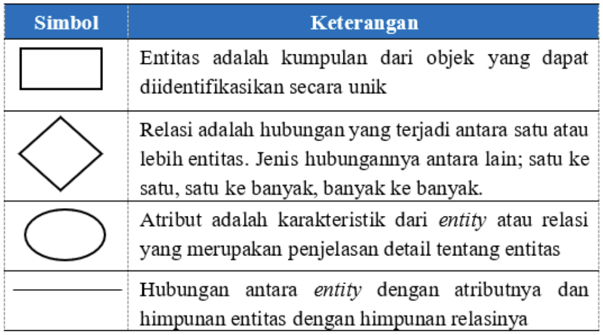

# Model Data

Model _database_ adalah suatu konsep yang terintegrasi dalam menggambarkan hubungan (_relationship_) antar data dan batasan-batasan (_constraint_) data dalam suatu sistem _database_.

1. Model Database Hierarki (_Hierarchical Database Model_)
2. Model Database Jaringan (_Network Database Model_)
3. Model Database Relasi (_Relational Database Model_)

## Model Data

Model data adalah sekumpulan konsep yang terintegrasi untuk mendiskripsikan data, hubungan antar data, dan batasan-batasannya.

Model data harus merepresentasikan serta menyediakan konsep dasar dan notasi yang memungkinkan perancang basis data dan pemakai untuk dapat mengkomunikasikan pemahamannya mengenai organisasi data.

## Entity Relationship Model

_Entity Relationship Model_ (ERM) adalah model konseptual tingkat tinggi pada proses perancangan basis data. Model data konseptual adalah himpunan konsep yang mendeskripsikan struktur basis data, transaksi pengambilan, dan pembaruan basis data.

## Tahapan Pembuatan ERD

1. Mengidentifikasi dan menetapkan seluruh _entity_ yang terlibat dalam sistem basis data tersebut.
2. Menentukan _attribute-attribute_ atau _field_ dari masing-masing _entity_ beserta kunci (_key_)-nya.
3. Menentukan _attribute_ dari suatu entitas sangat menentukan baik atau tidaknya sistem basis data yang dirancang, karena attribute ini akan sangat menentukan dalam proses relasi nantinya. Attribute merupakan ciri khas yang melekat pada suatu entity, misalnya attribute pada mahasiswa dapat berupa nomor telepon genggam, nama, tempat lahir, tanggal lahir, alamat, nama orang tua, pekerjaan orang tua dan lain-lain. Dari sekian banyak kemungkinan attribute yang ada pada entity mahasiswa, kita dapat menggunakan hanya yang perlu saja. Setelah menentukan attribute-nya selanjutnya adalah menentukan field kunci. Field kunci adalah penanda attribute tersebut sehingga bisa digunakan untuk relasi nantinya dan field kunci ini harus bersifat unik. Misalnya pada entity mahasiswa, attribute nomor induk mahasiswa (NIM) bisa dijadikan field kunci karena bersifat unik dan tidak ada mahasiswa yang mempunyai NIM yang sama.
4. mengidentifkasi dan menetapkan seluruh himpunan relasi di antara himpunan-himpunan _entity_ yang ada beserta kunci tamu (_foreign key_).
5. Setelah menentukan _entity_ dan _attribute_ beserta _field_ kuncinya, maka selanjutnya adalah menentukan _entity_ yang terbentuk akibat adanya relasi antar-_entity_. Misalnya antara _entity_ mahasiswa dengan _entity_ dosen, terjadi suatu hubungan proses mengajar maka proses mengajar ini merupakan _entity_ baru. _Entity_ mengajar ini harus kita tentukan juga _attribute_ yang melekat padanya beserta kunci tamu (foreign key). Kunci tamu adalah _field_ kunci utama pada tabel lain dan _field_ tersebut digunakan juga pada tabel yang satu lagi. Misalnya NIM adalah _field_ kunci dari _entity_ mahasiswa, pada _entity_ mengajar terdapat juga _attribute_ NIM, maka keberadaan _attribute_ NIM pada _entity_ mengajar disebut sebagai kunci tamu. Proses menentukan hubungan antar entitas juga sangat menentukan kualitas sistem basis data yang dirancang.
6. menentukan derajat relasi untuk setiap himpunan relasi. Setelah semua entitas dan atribut yang dibutuhkan terbentuk, maka selanjutnya adalah menentukan derajat relasi antar entitas tersebut, apakah satu ke satu, satu ke banyak atau sebaliknya, atau banyak ke banyak. Berhati-hatilah dalam menentukan derajat relasi ini karena nantinya akan berhubungan dengan proses pengambilan (_query_) terhadap data.
7. melengkapi himpunan entitas dan himpunan relasi dengan atribut-atribut deskriptif (_non-key_).