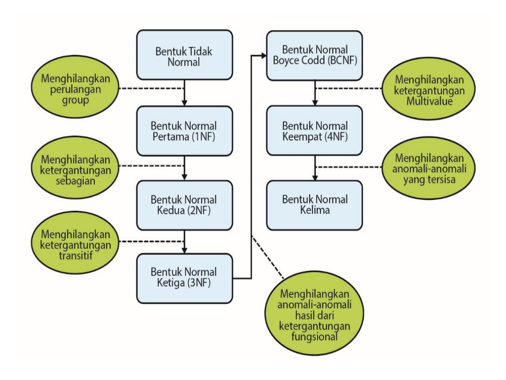
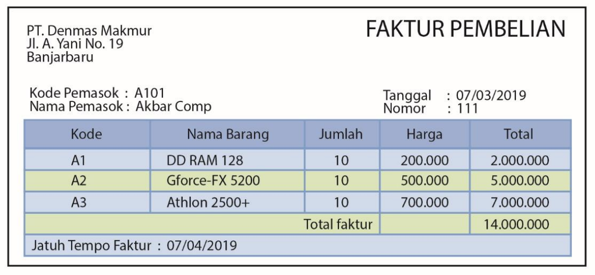
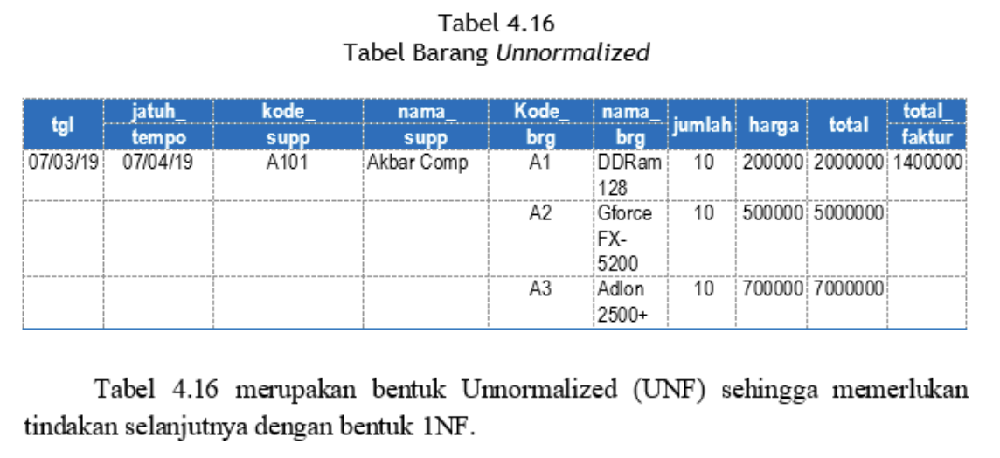

# Normalisasi

Normalisasi merupakan sebuah teknik dalam membangun _logical design_ sebuah basis data, teknik pengelompokan atribut dari suatu relasi sehingga membentuk struktur relasi yang baik (tanpa redudansi) dengan menerapkan sejumlah aturan dan kriteria standar.

Normalisasi sebagai proses untuk mengubah suatu relasi atau tabel yang memiliki masalah tertentu ke dalam dua buah tabel atau lebih untuk menghilangkan/meminimalisasi masalah tersebut. Masalah yang dimaksud ini sering disebut dengan istilah anomali.

## Proses Normalisasi

Secara garis besar proses normalisasi adalah sebagai berikut.

1. Data diuraikan dalam bentuk tabel, selanjutnya dianalisis berdasarkan persyaratan tertentu ke beberapa tingkat.
2. Apabila tabel yang diuji belum memenuhi persyaratan tertentu, maka tabel tersebut perlu dipecah menjadi beberapa tabel yang lebih sederhana sampai memenuhi bentuk yang optimal.

## Anomali

1. **Anomali Peremajaan (Update Anomaly)**: Merupakan error atau kesalahan yang terjadi sebagai akibat operasi perubahan (update) tuple atau record dari sebuah tabel. Anomali ini terjadi karena adanya redundansi data, bila ingin melakukan perubahan data, maka data yang sama pada kolom sama harus juga dilakukan perubahan, jika tidak maka terjadi inkonsistensi data. Seperti terlihat pada Tabel 4.1 baris ke 2, misalnya kolom Telepon Cabang yaitu Jakarta, yang dilakukan perubahan data (update) namun baris data lainnya tidak ter-update sehingga cabang Jakarta memiliki 2 telepon cabang.
2. **Anomali Penyisipan (Insertion Anomali)**: Merupakan error atau kesalahan yang terjadi sebagai akibat dari operasi menyisipkan (insert) tuple/record pada sebuah relasi. Pada saat kita akan menyisipkan data baru maka kolom Cabang, Manajer Cabang, Telp Cabang perlu kita isi juga. Anomali juga terjadi pada saat penambahan data ternyata ada elemen yang kosong dan elemen misalnya menjadi justru menjadi key seperti terlihat pada Tabel 4.1 baris ke 4, dimana kolom cabang tidak terisi.
3. **Anomali Penghapusan (Delete Anomaly)**: Merupakan error atau kesalahan yang terjadi sebagai akibat operasi penghapusan (delete) terhadap tuple atau record dari sebuah relasi. Anomali ini terjadi apabila dalam satu baris atau tuple ada data yang akan dihapus sehingga akibatnya terdapat data lain yang hilang. Seperti terlihat pada Tabel 4.1 baris ke 1, disaat kita memerlukan penghapusan baris ke-1 tersebut maka kita akan kehilangan informasi terkait Cabang “Bandung”.

## Tahapan Normalisasi

## Contoh Kasus

Sebagai contoh basis data yang dibangun dari Daftar Faktur Pembelian sebagai berikut.

### 1. Bentuk Un-Normal Form

Berdasarkan gambar Daftar Faktur Pembelian dilakukan penulisan semua data yang akan direkam pada sebuah tabel.

Langkah awal membentuk suatu tabel Un-Normalized, dengan mencantumkan semua field data yang ada. Hasilnya dapat dilihat pada tabel berikut.

### 2. Bentuk Normal 1NF

Selanjutnya membentuk tabel Normal 1NF, dengan cara memisah-misah data pada field-field yang tepat dan bernilai atomic. Seluruh record harus lengkap adanya.

Tabel 4.17 berikut merupakan bentuk 1NF dari Tabel 4.16.

