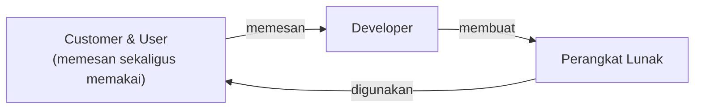
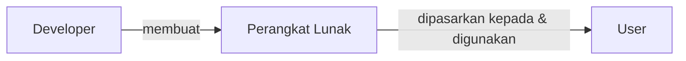
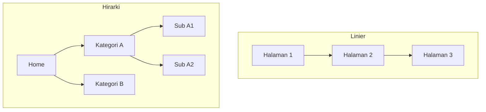
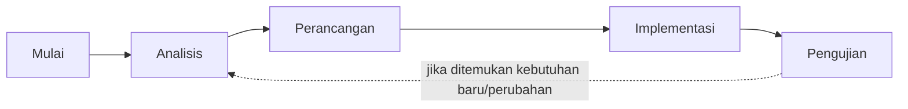
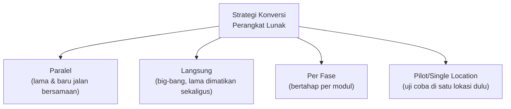
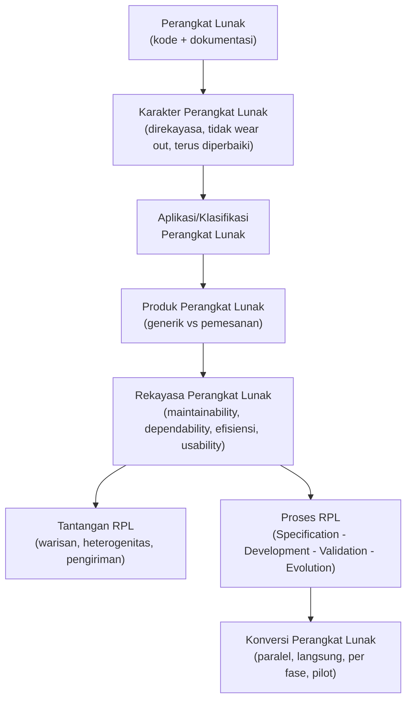

# Sesi 1 — Pendahuluan Rekayasa Perangkat Lunak

**MSIM4303 Rekayasa Perangkat Lunak**
Sistem Informasi — Fakultas Sains dan Teknologi — Universitas Terbuka

> Catatan: dokumen ini merupakan ekstraksi sekaligus elaborasi dari materi *Inisiasi 1 RPL*. Setiap poin asli dari slide dijelaskan lebih dalam dengan konteks, contoh, dan kaitannya satu sama lain agar lebih mudah dipahami secara utuh, bukan sekadar dihafal.

---

## 1. Perangkat Lunak (*Software*)

### 1.1 Definisi

Perangkat lunak (*software*), dari sudut pandang rekayasa perangkat lunak, **bukan hanya program komputer**. Definisi yang lebih lengkap mencakup:

> Program komputer **yang terasosiasi dengan dokumentasi perangkat lunak**, seperti dokumentasi kebutuhan, model desain, cara penggunaan (*user manual*), dokumen teknis, maupun dokumen lainnya yang dapat mendukung program komputer untuk terus digunakan maupun dikembangkan.

Ini poin penting yang sering disalahpahami oleh pemula: **kode program saja bukan perangkat lunak yang utuh**. Tanpa dokumentasi, kode tersebut sulit dipelihara, sulit diserahterimakan ke tim lain, dan berisiko menjadi *technical debt* di masa depan. Sebuah aplikasi baru benar-benar menjadi "perangkat lunak" yang matang ketika ia disertai:

| Komponen | Fungsi |
|---|---|
| Dokumen kebutuhan (*requirements*) | Menjelaskan apa yang harus dilakukan sistem |
| Model desain (*design model*) | Menjelaskan bagaimana sistem dibangun (arsitektur, basis data, alur data) |
| Manual pengguna (*user manual*) | Memandu *end-user* dalam menggunakan sistem |
| Dokumen teknis | Memandu developer lain dalam memelihara/mengembangkan sistem |

### 1.2 Mengapa dokumentasi sepenting kode itu sendiri?

Tanpa dokumentasi, ketika tim pengembang berganti (developer resign, vendor kontrak berakhir, dsb.), pengetahuan tentang sistem ikut hilang — fenomena ini disebut ***knowledge lock-in***. Akibatnya tim baru harus melakukan *reverse engineering* dari nol, yang lambat, mahal, dan berisiko salah paham terhadap logika bisnis yang sudah ada.

### 1.3 Relasi Customer, User, dan Developer

Dalam praktiknya, perangkat lunak melibatkan tiga peran yang **belum tentu orang yang sama**:

- **Customer** — pihak yang memesan/membayar pembuatan perangkat lunak (misalnya manajemen perusahaan).
- **User** — pihak yang sehari-hari memakai perangkat lunak tersebut (misalnya staf operasional).
- **Developer** — pihak yang membangun perangkat lunak.

Ada dua skenario hubungan yang umum terjadi:

**Skenario A — Perangkat lunak pesanan (*bespoke/custom software*).**
*Customer* sekaligus berperan sebagai *user* memesan langsung ke *developer*, lalu memakai sendiri hasilnya.

*Contoh:* sebuah instansi pemerintah memesan sistem informasi kepegawaian khusus untuk dipakai oleh stafnya sendiri.

**Skenario B — Perangkat lunak generik yang dipasarkan (*product software*).**
*Developer* membangun perangkat lunak lebih dulu (tanpa pesanan spesifik), kemudian memasarkannya ke *user* di pasar umum.

*Contoh:* Microsoft Word, Adobe Photoshop, atau aplikasi mobile di Play Store yang dijual/didistribusikan ke publik tanpa pesanan dari satu pelanggan tertentu.

> Perbedaan dua skenario ini penting karena akan menentukan **siapa yang menanggung biaya, siapa yang menentukan kebutuhan, dan siapa yang memegang risiko** jika perangkat lunak gagal memenuhi ekspektasi.

---

## 2. Karakter Perangkat Lunak

Perangkat lunak memiliki sifat yang **berbeda secara fundamental** dari produk manufaktur/pabrikan. Tiga karakter utamanya:

1. **Dibangun dengan rekayasa, bukan diproduksi.**
   Setiap unit perangkat lunak yang "diproduksi" (di-*deploy*/di-*install*) sebenarnya hanyalah penggandaan dari satu hasil rekayasa (source code yang sama). Tidak ada proses produksi fisik berulang seperti merakit komponen di pabrik — semua "biaya" ada di tahap rekayasa/pembuatan awal, bukan di tahap penggandaan.

2. **Tidak pernah usang secara fisik (*tidak wear out*), tetapi bisa "usang" secara fungsional.**
   Berbeda dengan onderdil mesin yang fisiknya bisa rusak karena gesekan/usia, kecacatan (*defect*) pada perangkat lunak murni masalah logika dan **selalu bisa diperbaiki** lewat *patch* atau *update* — tidak perlu "diganti komponennya". Namun ia bisa menjadi tidak relevan (*obsolete*) bila tidak mengikuti perkembangan kebutuhan/teknologi.

3. **Terus diperbaiki, bukan komponennya yang diganti.**
   Barang manufaktur biasanya punya siklus: komponen lama dihentikan produksinya, lalu diganti komponen baru. Perangkat lunak sebaliknya — *codebase* yang sama terus dipelihara dan ditambah fitur seiring bertambahnya kebutuhan pengguna (lihat juga konsep *software evolution* di bagian 8).

> **Implikasi praktis:** karena perangkat lunak "tidak rusak secara fisik", sebagian besar biaya dalam siklus hidup perangkat lunak justru ada pada tahap **pemeliharaan** (*maintenance*) — memperbaiki bug, menyesuaikan kebutuhan baru, dan beradaptasi dengan lingkungan/teknologi baru — bukan pada produksi ulang.

---

## 3. Aplikasi/Klasifikasi Perangkat Lunak

Perangkat lunak dapat dikelompokkan berdasarkan domain penggunaannya:

| Jenis | Penjelasan | Contoh |
|---|---|---|
| **Perangkat lunak sistem** (*system software*) | Mengelola dan mengoperasikan perangkat keras serta menjadi fondasi bagi perangkat lunak lain | Sistem operasi (Windows, Linux), driver |
| **Perangkat lunak waktu nyata** (*real-time software*) | Harus merespons dalam batas waktu tertentu yang ketat | Sistem kendali pesawat, sistem monitoring pasien ICU |
| **Perangkat lunak bisnis** (*business software*) | Mendukung proses bisnis dan pengolahan data transaksional | ERP, akuntansi, sistem informasi akademik |
| **Perangkat lunak rekayasa & keilmuan** (*engineering and scientific software*) | Untuk komputasi/simulasi ilmiah dan rekayasa | MATLAB, simulasi struktur bangunan |
| **Perangkat lunak tambahan** (*embedded software*) | "Menumpang" di dalam perangkat lain untuk menjalankan fungsi spesifik | Firmware microwave, ECU mobil |
| **Perangkat lunak komputer personal** (*personal computer software*) | Dipakai langsung oleh individu di komputer pribadi | Microsoft Office, media player |
| **Perangkat lunak berbasis web** (*web based software*) | Diakses lewat browser, biasanya client-server | Gmail, marketplace, sistem akademik daring |
| **Perangkat lunak berinteligensia buatan** (*artificial intelligence software*) | Menggunakan algoritma AI/ML untuk pengambilan keputusan atau prediksi | Chatbot, sistem rekomendasi, computer vision |

> Satu produk nyata seringkali menggabungkan lebih dari satu kategori — misalnya aplikasi *e-commerce* adalah *web based software* (bisnis) yang juga menyisipkan *AI software* untuk rekomendasi produk.

---

## 4. Produk Perangkat Lunak

Berdasarkan **asal mula permintaan pembuatannya**, produk perangkat lunak terbagi dua:

### 4.1 Produk Generik
Dibuat oleh pengembang **tanpa pesanan terlebih dahulu**, untuk dijual atau dipopulerkan secara bebas/terbuka (*open source*). Target pasarnya luas dan umum.

*Contoh:* sistem operasi, aplikasi perkantoran (pengolah dokumen, *slide* presentasi, spreadsheet/*papersheet*).

### 4.2 Produk Pemesanan
Dibuat **karena ada pelanggan spesifik yang memesan** untuk memenuhi proses bisnis tertentu di instansinya. Pengembang bekerja sama langsung dengan pemesan untuk menentukan kebutuhan.

*Contoh:* sistem informasi akademik kampus yang dipesan khusus oleh universitas tertentu.

| Aspek | Produk Generik | Produk Pemesanan |
|---|---|---|
| Inisiatif pembuatan | Dari pengembang | Dari pelanggan |
| Target pengguna | Umum/luas | Spesifik (satu organisasi/instansi) |
| Kustomisasi kebutuhan | Rendah (mengikuti pasar) | Tinggi (mengikuti kebutuhan pemesan) |
| Risiko bisnis | Ditanggung pengembang | Ditanggung bersama/pemesan |

---

## 5. Rekayasa Perangkat Lunak (*Software Engineering*)

Rekayasa perangkat lunak berfokus pada bagaimana **membangun** perangkat lunak — bukan sekadar menulis kode — agar memenuhi empat kriteria kualitas utama:

1. ***Maintainability*** — dapat terus dipelihara/diadaptasi setelah selesai dibuat, seiring berkembangnya teknologi dan lingkungan. Tanpa ini, setiap perubahan kecil akan terasa "mahal" dan berisiko.
2. ***Dependability* dan *Robust*** — dapat diandalkan menjalankan proses bisnis secara konsisten, serta tetap "tahan" (tidak gagal total) saat menghadapi input tak terduga atau perubahan kondisi.
3. **Efisiensi** — hemat dari segi sumber daya komputasi (memori, prosesor, jaringan) maupun sumber daya pengembangan (waktu, biaya).
4. ***Usability*** — mudah dipakai sesuai kebutuhan pengguna sebenarnya, bukan hanya secara teknis "berfungsi".

> Empat kriteria ini sering disebut sebagai bagian dari *non-functional requirements* dalam rekayasa perangkat lunak — sama pentingnya dengan *functional requirements* (apa yang sistem **lakukan**), karena menentukan apakah sistem akan tetap bernilai dalam jangka panjang.

---

## 6. Tantangan dalam Rekayasa Perangkat Lunak

Tiga tantangan besar yang dihadapi proses rekayasa perangkat lunak:

1. **Tantangan warisan (*legacy challenge*).**
   Perangkat lunak sering dikembangkan bertahun-tahun oleh orang-orang yang berbeda (developer berganti, vendor berganti). Hal ini bisa menyebabkan **ketidakpahaman** terhadap kode yang sudah ada atau bahkan **perubahan tujuan** pembuatan perangkat lunak dari rancangan awalnya. Inilah alasan dokumentasi (lihat bagian 1) menjadi krusial — tanpanya, *legacy system* menjadi sangat sulit dan berisiko untuk dimodifikasi.

2. **Tantangan heterogenitas (*heterogeneity challenge*).**
   Perangkat lunak harus mampu beradaptasi dengan teknologi yang terus berkembang, sejalan dengan makin luasnya lingkungan distribusi (berbagai perangkat, sistem operasi, platform cloud, jaringan). Sistem yang dirancang kaku terhadap satu platform akan cepat tertinggal.

3. **Tantangan pengiriman (*delivery challenge*).**
   Perangkat lunak berskala besar dan kompleks sekalipun harus tetap bisa **sampai ke tangan pelanggan/user dengan cepat**, tanpa mengorbankan kualitas. Tantangan ini melatari munculnya pendekatan pengembangan iteratif/agile dibanding model waterfall yang kaku.

---

## 7. Beberapa Struktur Aliran Halaman Web

Saat merancang navigasi sebuah aplikasi/situs web, terdapat empat pola struktur umum:

1. **Struktur linier** — halaman tersusun berurutan, pengguna bernavigasi maju/mundur secara linear (mirip alur baca buku). Cocok untuk proses bertahap seperti *checkout* atau *form wizard*.
2. **Struktur *grid*** — halaman tersusun dalam baris dan kolom yang saling terhubung, memungkinkan navigasi ke berbagai arah dengan pola yang konsisten.
3. **Struktur hirarki** — halaman tersusun seperti pohon, dari halaman utama (root) bercabang ke sub-halaman yang lebih spesifik. Pola paling umum dipakai di situs informasi/perusahaan.
4. **Struktur jaringan** — halaman saling terhubung tanpa pola hierarki yang kaku; pengguna bisa berpindah ke halaman mana pun yang relevan. Umum dipakai di *wiki* atau situs dengan banyak tautan silang.

> Pemilihan struktur ini berdampak langsung pada *usability* (lihat bagian 5) — struktur yang salah pilih akan membuat pengguna kesulitan menemukan informasi yang mereka cari.

---

## 8. Proses Rekayasa Perangkat Lunak

### 8.1 Definisi
Proses perangkat lunak (*software process*) adalah **sekumpulan aktivitas** yang bertujuan untuk **mengembangkan atau mengubah** perangkat lunak. Secara umum terdiri dari empat aktivitas inti:

1. **Pengumpulan Spesifikasi (*Specification*)** — menentukan apa yang harus dilakukan sistem dan batasan-batasannya (kebutuhan fungsional & non-fungsional).
2. **Pengembangan (*Development*)** — merancang dan membangun perangkat lunak sesuai spesifikasi yang ditetapkan.
3. **Validasi (*Validation*)** — memeriksa bahwa perangkat lunak yang dibangun benar-benar memenuhi spesifikasi dan kebutuhan pengguna (testing, *quality assurance*).
4. **Evolusi (*Evolution*)** — perangkat lunak terus dimodifikasi untuk merespons perubahan kebutuhan pasar/pengguna, sejalan dengan karakter perangkat lunak di bagian 2 yang "terus diperbaiki, tidak pernah benar-benar usang".

Keempat aktivitas ini **tidak selalu linear satu arah** — dalam praktiknya sering berulang (iteratif), terutama saat masuk fase evolusi yang akan kembali memicu spesifikasi baru.

### 8.2 Tahapan Umum Rekayasa Perangkat Lunak

Selain empat aktivitas proses di atas, terdapat juga gambaran siklus tahapan teknis yang lebih operasional:

- **Analisis** — menggali dan mendefinisikan kebutuhan (selaras dengan *Specification*).
- **Perancangan** — mendesain arsitektur, basis data, antarmuka (bagian dari *Development*).
- **Implementasi** — menulis kode program berdasarkan rancangan (bagian dari *Development*).
- **Pengujian** — memverifikasi hasil implementasi sesuai kebutuhan (selaras dengan *Validation*).

> Siklus ini bisa kembali ke tahap Analisis ketika ditemukan kebutuhan baru — inilah representasi konkret dari aktivitas **Evolusi** pada proses perangkat lunak.

---

## 9. Konversi Perangkat Lunak

Konversi adalah strategi **perpindahan dari sistem lama ke sistem baru**. Empat strategi umum:

1. **Konversi paralel** — sistem lama dan baru dijalankan **bersamaan** untuk sementara waktu, hasil dibandingkan, baru kemudian sistem lama dimatikan. Paling aman tetapi paling mahal (perlu menjalankan dua sistem sekaligus).
2. **Konversi langsung** (*direct/big-bang*) — sistem lama dihentikan dan sistem baru langsung dipakai sepenuhnya pada satu waktu tertentu. Murah dan cepat, tetapi berisiko tinggi jika sistem baru bermasalah.
3. **Konversi per fase** (*phased*) — sistem baru diterapkan **bertahap per modul/fitur**, bukan sekaligus seluruh sistem. Risiko lebih terkendali karena masalah bisa diisolasi per fase.
4. **Konversi pilot/*single location*** — sistem baru diuji coba dulu di **satu lokasi/cabang/unit** sebagai percontohan, sebelum diterapkan ke seluruh organisasi. Cocok untuk organisasi besar dengan banyak cabang/unit kerja.

| Strategi | Risiko | Biaya | Cocok untuk |
|---|---|---|---|
| Paralel | Rendah | Tinggi | Sistem kritikal (mis. perbankan) |
| Langsung | Tinggi | Rendah | Sistem kecil/sederhana, *downtime* dapat ditoleransi |
| Per fase | Sedang | Sedang | Sistem besar dengan modul yang independen |
| Pilot | Rendah–Sedang | Sedang | Organisasi multi-cabang/unit |

---

## Ringkasan Keterkaitan Antar Konsep

Seluruh materi sesi ini saling berkaitan dalam satu alur besar:

Inti dari sesi pendahuluan ini: **perangkat lunak bukan sekadar kode**, melainkan aset yang harus direkayasa secara sadar (bukan diproduksi seperti barang pabrikan), didokumentasikan dengan baik, dan dikelola sepanjang siklus hidupnya — dari spesifikasi awal hingga evolusi dan konversi ke sistem baru di masa depan.

---

*Terima kasih*
