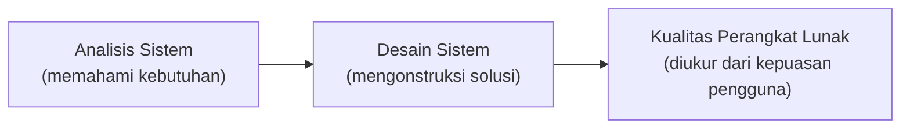
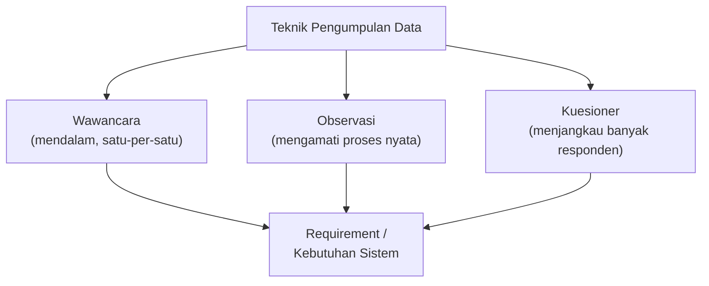
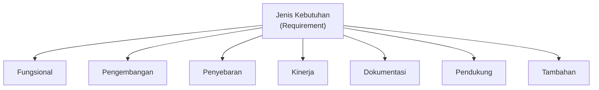
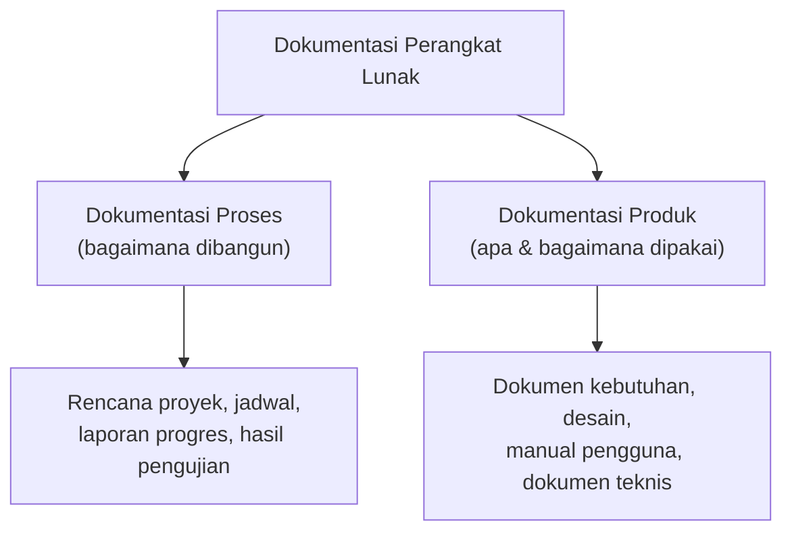
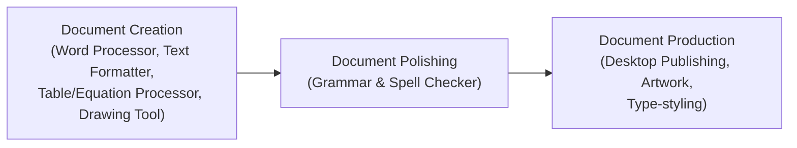
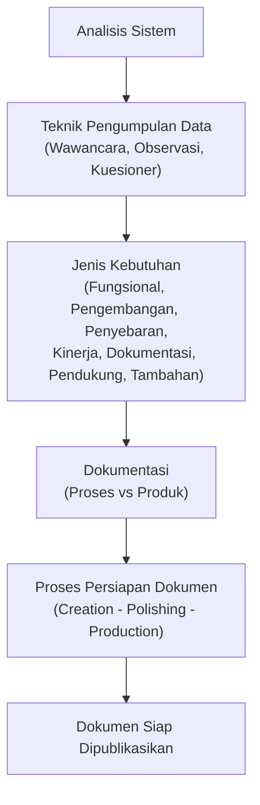

# Sesi 2 — Analisis dan Desain Sistem

**MSIM4303 Rekayasa Perangkat Lunak**
Sistem Informasi — Fakultas Sains dan Teknologi — Universitas Terbuka

> Catatan: dokumen ini merupakan ekstraksi sekaligus elaborasi dari materi *Inisiasi 2 RPL*. Setiap poin asli dari slide dijelaskan lebih dalam dengan konteks, contoh, dan kaitannya satu sama lain agar lebih mudah dipahami secara utuh.

---

## 1. Pendahuluan Analisis Sistem

### 1.1 Apa itu desain/perancangan?

Desain atau perancangan dalam pembangunan perangkat lunak adalah upaya untuk **mengonstruksi sebuah sistem** yang:

- Memberikan kepuasan (mungkin informal) terhadap spesifikasi kebutuhan fungsional;
- Memenuhi target dan kebutuhan, baik secara implisit maupun eksplisit, dari segi performansi maupun penggunaan sumber daya;
- Memenuhi batasan-batasan dalam proses desain — dari segi biaya, waktu, dan perangkat yang tersedia.

Pada akhirnya, **kualitas perangkat lunak diukur dari kepuasan pengguna** terhadap perangkat lunak yang mereka gunakan — bukan semata dari sisi teknis seberapa elegan kodenya.

### 1.2 Mengapa analisis harus dilakukan sebelum desain?

Desain yang baik **tidak mungkin dibuat tanpa pemahaman kebutuhan yang akurat**. Inilah sebabnya proses rekayasa perangkat lunak selalu dimulai dari **analisis sistem** — yaitu proses memahami secara mendalam siapa penggunanya, apa yang mereka butuhkan, dan batasan apa yang berlaku — sebelum melangkah ke tahap merancang arsitektur maupun antarmuka.

> Kaitan dengan sesi sebelumnya: konsep *maintainability*, *dependability*, efisiensi, dan *usability* (Sesi 1) sebenarnya adalah **kriteria yang harus sudah dipikirkan sejak tahap analisis ini**, bukan ditambahkan belakangan setelah sistem jadi.

---

## 2. Teknik Pengumpulan Data

Hal pertama yang dilakukan dalam analisis sistem adalah **pengumpulan data** kebutuhan. Tiga teknik yang paling umum digunakan:

1. **Teknik Wawancara** — menggali kebutuhan langsung dari pengguna/*stakeholder* melalui tanya-jawab. Kelebihannya bisa menggali informasi yang dalam dan klarifikasi langsung, namun memakan waktu dan tergantung kemampuan komunikasi pewawancara.
2. **Teknik Observasi** — mengamati langsung bagaimana proses bisnis berjalan di lapangan. Cocok untuk menangkap kebiasaan kerja nyata yang sering tidak disadari atau tidak terungkap saat wawancara.
3. **Teknik Kuesioner** — mengumpulkan data dari banyak responden sekaligus melalui daftar pertanyaan terstruktur. Efisien untuk populasi besar, tetapi kurang fleksibel untuk menggali detail mendalam.

> **Tips praktis:** ketiga teknik ini sering dikombinasikan. Misalnya, kuesioner dipakai dulu untuk menjaring gambaran umum dari banyak pengguna, lalu wawancara dilakukan untuk menggali lebih dalam dari beberapa *key user*, dan observasi dilakukan untuk memverifikasi apakah jawaban wawancara/kuesioner sesuai dengan praktik nyata di lapangan.

---

## 3. Jenis Kebutuhan (*Requirement*)

Kebutuhan (*requirement*) yang dikumpulkan melalui wawancara, observasi, kuesioner, atau kombinasinya, dapat dikelompokkan ke dalam beberapa kategori berikut. **Tidak semua kategori ini harus selalu ada** pada setiap proyek — tergantung kompleksitas dan kebutuhan sistemnya.

| No | Jenis Kebutuhan | Penjelasan | Contoh |
|---|---|---|---|
| 1 | **Kebutuhan Fungsional** (*Functional Requirement*) | Apa saja fungsi/fitur yang harus dilakukan sistem | Sistem dapat memproses pendaftaran mahasiswa baru |
| 2 | **Kebutuhan Pengembangan** (*Development Requirement*) | Batasan/standar yang harus dipenuhi selama proses pengembangan | Bahasa pemrograman, framework, atau metodologi yang harus dipakai |
| 3 | **Kebutuhan Penyebaran** (*Deployment Requirement*) | Kebutuhan terkait bagaimana sistem akan diinstal/dijalankan di lingkungan produksi | Server, OS, atau platform cloud target |
| 4 | **Kebutuhan Kinerja** (*Performance Requirement*) | Target performa sistem yang harus dicapai | Waktu respons maksimal 2 detik, mampu menangani 1000 pengguna bersamaan |
| 5 | **Kebutuhan Dokumentasi** (*Documentation Requirement*) | Dokumen apa saja yang wajib dihasilkan bersama sistem | Manual pengguna, dokumen teknis (lihat bagian 4) |
| 6 | **Kebutuhan Pendukung** (*Support Requirement*) | Dukungan yang dibutuhkan setelah sistem berjalan | Pelatihan pengguna, *helpdesk*, garansi pemeliharaan |
| 7 | **Kebutuhan Tambahan** (*Miscellaneous Requirement*) | Kebutuhan lain yang tidak masuk kategori di atas tetapi tetap relevan | Kepatuhan regulasi tertentu, kebutuhan khusus klien |

> Perhatikan bahwa **kebutuhan dokumentasi** (poin 5) menjadi salah satu jenis kebutuhan formal di sini — selaras dengan penekanan di Sesi 1 bahwa perangkat lunak yang utuh bukan hanya kode, melainkan kode **plus** dokumentasinya.

---

## 4. Dokumentasi

### 4.1 Hal yang Perlu Diperhatikan

Dalam pembuatan dokumen perangkat lunak, ada tiga hal utama yang perlu diperhatikan agar dokumen benar-benar berguna dan tidak sekadar formalitas:

1. **Kualitas Dokumen** — apakah isi dokumen akurat, jelas, dan mudah dipahami oleh pembacanya (developer lain, *user*, maupun *stakeholder*)?
2. **Struktur Dokumen** — apakah dokumen tersusun dengan kerangka yang konsisten dan logis, sehingga mudah dinavigasi dan dicari informasinya?
3. **Standar Dokumen** — apakah dokumen mengikuti format/standar baku (organisasi, industri, atau internasional seperti IEEE) sehingga seragam dan mudah dibandingkan antar proyek?

### 4.2 Kategori Dokumentasi

Dokumentasi dari perangkat lunak dikategorikan menjadi dua jenis besar:

1. **Dokumentasi Proses (*Process Documentation*)** — mencatat *bagaimana* perangkat lunak dibangun: rencana proyek, jadwal, catatan rapat, laporan progres, hasil pengujian, dan estimasi biaya. Dokumentasi ini lebih ditujukan untuk **tim internal proyek** sebagai jejak kerja (*audit trail*).
2. **Dokumentasi Produk (*Product Documentation*)** — mendeskripsikan *apa* perangkat lunak itu dan *bagaimana cara menggunakannya*: dokumen kebutuhan, dokumen desain/arsitektur, manual pengguna, dan dokumen teknis. Dokumentasi ini ditujukan untuk **pengguna akhir maupun developer yang akan memelihara sistem di masa depan**.

> Kasus pada Diskusi Sesi 1 — vendor yang tidak menyerahkan dokumentasi teknis — sebenarnya adalah hilangnya **Dokumentasi Produk**. Tanpa itu, tim internal tidak memiliki "peta" untuk memahami arsitektur dan logika sistem yang sudah dibangun.

---

## 5. Proses Persiapan Dokumen

### 5.1 Fasilitas Pendukung

Persiapan dokumen adalah proses untuk **membuat dan memformat** dokumen agar siap dipublikasikan. Beberapa kategori perangkat lunak yang mendukung proses ini:

| No | Jenis Aplikasi | Fungsi | Contoh |
|---|---|---|---|
| 1 | *Activity management programs* | Mengelola jadwal dan kontak | Kalender, buku alamat |
| 2 | *Word processing application* | Membuat dan memformat dokumen teks | Microsoft Word, Google Docs |
| 3 | *Spreadsheet application* | Mengelola dan mengorganisasikan data numerik | Microsoft Excel, Google Sheets |
| 4 | *Presentation application* | Membuat tampilan presentasi | Microsoft PowerPoint |
| 5 | *Graphics application* | Membuat gambar/ilustrasi | Adobe Illustrator, Figma |
| 6 | *Database application* | Mengorganisasikan dan menyimpan data dalam jumlah besar | MySQL, PostgreSQL |
| 7 | *Communications programs* | Mengirim dan menerima pesan | E-mail, perangkat lunak faksimile |
| 8 | *Multimedia application* | Membuat video dan musik | Adobe Premiere, Audacity |
| 9 | *Utilities* | Memelihara/meningkatkan kinerja sistem operasi | Antivirus, *firewall* |

### 5.2 Tiga Tahapan Proses Persiapan Dokumen

Proses persiapan dokumen, terkait fasilitas pendukungnya, terdiri dari tiga tahap berurutan:

1. **Pembuatan Dokumen (*Document Creation*)** — tahap awal memasukkan informasi ke dalam dokumen. Biasanya didukung oleh *Word Processor*, *Text Formatters*, *Table and Equation Processor*, serta *Drawing and Art Package*.
2. **Penyempurnaan Dokumen (*Document Polishing*)** — proses memperbaiki tulisan dan tampilan dokumen agar lebih mudah dipahami isinya, misalnya memperbaiki tata kalimat dan menghapus kalimat yang redundan/berulang. Didukung oleh perangkat lunak kamus dan pemeriksa struktur kalimat/kata (*grammar/spell checker*).
3. **Pencetakan Dokumen (*Document Production*)** — proses mempersiapkan dokumen untuk dicetak secara profesional. Didukung oleh *desktop-publishing packages*, *artwork packages*, dan *type-styling*.

> Ketiga tahap ini berlaku **bukan hanya untuk dokumen produk perangkat lunak** (manual, spesifikasi), tetapi juga relevan untuk dokumentasi proses (laporan, rencana proyek) yang dibahas pada bagian 4.

---

## Ringkasan Keterkaitan Antar Konsep

Seluruh materi Sesi 2 ini membentuk satu rangkaian alur kerja analisis sistem, dari pengumpulan data hingga dokumen siap dipublikasikan:

Inti dari sesi ini: analisis sistem yang baik dimulai dari **pengumpulan data yang tepat**, menghasilkan **kebutuhan yang terklasifikasi dengan jelas**, dan semua hasil analisis maupun proses pengembangan harus **terdokumentasi dengan kualitas, struktur, dan standar yang baik** — karena dokumentasi inilah yang akan menjadi rujukan utama sepanjang siklus hidup perangkat lunak (lihat juga Sesi 1 mengenai pentingnya dokumentasi).

---

*Terima kasih*
