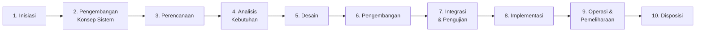
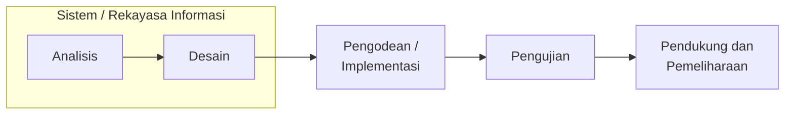
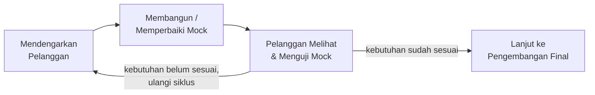
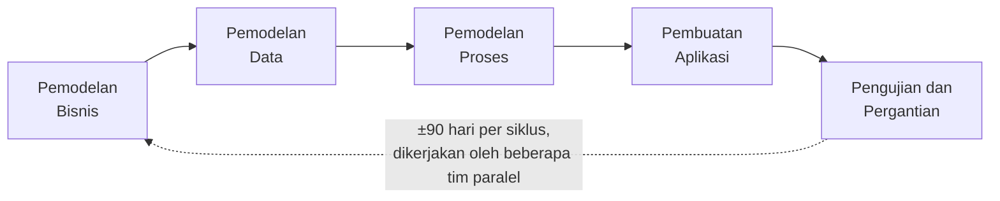
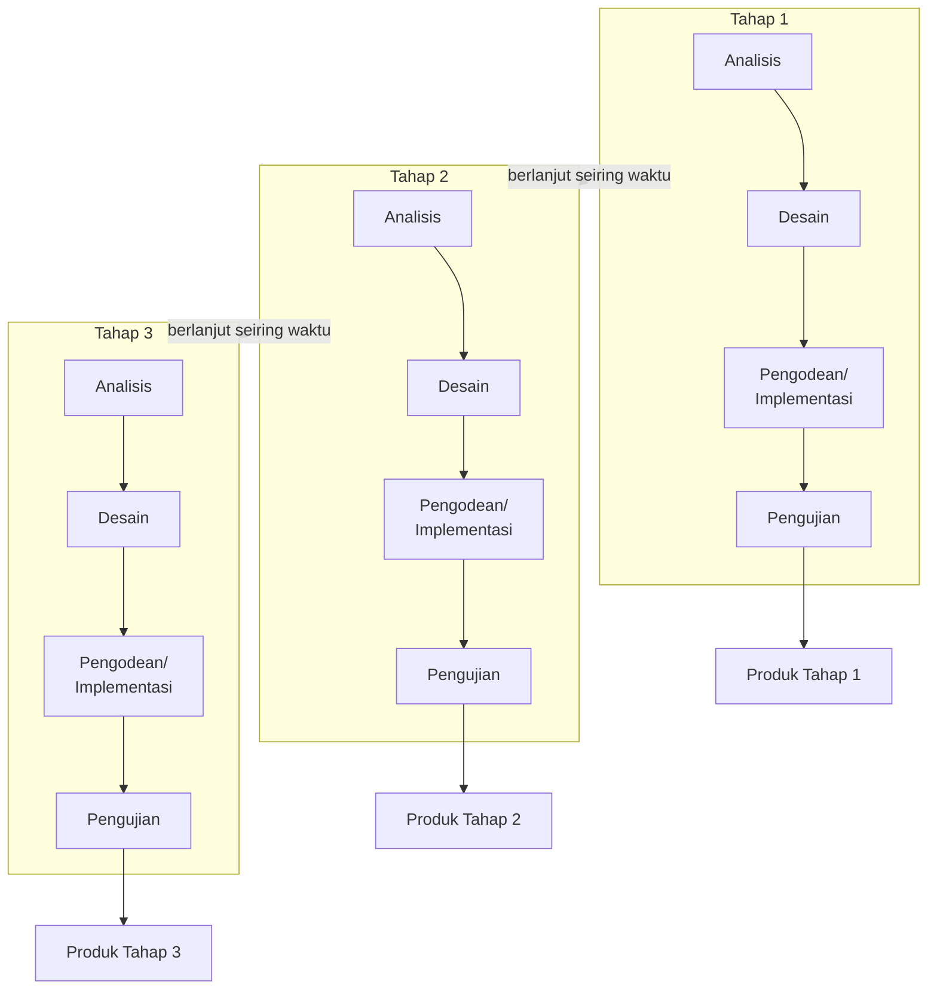
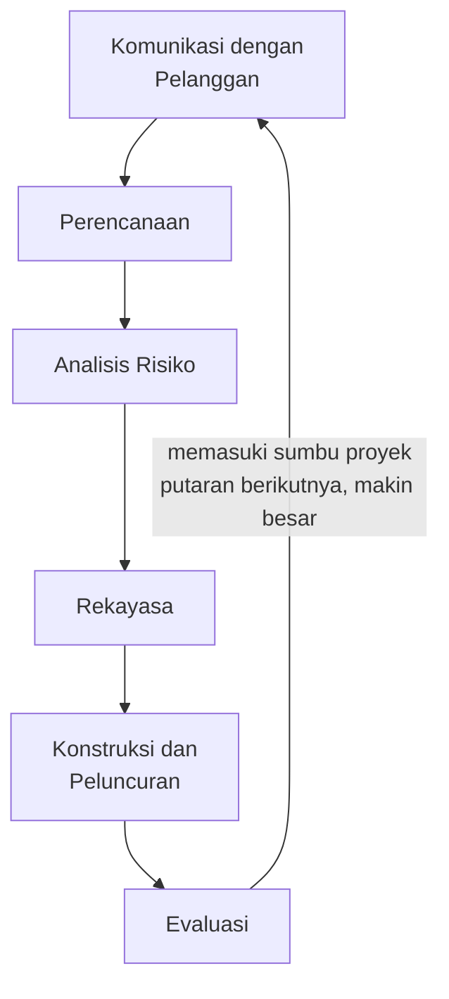
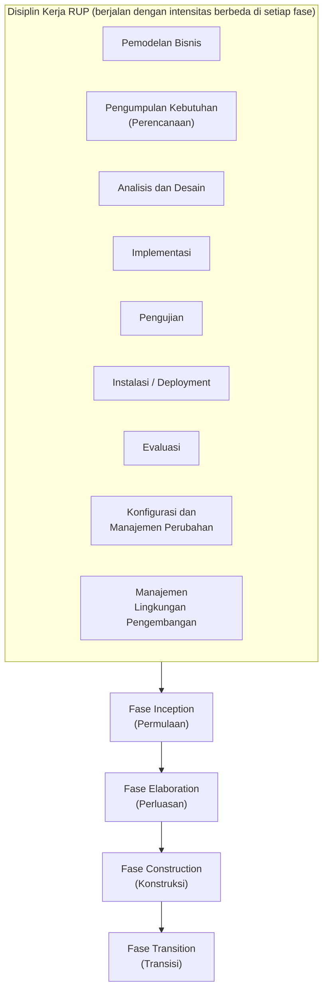
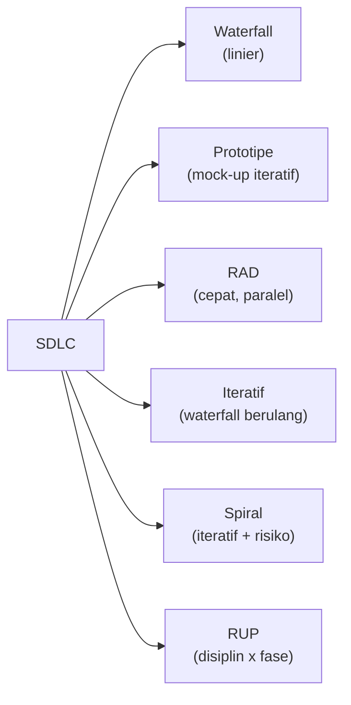

# Sesi 3 — Software Development Life Cycle (SDLC)

**MSIM4303 Rekayasa Perangkat Lunak**
Sistem Informasi — Fakultas Sains dan Teknologi — Universitas Terbuka

> Catatan: dokumen ini merupakan ekstraksi sekaligus elaborasi dari materi *Inisiasi 3 RPL*. Setiap diagram pada slide asli digambar ulang dengan mermaid, dan setiap poin dijelaskan lebih dalam dengan konteks, contoh, serta kaitannya dengan sesi sebelumnya.

---

## 1. Apa itu SDLC?

**Software Development Life Cycle (SDLC)** — sering juga disebut **System Development Life Cycle** atau **siklus hidup pengembangan perangkat lunak** — adalah proses **mengembangkan atau mengubah** suatu sistem perangkat lunak.

SDLC pada dasarnya adalah jawaban atas pertanyaan: *"Dengan urutan dan pendekatan seperti apa sebuah perangkat lunak sebaiknya dibangun?"* Berbagai **model SDLC** (waterfall, prototipe, RAD, iteratif, spiral, RUP) yang dibahas di sesi ini adalah jawaban-jawaban yang berbeda terhadap pertanyaan tersebut — masing-masing punya kelebihan dan cocok untuk konteks proyek yang berbeda.

> Kaitan dengan sesi sebelumnya: tahapan **Analisis → Perancangan → Implementasi → Pengujian** yang dibahas di Sesi 1 (bagian *Proses Rekayasa Perangkat Lunak*) sebenarnya adalah inti dari hampir **semua model SDLC** di sesi ini — perbedaannya ada di **bagaimana tahapan-tahapan itu diatur** (linear, berulang, paralel, atau melingkar).

---

## 2. Tahapan Umum SDLC

Secara global, SDLC terdiri dari sepuluh tahapan berikut:

1. **Inisiasi** (*initiation*) — mengidentifikasi kebutuhan awal akan sistem baru.
2. **Pengembangan konsep sistem** (*system concept development*) — mendefinisikan lingkup, visi, dan pendekatan sistem secara konseptual.
3. **Perencanaan** (*planning*) — menyusun rencana proyek: jadwal, sumber daya, risiko.
4. **Analisis kebutuhan** (*requirements analysis*) — menggali dan mendokumentasikan kebutuhan secara rinci (lihat Sesi 2).
5. **Desain** (*design*) — merancang arsitektur, basis data, dan antarmuka sistem.
6. **Pengembangan** (*development*) — menulis kode program berdasarkan rancangan.
7. **Integrasi dan pengujian** (*integration and test*) — menggabungkan komponen dan memverifikasi sistem berfungsi sesuai kebutuhan.
8. **Implementasi** (*implementation*) — men-*deploy* sistem ke lingkungan produksi/penggunaan nyata.
9. **Operasi dan pemeliharaan** (*operations and maintenance*) — menjalankan sistem sehari-hari dan memperbaiki/menyesuaikannya seiring waktu.
10. **Disposisi** (*disposition*) — mengakhiri masa pakai sistem (penghentian, penggantian, atau pengarsipan data).

> Sepuluh tahapan ini adalah kerangka **paling generik**. Setiap model SDLC pada bagian berikut adalah variasi cara mengelompokkan, mengulang, atau menyusun ulang tahapan-tahapan ini.

---

## 3. Model Waterfall

Model SDLC air terjun (***waterfall***) — disebut juga model **sekuensial linier** (*sequential linear*) atau **alur hidup klasik** (*classic life cycle*) — menyediakan pendekatan alur hidup perangkat lunak secara **sekuensial/terurut**: dimulai dari analisis, desain, pengodean, pengujian, hingga tahap pendukung (*support*).

### Karakteristik
- **Setiap tahap harus selesai dahulu** sebelum lanjut ke tahap berikutnya — tidak ada tumpang tindih.
- Cocok untuk proyek dengan **kebutuhan yang sudah jelas dan stabil** sejak awal (tidak banyak berubah di tengah jalan).
- **Kelemahan utama**: sulit mengakomodasi perubahan kebutuhan di tengah proses, karena harus "mundur" ke tahap sebelumnya — biaya perubahan menjadi sangat mahal jika ditemukan di tahap akhir (misalnya saat pengujian).

---

## 4. Model Prototipe

Model prototipe/purwarupa termasuk kategori pengembangan **bertahap/inkremental** (*incremental development*). Model ini digunakan untuk **menjembatani ketidakpahaman pelanggan** mengenai hal teknis, dan memperjelas spesifikasi kebutuhan yang sebenarnya diinginkan pelanggan.

Konteksnya: pelanggan (*customer*) bisa jadi tidak memahami seluk-beluk teknis perangkat lunak, sehingga diperlukan **contoh tampilan (mock-up)** yang dapat membuat pelanggan "membayangkan" perangkat lunak yang akan dikembangkan, sebelum versi final dibangun.

### Karakteristik
- Siklus **Dengar → Bangun → Lihat/Uji** diulang terus sampai pelanggan puas dengan gambaran sistemnya.
- Sangat membantu ketika **kebutuhan pelanggan belum jelas/sulit diartikulasikan** secara verbal.
- Risiko: prototipe yang terlalu bagus secara visual kadang membuat pelanggan mengira sistem **sudah selesai**, padahal baru tampilan luarnya (belum ada logika bisnis yang lengkap).

---

## 5. Model Rapid Application Development (RAD)

**Rapid Application Development (RAD)**, atau pengembangan aplikasi secara cepat, adalah model SDLC yang diperuntukkan untuk **waktu pengembangan yang singkat**.

> RAD dapat digunakan **jika** kebutuhan perangkat lunak sudah dipahami dengan baik **dan** lingkup perangkat lunak dibatasi dengan baik, sehingga tim dapat menyelesaikan pembuatan perangkat lunak dalam waktu yang pendek (misalnya dalam hitungan **90 hari** per siklus, sebagaimana digambarkan pada diagram aslinya).

### Karakteristik
- Mengandalkan **tim-tim kerja paralel** (masing-masing tim menangani satu modul/komponen) untuk mempercepat keseluruhan waktu pengembangan.
- Sangat bergantung pada penggunaan ulang komponen (*component reuse*) dan *tools* pengembangan yang mendukung pembuatan cepat (misalnya *code generator*, *low-code platform*).
- Tidak cocok untuk proyek dengan **risiko teknis tinggi** atau kebutuhan yang masih sangat berubah-ubah.

---

## 6. Model Iteratif

Model **iteratif** (*iterative model*) mengombinasikan proses-proses pada model **waterfall** dengan sifat **iteratif/berulang** dari model **prototipe**. Pengembangan dilakukan secara bertahap/inkremental (*incremental*), menghasilkan **versi-versi perangkat lunak** yang setiap tahapnya sudah mengalami penambahan fungsi (*increment*).

### Karakteristik
- Setiap **tahap (increment)** menjalankan ulang siklus waterfall lengkap (analisis–desain–implementasi–pengujian), tetapi dalam **skala lebih kecil**.
- Menghasilkan **produk yang dapat dipakai/dievaluasi di setiap tahap**, bukan menunggu seluruh sistem selesai di akhir — mengurangi risiko dibanding waterfall murni.
- Cocok untuk proyek besar yang ingin **merilis fungsi secara bertahap** sambil tetap mengumpulkan masukan dari penggunaan nyata di setiap tahap.

---

## 7. Model Spiral

Model **spiral** memasangkan sifat **iteratif/pengulangan** dari model prototipe dengan **kontrol dan aspek sistematik** yang diambil dari model waterfall. Model ini menyediakan pengembangan cepat dengan perangkat lunak yang **terus bertambah fungsinya** (*increment*) di setiap putaran spiral.

### Empat Jenis Proyek pada Model Spiral
Setiap putaran spiral pada dasarnya bisa diterapkan untuk salah satu dari empat jenis proyek berikut:

1. **Proyek pengembangan konsep** — eksplorasi awal ide/kelayakan sistem.
2. **Proyek pengembangan produk baru** — membangun produk perangkat lunak baru dari nol.
3. **Proyek perbaikan produk** — menyempurnakan produk yang sudah ada.
4. **Proyek pemeliharaan produk** — menjaga produk yang sudah berjalan tetap berfungsi optimal.

### Karakteristik
- Setiap putaran spiral **makin "membesar"** — merepresentasikan cakupan/biaya proyek yang makin besar seiring waktu (sumbu radial = biaya kumulatif, sumbu sudut = progres).
- **Analisis risiko** menjadi tahap eksplisit di setiap putaran — inilah pembeda utama model spiral dari model iteratif biasa. Model ini cocok untuk proyek **berisiko tinggi dan berskala besar**.

---

## 8. Rational Unified Process (RUP)

**RUP (Rational Unified Process)** adalah pendekatan pengembangan perangkat lunak yang:

- Dilakukan **berulang-ulang** (*iterative*);
- Berfokus pada **arsitektur** (*architecture-centric*);
- Diarahkan berdasarkan **penggunaan kasus** (*use case driven*).

RUP merupakan proses rekayasa perangkat lunak dengan **pendefinisian yang baik** (*well defined*) dan **penstrukturan yang baik** (*well structured*), serta menyediakan pendefinisian struktur yang jelas untuk alur hidup proyek perangkat lunak.

RUP menggambarkan dua dimensi sekaligus: **disiplin kerja** (apa yang dikerjakan) yang berjalan sepanjang **fase proyek** (kapan dikerjakan, dengan intensitas berbeda-beda di tiap fase):

### Karakteristik
- Berbeda dari model iteratif/spiral yang fokus pada *increment* produk, RUP lebih menekankan **disiplin kerja apa saja** yang harus berjalan (pemodelan bisnis, kebutuhan, desain, implementasi, pengujian, deployment, evaluasi, manajemen konfigurasi, manajemen lingkungan pengembangan) di sepanjang **empat fase proyek**: *Inception, Elaboration, Construction, Transition*.
- Setiap disiplin kerja **tidak berhenti di satu fase saja** — misalnya "Analisis dan Desain" tetap berjalan (dengan intensitas menurun) bahkan di fase *Construction*, sementara "Implementasi" baru mulai signifikan di fase tersebut.
- Cocok untuk **proyek skala besar dan kompleks** yang membutuhkan struktur proses yang sangat jelas dan terdokumentasi.

---

## Ringkasan Perbandingan Model SDLC

| Model | Pendekatan Utama | Cocok untuk | Risiko Utama |
|---|---|---|---|
| **Waterfall** | Sekuensial, satu arah | Kebutuhan sudah jelas & stabil | Mahal jika ada perubahan di akhir |
| **Prototipe** | Iteratif mock-up dengan pelanggan | Kebutuhan belum jelas/sulit diartikulasikan | Pelanggan mengira mock-up = produk jadi |
| **RAD** | Tim paralel, siklus cepat (±90 hari) | Kebutuhan jelas, lingkup terbatas, perlu cepat | Tidak cocok untuk risiko teknis tinggi |
| **Iteratif** | Waterfall berulang dalam skala kecil (*increment*) | Proyek besar, ingin rilis bertahap | Perlu disiplin integrasi antar increment |
| **Spiral** | Iteratif + analisis risiko eksplisit | Proyek besar & berisiko tinggi | Biaya analisis risiko di setiap putaran |
| **RUP** | Disiplin kerja x fase proyek, *use case driven* | Proyek besar, kompleks, butuh struktur formal | Overhead proses bagi tim/proyek kecil |

Inti dari sesi ini: **tidak ada satu model SDLC yang "paling benar"** — pemilihan model bergantung pada seberapa jelas kebutuhan di awal proyek, seberapa besar/kompleks proyeknya, seberapa tinggi risikonya, dan seberapa ketat batasan waktu pengembangannya. Memahami kelebihan-kekurangan masing-masing model memungkinkan tim memilih atau bahkan **mengombinasikan** pendekatan yang paling sesuai dengan konteks proyek mereka.

---

*Terima kasih*
