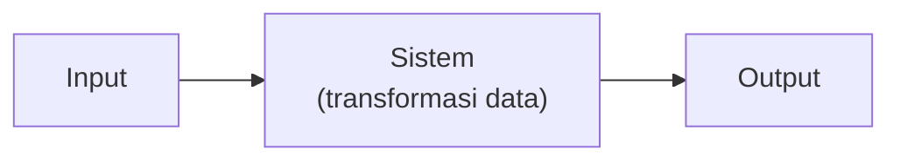
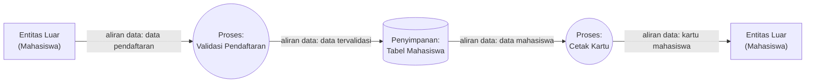
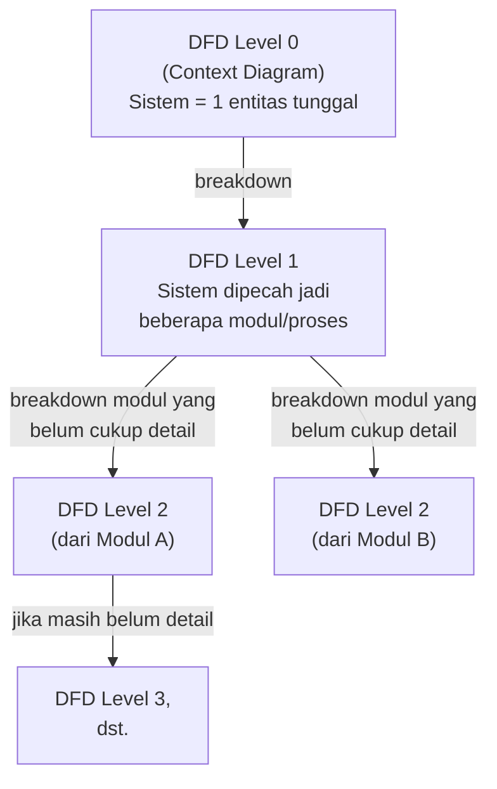
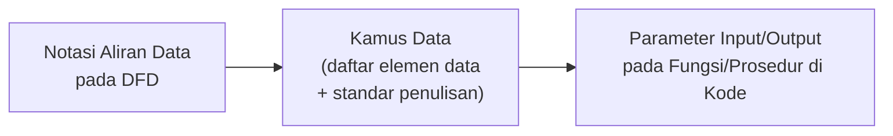
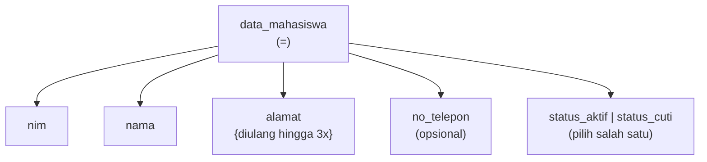
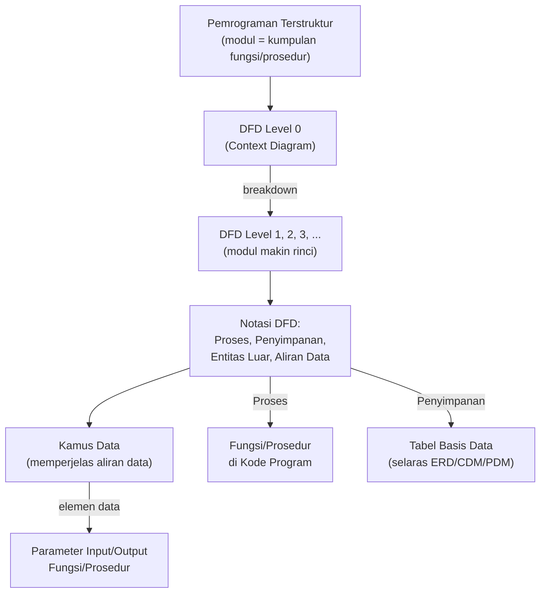

# Sesi 4 — Rekayasa Perangkat Lunak untuk Pemrograman Terstruktur

**MSIM4303 Rekayasa Perangkat Lunak**
Sistem Informasi — Fakultas Sains dan Teknologi — Universitas Terbuka

> Catatan: dokumen ini merupakan ekstraksi sekaligus elaborasi dari materi *Inisiasi 4 RPL*. Diagram notasi pada slide asli digambarkan ulang dengan mermaid, dan setiap poin dijelaskan lebih dalam dengan konteks, contoh, serta kaitannya dengan sesi-sesi sebelumnya.

---

## 1. Pemrograman Terstruktur

**Pemrograman terstruktur** adalah konsep/paradigma/sudut pandang pemrograman yang **membagi-bagi program berdasarkan fungsi-fungsi atau prosedur-prosedur** yang dibutuhkan oleh program komputer.

- **Modul** (pembagian program) biasanya dibuat dengan **mengelompokkan fungsi-fungsi dan prosedur-prosedur** yang diperlukan untuk sebuah proses tertentu.
- Pendekatan ini membuat program lebih mudah dibaca, diuji, dan dipelihara, karena setiap modul punya tanggung jawab yang spesifik dan terbatas (mirip prinsip *single responsibility* pada paradigma modern).

> Kaitan dengan sesi sebelumnya: pembagian modul ini adalah implementasi nyata dari tahap **Desain** dan **Pengembangan** pada SDLC (Sesi 3) — sebelum kode benar-benar ditulis, struktur modulnya harus dipetakan dulu. Alat pemetaan yang dibahas di sesi ini adalah **DFD (Data Flow Diagram)**.

---

## 2. Data Flow Diagram (DFD)

**Data Flow Diagram (DFD)**, dalam bahasa Indonesia disebut **Diagram Alir Data (DAD)**, adalah representasi grafik yang menggambarkan **aliran informasi** dan **transformasi informasi** yang diaplikasikan sebagai data — mulai dari masukan (*input*) hingga keluaran (*output*).

DFD adalah alat utama dalam pemrograman terstruktur untuk **memetakan modul-modul apa saja** yang akan dibuat, serta **bagaimana data mengalir** antar modul tersebut — sebelum diterjemahkan ke kode program.



---

## 3. Notasi-notasi pada DFD

DFD menggunakan empat jenis notasi/simbol standar. Memahami notasi ini penting karena **setiap notasi punya konsekuensi langsung saat diterjemahkan ke kode program**:

| Notasi | Bentuk pada Diagram | Penjelasan | Konsekuensi pada Kode | Aturan Penamaan |
|---|---|---|---|---|
| **Proses** (*process*) | Lingkaran/persegi dengan sudut tumpul | Fungsi atau prosedur yang mengolah data | Diimplementasikan sebagai **fungsi/prosedur** di kode program | Kata kerja (misalnya "Validasi Login", "Hitung Total") |
| **File/Basis Data/Penyimpanan** (*storage*) | Persegi terbuka (dua garis sejajar) | Tempat penyimpanan data | Diimplementasikan sebagai **tabel basis data** — harus selaras dengan ERD/CDM/PDM | Kata benda (misalnya "Data Mahasiswa", "Tabel Transaksi") |
| **Entitas Luar** (*external entity*) | Persegi/kotak | Orang atau sistem lain yang berinteraksi dengan sistem yang dimodelkan (sumber *input* atau tujuan *output*) | Merepresentasikan **aktor/sumber data eksternal** — bukan bagian dari sistem itu sendiri | Kata benda (misalnya "Mahasiswa", "Admin") |
| **Aliran Data** (*data flow*) | Garis dengan tanda panah | Data yang berpindah antar proses, dari penyimpanan ke proses, atau dari/ke entitas luar | Merepresentasikan **parameter masukan/keluaran** antar fungsi | Kata benda, boleh diawali kata "data" (misalnya "data siswa" atau cukup "siswa") — yang penting maknanya adalah representasi aliran data |



> **Catatan penting dari materi:**
> - Penamaan **Proses** memakai kata kerja, karena proses merepresentasikan *aksi*.
> - Penamaan **Penyimpanan**, **Entitas Luar**, dan **Aliran Data** memakai kata benda, karena ketiganya merepresentasikan *data atau pihak*, bukan aksi.
> - Tabel hasil pemodelan **Penyimpanan** pada DFD harus konsisten dengan hasil perancangan basis data lain seperti **Entity Relationship Diagram (ERD)**, **Conceptual Data Model (CDM)**, dan **Physical Data Model (PDM)** — DFD tidak berdiri sendiri, melainkan harus selaras dengan pemodelan data.

---

## 4. Tahapan Perancangan dengan DFD (Leveling)

DFD dirancang secara **berjenjang (leveled)** — dari gambaran paling umum hingga paling detail. Empat tahapan utamanya:

### 4.1 DFD Level 0 (*Context Diagram*)
Menggambarkan sistem yang akan dibuat sebagai **satu entitas tunggal** yang berinteraksi dengan orang maupun sistem lain. Digunakan untuk menggambarkan **interaksi antara sistem yang dikembangkan dengan entitas luar**, tanpa merinci proses internal sistem.

### 4.2 DFD Level 1
Menggambarkan **modul-modul** yang ada di dalam sistem. DFD Level 1 adalah hasil *breakdown* (pemecahan) dari DFD Level 0 yang sebelumnya sudah dibuat — sistem yang tadinya satu kotak besar, kini dipecah menjadi beberapa proses/modul.

### 4.3 DFD Level 2
Modul-modul pada DFD Level 1 dapat dipecah lebih lanjut menjadi DFD Level 2. **Tidak semua modul harus dipecah** — tergantung tingkat kedetailannya. Jika modul sudah cukup detail dan rinci, modul tersebut **tidak perlu dipecah lagi**. Untuk satu sistem, **jumlah DFD Level 2 = jumlah modul pada DFD Level 1 yang di-*breakdown***.

### 4.4 DFD Level 3 dan Seterusnya
Merupakan *breakdown* dari modul pada level di atasnya. Aturan pemecahannya **sama persis** dengan aturan pada Level 1 dan Level 2 — proses ini berlanjut sampai setiap proses sudah cukup sederhana untuk langsung diterjemahkan menjadi satu fungsi/prosedur dalam kode.



> **Aturan penting:** semakin dalam levelnya, semakin **rinci** prosesnya — sampai akhirnya setiap proses di level terdalam **idealnya bisa langsung dipetakan menjadi satu fungsi/prosedur** dalam pemrograman terstruktur (lihat bagian 1).

---

## 5. Kamus Data (*Data Dictionary*)

**Kamus data** digunakan untuk **memperjelas aliran data** yang digambarkan pada DFD. Kamus data adalah **kumpulan daftar elemen data** yang mengalir pada sistem perangkat lunak, sehingga *input* dan *output* dapat dipahami secara umum (memiliki standar cara penulisan).

> Dalam implementasi program, kamus data dapat menjadi **parameter masukan atau keluaran** dari sebuah fungsi atau prosedur — artinya kamus data adalah jembatan langsung antara notasi **Aliran Data** pada DFD (bagian 3) dengan **signature fungsi** yang akan ditulis di kode program.



### 5.1 Simbol pada Kamus Data

Kamus data memiliki notasi standar sendiri untuk mendeskripsikan struktur sebuah elemen data secara ringkas dan presisi:

| Simbol | Keterangan |
|---|---|
| `=` | disusun atau terdiri dari |
| `+` | dan |
| `[ \| ]` | baik ... atau ... (pilih salah satu) |
| `{ }ⁿ` | n kali diulang / bernilai banyak (perulangan) |
| `( )` | data opsional (boleh ada, boleh tidak) |
| `*...*` | batas komentar |

**Contoh penerapan** (ilustrasi tambahan untuk memperjelas, bukan dari slide asli):

```
data_mahasiswa = nim + nama + {alamat}3 + (no_telepon) + [status_aktif | status_cuti]
```

Dibaca sebagai: *data mahasiswa terdiri dari NIM dan nama, ditambah alamat yang bisa berulang hingga 3 baris, ditambah nomor telepon yang sifatnya opsional, dan baik status aktif atau status cuti (pilih satu).*



---

## Ringkasan Keterkaitan Antar Konsep



Inti dari sesi ini: dalam pemrograman terstruktur, **DFD adalah jembatan antara kebutuhan sistem dan struktur kode program** — setiap **proses** pada DFD akan menjadi fungsi/prosedur, setiap **penyimpanan** akan menjadi tabel basis data, dan **kamus data** memastikan setiap data yang mengalir antar fungsi memiliki definisi yang jelas dan standar. Pemodelan yang rapi pada tahap ini akan membuat tahap implementasi (Sesi 3 — tahap *Development*) jauh lebih terarah dan minim ambiguitas.

---

*Terima kasih*
