# Sesi 5 — Rekayasa Perangkat Lunak Berorientasi Objek

**MSIM4303 Rekayasa Perangkat Lunak**
Sistem Informasi — Fakultas Sains dan Teknologi — Universitas Terbuka

> Catatan: dokumen ini merupakan ekstraksi sekaligus elaborasi dari materi *Inisiasi 5 RPL*. Diagram pada slide asli digambarkan ulang dengan mermaid, dan setiap poin dijelaskan lebih dalam dengan konteks, contoh, serta kaitannya dengan sesi-sesi sebelumnya.

---

## 1. Rekayasa Perangkat Lunak Berorientasi Objek

**Metodologi berorientasi objek** adalah suatu strategi pembangunan perangkat lunak yang **mengorganisasikan perangkat lunak sebagai kumpulan objek** yang berisi data dan operasi yang diberlakukan terhadapnya. Metodologi ini merupakan cara bagaimana sistem perangkat lunak dibangun melalui **pendekatan objek secara sistematis**.

> Kaitan dengan Sesi 4: pemrograman terstruktur (Sesi 4) memecah program berdasarkan **fungsi/prosedur**, sedangkan pemrograman berorientasi objek memecah program berdasarkan **objek yang membungkus data dan perilakunya sendiri**. Kedua paradigma ini adalah dua cara berbeda dalam mengelola kompleksitas perangkat lunak — DFD cocok untuk paradigma terstruktur, sedangkan **UML** (bagian 3) adalah alat pemodelan standar untuk paradigma berorientasi objek.

### 1.1 Keuntungan Menggunakan Metodologi Berorientasi Objek

1. **Meningkatkan produktivitas** — komponen (kelas/objek) dapat dipakai ulang di berbagai bagian sistem maupun proyek lain.
2. **Kecepatan pengembangan** — pengembang tidak perlu menulis ulang logika yang sudah ada dalam kelas yang sudah dibuat.
3. **Kemudahan pemeliharaan** — perubahan pada satu kelas cenderung tidak memengaruhi kelas lain karena data dan logika sudah terbungkus rapi (lihat *enkapsulasi*).
4. **Adanya konsistensi** — struktur kelas yang seragam membuat cara kerja sistem lebih mudah diprediksi dan dipahami antar developer.
5. **Meningkatkan kualitas perangkat lunak** — desain yang modular dan dapat diuji per komponen menghasilkan sistem yang lebih *robust* (lihat kriteria kualitas RPL di Sesi 1).

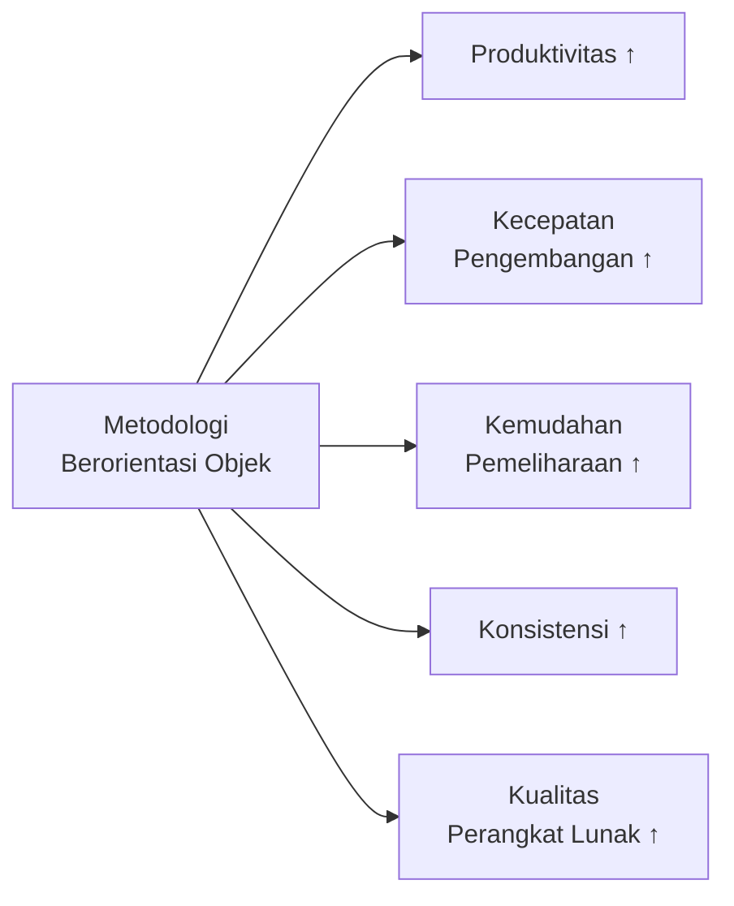

---

## 2. Konsep Dasar Berorientasi Objek

Sembilan konsep fundamental yang menjadi dasar paradigma berorientasi objek:

| Konsep | Penjelasan |
|---|---|
| **Kelas** (*class*) | Cetak biru/template yang mendefinisikan struktur (atribut) dan perilaku (metode) yang akan dimiliki oleh objek-objeknya |
| **Objek** (*object*) | Instansiasi/perwujudan nyata dari sebuah kelas pada saat program dijalankan |
| **Atribut** (*attribute*) | Variabel/data yang dimiliki oleh sebuah kelas, merepresentasikan keadaan/properti objek |
| **Metode** (*method*) | Fungsi/operasi yang dimiliki oleh sebuah kelas, merepresentasikan perilaku/kemampuan objek |
| **Abstraksi** (*abstraction*) | Menyederhanakan kompleksitas dunia nyata dengan hanya menampilkan sifat/perilaku yang relevan terhadap konteks sistem |
| **Enkapsulasi** (*encapsulation*) | Membungkus data dan metode dalam satu kesatuan kelas, serta menyembunyikan detail internal dari pihak luar |
| **Pewarisan** (*inheritance*) | Mekanisme sebuah kelas (*subclass*) mewarisi atribut dan metode dari kelas lain (*superclass*) |
| **Antarmuka** (*interface*) | Kontrak berupa kumpulan metode yang harus diimplementasikan oleh kelas yang menggunakannya, tanpa menentukan cara implementasinya |
| ***Reusability*** | Kemampuan kelas/komponen untuk dipakai ulang di berbagai konteks/bagian sistem yang berbeda |

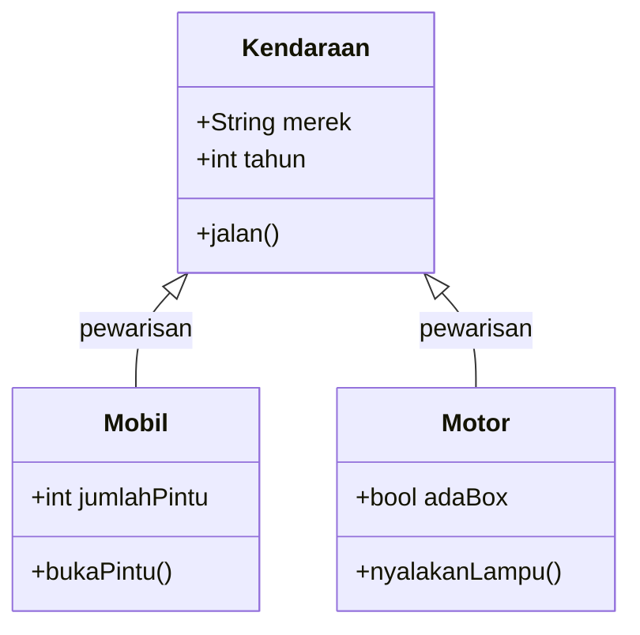

*(Diagram di atas adalah ilustrasi tambahan untuk memperjelas konsep pewarisan/atribut/metode — bukan diagram dari slide asli.)*

### 2.1 Konsep Lanjutan

Empat konsep tambahan yang melengkapi konsep dasar di atas:

1. **Generalisasi dan Spesialisasi** — *generalisasi* adalah proses menarik sifat-sifat umum dari beberapa kelas menjadi satu kelas induk (superclass); *spesialisasi* adalah kebalikannya, yaitu menurunkan kelas yang lebih khusus dari kelas umum. Keduanya adalah dua sisi mata uang dari konsep **pewarisan**.
2. **Komunikasi Antar Objek** — objek-objek dalam sistem saling berinteraksi dengan cara mengirim **pesan** (*message*) — misalnya satu objek memanggil metode milik objek lain.
3. **Polimorfisme** (*polymorphism*) — kemampuan objek dari kelas yang berbeda untuk merespons **panggilan metode yang sama** dengan perilaku yang berbeda-beda sesuai kelasnya masing-masing.
4. **Package** — mekanisme pengelompokan kelas-kelas yang berkaitan ke dalam satu kesatuan logis, untuk menjaga sistem tetap terorganisasi saat jumlah kelas semakin banyak.

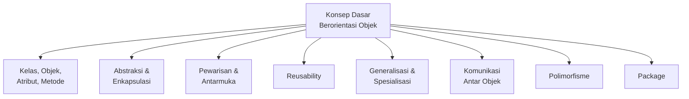

---

## 3. UML (Unified Modeling Language)

### 3.1 Pemodelan

**Pemodelan** adalah gambaran dari realita yang disederhanakan dan dituangkan dalam bentuk pemetaan dengan aturan tertentu. Contoh analoginya: seorang **arsitek** yang ingin memodelkan gedung akan membuat **maket (tiruan)** arsitektur gedung tersebut, dibuat semirip mungkin dengan desain aslinya agar bentuk gedung yang diinginkan dapat terlihat jelas sebelum benar-benar dibangun.

Manusia lebih mudah memahami sesuatu melalui **visual**, sehingga sekelompok orang yang berkepentingan dapat memahami ide yang akan dikerjakan dengan cara yang sama. Pemodelan juga banyak digunakan untuk **merencanakan** sesuatu agar kegagalan dan risiko yang mungkin terjadi dapat **diminimalisir** — sejalan dengan tahap **Analisis Risiko** pada model Spiral (Sesi 3).

### 3.2 Diagram UML

UML menyediakan berbagai jenis diagram yang terbagi ke dalam dua kategori besar: **Structure Diagram** (menggambarkan struktur statis sistem) dan **Behavior Diagram** (menggambarkan perilaku dinamis sistem).

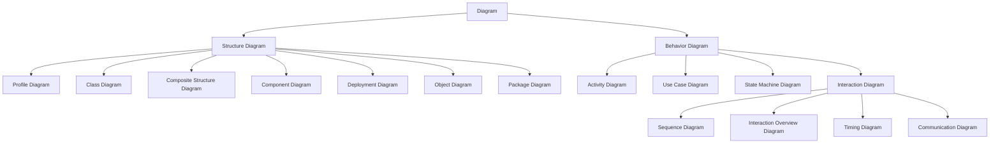

> Dari sembilan-belas jenis diagram UML di atas, materi sesi ini membahas **enam diagram inti** yang paling sering dipakai dalam praktik rekayasa perangkat lunak: *Class*, *Object*, *Component*, *Deployment*, *Use Case*, *Activity*, dan *Sequence Diagram*.

---

## 4. Class Diagram

**Diagram kelas** menggambarkan **struktur sistem** dari segi pendefinisian kelas-kelas yang akan dibuat untuk membangun sistem. Setiap kelas memiliki:

- **Atribut** — variabel-variabel yang dimiliki oleh suatu kelas.
- **Operasi/Metode** — fungsi-fungsi yang dimiliki oleh suatu kelas.

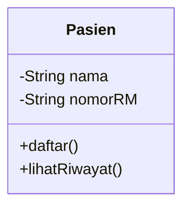

> Class Diagram adalah representasi **statis** — ia menunjukkan kelas apa saja yang ada dan apa isinya, tetapi **tidak** menunjukkan urutan eksekusi atau bagaimana objek-objeknya saling berinteraksi saat program berjalan (itu tugas diagram perilaku seperti *Sequence* dan *Activity Diagram*).

---

## 5. Object Diagram

**Diagram objek** menggambarkan struktur sistem dari segi **penamaan objek** dan **jalannya objek** dalam sistem — pada dasarnya adalah "potret" (*snapshot*) dari objek-objek nyata yang sedang berjalan, sebagai contoh konkret dari Class Diagram.

| Simbol | Deskripsi |
|---|---|
| **Objek** | Digambarkan sebagai `nama_objek : nama_kelas`, dengan daftar `atribut = nilai` di dalamnya — merupakan objek dari kelas yang berjalan saat sistem dijalankan |
| **Link** | Garis yang menggambarkan relasi antar objek |

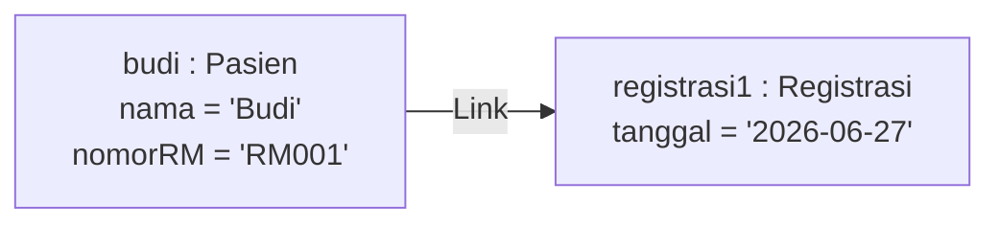

> Perbedaan **Class Diagram** vs **Object Diagram**: Class Diagram menunjukkan **definisi/cetak biru** (mis. kelas `Pasien` punya atribut `nama` dan `nomorRM`), sedangkan Object Diagram menunjukkan **instansi nyata** dengan nilai konkret (mis. objek `budi : Pasien` dengan `nama = 'Budi'`).

---

## 6. Component Diagram

**Diagram komponen** dibuat untuk menunjukkan **organisasi dan ketergantungan** di antara kumpulan komponen dalam sebuah sistem.

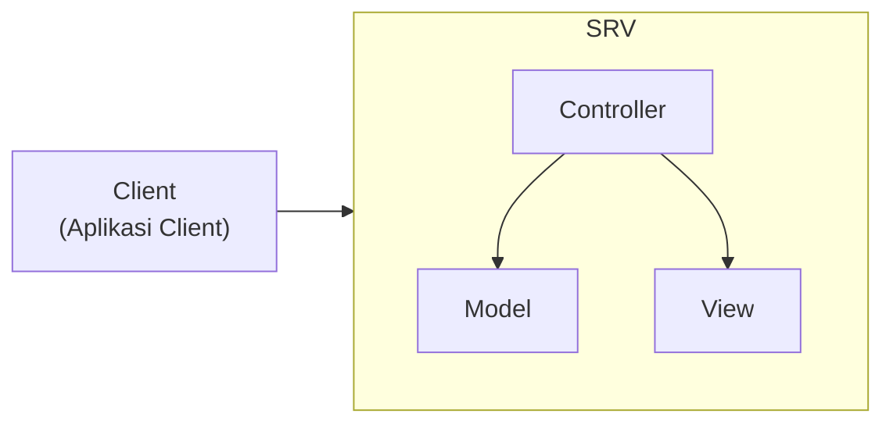

> Contoh pada diagram asli menggambarkan komponen sistem dengan pola **MVC (Model-View-Controller)** di sisi server, yang diakses oleh sebuah komponen aplikasi *client*. Ini menunjukkan bagaimana komponen-komponen besar (bukan kelas individual) saling bergantung dan terorganisasi dalam satu sistem.

---

## 7. Deployment Diagram

**Diagram *deployment*** menunjukkan **konfigurasi komponen** dalam proses eksekusi aplikasi — yaitu di **perangkat keras/node** mana saja komponen perangkat lunak tersebut akan berjalan secara fisik.

Diagram *deployment* dapat digunakan untuk memodelkan beberapa hal:

- **Sistem tambahan** (*embedded system*) — menggambarkan rancangan *device*, *node*, dan *hardware*.
- **Sistem *client*/server** — misalnya konfigurasi *browser* di sisi client yang terhubung ke server aplikasi.
- **Sistem terdistribusi murni** — komponen tersebar di banyak node yang saling terhubung.
- **Rekayasa ulang aplikasi** (*application re-engineering*).

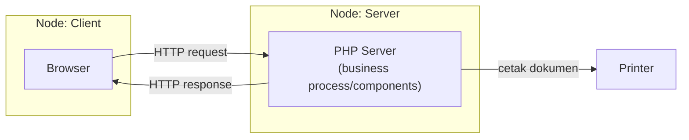

> Perbedaan **Component Diagram** vs **Deployment Diagram**: Component Diagram berfokus pada **ketergantungan logis** antar komponen perangkat lunak (mis. Controller bergantung pada Model), sedangkan Deployment Diagram berfokus pada **penempatan fisik** komponen tersebut di perangkat/node tertentu (mis. komponen server berjalan di node mana, terhubung ke printer fisik).

---

## 8. Use Case Diagram

**Use case** atau **diagram use case** merupakan pemodelan untuk **perilaku (*behavior*) sistem informasi** yang akan dibuat — menunjukkan **apa saja yang dapat dilakukan** oleh sistem dari sudut pandang penggunanya (aktor).

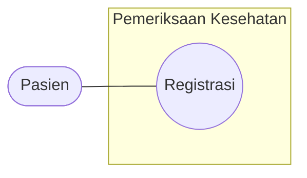

### Elemen Utama Use Case Diagram
- **Aktor** (digambarkan sebagai tongkat/*stick figure*) — pengguna atau sistem lain yang berinteraksi dengan sistem, contoh pada diagram asli: **Pasien**.
- **Use Case** (digambarkan sebagai elips/oval) — sebuah fungsi/layanan yang disediakan sistem, contoh pada diagram asli: **Registrasi**.
- **Sistem/Batas Sistem** (digambarkan sebagai kotak pembungkus) — batas dari sistem yang dimodelkan, contoh pada diagram asli: **Pemeriksaan Kesehatan**.
- **Garis penghubung** (asosiasi) — menunjukkan aktor mana yang terlibat pada use case mana, dengan notasi multiplisitas (`*`) jika diperlukan.

---

## 9. Activity Diagram

**Diagram aktivitas** menggambarkan ***workflow*** (aliran kerja) atau aktivitas dari sebuah sistem, proses bisnis, atau menu yang ada pada perangkat lunak.

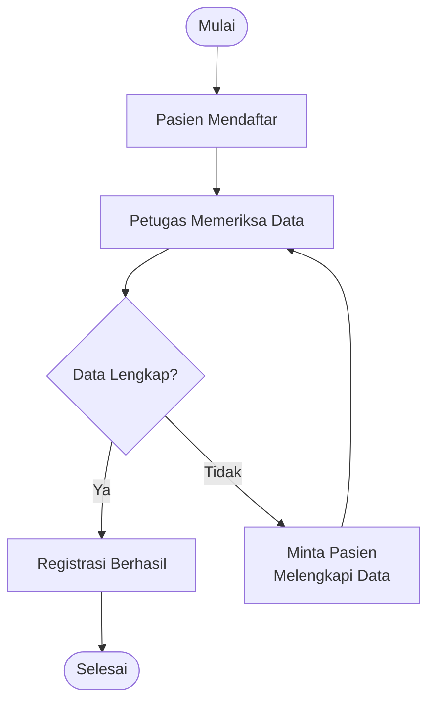

> Activity Diagram mirip dengan **flowchart** pada umumnya, tetapi dalam konteks UML ia secara spesifik dipakai untuk memodelkan **aliran proses bisnis atau use case tertentu** secara lebih rinci — sering dipakai sebagai pelengkap dari Use Case Diagram (bagian 8) untuk menjelaskan **bagaimana** sebuah use case dijalankan langkah demi langkah.

---

## 10. Sequence Diagram

**Diagram sekuen** (*sequence diagram*) menggambarkan **perilaku objek pada use case**, dengan mendeskripsikan **waktu hidup objek** dan ***message*** yang dikirimkan dan diterima antar objek.

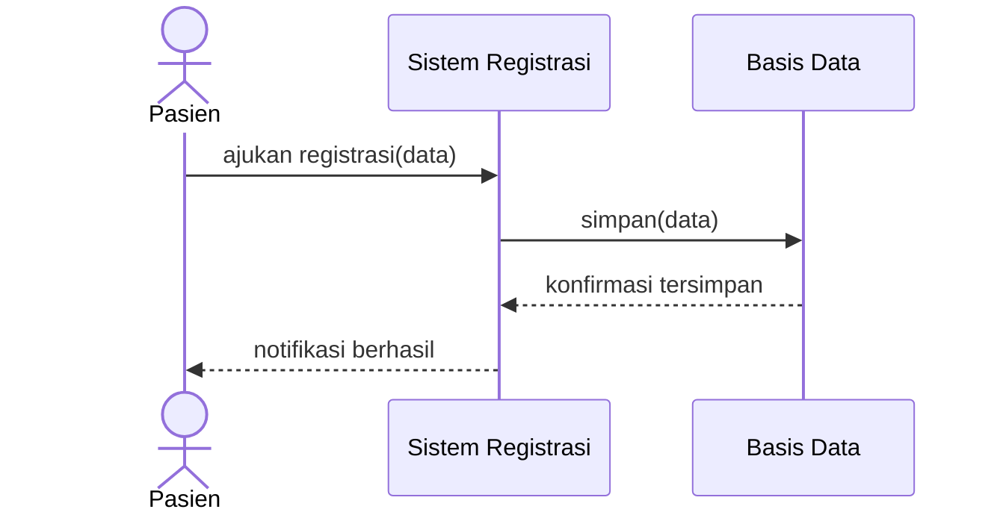

> Perbedaan **Sequence Diagram** vs **Activity Diagram**: Activity Diagram menunjukkan **urutan aktivitas/keputusan** secara umum (mirip flowchart, fokus pada *apa yang terjadi*), sedangkan Sequence Diagram menunjukkan **interaksi antar objek dari waktu ke waktu** secara spesifik (fokus pada *siapa mengirim pesan apa ke siapa, dan kapan*) — keduanya saling melengkapi, bukan saling menggantikan.

---

## Ringkasan Keterkaitan Antar Konsep

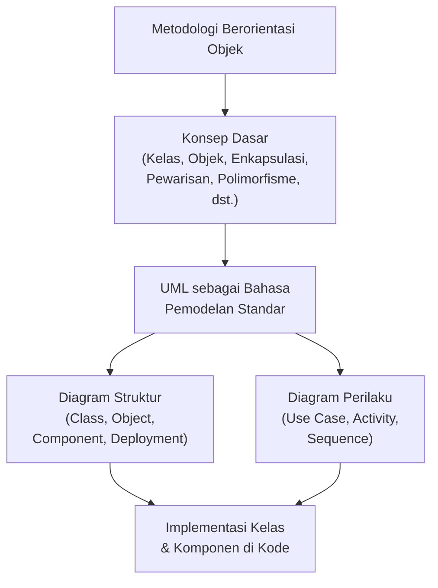

Inti dari sesi ini: paradigma berorientasi objek memandang sistem sebagai **kumpulan objek yang saling berinteraksi**, berbeda dari paradigma terstruktur (Sesi 4) yang memandang sistem sebagai **kumpulan fungsi yang memproses aliran data**. **UML** menjadi bahasa pemodelan standar untuk paradigma ini — diagram strukturnya (*Class*, *Object*, *Component*, *Deployment*) menjawab pertanyaan *"sistem ini terbuat dari apa?"*, sedangkan diagram perilakunya (*Use Case*, *Activity*, *Sequence*) menjawab pertanyaan *"sistem ini melakukan apa, dan bagaimana?"*.

---

*Terima kasih*
