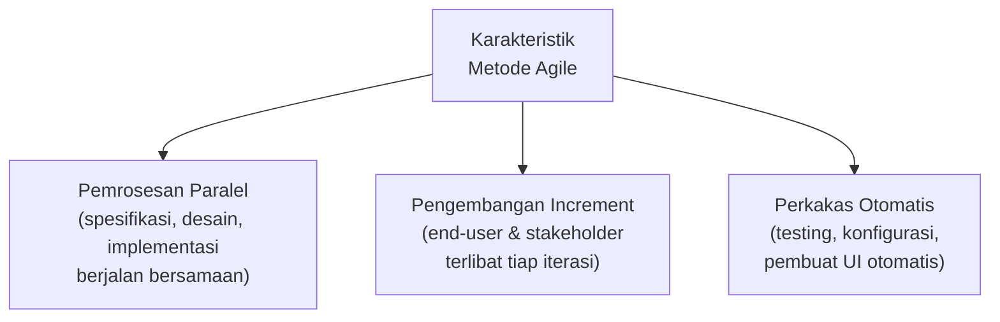
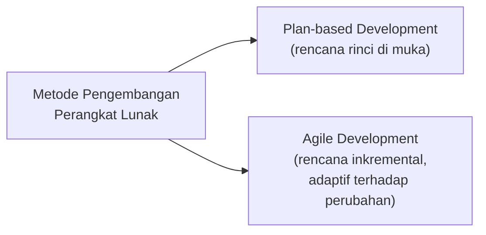
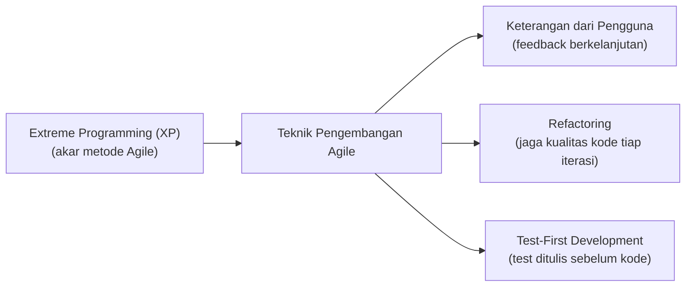
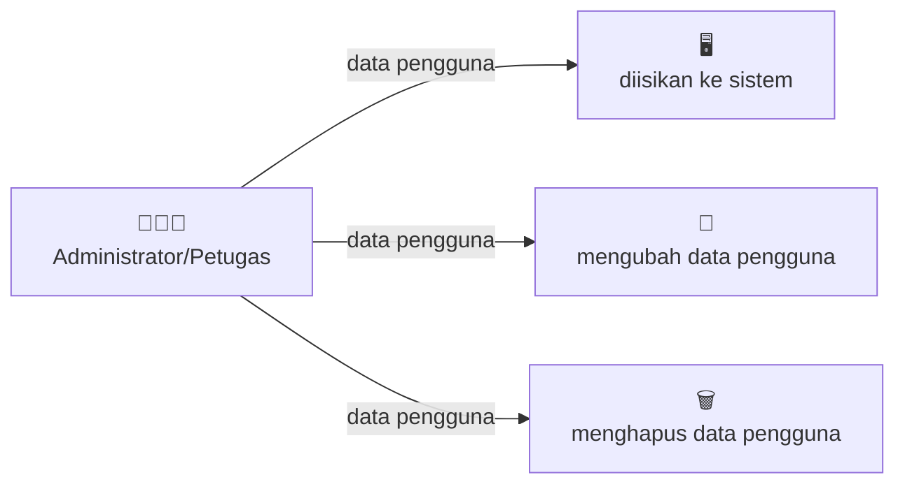
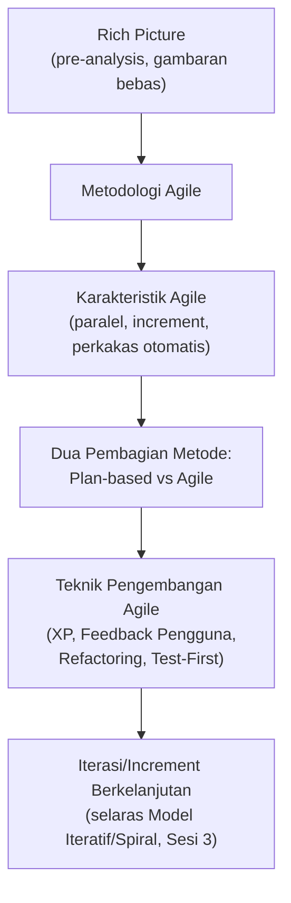

# Sesi 6 — Rekayasa Perangkat Lunak dengan Metodologi Agile

**MSIM4303 Rekayasa Perangkat Lunak**
Sistem Informasi — Fakultas Sains dan Teknologi — Universitas Terbuka

> Catatan: dokumen ini merupakan ekstraksi sekaligus elaborasi dari materi *Inisiasi 6 RPL*. Diagram/ilustrasi pada slide asli digambarkan ulang dengan mermaid, dan setiap poin dijelaskan lebih dalam dengan konteks, contoh, serta kaitannya dengan sesi-sesi sebelumnya.

---

## 1. Pendahuluan Metodologi Agile

**Rapid Software Development**, seiring berjalannya waktu, lebih dikenal sebagai **Agile Development** atau **Metode Agile**. Metode Agile memiliki tiga karakteristik umum:

1. **Pemrosesan paralel** — pendefinisian spesifikasi kebutuhan, desain, dan implementasi berjalan **secara paralel dan sering terjadi bersamaan**. Tidak ada sistem pengumpulan spesifikasi yang detail; dokumentasi desain **diminimalisir** atau dibuat secara otomatis oleh lingkungan pemrograman yang digunakan. Dokumen kebutuhan pengguna lebih banyak berisi **garis besar** dari karakteristik penting sistem yang akan dibuat — bukan spesifikasi rinci di muka.
2. **Pengembangan berbasis pengulangan (*increment*)** — perangkat lunak yang dikembangkan merupakan hasil dari pengulangan proses. **Pengguna (*end-user*)** dan **pemangku kepentingan (*stakeholder*)** terlibat langsung pada spesifikasi dan **mengevaluasi setiap pengulangan proses** dari sistem yang dibuat.
3. **Penggunaan perkakas pendukung otomatis** — digunakan perkakas/perangkat yang mendukung proses pengembangan secara cepat dan sebisa mungkin otomatis, termasuk perangkat pengujian, perangkat untuk pengelolaan konfigurasi dan integrasi sistem, serta perangkat pembuat tampilan (*user interface*) secara otomatis.

> Kaitan dengan Sesi 3: karakteristik *increment* di atas pada dasarnya adalah perwujudan dari **Model Iteratif** dan **Model Spiral** yang sudah dibahas sebelumnya — Agile dapat dipandang sebagai **kerangka kerja/filosofi** yang menerapkan prinsip iteratif tersebut secara lebih ringan (*lightweight*) dan lebih melibatkan pengguna secara aktif di setiap putarannya.

---

## 2. Dua Pembagian Besar Metode Pengembangan Perangkat Lunak

Secara garis besar, metode pengembangan perangkat lunak terbagi menjadi dua kelompok:

1. **Pengembangan Berbasis Perencanaan** (*Plan-based Development*) — seluruh proses pengembangan **direncanakan dan dijadwalkan secara rinci di muka** sebelum proses implementasi dimulai. Aktivitas-aktivitas proses direncanakan terlebih dahulu, dan progres diukur berdasarkan rencana tersebut.
2. ***Agile Development*** — perencanaan dilakukan secara **inkremental**, sehingga lebih mudah mengubah proses untuk merefleksikan perubahan kebutuhan pelanggan.

| Aspek | Plan-based Development | Agile Development |
|---|---|---|
| Perencanaan | Rinci, dilakukan di awal | Inkremental, bisa berubah tiap iterasi |
| Dokumentasi | Lengkap dan formal | Diminimalisir, fokus pada garis besar |
| Keterlibatan pengguna | Umumnya di tahap awal & akhir | Terlibat aktif di setiap iterasi |
| Cocok untuk | Kebutuhan stabil, proyek besar & teregulasi ketat | Kebutuhan sering berubah, butuh respons cepat |

> Kaitan dengan Sesi 3: **Plan-based Development** sejalan dengan filosofi **Model Waterfall**, sedangkan **Agile Development** sejalan dengan filosofi **Model Iteratif**, **Spiral**, dan **Prototipe** yang menekankan keterlibatan pelanggan secara berulang.

---

## 3. Teknik Pengembangan Agile

Empat teknik/pilar utama yang mendukung penerapan metode Agile:

### 3.1 Extreme Programming (XP) sebagai Awal Munculnya Metode Agile
**Extreme Programming (XP)** adalah salah satu metode pengembangan perangkat lunak paling awal dan paling berpengaruh yang menjadi **akar lahirnya gerakan Agile** secara umum. XP menekankan praktik-praktik teknis yang ketat (seperti *pair programming*, integrasi berkelanjutan, dan rilis yang sering) untuk merespons perubahan kebutuhan dengan cepat tanpa mengorbankan kualitas kode.

### 3.2 Keterangan dari Pengguna sebagai Pendukung Metode Agile
Keterlibatan aktif pengguna (*end-user*) dalam memberikan **keterangan/umpan balik** secara berkelanjutan menjadi pendukung utama metode Agile — selaras dengan karakteristik kedua pada bagian 1, di mana pengguna ikut mengevaluasi setiap *increment* yang dihasilkan.

### 3.3 Refactoring
***Refactoring*** adalah proses **memperbaiki struktur internal kode program** tanpa mengubah perilaku/fungsinya dari sudut pandang pengguna. Karena dokumentasi desain diminimalisir di Agile (lihat bagian 1), kode program itu sendiri harus selalu dijaga tetap bersih dan mudah dipahami — *refactoring* adalah cara untuk menjaga kualitas tersebut seiring berjalannya banyak iterasi.

### 3.4 Pengembangan Test-First
**Pengembangan *Test-First*** adalah pendekatan di mana **pengujian (test) ditulis terlebih dahulu**, sebelum kode implementasi yang sebenarnya ditulis. Pendekatan ini memastikan setiap fungsi/fitur sudah memiliki kriteria keberhasilan yang jelas sejak awal, sekaligus menjaga agar kode baru tidak merusak fungsi yang sudah ada (mirip prinsip *regression testing*).

> Keempat teknik ini saling melengkapi: **XP** menjadi fondasi filosofi, **keterangan pengguna** menjamin arah pengembangan tetap relevan, **refactoring** menjaga kualitas struktur kode, dan **test-first** menjaga kebenaran fungsional kode — semuanya berjalan berulang di setiap iterasi/*increment*.

---

## 4. Rich Picture

### 4.1 Definisi
***Rich picture*** adalah sebuah tipe diagram dengan **gambaran bebas** yang dapat memiliki jangkauan luas terkait fungsi kecerdasan manusia. Rich picture biasanya digunakan untuk membuat gambaran pada tahap ***pre-analysis*** — sebelum memahami bagian dari situasi secara lebih formal terkait proses maupun struktur.

Rich picture digunakan untuk mencoba **mengkapsulasi situasi yang sesungguhnya**, **tanpa aturan yang ketat**, menggunakan representasi bebas (mirip kartun) untuk merepresentasikan ide-ide seperti:

- *Layout* (tata letak)
- Koneksi
- Relasi
- Pengaruh
- Sebab-akibat
- Dan lain sebagainya

> **Catatan penting:** karena sifatnya yang bebas dan informal, rich picture **berbeda secara fundamental** dari diagram UML (Sesi 5) yang memiliki notasi dan aturan ketat. Rich picture justru sengaja dibuat **tanpa aturan baku**, agar dapat menangkap konteks situasi yang kompleks dan manusiawi (termasuk hal-hal yang sulit dimodelkan secara formal, seperti emosi, konflik kepentingan, atau hubungan informal antar pihak) **sebelum** beralih ke pemodelan formal seperti DFD (Sesi 4) atau UML (Sesi 5).

### 4.2 Contoh Rich Picture

Berikut adalah rekonstruksi dari contoh rich picture pada materi asli, yang menggambarkan **fungsi pengelolaan pengguna oleh Administrator/Petugas**:

**Fungsi Pengelolaan Pengguna oleh Administrator atau Petugas**

Pada contoh ini, satu aktor (**Administrator/Petugas**) digambarkan melakukan tiga jenis interaksi terhadap **data pengguna**: mengisikannya ke sistem, mengubahnya, dan menghapusnya. Meskipun direkonstruksi di sini dalam bentuk diagram alur yang lebih terstruktur (karena keterbatasan notasi mermaid untuk gaya bebas/kartun), **esensi rich picture yang sesungguhnya** akan menggambarkan elemen-elemen ini secara lebih bebas — misalnya dengan ilustrasi orang, panah tebal yang menunjukkan arah pengaruh, dan susunan visual yang tidak harus simetris atau kaku seperti flowchart formal.

> Rich picture seperti ini sangat berguna di **tahap paling awal analisis sistem** (sebelum bagian "Teknik Pengumpulan Data" pada Sesi 2), untuk membantu tim pengembang dan pemangku kepentingan **menyamakan pemahaman awal** tentang situasi nyata, sebelum kebutuhan tersebut diformalkan menjadi *requirement*, DFD, atau diagram UML.

---

## Ringkasan Keterkaitan Antar Konsep

Inti dari sesi ini: Agile adalah respons terhadap kelemahan pendekatan **berbasis rencana yang kaku** (*plan-based*) — dengan memproses spesifikasi, desain, dan implementasi secara **paralel dan berulang**, meminimalkan dokumentasi formal, dan melibatkan pengguna secara aktif di setiap iterasi. **Rich picture** menjadi alat bantu informal di tahap paling awal sebelum proses analisis lebih formal dimulai, sejalan dengan filosofi Agile yang tidak terlalu kaku terhadap aturan baku di tahap awal pengembangan.

---

*Terima kasih*
