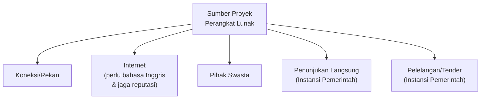
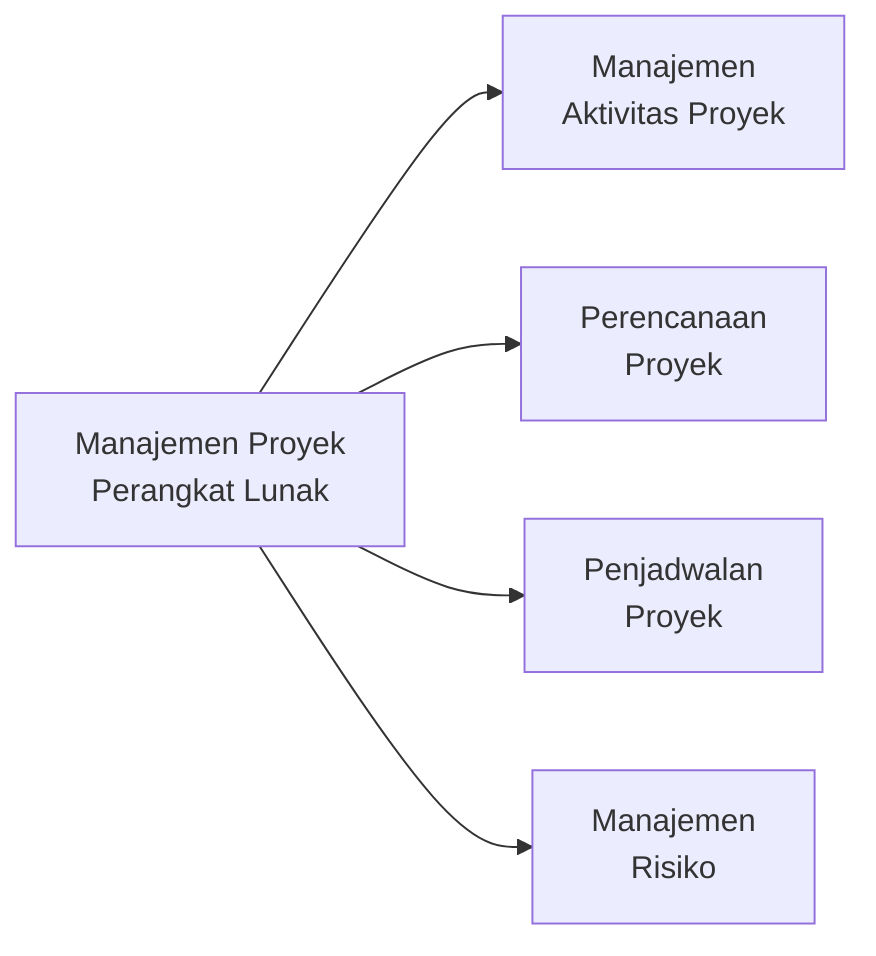
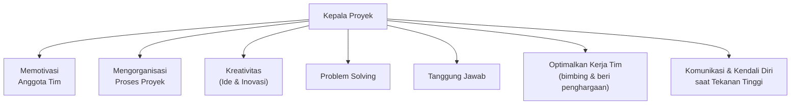
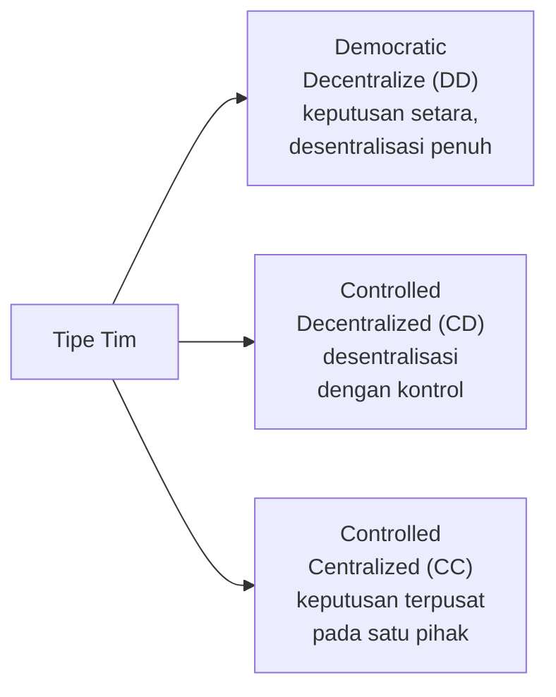
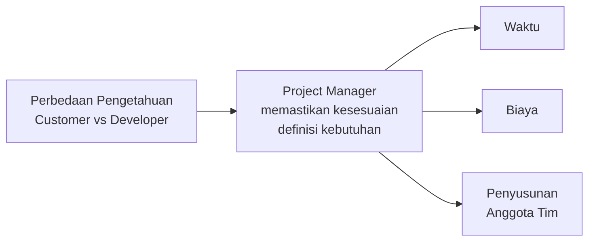
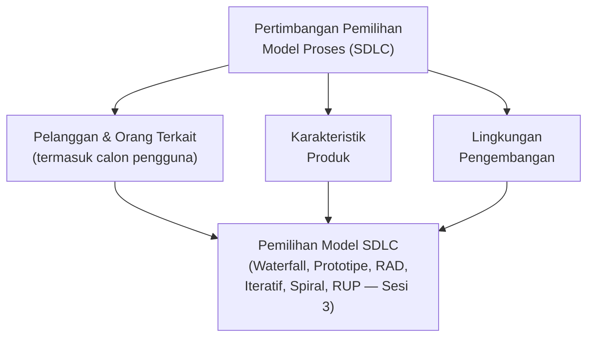
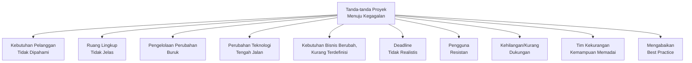
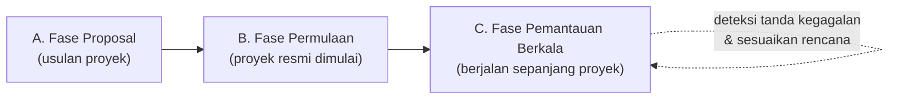
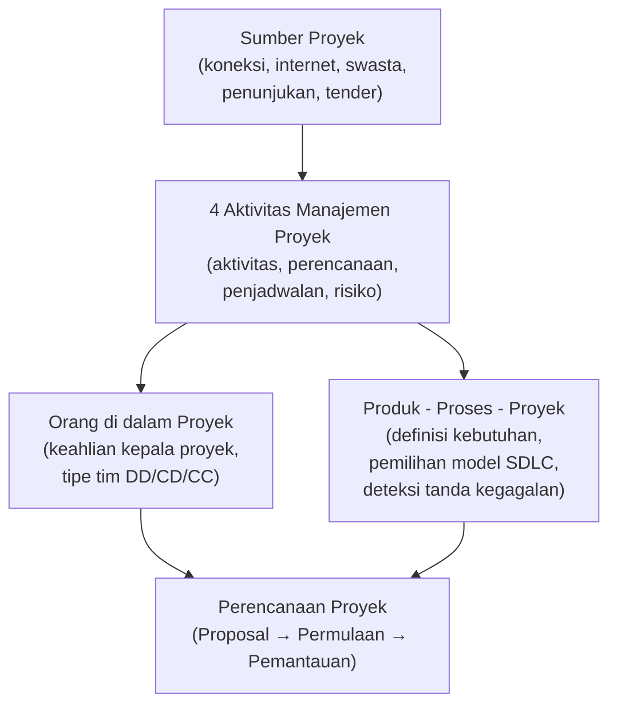

# Sesi 7 — Manajemen Proyek Perangkat Lunak

**MSIM4303 Rekayasa Perangkat Lunak**
Sistem Informasi — Fakultas Sains dan Teknologi — Universitas Terbuka

> Catatan: dokumen ini merupakan ekstraksi sekaligus elaborasi dari materi *Inisiasi 7 RPL*. Slide asli tidak memiliki diagram visual (hanya teks), sehingga mermaid dibuat dari struktur konsep untuk membantu pemahaman. Setiap poin dijelaskan lebih dalam dengan konteks, contoh, serta kaitannya dengan sesi-sesi sebelumnya.

---

## 1. Pendahuluan Manajemen Proyek Perangkat Lunak

Sebelum manajemen proyek dapat berjalan, proyek itu sendiri harus **didapatkan** terlebih dahulu. Ada lima jalur umum untuk mendapatkan proyek perangkat lunak:

1. **Koneksi/rekan** — memiliki koneksi atau rekan yang sedang membutuhkan rekanan untuk mengerjakan proyek **Information Technology (IT)**.
2. **Internet** — mencari proyek perangkat lunak melalui internet. Beberapa situs luar negeri menyediakan iklan dari para pencari rekanan proyek. Catatan penting: orang yang mendapat proyek dari internet **paling tidak harus dapat berbahasa Inggris** dan **menjaga reputasi**, karena jika tidak, klien asing cenderung sulit percaya kembali.
3. **Pihak swasta** — pihak swasta yang sedang membutuhkan rekanan untuk mengerjakan proyek IT.
4. **Penunjukan langsung** — penunjukan langsung dari instansi pemerintah yang membutuhkan rekanan proyek IT.
5. **Pelelangan (tender)** — proses pelelangan oleh instansi pemerintah yang membutuhkan rekanan proyek IT.

> Poin ini relevan secara praktis: sumber proyek (poin 4 dan 5, instansi pemerintah) cenderung memiliki proses formal seperti **Plan-based Development** (Sesi 6), sementara proyek dari koneksi/internet/swasta (poin 1–3) cenderung lebih fleksibel untuk menerapkan pendekatan **Agile** (Sesi 6).

---

## 2. Empat Aktivitas Manajemen Proyek

Manajemen proyek perangkat lunak terdiri dari empat aktivitas utama:

1. **Manajemen Aktivitas Proyek** — mengelola dan mengoordinasikan seluruh kegiatan yang berlangsung di dalam proyek.
2. **Perencanaan Proyek** — menyusun rencana kerja proyek secara keseluruhan (dibahas lebih rinci pada bagian 7).
3. **Penjadwalan Proyek** — menentukan urutan dan waktu pengerjaan setiap aktivitas/tugas dalam proyek.
4. **Manajemen Risiko** — mengidentifikasi, menilai, dan mengantisipasi risiko yang mungkin terjadi sepanjang proyek (lihat juga konsep *Analisis Risiko* pada Model Spiral, Sesi 3).

---

## 3. Orang di dalam Proyek

### 3.1 Keahlian yang Harus Dimiliki Kepala Proyek

Kepala proyek (*project leader*) harus memiliki tujuh keahlian berikut:

1. **Memotivasi anggota tim.**
2. **Mengorganisasi proses proyek** — memastikan setiap aktivitas berjalan dengan tertata.
3. **Memiliki kreativitas yang baik** terkait ide dan inovasi.
4. **Memiliki kemampuan *problem solving*** (menyelesaikan masalah) yang baik.
5. **Bertanggung jawab** terhadap proyek yang diberikan.
6. **Mengoptimalkan kerja anggota tim** — melakukan pembimbingan jika terjadi kesalahan, dan memberikan bentuk penghargaan jika kerja anggota tim baik.
7. **Berkomunikasi dengan baik** secara verbal dan non-verbal, mampu membaca situasi, serta mampu mengendalikan diri saat terjadi tekanan yang tinggi.

### 3.2 Tipe-tipe Tim

Selain kepala proyek, struktur dan pola kerja tim juga memengaruhi keberhasilan proyek. Terdapat tiga tipe tim:

1. **Democratic Decentralize (DD)** — pengambilan keputusan dilakukan secara demokratis dan **terdesentralisasi**; setiap anggota tim memiliki kontribusi yang relatif setara dalam pengambilan keputusan.
2. **Controlled Decentralized (CD)** — keputusan tetap terdesentralisasi, tetapi ada **kontrol** dari pemimpin/struktur tertentu terhadap arah keputusan tersebut.
3. **Controlled Centralized (CC)** — pengambilan keputusan **terpusat** pada satu pihak (misalnya kepala proyek) dengan kontrol penuh terhadap arah tim.

> **Catatan praktis:** tipe **DD** cenderung cocok untuk tim kecil dengan anggota berpengalaman dan proyek yang membutuhkan kreativitas tinggi (selaras filosofi Agile, Sesi 6); tipe **CC** cenderung cocok untuk proyek besar dengan struktur formal yang ketat (selaras filosofi Plan-based Development, Sesi 6); tipe **CD** berada di antara keduanya.

---

## 4. Produk

Pendefinisian **kebutuhan akan produk perangkat lunak** yang akan dibuat sangat diperlukan. Namun pada kenyataannya, hal ini bukanlah hal yang mudah, karena sering terjadi **perbedaan tingkatan pengetahuan** di bidang perangkat lunak antara pelanggan (*customer*) dan pengembang (*developer*).

Oleh sebab itu, seorang **pengelola proyek (*project manager*)** harus dapat memastikan bahwa **definisi kebutuhan sesuai dengan kebutuhan pelanggan**. Hal ini akan memengaruhi perencanaan terkait:

- **Waktu** pengerjaan
- **Biaya** proyek
- **Penyusunan anggota tim**

> Kaitan dengan Sesi 1: kesalahan dalam mendefinisikan kebutuhan produk ini adalah salah satu akar dari **tantangan warisan** (*legacy challenge*) yang dibahas pada Sesi 1 — jika kebutuhan awal sudah salah dipahami, perangkat lunak yang dihasilkan akan menyimpang dari tujuan aslinya sejak awal.

---

## 5. Proses

Seorang manajer harus memutuskan **model proses (model SDLC)** yang digunakan dalam proyek (lihat Sesi 3: Waterfall, Prototipe, RAD, Iteratif, Spiral, RUP), dengan mempertimbangkan tiga kondisi:

1. **Pelanggan dan orang-orang terkait** — pelanggan (*customer*) yang memesan produk, beserta orang-orang terkait kebutuhan perangkat lunak, termasuk orang-orang yang nantinya akan menggunakan perangkat lunak tersebut (*user*).
2. **Karakteristik produk** — sifat dan kompleksitas dari produk perangkat lunak itu sendiri.
3. **Lingkungan pengembangan** — kondisi lingkungan di mana tim pengembang bekerja.

---

## 6. Proyek — Tanda-tanda Kegagalan

Agar proyek dapat mencapai keberhasilan, diperlukan **ketajaman dalam memahami tanda-tanda** di mana proyek mulai masuk ke area kegagalan. Sepuluh tanda peringatan kegagalan proyek:

1. Tim pengembang **tidak memahami kebutuhan pelanggan**.
2. **Ruang lingkup** perangkat lunak sangat kurang terdefinisi dengan jelas.
3. **Pengelolaan perubahan** pada jalannya proyek kurang baik.
4. **Perubahan teknologi** yang dipilih di tengah jalan.
5. **Kebutuhan proses bisnis berubah** dan hal ini kurang didefinisikan dengan baik sebelumnya.
6. **Batas waktu pengerjaan (*deadlines*)** tidak realistis.
7. **Pengguna bersifat resistan** (sulit mengubah kebiasaan, terutama dari sistem kerja lama ke sistem kerja baru).
8. **Kehilangan dukungan**, atau memang belum mendapat dukungan yang memadai.
9. **Tim proyek kekurangan orang** dengan kemampuan yang memadai.
10. **Mengabaikan *best practice*** (pengalaman ahli yang sudah terbukti baik) dan pelajaran yang perlu dipelajari untuk memperbaiki langkah ke depan (hikmah).

> **Catatan praktis:** sepuluh tanda ini sebagian besar berakar dari **kegagalan komunikasi** (poin 1, 3, 5, 7) dan **kegagalan perencanaan** (poin 2, 4, 6, 8, 9) — dua hal yang seharusnya sudah diantisipasi sejak aktivitas **Perencanaan Proyek** dan **Manajemen Risiko** pada bagian 2, serta keahlian **komunikasi** kepala proyek pada bagian 3.

---

## 7. Perencanaan Proyek

Perencanaan proyek terdiri dari tiga fase besar:

### A. Fase Proposal
Fase di mana proyek **diusulkan/ditawarkan** — mencakup penyusunan dokumen proposal yang menjelaskan lingkup pekerjaan, estimasi biaya, jadwal, dan pendekatan yang akan dipakai untuk meyakinkan pemberi kerja (*customer*) bahwa tim pengembang layak dipercaya mengerjakan proyek tersebut.

### B. Fase Permulaan
Fase di mana proyek **resmi dimulai** setelah proposal disetujui — mencakup pembentukan tim, penyusunan rencana detail, dan penetapan kesepakatan awal dengan pelanggan (selaras dengan tahap **Inisiasi** pada SDLC, Sesi 3).

### C. Fase Pemantauan secara Berkala Sepanjang Proyek
Fase **pemantauan berkelanjutan** yang berjalan selama proyek berlangsung — memastikan proyek tetap berada di jalur yang benar, mendeteksi sedini mungkin tanda-tanda kegagalan (bagian 6), serta melakukan penyesuaian rencana jika diperlukan.

---

## Ringkasan Keterkaitan Antar Konsep

Inti dari sesi ini: keberhasilan proyek perangkat lunak tidak hanya ditentukan oleh **kualitas teknis kode** (yang sudah dibahas di sesi-sesi sebelumnya), melainkan juga oleh **bagaimana proyek dikelola** — mulai dari cara mendapatkan proyek, siapa yang memimpin dan bagaimana tim disusun, seberapa akurat kebutuhan produk dipahami, model proses apa yang dipilih, hingga kewaspadaan terhadap tanda-tanda kegagalan yang harus dipantau sepanjang siklus hidup proyek.

---

*Terima kasih*
