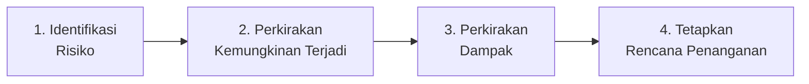
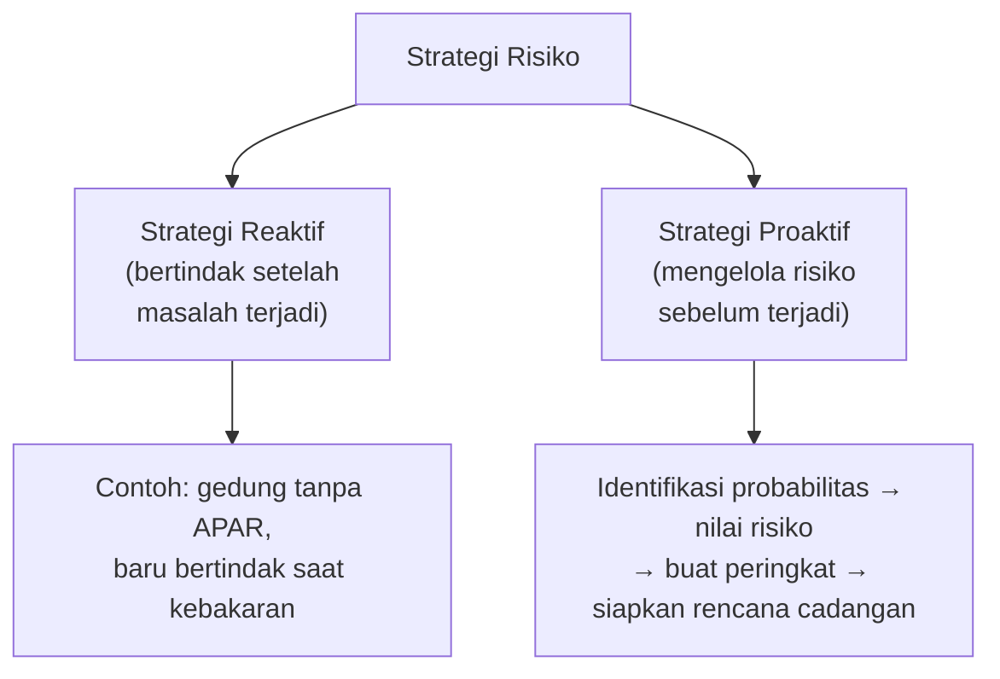
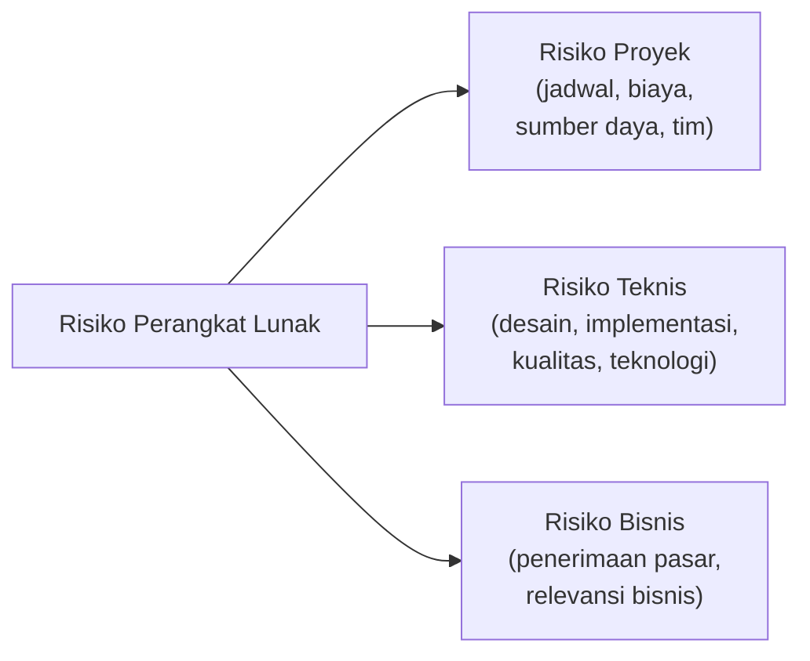
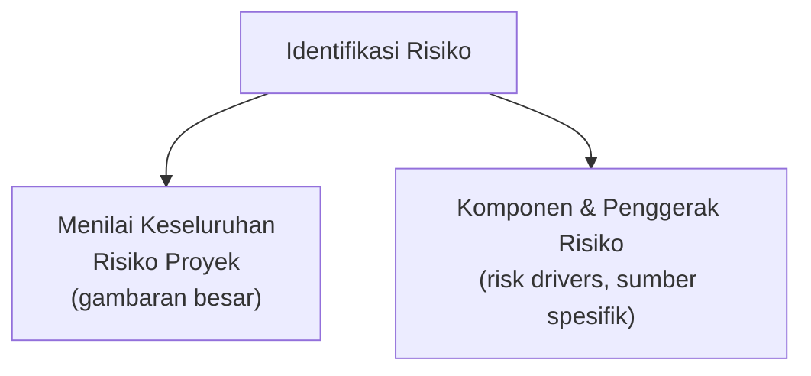
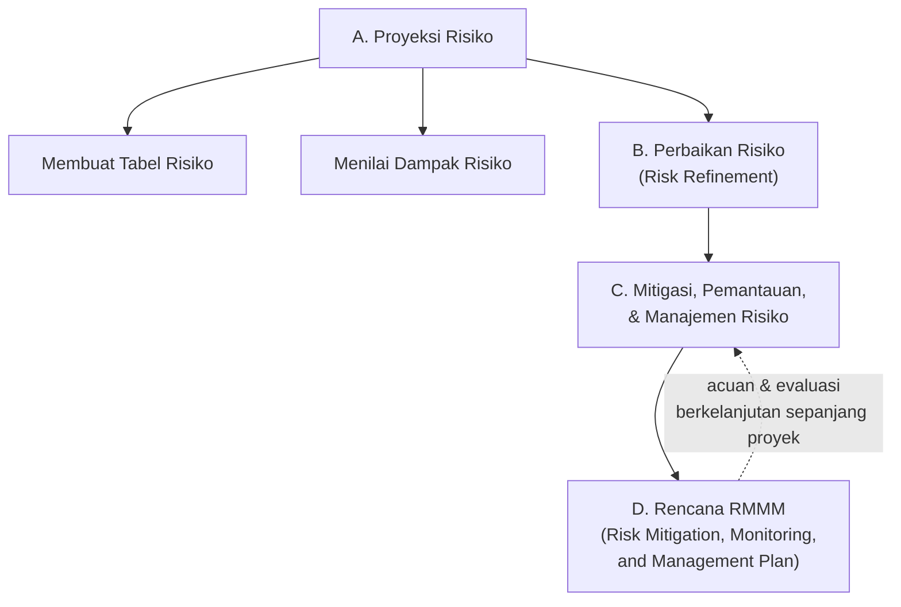
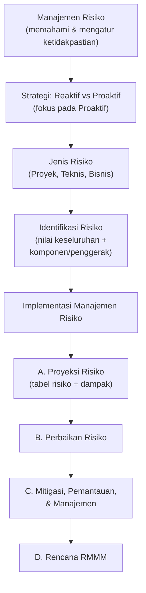

# Sesi 8 — Manajemen Risiko Proyek Perangkat Lunak

**MSIM4303 Rekayasa Perangkat Lunak**
Sistem Informasi — Fakultas Sains dan Teknologi — Universitas Terbuka

> Catatan: dokumen ini merupakan ekstraksi sekaligus elaborasi dari materi *Inisiasi 8 RPL*. Slide asli tidak memiliki diagram visual (hanya teks), sehingga mermaid dibuat dari struktur konsep untuk membantu pemahaman. Setiap poin dijelaskan lebih dalam dengan konteks, contoh, serta kaitannya dengan sesi-sesi sebelumnya.

---

## 1. Pendahuluan Manajemen Risiko

**Manajemen risiko** merupakan tindakan-tindakan untuk **memahami dan mengatur ketidakpastian**. Dalam proses pengembangan perangkat lunak, banyak permasalahan yang dapat mengganggu pelaksanaan proyek.

**Risiko** adalah **permasalahan potensial** yang mungkin terjadi — belum tentu terjadi, tetapi punya kemungkinan untuk terjadi. Oleh sebab itu, lebih baik untuk melakukan empat langkah berikut secara berurutan:

1. **Mengidentifikasi** risiko apa saja yang mungkin terjadi.
2. **Memperkirakan kemungkinan terjadinya** (probabilitas).
3. **Memperkirakan dampaknya** jika risiko tersebut benar-benar terjadi.
4. **Menetapkan rencana** apabila masalah tersebut terjadi.

> Kaitan dengan Sesi 7: manajemen risiko adalah salah satu dari **empat aktivitas manajemen proyek** (manajemen aktivitas, perencanaan, penjadwalan, dan **risiko**) yang sudah disinggung pada Sesi 7. Sesi ini membahas manajemen risiko secara lebih dalam dan terstruktur.

---

## 2. Strategi Risiko: Proaktif versus Reaktif

Terdapat dua strategi besar dalam menyikapi risiko proyek:

### 2.1 Strategi Reaktif
Strategi reaktif lebih fokus terhadap risiko yang **benar-benar sedang terjadi**. Tim proyek biasanya **tidak berbuat apa-apa** seputar pengelolaan risiko sampai sesuatu yang tidak beres terjadi, kemudian tim baru beraksi untuk membetulkan masalah dengan cepat.

> **Analogi dari materi asli:** seperti bencana kebakaran gedung — sebagian besar gedung tidak mengelola risiko kebakaran yang mungkin terjadi (tidak menyiapkan aturan, prosedur, maupun alat pemadam api ringan/APAR). Ketika kebakaran benar-benar terjadi, baru saat itulah mereka menyelesaikan permasalahannya.

### 2.2 Strategi Proaktif
Strategi proaktif lebih fokus dalam **mengelola risiko walaupun belum terjadi**. Tim manajemen risiko disiapkan secara teknis untuk:

- Mengidentifikasi probabilitas risiko
- Menilai setiap risiko
- Membuat peringkat risiko yang mungkin terjadi

Strategi proaktif **dimulai sebelum kerja teknis pengembangan proyek dimulai**. Tim proyek akan menetapkan rencana dan mengelola risiko yang mungkin terjadi. Tujuan utamanya adalah **menghindari risiko** — meskipun tidak sepenuhnya bisa menghindari risiko, setidaknya **rencana cadangan** yang memungkinkan tim merespons dan mengendalikan risiko secara efektif sudah disiapkan **sebelum** risiko tersebut benar-benar terjadi.

> Materi ini secara eksplisit menyatakan bahwa pembahasan selanjutnya akan **lebih berfokus pada manajemen risiko proaktif**.

| Aspek | Strategi Reaktif | Strategi Proaktif |
|---|---|---|
| Waktu bertindak | Setelah masalah terjadi | Sebelum kerja teknis dimulai |
| Fokus | Memperbaiki masalah dengan cepat | Mencegah & menyiapkan rencana cadangan |
| Hasil | Solusi darurat, seringkali mahal | Risiko terkendali, dampak diminimalkan |

---

## 3. Risiko-risiko Perangkat Lunak

Risiko dalam proyek perangkat lunak dapat dikelompokkan menjadi tiga jenis:

1. **Risiko Proyek** — risiko yang berkaitan dengan **pengelolaan proyek itu sendiri**: jadwal, biaya, sumber daya, dan organisasi tim (selaras dengan bagian "Orang di dalam Proyek" pada Sesi 7).
2. **Risiko Teknis** — risiko yang berkaitan dengan **aspek teknis pengembangan**: desain, implementasi, antarmuka, kualitas, maupun teknologi yang dipilih.
3. **Risiko Bisnis** — risiko yang berkaitan dengan **kelangsungan/nilai bisnis** dari produk perangkat lunak: apakah produk akan diterima pasar, apakah proyek masih relevan secara bisnis, dsb.

---

## 4. Identifikasi Risiko

Identifikasi risiko dilakukan melalui dua pendekatan:

1. **Menilai Keseluruhan Risiko Proyek** — melakukan asesmen risiko secara menyeluruh terhadap proyek, bukan hanya per komponen kecil — untuk mendapatkan gambaran besar tingkat risiko proyek secara umum.
2. **Komponen-komponen dan Penggerak Risiko** (*risk drivers*) — mengidentifikasi unsur-unsur spesifik yang **mendorong/memicu** munculnya risiko, sehingga sumber risiko dapat ditelusuri lebih rinci dan ditangani secara tepat sasaran.

---

## 5. Implementasi Manajemen Risiko

Implementasi manajemen risiko (proaktif) terdiri dari empat tahap besar:

### A. Proyeksi Risiko
Proyeksi risiko (*risk projection*/*risk estimation*) terdiri dari dua langkah:

1. **Membuat Tabel Risiko** — menyusun daftar seluruh risiko yang teridentifikasi ke dalam satu tabel terstruktur, biasanya berisi deskripsi risiko, kategori (lihat bagian 3), probabilitas, dan dampak.
2. **Menilai Dampak Risiko** — mengukur seberapa besar dampak yang akan ditimbulkan apabila masing-masing risiko benar-benar terjadi.

### B. Perbaikan Risiko (*Risk Refinement*)
Tahap untuk **menyempurnakan/merinci** risiko yang telah teridentifikasi — risiko besar yang masih umum dipecah menjadi risiko-risiko yang lebih spesifik dan dapat ditindaklanjuti, sehingga lebih mudah dirancang penanganannya.

### C. Mitigasi, Pemantauan, dan Manajemen Risiko
Tahap untuk:
- **Mitigasi** — mengurangi probabilitas atau dampak risiko sebelum terjadi.
- **Pemantauan** — mengawasi indikator-indikator risiko secara berkala sepanjang proyek berjalan.
- **Manajemen** — mengambil tindakan terkoordinasi saat risiko benar-benar muncul, berdasarkan rencana yang sudah disiapkan.

### D. Rencana RMMM
**RMMM** adalah singkatan dari **Risk Mitigation, Monitoring, and Management** (Mitigasi, Pemantauan, dan Manajemen Risiko) — yaitu **dokumen rencana formal** yang merangkum seluruh strategi penanganan risiko (tahap A, B, dan C di atas) ke dalam satu rencana terpadu yang menjadi acuan tim sepanjang proyek berjalan.

> **Catatan keterkaitan:** Rencana RMMM (D) pada dasarnya adalah **dokumen hasil akhir** dari seluruh proses A–C. Sekali rencana ini disusun, ia tidak statis — tahap **Mitigasi, Pemantauan, dan Manajemen** (C) akan terus berjalan secara siklis sepanjang proyek, sejalan dengan **Fase Pemantauan secara Berkala** pada Perencanaan Proyek yang dibahas di Sesi 7.

---

## Ringkasan Keterkaitan Antar Konsep

Inti dari sesi ini: risiko dalam proyek perangkat lunak **tidak bisa dihindari sepenuhnya**, tetapi dengan pendekatan **proaktif** — mengidentifikasi, menilai probabilitas dan dampak, lalu menyusun rencana mitigasi sejak awal (RMMM) — dampak negatif dari risiko dapat **diminimalkan dan dikendalikan secara efektif**, jauh lebih baik dibandingkan menunggu masalah terjadi lalu bereaksi secara reaktif seperti yang sering terjadi pada tanda-tanda kegagalan proyek yang sudah dibahas di Sesi 7.

---

*Terima kasih*
