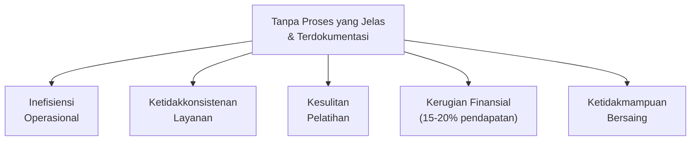
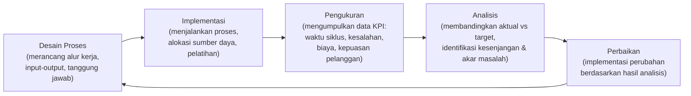
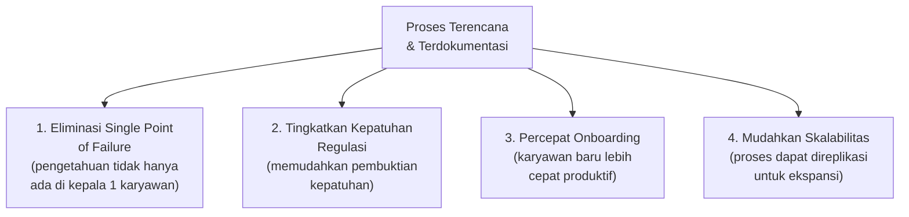
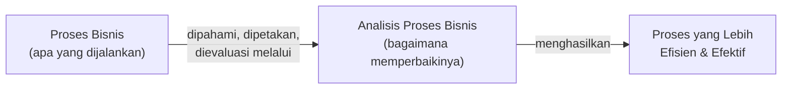
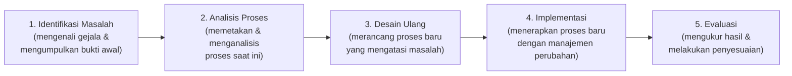
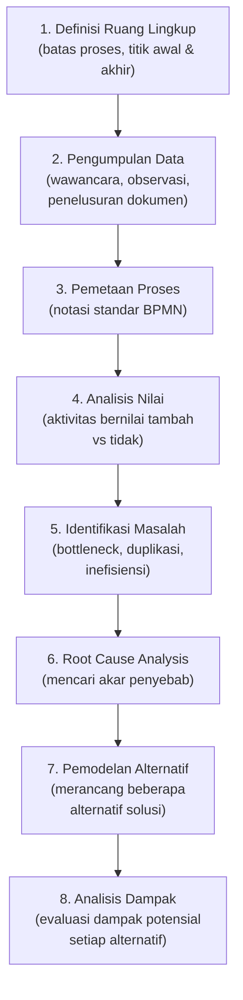
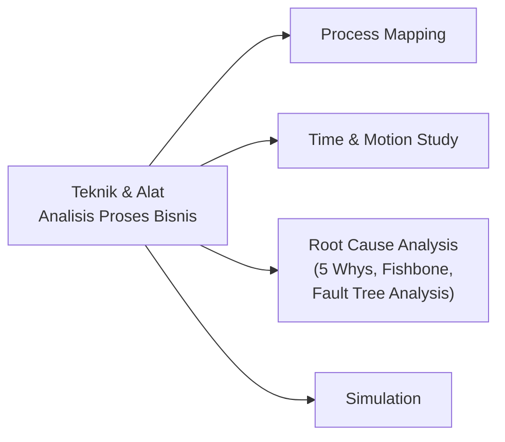
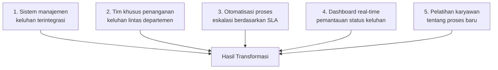
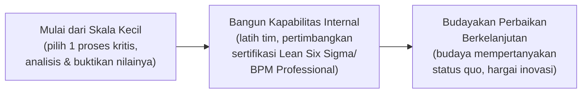
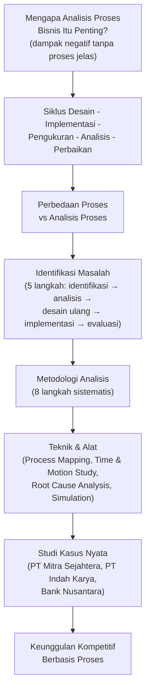

# Sesi 1 — Analisis Proses Bisnis: Fondasi Strategis untuk Keunggulan Operasional

**STSI4206 Proses Bisnis**
Sistem Informasi — Fakultas Sains dan Teknologi — Universitas Terbuka

> Catatan: dokumen ini merupakan ekstraksi sekaligus elaborasi dari materi *Analisis Proses Bisnis: Fondasi Strategis untuk Keunggulan Operasional*. Diagram pada slide asli digambarkan ulang dengan mermaid, dan setiap poin dijelaskan lebih dalam dengan konteks, contoh, serta studi kasus nyata yang disajikan pada materi.

---

## 1. Mengapa Analisis Proses Bisnis Itu Penting?

Bayangkan sebuah perusahaan manufaktur di Tangerang yang beroperasi **tanpa proses yang jelas dan terdokumentasi**. Setiap departemen bekerja dengan caranya sendiri, tanpa standarisasi atau koordinasi yang efektif. Apa yang terjadi? Enam dampak negatif berikut akan muncul:

| Dampak | Penjelasan |
|---|---|
| **Inefisiensi Operasional** | Terjadi duplikasi pekerjaan di beberapa divisi karena tidak ada dokumentasi tentang siapa yang bertanggung jawab atas tugas tertentu. Contoh: bagian pembelian dan inventaris sama-sama melakukan pemesanan bahan baku, mengakibatkan kelebihan stok. |
| **Ketidakkonsistenan Layanan** | Pelanggan mendapatkan pengalaman yang berbeda-beda setiap kali berinteraksi dengan perusahaan. Tanpa SOP yang jelas, setiap karyawan menangani keluhan pelanggan dengan cara berbeda. |
| **Kesulitan Pelatihan** | Karyawan baru membutuhkan waktu lebih lama untuk beradaptasi karena tidak ada panduan proses yang jelas — mereka belajar melalui *trial and error* sehingga produktivitas rendah pada bulan-bulan awal. |
| **Kerugian Finansial** | Studi menunjukkan perusahaan manufaktur menengah di Indonesia kehilangan sekitar **15–20% pendapatan potensial** karena inefisiensi proses (pemborosan bahan baku, keterlambatan produksi, penalti kontrak). |
| **Ketidakmampuan Bersaing** | Tanpa proses yang teroptimasi, biaya operasional lebih tinggi dibanding kompetitor. Contoh: PT. XYZ kehilangan tender besar karena tidak mampu menawarkan harga kompetitif akibat biaya produksi yang tinggi. |

> **Inti poin ini:** analisis proses bisnis memungkinkan perusahaan **mengidentifikasi dan menyelesaikan masalah-masalah ini**, membuka jalan untuk perbaikan yang sistematis dan berkelanjutan — bukan sekadar aktivitas administratif, melainkan fondasi strategis bagi kelangsungan bisnis.

### Studi Kasus: Transformasi Melalui Analisis Proses — PT Mitra Sejahtera

**PT Mitra Sejahtera**, perusahaan distribusi makanan di Surabaya, mengalami masalah serius: tingkat kesalahan pengiriman mencapai **23%** dan waktu tunggu rata-rata **5 hari**. Setelah melakukan analisis proses bisnis secara menyeluruh, mereka mengidentifikasi:

- Alur komunikasi yang rumit antara penjualan dan gudang
- Proses verifikasi manual yang membutuhkan 3 tanda tangan berbeda
- Sistem inventaris yang tidak terintegrasi dengan sistem pemesanan
- Rute pengiriman yang tidak dioptimalkan

Setelah implementasi perbaikan proses selama 6 bulan:

| Metrik | Sebelum | Sesudah |
|---|---|---|
| Tingkat kesalahan pengiriman | 23% | 3% |
| Waktu tunggu | 5 hari | 1,5 hari |
| Penghematan biaya operasional | — | Rp 1,2 miliar/tahun |
| Kepuasan pelanggan | 65% | 92% |

> *"Analisis proses bisnis bukan hanya tentang efisiensi, tetapi juga tentang kelangsungan hidup perusahaan di era persaingan global. Tanpa proses yang terstruktur dan terukur, kita hanya menebak-nebak dalam gelap."* — Direktur Operasi PT Mitra Sejahtera

---

## 2. Hubungan Antara Proses Bisnis, Kinerja, dan Pengukuran

Proses bisnis yang efektif membutuhkan **mekanisme pengukuran yang tepat** untuk memastikan bahwa proses tersebut benar-benar memberikan nilai yang diharapkan. Hubungan ini membentuk **siklus perbaikan berkelanjutan**:

| Fase | Aktivitas |
|---|---|
| **Desain Proses** | Merancang alur kerja, menentukan input-output, dan menentukan tanggung jawab setiap pihak yang terlibat. |
| **Implementasi** | Menjalankan proses sesuai desain, mengalokasikan sumber daya, dan melakukan pelatihan yang diperlukan. |
| **Pengukuran** | Mengumpulkan data kinerja berdasarkan KPI yang telah ditetapkan: waktu siklus, tingkat kesalahan, biaya, kepuasan pelanggan. |
| **Analisis** | Membandingkan hasil aktual dengan target, mengidentifikasi kesenjangan dan akar masalah. |
| **Perbaikan** | Mengimplementasikan perubahan berdasarkan hasil analisis untuk meningkatkan kinerja proses. |

### Mengapa Pengukuran Kinerja Proses Sangat Penting?

Tanpa pengukuran yang tepat, perbaikan proses hanya mengandalkan **intuisi dan asumsi**, bukan data faktual. Sebagaimana dikatakan Peter Drucker:

> *"Apa yang tidak dapat diukur, tidak dapat dikelola."*

Pengukuran kinerja proses memungkinkan perusahaan untuk:

1. **Mengidentifikasi Masalah Secara Dini** — deviasi dari target kinerja menjadi sinyal peringatan dini sebelum masalah menjadi besar.
2. **Mengambil Keputusan Berbasis Data** — perubahan proses didasarkan pada bukti empiris, bukan perasaan atau preferensi individu.
3. **Mengalokasikan Sumber Daya dengan Tepat** — sumber daya terbatas diarahkan ke area yang benar-benar membutuhkan perbaikan berdasarkan data kinerja.

---

## 3. Proses Bisnis yang Terencana: Penghematan Biaya & Mitigasi Risiko

### Studi Kasus: Transformasi Proses Pemesanan PT Indah Karya

**PT Indah Karya**, perusahaan furniture di Jepara, menghadapi proses pemesanan produk yang tidak terstruktur:

| Metrik | Sebelum Analisis Proses | Setelah Rekayasa Proses |
|---|---|---|
| Pesanan hilang/terlewat | 30% | < 1% |
| Waktu pemesanan ke produksi | 12 hari | 3 hari |
| Biaya administrasi per pesanan | Rp 250.000 | Rp 75.000 |
| Kesalahan spesifikasi pesanan | 23% | 4% |

**Total penghematan tahunan: Rp 3,8 miliar.** Kepuasan pelanggan meningkat dari **70% menjadi 94%**, berdampak positif pada tingkat pembelian ulang dan rekomendasi dari mulut ke mulut.

### Bagaimana Proses Terencana Mengurangi Risiko

> Keempat manfaat ini menunjukkan bahwa proses yang terencana **tidak hanya menghemat biaya**, tetapi juga menjadi **mitigasi risiko** terhadap ketergantungan pada individu tertentu, ketidakpatuhan regulasi, lambatnya adaptasi karyawan baru, dan kesulitan ekspansi bisnis.

---

## 4. Perbedaan Antara "Proses" dan "Analisis Proses"

Istilah **Proses Bisnis** dan **Analisis Proses Bisnis** sering tertukar, padahal keduanya memiliki fokus yang berbeda secara mendasar:

| | **Proses Bisnis** | **Analisis Proses Bisnis** |
|---|---|---|
| **Definisi** | Serangkaian aktivitas terstruktur dan terukur yang dirancang untuk menghasilkan output spesifik bagi pelanggan/pasar tertentu. | Aktivitas sistematis untuk memahami, mendokumentasikan, dan mengevaluasi proses bisnis yang ada untuk tujuan perbaikan. |
| **Karakteristik/Komponen** | • Memiliki input dan output yang jelas • Terdiri dari aktivitas sekuensial/paralel • Melibatkan berbagai sumber daya (manusia, teknologi) • Dilaksanakan berulang dengan cara yang sama • Memiliki batasan waktu dan ruang lingkup • Bertujuan mencapai hasil bisnis tertentu | • Pemetaan proses saat ini (*as-is process mapping*) • Identifikasi *bottleneck* dan inefisiensi • Analisis nilai tambah dari setiap aktivitas • Pengukuran kinerja proses (waktu, biaya, kualitas) • *Benchmarking* dengan praktik terbaik industri • Pemodelan proses masa depan (*to-be process modeling*) |
| **Contoh** | Proses penerimaan karyawan baru, proses pemesanan produk, proses penanganan keluhan pelanggan. | — |
| **Fokus** | Menjalankan aktivitas untuk mencapai hasil bisnis. | Menemukan cara membuat proses lebih efisien, efektif, dan adaptif terhadap perubahan lingkungan bisnis. |

> **Statistik penting:** *Analisis proses adalah langkah krusial sebelum melakukan rekayasa proses bisnis*, karena tanpa pemahaman mendalam tentang proses saat ini, perubahan yang dilakukan mungkin justru memperburuk situasi atau menyelesaikan masalah yang salah. Statistik menunjukkan bahwa **68% proyek transformasi bisnis gagal** karena tidak melakukan analisis proses yang memadai sebelum implementasi perubahan.

---

## 5. Identifikasi Masalah: Langkah Awal yang Krusial

Identifikasi masalah adalah **langkah pertama** dalam siklus besar perbaikan proses bisnis, yang terdiri dari lima langkah berurutan:

| Langkah | Penjelasan |
|---|---|
| **1. Identifikasi Masalah** | Mengenali gejala masalah dan mengumpulkan bukti awal adanya inefisiensi dalam proses bisnis. |
| **2. Analisis Proses** | Memetakan dan menganalisis proses saat ini untuk memahami akar masalah. |
| **3. Desain Ulang** | Merancang proses baru yang mengatasi masalah yang teridentifikasi. |
| **4. Implementasi** | Menerapkan proses baru dengan manajemen perubahan yang tepat. |
| **5. Evaluasi** | Mengukur hasil dan melakukan penyesuaian yang diperlukan. |

### Mengapa Identifikasi Masalah Sangat Krusial?

1. **Menghindari "Solusi Mencari Masalah"** — tanpa identifikasi masalah yang tepat, perusahaan sering menerapkan solusi yang sedang tren (otomatisasi, digitalisasi) tanpa benar-benar memahami apakah itu yang dibutuhkan.
2. **Mengalokasikan Sumber Daya dengan Tepat** — identifikasi masalah membantu menentukan area mana yang paling membutuhkan perhatian, sehingga investasi perbaikan proses memberikan pengembalian maksimal.
3. **Menentukan Skala Perubahan yang Diperlukan** — beberapa masalah hanya membutuhkan penyesuaian kecil, sementara yang lain memerlukan rekayasa ulang proses secara total.
4. **Membangun Dukungan untuk Perubahan** — ketika masalah teridentifikasi dengan jelas dan didukung data, lebih mudah mendapatkan dukungan dari manajemen dan karyawan.

> **Kesalahan umum dalam identifikasi masalah:** banyak perusahaan fokus pada **gejala**, bukan **akar masalah**. Misalnya, menambah staf untuk mengatasi keluhan pelanggan, alih-alih memperbaiki proses yang menyebabkan keluhan tersebut — ini adalah solusi jangka pendek yang mahal dan tidak berkelanjutan.

---

## 6. Metodologi Analisis Proses Bisnis

### 6.1 Pendekatan Sistematis

Analisis proses bisnis yang efektif mengikuti **delapan langkah** metodologi terstruktur, untuk memastikan semua aspek proses dievaluasi secara menyeluruh:

> Pemetaan proses (langkah 3) umumnya menggunakan notasi standar seperti **BPMN (Business Process Model and Notation)** — sebagaimana dicontohkan pada materi asli oleh tim analis proses bisnis PT Mandiri Sukses yang menggunakan notasi BPMN untuk pemetaan proses.

### 6.2 Teknik dan Alat Analisis Proses Bisnis

| Teknik | Penjelasan |
|---|---|
| **Process Mapping** | Teknik untuk membuat visualisasi alur kerja, seperti *flowchart*, *swimlane diagram*, dan *value stream mapping*. Membantu mengidentifikasi langkah yang tidak perlu atau aktivitas yang tumpang tindih. |
| **Time & Motion Study** | Analisis detail tentang waktu dan gerakan yang diperlukan untuk melakukan tugas tertentu. Berguna untuk mengidentifikasi inefisiensi dalam proses manual dan menghitung kapasitas proses yang akurat. |
| **Root Cause Analysis** | Teknik untuk mengidentifikasi akar penyebab masalah, bukan hanya gejala. Metode populer: **5 Whys**, **Fishbone Diagram**, dan **Fault Tree Analysis** — banyak digunakan oleh perusahaan manufaktur di Indonesia. |
| **Simulation** | Pemodelan komputer untuk menguji berbagai skenario proses sebelum implementasi. Contoh: PT Astra International menggunakan simulasi untuk menguji perubahan lini produksi sebelum investasi besar. |

---

## 7. Studi Kasus: Transformasi Layanan Pelanggan Bank Nusantara

**Bank Nusantara**, salah satu bank regional terkemuka di Indonesia, menghadapi masalah serius dengan proses penanganan keluhan nasabah yang berbelit-belit. Analisis proses bisnis mengungkapkan:

- Nasabah harus melalui **7 titik kontak** berbeda untuk menyelesaikan keluhan
- Rata-rata waktu resolusi keluhan mencapai **23 hari**
- Tingkat eskalasi ke manajemen senior mencapai **42%** dari total keluhan
- Kepuasan nasabah terhadap penanganan keluhan hanya **48%**

### Akar Masalah yang Teridentifikasi

1. Fragmentasi tanggung jawab antar departemen
2. Tidak adanya visibilitas status keluhan secara *real-time*
3. Proses eskalasi manual yang memakan waktu
4. Sistem dokumentasi keluhan yang tidak terintegrasi

### Solusi yang Diimplementasikan

### Hasil Transformasi

| Metrik | Sebelum | Sesudah |
|---|---|---|
| Titik Kontak | 7 | 2 |
| Hari Resolusi | 23 | 4 |
| Tingkat Eskalasi | 42% | 9% |
| Kepuasan Nasabah | 48% | 87% |

Bank Nusantara berhasil menghemat sekitar **Rp 5,2 miliar per tahun** dari efisiensi proses dan pengurangan *churn rate* nasabah. Reputasi bank sebagai institusi yang responsif meningkat signifikan, tercermin dari peningkatan **Net Promoter Score dari 18 menjadi 42**.

---

## 8. Kesimpulan: Analisis Proses Bisnis sebagai Keunggulan Kompetitif

### Temuan Utama

1. **Proses yang tidak terstruktur menyebabkan inefisiensi, inkonsistensi layanan, dan kerugian finansial** — perusahaan yang beroperasi tanpa proses yang jelas menghadapi risiko signifikan dalam operasional dan daya saing.
2. **Pengukuran kinerja proses adalah komponen vital dalam siklus perbaikan berkelanjutan** — apa yang tidak terukur tidak dapat dikelola; pengukuran yang tepat memungkinkan pengambilan keputusan berbasis data.
3. **Proses bisnis yang terencana dan strategis secara langsung mengurangi biaya dan risiko** — seperti ditunjukkan dalam kasus PT Indah Karya yang menghemat Rp 3,8 miliar per tahun.
4. **Identifikasi masalah yang tepat adalah fondasi dari rekayasa proses yang sukses** — tanpa pemahaman mendalam tentang akar masalah, solusi yang diimplementasikan mungkin tidak efektif.

### Langkah Selanjutnya

| Langkah | Penjelasan |
|---|---|
| **Mulai dari Skala Kecil** | Pilih satu proses kritis yang memberikan dampak signifikan pada bisnis. Lakukan analisis menyeluruh dan implementasikan perbaikan untuk membuktikan nilai dari pendekatan ini. |
| **Bangun Kapabilitas Internal** | Investasikan pada pelatihan tim dalam metodologi analisis proses bisnis dan alat-alat pendukungnya. Pertimbangkan sertifikasi seperti Lean Six Sigma atau BPM Professional. |
| **Budayakan Perbaikan Berkelanjutan** | Ciptakan budaya yang selalu mempertanyakan status quo dan mencari cara untuk meningkatkan proses. Berikan penghargaan pada inovasi dan perbaikan proses. |

---

## Ringkasan Keterkaitan Antar Konsep

Inti dari sesi ini: analisis proses bisnis **bukan sekadar aktivitas dokumentasi**, melainkan **fondasi strategis** yang menghubungkan desain proses, pengukuran kinerja berbasis data, identifikasi akar masalah, hingga rekayasa ulang proses — yang secara konsisten terbukti pada berbagai studi kasus nyata (PT Mitra Sejahtera, PT Indah Karya, Bank Nusantara) mampu **menghemat biaya operasional secara signifikan, mengurangi risiko, dan meningkatkan kepuasan pelanggan**, sehingga menjadi sumber **keunggulan kompetitif** yang nyata bagi perusahaan.
