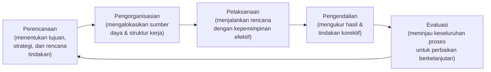
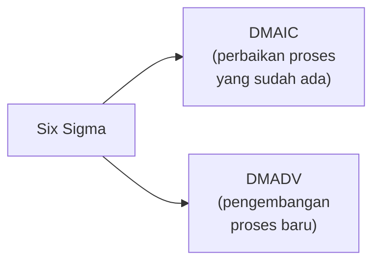
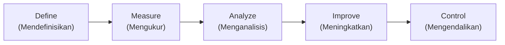
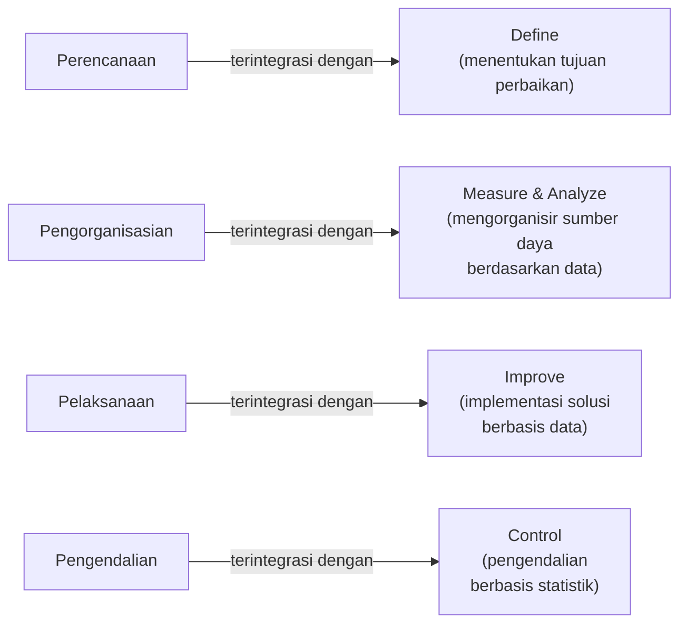
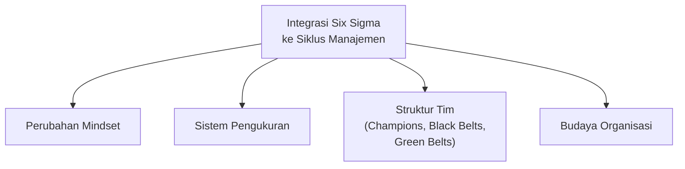
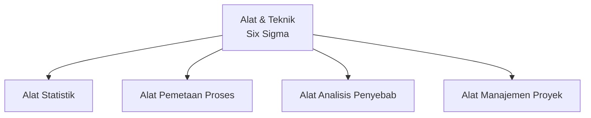
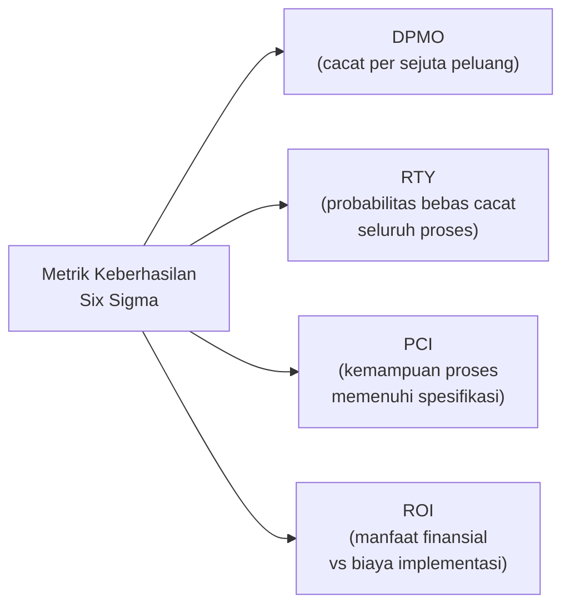
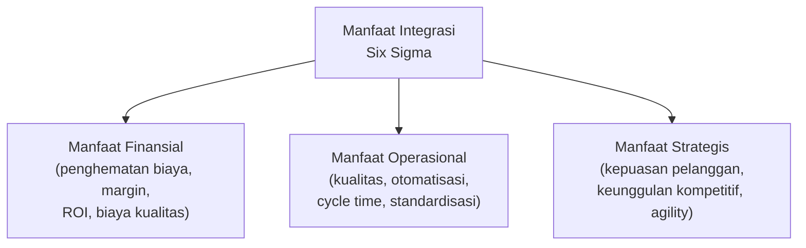
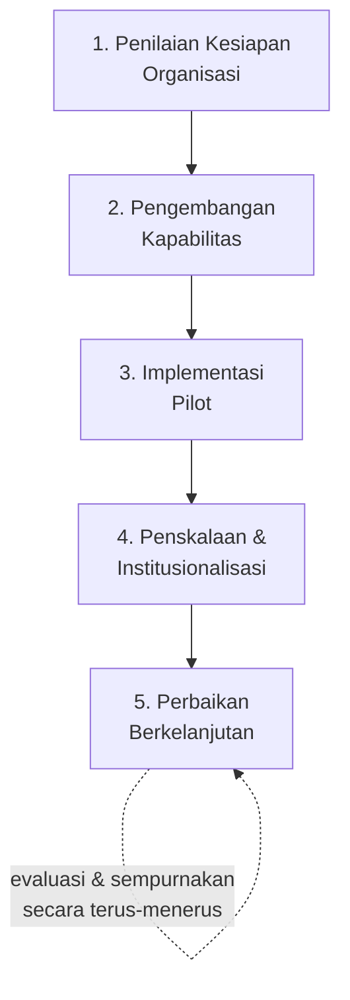
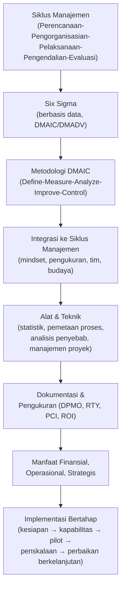

# Integrasi Six Sigma dalam Siklus Manajemen Proses

Presentasi ini membahas bagaimana **siklus manajemen** dan **Six Sigma** dapat bekerja secara sinergis untuk meningkatkan kinerja organisasi — mulai dari konsep dasar, metodologi implementasi (DMAIC), hingga praktik terbaik dan manfaat bisnis yang dapat diperoleh, disertai contoh praktis di setiap bagian.

> Tujuan akhir materi ini: memberikan pemahaman komprehensif tentang bagaimana **mengintegrasikan pendekatan Six Sigma ke dalam siklus manajemen proses organisasi** untuk mencapai hasil bisnis yang lebih baik.

## Daftar Isi Materi

| Kelompok | Topik |
|---|---|
| **Pemahaman Dasar** | Definisi siklus manajemen; Konsep dasar Six Sigma; Hubungan antara keduanya |
| **Metodologi Implementasi** | Tahapan DMAIC dalam Six Sigma; Integrasi ke dalam siklus manajemen; Alat dan teknik yang digunakan |
| **Praktik & Manfaat** | Studi kasus implementasi; Pengukuran keberhasilan; Manfaat bisnis & langkah selanjutnya |

---

## 1. Memahami Siklus Manajemen Proses

**Siklus manajemen** adalah istilah yang digunakan untuk menggambarkan proses perencanaan dan pengelolaan proyek atau program dalam suatu organisasi. Ini adalah rangkaian fungsi manajemen yang **saling berkesinambungan dan tidak dapat dipisahkan satu sama lain**, meskipun masing-masing dapat diidentifikasi secara terpisah dari segi aktivitas dan tujuannya.

Siklus ini terdiri dari lima fase yang berjalan melingkar dan berkelanjutan:

| Fase | Penjelasan |
|---|---|
| **Perencanaan** | Menentukan tujuan, strategi, dan rencana tindakan yang akan dilakukan. |
| **Pengorganisasian** | Mengalokasikan sumber daya dan menetapkan struktur kerja. |
| **Pelaksanaan** | Menjalankan rencana dengan kepemimpinan efektif. |
| **Pengendalian** | Mengukur hasil dan melakukan tindakan korektif bila diperlukan. |
| **Evaluasi** | Meninjau keseluruhan proses untuk perbaikan berkelanjutan. |

> Dalam praktiknya, setiap tahap siklus ini menuntun ke tahap berikutnya, membentuk proses yang berkelanjutan. Efektivitas siklus manajemen sangat bergantung pada kemampuan organisasi untuk **mengoordinasikan dan mengintegrasikan setiap fungsi manajemen** dengan baik, sehingga organisasi dapat mencapai tujuan strategis secara efisien dan efektif.

---

## 2. Memahami Konsep Six Sigma

**Six Sigma** adalah metodologi berbasis statistik dan data yang berfokus pada **peningkatan kualitas proses bisnis** melalui identifikasi dan eliminasi cacat atau kesalahan. Dikembangkan oleh **Motorola pada tahun 1980-an**, pendekatan ini telah diadopsi oleh berbagai perusahaan terkemuka di seluruh dunia.

Istilah "Six Sigma" merujuk pada tingkat kinerja proses di mana **99,99966% output bebas dari cacat**, atau hanya **3,4 cacat per sejuta peluang (DPMO — *Defects Per Million Opportunities*)**. Pencapaian tingkat kualitas ini memerlukan pendekatan sistematis dan disiplin yang ketat dalam pengelolaan proses.

### Prinsip Dasar Six Sigma

1. **Fokus pada pelanggan** — memahami kebutuhan dan harapan pelanggan sebagai dasar perbaikan.
2. **Berbasis data dan fakta** — menggunakan analisis statistik untuk pengambilan keputusan.
3. **Perbaikan proses** — mengidentifikasi dan mengeliminasi variasi yang tidak diinginkan.
4. **Manajemen proaktif** — antisipasi masalah sebelum terjadi.
5. **Kolaborasi tanpa batas** — melibatkan semua level organisasi dalam perbaikan.

> *"Six Sigma bukan hanya tentang statistik, tetapi tentang disiplin untuk mencapai kualitas nyaris sempurna dalam setiap aspek bisnis."*

Six Sigma menggunakan dua pendekatan metodologi, tergantung kebutuhannya:

- **DMAIC** (*Define, Measure, Analyze, Improve, Control*) — untuk **perbaikan proses yang sudah ada**.
- **DMADV** (*Define, Measure, Analyze, Design, Verify*) — untuk **pengembangan proses baru**.

---

## 3. Metodologi DMAIC dalam Six Sigma

**DMAIC** merupakan pendekatan sistematis dan terstruktur yang digunakan dalam Six Sigma untuk memecahkan masalah dan meningkatkan proses bisnis. Setiap tahap memiliki tujuan spesifik dan menggunakan berbagai alat/teknik untuk mencapainya — memastikan perbaikan proses dilakukan **berdasarkan data dan fakta**, bukan hanya intuisi atau asumsi.

| Tahap | Tujuan | Alat yang Digunakan |
|---|---|---|
| **Define** (Mendefinisikan) | Mengidentifikasi masalah, menentukan ruang lingkup proyek, dan menetapkan tujuan yang ingin dicapai. | Project Charter, *Voice of Customer* (VOC), SIPOC Diagram |
| **Measure** (Mengukur) | Mengumpulkan data dasar tentang proses saat ini dan mengukur kinerja. | Data Collection Plan, Process Capability Analysis, Measurement System Analysis |
| **Analyze** (Menganalisis) | Mengidentifikasi akar penyebab masalah dan peluang perbaikan. | Root Cause Analysis, Fishbone Diagram, Hypothesis Testing |
| **Improve** (Meningkatkan) | Mengembangkan dan mengimplementasikan solusi untuk mengatasi akar masalah. | Design of Experiments, Solution Selection Matrix, Pilot Implementation |
| **Control** (Mengendalikan) | Memastikan solusi dipertahankan dan proses tetap stabil dalam jangka panjang. | Control Charts, Standard Operating Procedures, Monitoring Plan |

> Keberhasilan implementasi DMAIC sangat bergantung pada **komitmen organisasi** untuk mengikuti setiap tahap secara disiplin dan menggunakan alat-alat yang tepat pada setiap tahap.

---

## 4. Integrasi Six Sigma ke dalam Siklus Manajemen

Bagian inti dari materi ini adalah memetakan **setiap fase siklus manajemen tradisional** (bagian 1) ke **tahap DMAIC** (bagian 3) yang sesuai:

| Siklus Manajemen Tradisional | Integrasi dengan Six Sigma |
|---|---|
| **Perencanaan** — menetapkan tujuan dan strategi | → **Define** (menentukan tujuan perbaikan) |
| **Pengorganisasian** — mengalokasikan sumber daya | → **Measure & Analyze** (mengorganisir sumber daya berdasarkan data) |
| **Pelaksanaan** — implementasi rencana | → **Improve** (implementasi solusi berbasis data) |
| **Pengendalian** — evaluasi dan koreksi | → **Control** (pengendalian berbasis statistik) |

Integrasi ini membutuhkan empat perubahan mendasar dalam organisasi:

1. **Perubahan Mindset** — dari pendekatan intuitif ke pendekatan berbasis data dan statistik dalam pengambilan keputusan manajemen.
2. **Sistem Pengukuran** — mengintegrasikan metrik Six Sigma ke dalam sistem pengukuran kinerja organisasi.
3. **Struktur Tim** — membangun struktur peran Six Sigma (**Champions, Black Belts, Green Belts**) dalam organisasi manajemen.
4. **Budaya Organisasi** — menciptakan budaya perbaikan berkelanjutan yang mendukung implementasi Six Sigma.

> Integrasi ini **bukan sekadar menambahkan alat baru** ke dalam *toolbox* manajemen, melainkan **transformasi fundamental** dalam cara organisasi memikirkan dan mengelola proses mereka. Dengan mengadopsi pendekatan ini, organisasi mencapai sinergi antara disiplin manajemen tradisional dengan metodologi peningkatan kualitas modern — menghasilkan proses yang lebih efisien, lebih dapat diprediksi, dan lebih responsif terhadap kebutuhan pelanggan dan perubahan pasar.

---

## 5. Alat dan Teknik Six Sigma dalam Manajemen Proses

| Kategori | Alat/Teknik |
|---|---|
| **Alat Statistik** | Control Charts; Capability Analysis; Hypothesis Testing; Regression Analysis; Design of Experiments |
| **Alat Pemetaan Proses** | Value Stream Mapping; Process Flow Diagram; SIPOC Diagram; Swim Lane Diagram; Spaghetti Diagram |
| **Alat Analisis Penyebab** | Fishbone Diagram; 5 Whys Analysis; Pareto Chart; Failure Mode & Effects Analysis (FMEA); Root Cause Analysis |
| **Alat Manajemen Proyek** | Project Charter; Gantt Chart; Stakeholder Analysis; Communication Plan; Risk Assessment Matrix |

### Pemilihan Alat yang Tepat

Keberhasilan implementasi Six Sigma sangat bergantung pada pemilihan alat dan teknik yang tepat untuk setiap tahap dalam siklus DMAIC. Pemilihan ini harus didasarkan pada:

1. **Jenis masalah yang dihadapi** — apakah masalah terkait dengan variasi, cacat, atau efisiensi proses.
2. **Jenis data yang tersedia** — apakah data bersifat kuantitatif atau kualitatif.
3. **Kompleksitas proses yang sedang ditingkatkan** — proses sederhana vs. proses kompleks.
4. **Tingkat kematangan organisasi** dalam penerapan Six Sigma — pemula vs. organisasi yang telah berpengalaman.
5. **Sumber daya yang tersedia** — waktu, anggaran, dan keahlian tim.

> Pelatihan komprehensif dalam penggunaan alat-alat Six Sigma sangat penting untuk memastikan tim dapat mengaplikasikannya secara efektif. Kombinasi yang tepat antara **keahlian teknis** dan **pemahaman kontekstual** akan memaksimalkan nilai dari setiap alat yang digunakan.

---

## 6. Dokumentasi dan Pengukuran Keberhasilan

### 6.1 Dokumentasi

Dokumentasi pekerjaan dalam konteks Six Sigma dan manajemen proses **bukan sekadar formalitas administratif**, tetapi merupakan komponen kritis untuk memastikan keberhasilan implementasi dan perbaikan berkelanjutan.

**Tujuan Dokumentasi:**
- Mendapatkan informasi untuk mengevaluasi apakah perubahan/penyesuaian harus dilakukan pada desain proses, sumber daya, atau alat yang digunakan.
- Memastikan konsistensi dalam implementasi.
- Memfasilitasi transfer pengetahuan antar tim.
- Menyediakan dasar untuk analisis retrospektif.
- Menciptakan repositori praktik terbaik.

**Elemen Dokumentasi** yang harus ada dalam proyek Six Sigma:
- Project Charter dan ruang lingkup
- Data pengukuran *baseline* dan target
- Hasil analisis dan temuan utama
- Solusi yang diimplementasikan
- Rencana kontrol dan metrik pengawasan
- *Lessons learned* dan rekomendasi

### 6.2 Metrik Pengukuran Keberhasilan

| Metrik | Kepanjangan | Penjelasan |
|---|---|---|
| **DPMO** | *Defects Per Million Opportunities* | Mengukur jumlah cacat per sejuta peluang. |
| **RTY** | *Rolled Throughput Yield* | Probabilitas produk bebas cacat melalui seluruh proses. |
| **PCI** | *Process Capability Index* | Mengukur kemampuan proses memenuhi spesifikasi. |
| **ROI** | *Return on Investment* | Perbandingan manfaat finansial dengan biaya implementasi. |

### 6.3 Sistem Dokumentasi Modern

Pemanfaatan teknologi untuk meningkatkan efektivitas dokumentasi:

- **Digital Process Management Systems** — platform terpadu untuk dokumentasi proses.
- **Business Intelligence Tools** — visualisasi data *real-time* untuk monitoring.
- **Knowledge Management Systems** — repositori praktik terbaik dan *lessons learned*.
- **Collaboration Platforms** — memfasilitasi *sharing* dokumentasi antar tim.

---

## 7. Manfaat Integrasi Six Sigma dalam Siklus Manajemen

| Manfaat Finansial | Manfaat Operasional | Manfaat Strategis |
|---|---|---|
| Penghematan biaya melalui eliminasi pemborosan dan inefisiensi | Peningkatan kualitas — produk/layanan lebih konsisten dan bebas cacat | Peningkatan kepuasan pelanggan |
| Peningkatan margin keuntungan melalui efisiensi proses | Identifikasi peluang otomatisasi aktivitas manual | Keunggulan kompetitif melalui diferensiasi kualitas dan efisiensi |
| ROI yang terukur dari inisiatif perbaikan proses | Pengurangan *cycle time* — proses lebih cepat dan responsif | Pengambilan keputusan berbasis data |
| Pengurangan biaya kualitas (inspeksi, *rework*, garansi) | Standardisasi proses yang dapat direplikasi | Budaya perbaikan berkelanjutan |
| | Pengurangan variasi — hasil lebih konsisten dan dapat diprediksi | *Agility* — adaptasi lebih cepat terhadap perubahan pasar |

> *"Ketika bisnis secara efektif menerapkan Six Sigma dan BPM ke tempat kerja, mereka dapat menuai banyak manfaat, termasuk penghematan biaya, otomatisasi proses, serta peningkatan kualitas dan kinerja."*

Studi kasus dari berbagai industri menunjukkan bahwa organisasi yang berhasil mengintegrasikan Six Sigma ke dalam siklus manajemen proses mereka secara konsisten mencapai hasil yang lebih baik dibandingkan pendekatan manajemen tradisional — tidak hanya pada efisiensi operasional, tetapi juga pada posisi kompetitif organisasi di pasar.

---

## 8. Langkah Selanjutnya dan Rekomendasi Implementasi

Implementasi Six Sigma ke dalam siklus manajemen sebaiknya dilakukan secara bertahap melalui lima langkah berikut:

1. **Penilaian Kesiapan Organisasi** — evaluasi kesiapan organisasi mengadopsi Six Sigma (budaya, struktur, sumber daya).
   - Melakukan survei kesiapan organisasi
   - Mengidentifikasi *champion* potensial
   - Mengevaluasi infrastruktur dan sistem yang ada

2. **Pengembangan Kapabilitas** — investasi pelatihan dan pengembangan kompetensi yang diperlukan.
   - Melatih Black Belts dan Green Belts
   - Mengedukasi manajemen senior
   - Membangun komunitas praktisi internal

3. **Implementasi Pilot** — mulai dengan proyek pilot terfokus untuk mendemonstrasikan nilai dan membangun momentum.
   - Memilih proses dengan dampak tinggi
   - Menetapkan tujuan yang jelas dan terukur
   - Mendokumentasikan hasil dan pembelajaran

4. **Penskalaan dan Institusionalisasi** — perluas penerapan Six Sigma ke seluruh organisasi.
   - Mengembangkan *roadmap* implementasi
   - Mengintegrasikan dengan sistem manajemen kinerja
   - Membangun mekanisme tata kelola

5. **Perbaikan Berkelanjutan** — kembangkan mekanisme evaluasi dan penyempurnaan pendekatan Six Sigma secara berkelanjutan.
   - Melakukan *review* berkala terhadap metodologi
   - Mengadaptasi pendekatan berdasarkan *feedback*
   - Mengikuti perkembangan terbaru dalam bidang ini

---

## Ringkasan Keterkaitan Antar Konsep

Inti dari materi ini: integrasi Six Sigma ke dalam siklus manajemen proses **bukan sekadar menambahkan alat statistik baru**, melainkan **transformasi cara organisasi berpikir dan mengambil keputusan** — dari pendekatan intuitif menjadi berbasis data — dengan memetakan setiap fase manajemen tradisional (Perencanaan, Pengorganisasian, Pelaksanaan, Pengendalian) ke tahap DMAIC yang sesuai, didukung alat yang tepat, dokumentasi yang disiplin, dan implementasi bertahap mulai dari proyek pilot hingga institusionalisasi penuh di seluruh organisasi.
