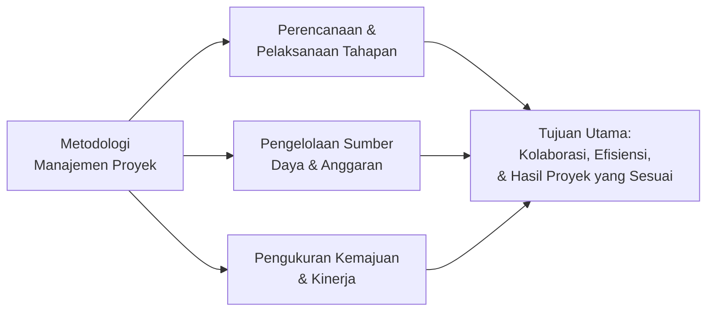
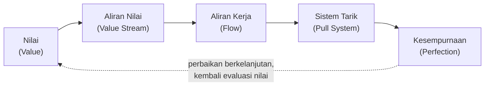
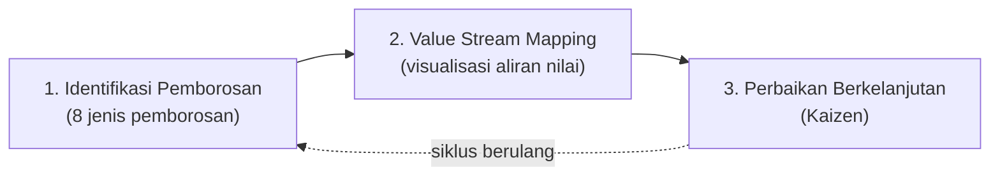
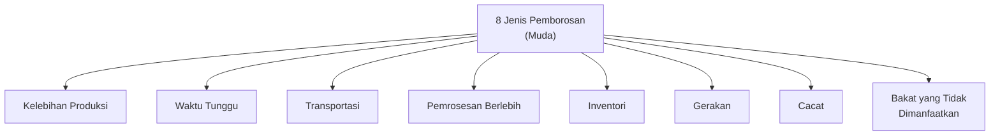
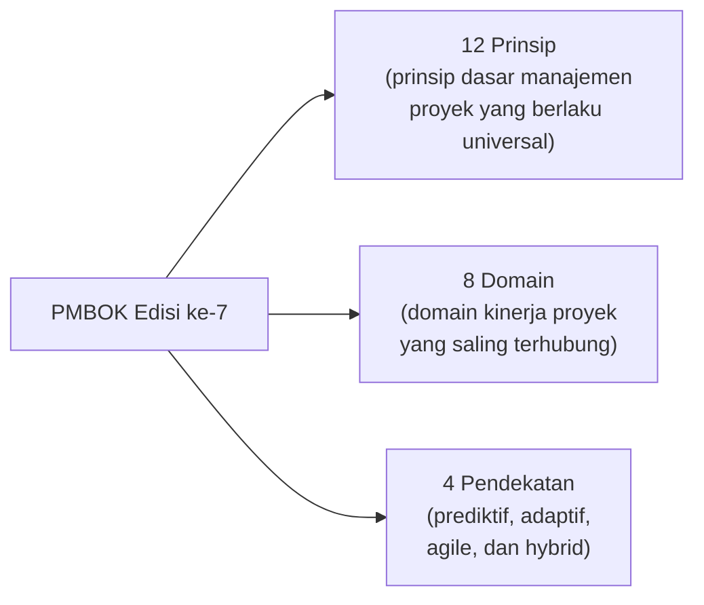
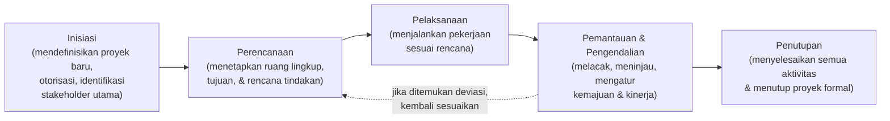
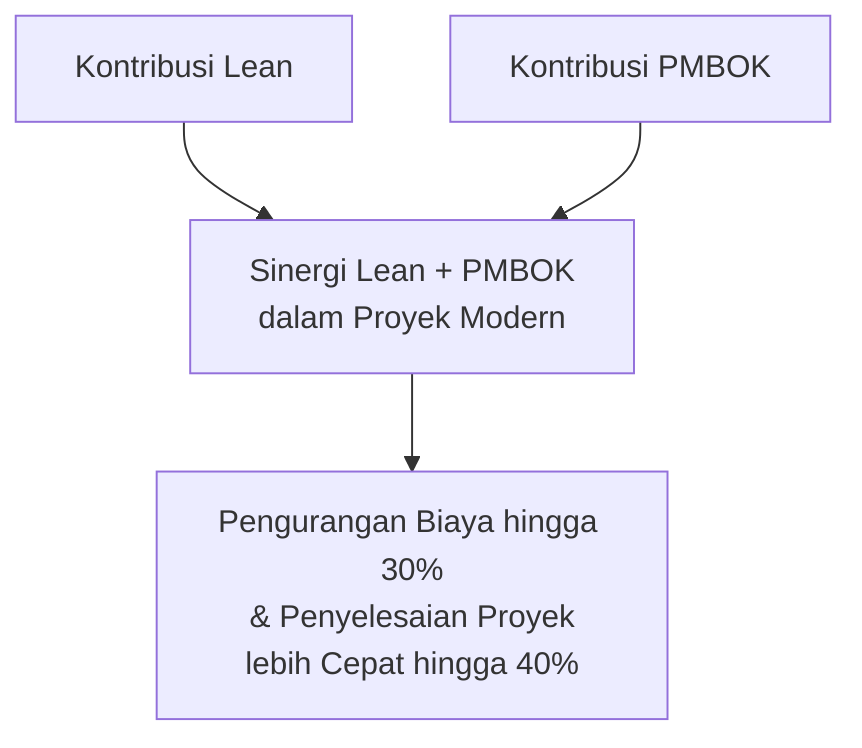
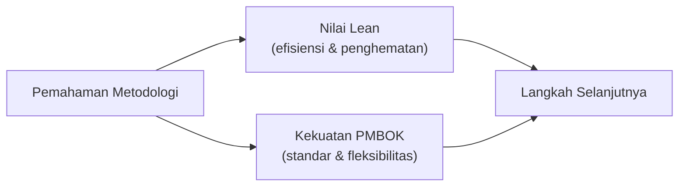
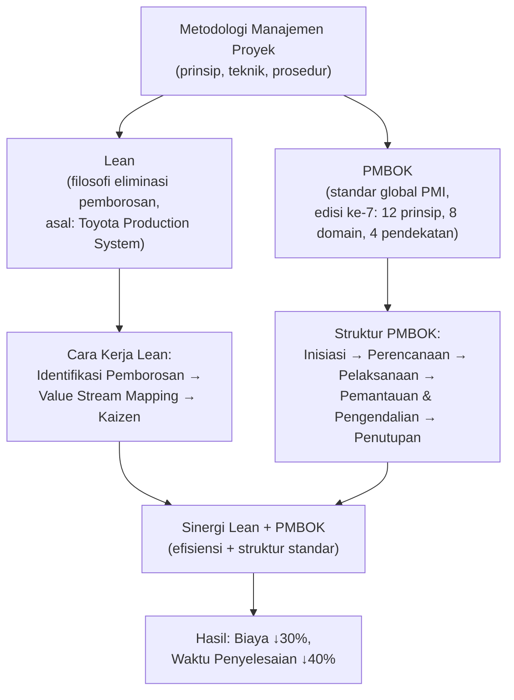

# Sesi 3 — Metodologi Manajemen Proyek: Lean, Teknik, dan PMBOK

**STSI4206 Proses Bisnis**
Sistem Informasi — Fakultas Sains dan Teknologi — Universitas Terbuka

> Catatan: dokumen ini merupakan ekstraksi sekaligus elaborasi dari materi *Metodologi Manajemen Proyek: Lean, Teknik, dan PMBOK*. Diagram pada slide asli digambarkan ulang dengan mermaid, dan setiap poin dijelaskan lebih dalam dengan konteks, contoh, serta kaitannya dengan sesi-sesi sebelumnya.

---

## 1. Apa Itu Metodologi Manajemen Proyek?

**Metodologi manajemen proyek** adalah sistem terstruktur yang terdiri dari **prinsip, teknik, dan prosedur** yang dikembangkan untuk membantu tim mengelola proyek secara efektif dari awal hingga akhir.

Setiap metodologi memiliki pendekatan unik untuk:

1. **Perencanaan dan pelaksanaan tahapan proyek**
2. **Pengelolaan sumber daya dan anggaran**
3. **Pengukuran kemajuan dan kinerja**

> **Tujuan utama** dari semua metodologi manajemen proyek adalah meningkatkan **kolaborasi, efisiensi, dan hasil proyek** sesuai dengan kebutuhan spesifik organisasi. Materi ini membahas dua pendekatan utama yang saling melengkapi: **Lean** (filosofi efisiensi) dan **PMBOK** (kerangka kerja standar global).

> Kaitan dengan Sesi 2 (STSI4206): metodologi manajemen proyek di sesi ini dapat dipandang sebagai **perluasan dari siklus manajemen proses** (Perencanaan-Pengorganisasian-Pelaksanaan-Pengendalian-Evaluasi) yang sudah dibahas sebelumnya, kali ini diterapkan secara spesifik dalam konteks **pengelolaan proyek** dengan kerangka kerja yang lebih formal.

---

## 2. Teknik Manajemen Proyek Lean: Filosofi dan Manfaat

### 2.1 Asal Usul

**Lean** berasal dari **Toyota Production System** yang dikembangkan pada tahun **1950-an**. Lean berfokus pada **identifikasi dan eliminasi pemborosan (*muda*)** dalam setiap proses.

### 2.2 Lima Prinsip Lean

Lima prinsip berikut membentuk dasar filosofi Lean untuk memaksimalkan nilai bagi pelanggan:

| Prinsip | Penjelasan Singkat |
|---|---|
| **Nilai** (*Value*) | Mendefinisikan apa yang benar-benar bernilai dari sudut pandang pelanggan. |
| **Aliran Nilai** (*Value Stream*) | Memetakan seluruh rangkaian aktivitas yang menghasilkan nilai tersebut. |
| **Aliran Kerja** (*Flow*) | Memastikan proses berjalan lancar tanpa hambatan/penundaan. |
| **Sistem Tarik** (*Pull*) | Produksi/pekerjaan dilakukan berdasarkan permintaan nyata, bukan dorongan jadwal semata. |
| **Kesempurnaan** (*Perfection*) | Upaya perbaikan berkelanjutan tanpa henti untuk mendekati kondisi ideal tanpa pemborosan. |

### 2.3 Manfaat Terukur

Penerapan Lean secara konsisten menunjukkan hasil nyata:

- **Pengurangan biaya hingga 20%**
- **Peningkatan produktivitas 35%**
- **Pengurangan waktu proses hingga 90%**

> **Studi kasus:** penerapan prinsip Lean pada proyek drainase perkotaan di Bekasi berhasil **menghemat Rp 2,8 miliar** melalui optimalisasi sumber daya dan pengurangan aktivitas yang tidak perlu.

---

## 3. Lean dalam Manajemen Proyek: Cara Kerja

Penerapan Lean dalam manajemen proyek dilakukan melalui tiga langkah utama:

### 3.1 Identifikasi Pemborosan

Mengenali dan menghilangkan **delapan jenis pemborosan**:

### 3.2 Value Stream Mapping

Teknik visualisasi untuk memetakan **seluruh aliran nilai**, mengidentifikasi aktivitas yang **tidak bernilai tambah** dan ***bottleneck*** dalam proses.

### 3.3 Perbaikan Berkelanjutan

Menerapkan ***kaizen*** (perbaikan berkelanjutan) untuk terus mengoptimalkan proses dan menambah nilai bagi *stakeholder* proyek.

> Pendekatan Lean menciptakan **fokus yang kuat pada kepuasan pelanggan**, sambil secara sistematis **meningkatkan margin keuntungan** melalui efisiensi.

---

## 4. PMBOK: Standar Global Manajemen Proyek

***Project Management Body of Knowledge* (PMBOK)** adalah panduan komprehensif yang diterbitkan oleh **Project Management Institute (PMI)**, dengan edisi terbaru (**edisi ke-7**) dirilis pada tahun **2021**.

PMBOK edisi ke-7 terdiri dari:

| Komponen | Jumlah | Penjelasan |
|---|---|---|
| **Prinsip** | 12 | Prinsip dasar manajemen proyek yang berlaku universal. |
| **Domain** | 8 | Domain kinerja proyek yang saling terhubung. |
| **Pendekatan** | 4 | Mendukung metodologi **prediktif, adaptif, agile, dan hybrid**. |

> PMBOK menyediakan **bahasa dan praktik standar** yang memfasilitasi komunikasi efektif antar tim proyek global — penting terutama bagi proyek yang melibatkan tim lintas negara/organisasi.

---

## 5. Struktur PMBOK Edisi ke-7

PMBOK mendefinisikan lima kelompok proses (*process groups*) yang berjalan secara melingkar dan saling terhubung:

| Kelompok Proses | Penjelasan |
|---|---|
| **Inisiasi** | Mendefinisikan proyek baru, mendapatkan otorisasi, dan mengidentifikasi *stakeholder* utama. |
| **Perencanaan** | Menetapkan ruang lingkup, tujuan, dan menyusun rencana tindakan untuk mencapai tujuan. |
| **Pelaksanaan** | Menjalankan pekerjaan sesuai rencana manajemen proyek. |
| **Pemantauan & Pengendalian** | Melacak, meninjau, dan mengatur kemajuan dan kinerja proyek. |
| **Penutupan** | Menyelesaikan semua aktivitas dan menutup proyek secara formal. |

> **Perubahan filosofis penting:** PMBOK edisi ke-7 telah berevolusi dari **pendekatan berbasis proses** menjadi **pendekatan berbasis prinsip** yang lebih fleksibel, dengan penekanan pada pencapaian **hasil proyek (*outcomes*)**, bukan hanya **dokumen/produk antara (*deliverables*)**. Ini menjadikan PMBOK edisi ke-7 lebih kompatibel dengan pendekatan Agile dan hybrid, tidak hanya pendekatan waterfall/prediktif seperti edisi-edisi sebelumnya.

---

## 6. Sinergi Lean dan PMBOK dalam Proyek Modern

Meskipun berasal dari latar belakang yang berbeda — Lean dari filosofi manufaktur, PMBOK dari kerangka kerja manajemen proyek formal — **kedua pendekatan ini saling melengkapi**:

| Kontribusi Lean | Kontribusi PMBOK |
|---|---|
| Eliminasi pemborosan dalam setiap fase proyek | Kerangka kerja komprehensif untuk manajemen proyek |
| Penyederhanaan proses dan alur kerja | Standarisasi terminologi dan praktik terbaik |
| Fokus pada penciptaan nilai bagi pelanggan | Panduan manajemen *stakeholder* dan risiko |
| Optimalisasi penggunaan sumber daya | Fleksibilitas untuk beradaptasi dengan berbagai jenis proyek |

> **Hasil nyata:** proyek konstruksi dan teknologi yang mengintegrasikan kedua pendekatan ini telah menunjukkan **pengurangan biaya hingga 30%** dan **penyelesaian proyek lebih cepat hingga 40%**.

Secara konseptual, **Lean berperan sebagai "filosofi efisiensi"** yang menjaga setiap fase PMBOK (Inisiasi, Perencanaan, Pelaksanaan, Pemantauan & Pengendalian, Penutupan) tetap bebas dari pemborosan, sementara **PMBOK berperan sebagai "kerangka kerja struktural"** yang memastikan proyek tetap terorganisasi, terstandarisasi, dan dapat dikomunikasikan secara konsisten antar tim.

---

## 7. Kesimpulan & Langkah Selanjutnya

### Temuan Utama

1. **Pemahaman Metodologi** — memahami berbagai metodologi manajemen proyek memungkinkan pemilihan pendekatan yang tepat untuk setiap proyek yang unik.
2. **Nilai Lean** — teknik Lean membantu memaksimalkan nilai dan meminimalkan pemborosan, menghasilkan efisiensi dan penghematan yang signifikan.
3. **Kekuatan PMBOK** — PMBOK menyediakan standar global dan kerangka kerja fleksibel yang dapat disesuaikan dengan kebutuhan spesifik organisasi.

### Langkah Selanjutnya

> Mulailah dengan **mengevaluasi proyek Anda saat ini menggunakan prinsip Lean** untuk mengidentifikasi pemborosan, sambil **menerapkan kerangka kerja PMBOK** untuk struktur dan standarisasi. Kombinasi ini akan membantu mencapai hasil proyek yang lebih optimal dan berkelanjutan.

---

## Ringkasan Keterkaitan Antar Konsep

Inti dari sesi ini: tidak ada satu metodologi manajemen proyek yang "paling benar" — **Lean** unggul dalam menciptakan efisiensi dan menghilangkan pemborosan di setiap fase kerja, sementara **PMBOK** unggul dalam menyediakan struktur, standar, dan bahasa yang konsisten untuk mengelola proyek secara global. Mengombinasikan keduanya — menggunakan **Lean sebagai filosofi/mindset** dan **PMBOK sebagai kerangka kerja struktural** — terbukti menghasilkan proyek yang lebih efisien, lebih cepat selesai, dan lebih hemat biaya dibandingkan menerapkan salah satunya saja.
