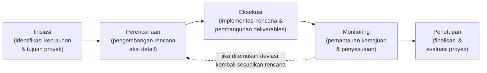
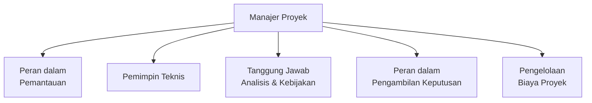
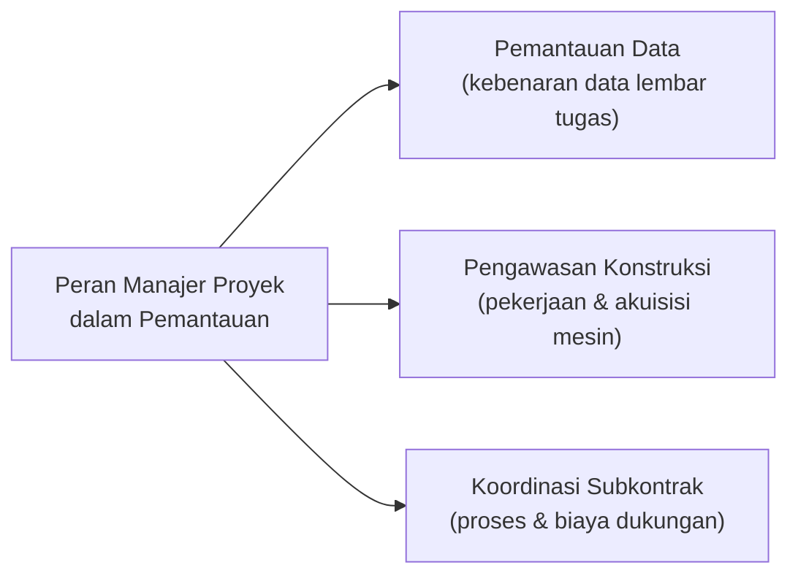
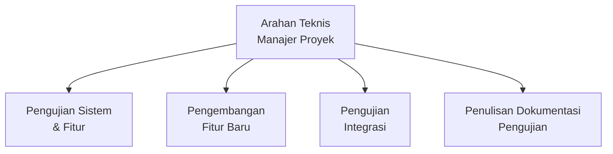
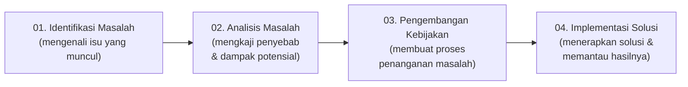
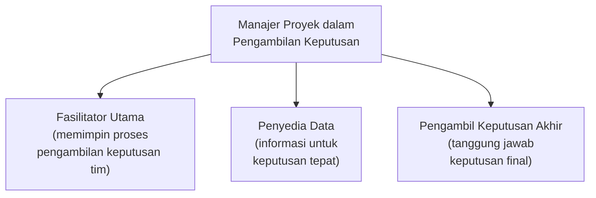
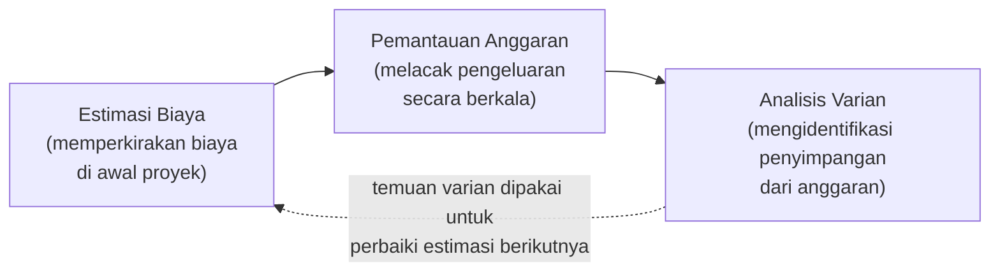
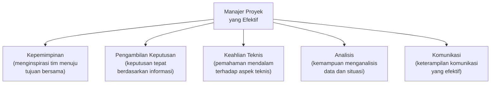
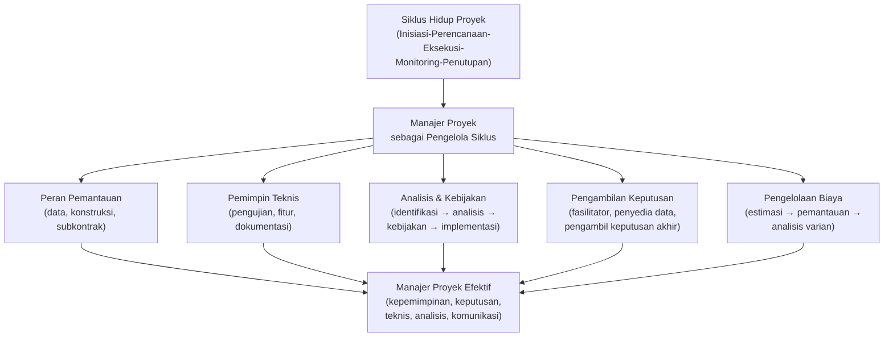

# Siklus Hidup Manajemen Proyek

Materi ini membahas **rangkaian fase yang dilewati proyek dari inisiasi hingga penyelesaian**, serta peran **manajer proyek** dalam memimpin, mengendalikan, dan mengoordinasikan seluruh aspek proyek di sepanjang siklus tersebut.

## Apa itu Siklus Hidup Manajemen Proyek?

Siklus hidup manajemen proyek adalah rangkaian fase yang dilewati proyek dari inisiasi hingga penyelesaian. Kerangka kerja ini penting karena:

- Memberikan **struktur dan alur kerja** yang jelas
- Memungkinkan **kontrol dan pemantauan** yang efektif
- Memfasilitasi **komunikasi dan pengambilan keputusan**

> Kaitan dengan Sesi 3: siklus hidup ini pada dasarnya selaras dengan **lima kelompok proses PMBOK** (Inisiasi, Perencanaan, Pelaksanaan, Pemantauan & Pengendalian, Penutupan) yang sudah dibahas sebelumnya — sesi ini menjabarkannya lebih rinci dari sudut pandang peran dan tanggung jawab **manajer proyek** di setiap fase.

---

## 1. Fase-Fase Utama Siklus Hidup Proyek

Lima fase berikut dilalui secara berurutan sepanjang umur sebuah proyek:

| Fase | Penjelasan |
|---|---|
| **Inisiasi** | Identifikasi kebutuhan dan tujuan proyek. |
| **Perencanaan** | Pengembangan rencana aksi detail. |
| **Eksekusi** | Implementasi rencana dan pembangunan *deliverables*. |
| **Monitoring** | Pemantauan kemajuan dan penyesuaian. |
| **Penutupan** | Finalisasi dan evaluasi proyek. |

---

## 2. Siapa Manajer Proyek?

**Manajer Proyek** adalah individu yang bertanggung jawab untuk **memimpin, mengendalikan, dan mengoordinasikan** seluruh aspek proyek dari awal hingga akhir. Peran ini mencakup banyak aspek — mulai dari pemantauan teknis hingga pengambilan keputusan strategis — yang dijabarkan pada bagian-bagian berikut.

---

## 3. Peran Manajer Proyek dalam Pemantauan

Dalam aktivitas pemantauan (*monitoring*) proyek, manajer proyek menjalankan tiga peran:

1. **Pemantauan Data** — memastikan kebenaran data dari lembar tugas untuk melacak kemajuan secara efektif.
2. **Pengawasan Konstruksi** — mengendalikan pekerjaan konstruksi dan akuisisi mesin proyek.
3. **Koordinasi Subkontrak** — mengawasi pengoperasian proses subkontrak dan biaya dukungan terkait.

---

## 4. Manajer Proyek sebagai Pemimpin Teknis

Selain aspek manajerial, manajer proyek juga memberikan **arahan teknis** untuk:

- Pengujian sistem dan fitur
- Pengembangan fitur baru
- Pengujian integrasi
- Penulisan dokumentasi pengujian

> Peran ini menunjukkan bahwa manajer proyek yang efektif **tidak hanya mengelola administrasi dan jadwal**, tetapi juga harus memiliki **pemahaman teknis yang cukup mendalam** terhadap produk/sistem yang sedang dikembangkan, agar dapat memberikan arahan yang relevan kepada tim teknis.

---

## 5. Tanggung Jawab Analisis dan Kebijakan

Ketika masalah muncul di tengah proyek, manajer proyek menjalankan empat langkah berurutan:

| Langkah | Penjelasan |
|---|---|
| **01. Identifikasi Masalah** | Mengenali isu-isu yang muncul dalam proyek. |
| **02. Analisis Masalah** | Mengkaji penyebab dan dampak potensial. |
| **03. Pengembangan Kebijakan** | Membuat proses penanganan masalah. |
| **04. Implementasi Solusi** | Menerapkan solusi dan memantau hasilnya. |

> Pola empat langkah ini mirip dengan pendekatan **Root Cause Analysis** dan **DMAIC** (Define-Measure-**Analyze**-**Improve**-Control) yang sudah dibahas pada Sesi 2 — menunjukkan bahwa prinsip "atasi akar masalah, bukan hanya gejala" berlaku konsisten di berbagai metodologi manajemen proses maupun proyek.

---

## 6. Manajer Proyek dalam Pengambilan Keputusan

Dalam proses pengambilan keputusan, manajer proyek memegang tiga peran:

1. **Fasilitator Utama** — memimpin proses pengambilan keputusan tim.
2. **Penyedia Data** — menyediakan informasi yang diperlukan untuk keputusan yang tepat.
3. **Pengambil Keputusan Akhir** — bertanggung jawab atas keputusan final saat diperlukan.

> Ketiga peran ini menunjukkan **spektrum keterlibatan** manajer proyek — dari sekadar memfasilitasi diskusi tim, hingga harus mengambil keputusan akhir sendiri ketika tim tidak mencapai konsensus atau situasi membutuhkan keputusan cepat.

---

## 7. Pengelolaan Biaya Proyek

**Tujuan utama:** memastikan **biaya teknik proyek** sama dengan **biaya proses desain per unit** untuk semua proyek.

Pengelolaan biaya dilakukan melalui tiga aktivitas berkelanjutan:

| Aktivitas | Penjelasan |
|---|---|
| **Estimasi Biaya** | Memperkirakan biaya di awal proyek. |
| **Pemantauan Anggaran** | Melacak pengeluaran secara berkala. |
| **Analisis Varian** | Mengidentifikasi penyimpangan dari anggaran. |

---

## 8. Kesimpulan: Manajer Proyek yang Efektif

Manajer proyek yang sukses menggabungkan **lima elemen kunci** berikut untuk memastikan keberhasilan proyek dari awal hingga akhir:

| Elemen | Penjelasan |
|---|---|
| **Kepemimpinan** | Menginspirasi tim menuju tujuan bersama. |
| **Pengambilan Keputusan** | Keputusan tepat berdasarkan informasi. |
| **Keahlian Teknis** | Pemahaman mendalam terhadap aspek teknis. |
| **Analisis** | Kemampuan menganalisis data dan situasi. |
| **Komunikasi** | Keterampilan komunikasi yang efektif. |

---

## Ringkasan Keterkaitan Antar Konsep

Inti dari materi ini: siklus hidup manajemen proyek memberikan **struktur fase yang jelas** (Inisiasi hingga Penutupan), namun struktur ini hanya akan berjalan efektif jika dikelola oleh **manajer proyek yang menggabungkan kepemimpinan, kemampuan teknis, analisis, pengambilan keputusan, dan komunikasi** secara seimbang — mulai dari memantau data dan konstruksi, memberi arahan teknis, menangani masalah secara sistematis, memfasilitasi keputusan tim, hingga mengelola biaya secara disiplin di sepanjang umur proyek.
