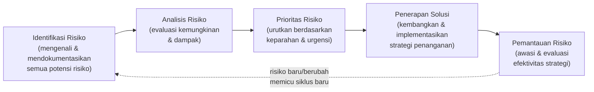
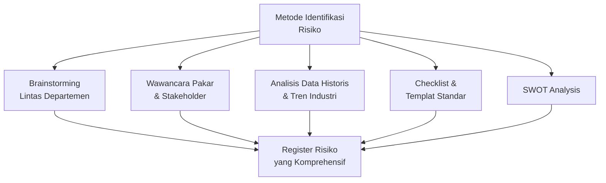
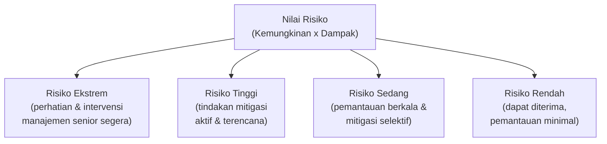
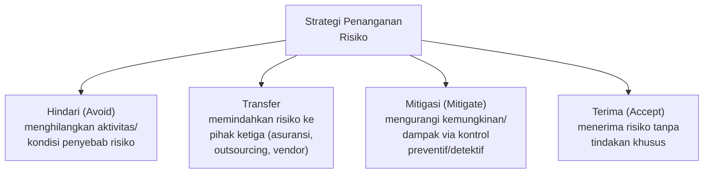
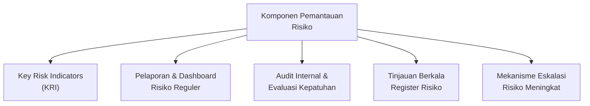
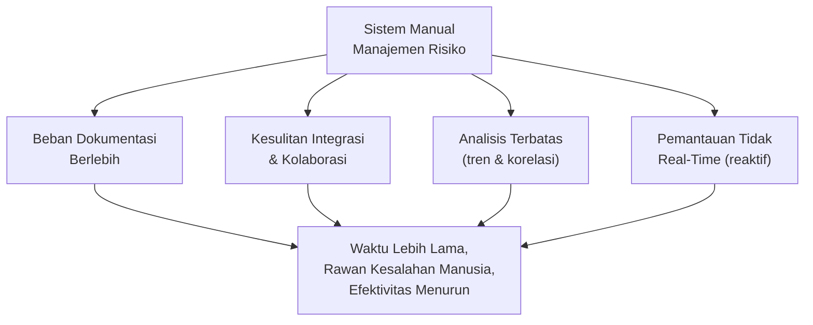
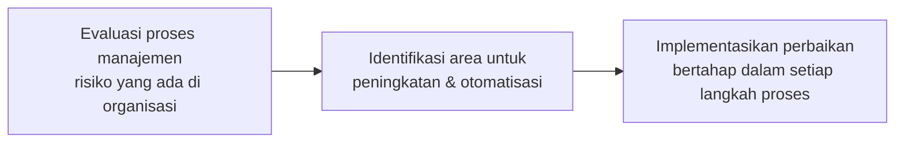
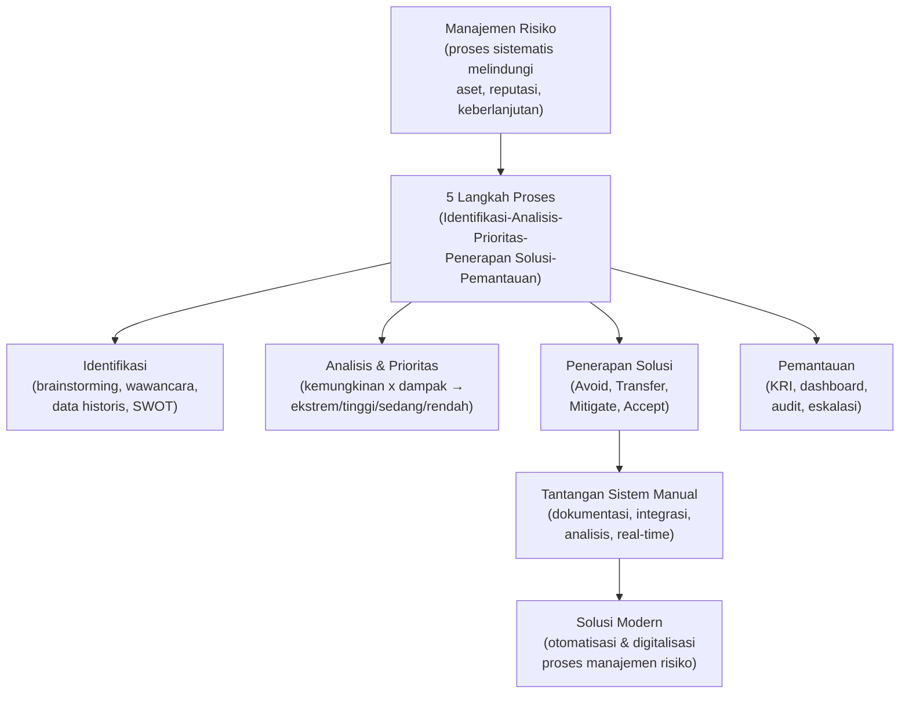

# Proses Manajemen Risiko: Kerangka Kerja Sistematis

Materi ini membahas seluruh siklus manajemen risiko, dari identifikasi hingga pemantauan, dengan fokus pada implementasi praktis dalam konteks organisasi.

## Ruang Lingkup Materi

| Bagian | Topik |
|---|---|
| **1. Pengantar Manajemen Risiko** | Definisi dan pentingnya manajemen risiko dalam organisasi modern |
| **2. Lima Langkah Proses Manajemen Risiko** | Penjelasan detail tentang setiap langkah dalam proses |
| **3. Tantangan Sistem Manual** | Masalah dokumentasi dan administrasi dalam pendekatan tradisional |
| **4. Solusi Modern dan Implementasi** | Pendekatan terkini untuk manajemen risiko yang efektif |

---

## 1. Apa Itu Manajemen Risiko?

**Manajemen risiko** adalah proses sistematis untuk **mengidentifikasi, menganalisis, dan merespons** potensi risiko yang dapat memengaruhi organisasi.

Tujuan utamanya adalah **melindungi aset, reputasi, dan keberlanjutan operasional** organisasi dengan cara yang terstruktur dan proaktif.

> *"Manajemen risiko bukan tentang menghilangkan risiko, tetapi tentang mengelolanya secara efektif untuk menciptakan nilai bagi pemangku kepentingan."*

> Kaitan dengan Sesi 2–4 (STSI4206): manajemen risiko adalah komponen yang melengkapi siklus manajemen proses dan manajemen proyek yang sudah dibahas sebelumnya — baik Six Sigma (DMAIC), PMBOK, maupun siklus hidup proyek semuanya membutuhkan kerangka kerja risiko yang sistematis seperti yang dijelaskan di sesi ini.

---

## 2. Lima Langkah Proses Manajemen Risiko

Proses manajemen risiko terdiri dari lima langkah yang berjalan secara **melingkar dan berkelanjutan** — bukan proses satu kali yang berhenti setelah selesai:

| Langkah | Penjelasan |
|---|---|
| **Identifikasi Risiko** | Mengenali dan mendokumentasikan semua potensi risiko yang dapat memengaruhi tujuan organisasi. |
| **Analisis Risiko** | Mengevaluasi kemungkinan dan dampak dari setiap risiko yang teridentifikasi. |
| **Prioritas Risiko** | Mengurutkan risiko berdasarkan tingkat keparahan dan urgensinya. |
| **Penerapan Solusi** | Mengembangkan dan mengimplementasikan strategi untuk mengatasi risiko. |
| **Pemantauan Risiko** | Mengawasi dan mengevaluasi efektivitas strategi penanganan risiko. |

---

## 3. Langkah 1: Identifikasi Risiko

Identifikasi risiko adalah **fondasi dari seluruh proses manajemen risiko**. Tanpa identifikasi yang tepat, risiko tidak dapat dikelola secara efektif.

### Metode Identifikasi Risiko

1. **Brainstorming** dengan tim lintas departemen
2. **Wawancara** dengan pakar dan pemangku kepentingan
3. **Analisis data historis** dan tren industri
4. **Checklist dan templat risiko standar**
5. **SWOT Analysis** (*Strength, Weakness, Opportunity, Threat*)

> Hasil dari tahap ini adalah **register risiko** yang komprehensif, mencakup semua potensi risiko yang dapat memengaruhi pencapaian tujuan organisasi.

---

## 4. Langkah 2 & 3: Analisis dan Prioritas Risiko

### 4.1 Analisis Risiko

Setiap risiko dievaluasi berdasarkan dua faktor kunci:

1. **Kemungkinan** (*Likelihood*) — tingkat peluang terjadinya risiko tersebut.
2. **Dampak** (*Impact*) — seberapa besar kerugian atau konsekuensi jika risiko terjadi.

Analisis dapat bersifat:
- **Kualitatif** (misalnya: rendah, sedang, tinggi)
- **Kuantitatif** (menggunakan nilai numerik)

### 4.2 Prioritas Risiko

Risiko dikategorikan dan diurutkan berdasarkan **tingkat/nilai risiko** — yaitu gabungan antara kemungkinan dan dampaknya:

| Tingkat Risiko | Tindakan |
|---|---|
| **Risiko Ekstrem** | Memerlukan perhatian dan intervensi manajemen senior secara segera. |
| **Risiko Tinggi** | Membutuhkan tindakan mitigasi yang aktif dan terencana. |
| **Risiko Sedang** | Memerlukan pemantauan berkala dan mitigasi selektif. |
| **Risiko Rendah** | Dapat diterima dengan pemantauan minimal, dampaknya relatif kecil. |

---

## 5. Langkah 4: Penerapan Solusi

Setelah risiko diidentifikasi, dianalisis, dan diprioritaskan, langkah selanjutnya adalah mengembangkan dan menerapkan **strategi penanganan risiko**. Terdapat empat strategi utama:

| Strategi | Penjelasan |
|---|---|
| **Hindari (*Avoid*)** | Menghilangkan aktivitas atau kondisi yang menyebabkan risiko, seperti menghentikan produk berisiko tinggi atau keluar dari pasar tertentu. |
| **Transfer** | Memindahkan risiko ke pihak ketiga, misalnya melalui asuransi, *outsourcing*, atau kontrak dengan vendor. |
| **Mitigasi (*Mitigate*)** | Mengurangi kemungkinan atau dampak risiko melalui kontrol preventif atau detektif, seperti prosedur operasi standar. |
| **Terima (*Accept*)** | Menerima risiko tanpa tindakan khusus karena biaya mitigasi lebih tinggi daripada potensi dampak, atau kemungkinannya sangat rendah. |

> Pemilihan strategi yang tepat bergantung pada **tingkat risiko** yang sudah ditentukan di Langkah 3 — misalnya, risiko ekstrem cenderung memerlukan strategi **Hindari** atau **Transfer**, sementara risiko rendah cukup ditangani dengan strategi **Terima**.

---

## 6. Langkah 5: Pemantauan Risiko

Pemantauan risiko adalah **proses berkelanjutan** untuk memastikan bahwa strategi penanganan risiko efektif dan relevan.

### Komponen Utama Pemantauan

1. Penetapan **indikator risiko utama** (*Key Risk Indicators*/KRI)
2. **Pelaporan dan dashboard risiko** reguler
3. **Audit internal** dan evaluasi kepatuhan
4. **Tinjauan berkala** terhadap register risiko
5. **Mekanisme eskalasi** untuk risiko yang meningkat

> Pemantauan efektif memungkinkan **penyesuaian strategi secara *real-time*** berdasarkan perubahan kondisi atau kemunculan risiko baru — inilah yang menjadikan proses ini sebuah **siklus**, bukan langkah linear yang berakhir.

---

## 7. Tantangan Sistem Manual dalam Manajemen Risiko

Pendekatan tradisional/manual dalam manajemen risiko menghadapi empat tantangan utama:

1. **Beban Dokumentasi Berlebih** — sistem manual mengharuskan pembuatan dan pemeliharaan dokumen fisik dalam jumlah besar, menyebabkan inefisiensi dan kemungkinan kehilangan data.
2. **Kesulitan Integrasi dan Kolaborasi** — sulitnya berbagi informasi risiko antar departemen dan dengan pemangku kepentingan eksternal secara tepat waktu.
3. **Analisis Terbatas** — keterbatasan dalam menganalisis tren risiko jangka panjang dan mengidentifikasi korelasi antar risiko.
4. **Pemantauan Tidak *Real-Time*** — pemantauan risiko manual seringkali reaktif, bukan proaktif, dengan penundaan dalam mendeteksi dan merespons perubahan tingkat risiko.

> Sistem manual cenderung membutuhkan waktu lebih lama dan rawan kesalahan manusia, sehingga berpotensi **mengurangi efektivitas seluruh proses manajemen risiko** — inilah alasan mengapa solusi modern/digital (dashboard, sistem terintegrasi) menjadi penting, sejalan dengan **Sistem Dokumentasi Modern** yang sudah dibahas pada Sesi 2 (Digital Process Management Systems, Business Intelligence Tools, Knowledge Management Systems).

---

## 8. Kesimpulan dan Langkah Selanjutnya

### Kesimpulan Utama

1. Proses manajemen risiko terdiri dari **lima langkah sistematis**: identifikasi, analisis, prioritas, penerapan solusi, dan pemantauan.
2. **Setiap langkah sama pentingnya** dan saling terkait dalam siklus berkelanjutan.
3. **Sistem manual memiliki keterbatasan signifikan** yang dapat menghambat efektivitas manajemen risiko.

### Langkah Selanjutnya

1. Evaluasi proses manajemen risiko yang ada di organisasi Anda.
2. Identifikasi area untuk peningkatan dan otomatisasi.
3. Implementasikan perbaikan bertahap dalam setiap langkah proses.

> **Manajemen risiko yang efektif adalah perjalanan, bukan tujuan akhir.** Komitmen untuk perbaikan berkelanjutan akan memastikan organisasi Anda siap menghadapi tantangan di masa depan.

---

## Ringkasan Keterkaitan Antar Konsep

Inti dari materi ini: manajemen risiko yang efektif bukanlah aktivitas sekali jalan, melainkan **siklus lima langkah yang berkelanjutan** — mulai dari mengidentifikasi risiko secara komprehensif, menganalisis dan memprioritaskannya berdasarkan kemungkinan dan dampak, memilih strategi penanganan yang tepat (Hindari, Transfer, Mitigasi, atau Terima), hingga memantau efektivitasnya secara terus-menerus. Pendekatan manual menghambat efektivitas siklus ini, sehingga organisasi modern perlu beralih ke **sistem digital/otomatis** untuk menjaga proses manajemen risiko tetap proaktif dan responsif terhadap perubahan.
