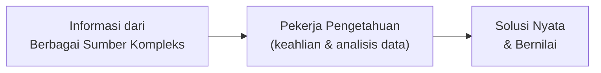
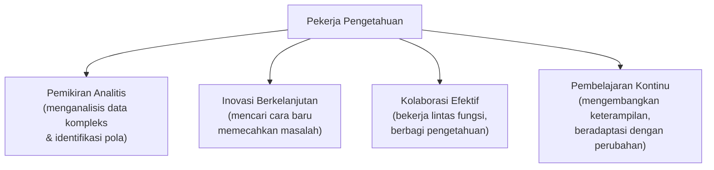
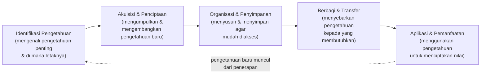
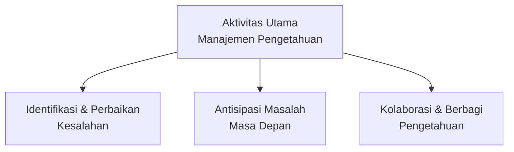
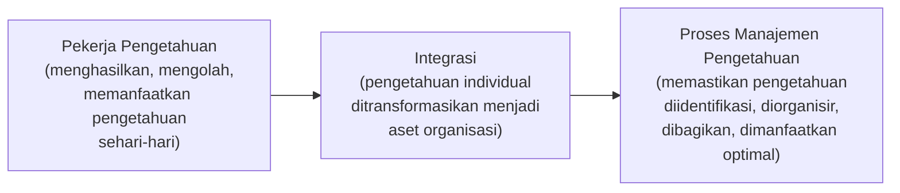
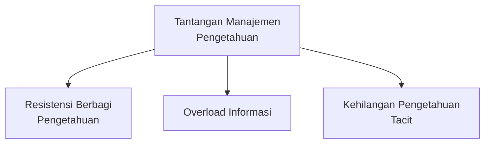
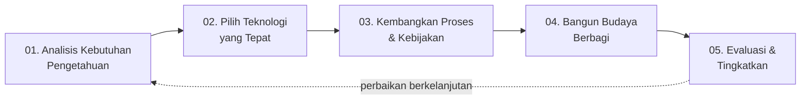
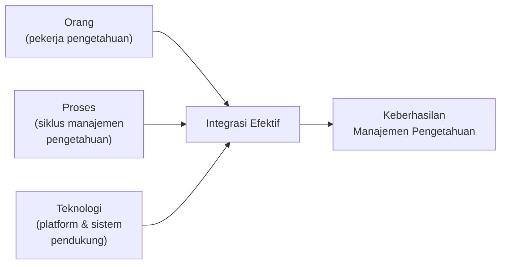
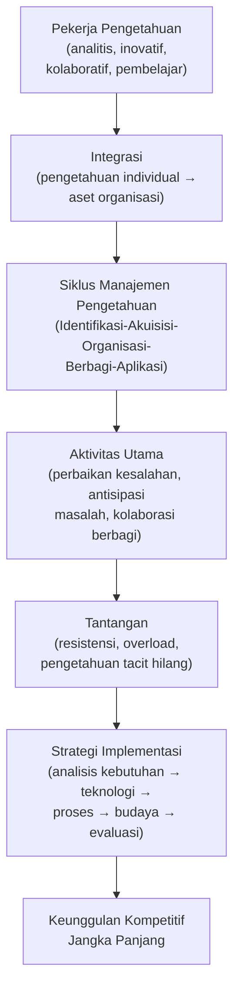

# Manajemen Proses untuk Pekerjaan Pengetahuan

**Optimalisasi Proses Bisnis di Era Digital**

Materi ini membahas bagaimana **pekerja pengetahuan** (*knowledge worker*) dan **manajemen pengetahuan** (*knowledge management*) saling terkait dalam proses bisnis modern, serta bagaimana organisasi dapat mengelola aset pengetahuannya secara sistematis untuk menciptakan keunggulan kompetitif.

## Apa itu Pekerja Pengetahuan?

**Pekerja pengetahuan** adalah individu yang:

1. Mengandalkan **keahlian dan analisis data** untuk membuat keputusan
2. Mampu mengolah informasi dari **berbagai sumber kompleks**
3. Mengubah informasi menjadi **solusi nyata dan bernilai**
4. Membangun pengetahuan secara **sistematis dan efisien**

> Mereka tidak hanya bekerja dengan tangan, tetapi juga dengan **pemikiran dan pengetahuan**.

---

## 1. Karakteristik Utama Pekerja Pengetahuan

| Karakteristik | Penjelasan |
|---|---|
| **Pemikiran Analitis** | Mampu menganalisis data kompleks dan mengidentifikasi pola yang tidak terlihat oleh orang lain. |
| **Inovasi Berkelanjutan** | Selalu mencari cara baru untuk memecahkan masalah dan meningkatkan proses yang ada. |
| **Kolaborasi Efektif** | Dapat bekerja dalam tim lintas fungsi dan berbagi pengetahuan untuk mencapai tujuan bersama. |
| **Pembelajaran Kontinu** | Terus mengembangkan keterampilan dan pengetahuan untuk beradaptasi dengan perubahan. |

---

## 2. Manajemen Pengetahuan dalam Proses Bisnis

### Definisi

**Manajemen pengetahuan** adalah pendekatan sistematis untuk mengelola **aset pengetahuan organisasi** agar dapat dimanfaatkan secara optimal dalam proses bisnis.

### Tujuan Utama

Membangun **kepercayaan dan kolaborasi** dalam tim sehingga pengetahuan bisa dibagikan secara efektif dan menciptakan **nilai tambah** bagi organisasi.

> Kaitan dengan Sesi 2 (STSI4206): manajemen pengetahuan ini melengkapi konsep **Dokumentasi dan Sistem Dokumentasi Modern** (Digital Process Management Systems, Knowledge Management Systems) yang sudah dibahas pada materi Six Sigma — keduanya menekankan bahwa pengetahuan organisasi harus dikelola secara sengaja, bukan dibiarkan tersebar tidak terstruktur.

---

## 3. Siklus Manajemen Pengetahuan

Manajemen pengetahuan berjalan melalui **lima tahap yang berkelanjutan**, membentuk siklus yang terus berputar untuk memastikan pengetahuan selalu diperbarui dan dimanfaatkan:

| Tahap | Penjelasan |
|---|---|
| **Identifikasi Pengetahuan** | Mengenali pengetahuan penting yang dibutuhkan organisasi dan di mana letaknya. |
| **Akuisisi & Penciptaan** | Mengumpulkan dan mengembangkan pengetahuan baru yang relevan. |
| **Organisasi & Penyimpanan** | Menyusun dan menyimpan pengetahuan agar mudah diakses. |
| **Berbagi & Transfer** | Menyebarkan pengetahuan kepada orang yang membutuhkannya. |
| **Aplikasi & Pemanfaatan** | Menggunakan pengetahuan untuk menciptakan nilai bagi organisasi. |

---

## 4. Aktivitas Utama Manajemen Pengetahuan

Tiga kelompok aktivitas konkret yang menjalankan siklus manajemen pengetahuan di atas:

| Kelompok | Aktivitas |
|---|---|
| **Identifikasi & Perbaikan Kesalahan** | Menemukan *error* dalam database/sistem; menganalisis akar masalah; mengimplementasikan solusi yang tepat; mendokumentasikan pelajaran yang didapat. |
| **Antisipasi Masalah Masa Depan** | Menganalisis tren dan pola dari data historis; membangun sistem peringatan dini; mengembangkan skenario dan rencana kontingensi; berbagi prediksi dengan tim terkait. |
| **Kolaborasi & Berbagi Pengetahuan** | Memfasilitasi pertemuan berbagi pengetahuan; membangun komunitas praktisi; mengembangkan sistem manajemen dokumen; menciptakan budaya pembelajaran. |

> Kelompok aktivitas **Identifikasi & Perbaikan Kesalahan** mencerminkan pola **Root Cause Analysis** yang sudah dibahas pada Sesi 2 dan 4 — menunjukkan bahwa prinsip "atasi akar masalah, dokumentasikan pelajarannya" konsisten berlaku di berbagai konteks proses bisnis.

---

## 5. Keterkaitan Pekerja Pengetahuan dengan Proses Manajemen Pengetahuan

Pekerja pengetahuan dan proses manajemen pengetahuan saling terhubung melalui satu tahap **integrasi** penting:

| Elemen | Penjelasan |
|---|---|
| **Pekerja Pengetahuan** | Menghasilkan, mengolah, dan memanfaatkan pengetahuan dalam pekerjaan sehari-hari. |
| **Integrasi** | Pengetahuan individual ditransformasikan menjadi aset organisasi melalui proses manajemen yang sistematis. |
| **Proses Manajemen Pengetahuan** | Memastikan pengetahuan diidentifikasi, diorganisir, dibagikan, dan dimanfaatkan secara optimal. |

> Tanpa tahap **integrasi** ini, pengetahuan yang dimiliki seorang pekerja pengetahuan akan tetap menjadi pengetahuan personal — hilang ketika orang tersebut keluar dari organisasi (lihat *Kehilangan Pengetahuan Tacit* pada bagian 6).

---

## 6. Tantangan dalam Manajemen Pengetahuan

| Tantangan | Penjelasan |
|---|---|
| **Resistensi Berbagi Pengetahuan** | Anggapan "pengetahuan adalah kekuatan" sering menyebabkan keengganan untuk berbagi informasi berharga. |
| **Overload Informasi** | Terlalu banyak data yang tidak terstruktur membuat sulit menemukan pengetahuan yang relevan. |
| **Kehilangan Pengetahuan *Tacit*** | Pengetahuan implisit yang sulit didokumentasikan sering hilang saat karyawan meninggalkan organisasi. |

> **Tantangan utama:** membangun **sistem dan budaya** yang mendorong berbagi pengetahuan secara efektif, sambil mengatasi hambatan teknologi dan manusia.

---

## 7. Strategi Implementasi Manajemen Pengetahuan yang Efektif

Lima langkah strategi berikut dapat dijalankan secara bertahap untuk membangun manajemen pengetahuan yang efektif:

| Langkah | Penjelasan |
|---|---|
| **01. Analisis Kebutuhan Pengetahuan** | Identifikasi jenis pengetahuan apa yang paling bernilai bagi organisasi dan di mana adanya kesenjangan. |
| **02. Pilih Teknologi yang Tepat** | Implementasikan platform manajemen pengetahuan yang sesuai dengan kebutuhan dan budaya organisasi. |
| **03. Kembangkan Proses & Kebijakan** | Buat pedoman yang jelas tentang bagaimana pengetahuan harus dikelola, dibagikan, dan diperbarui. |
| **04. Bangun Budaya Berbagi** | Dorong dan beri penghargaan pada perilaku berbagi pengetahuan di semua tingkatan organisasi. |
| **05. Evaluasi & Tingkatkan** | Ukur efektivitas proses manajemen pengetahuan dan lakukan perbaikan berkelanjutan. |

> Urutan strategi ini secara langsung menjawab tiga tantangan pada bagian 6: langkah **02 (Teknologi)** mengatasi *Overload Informasi*, langkah **03–04 (Proses & Budaya)** mengatasi *Resistensi Berbagi* dan *Kehilangan Pengetahuan Tacit*, sementara langkah **05 (Evaluasi)** memastikan perbaikan berkelanjutan terhadap ketiganya.

---

## 8. Kesimpulan & Langkah Selanjutnya

> **Manajemen pengetahuan yang efektif adalah jembatan penting** yang menghubungkan potensi individual pekerja pengetahuan dengan keberhasilan organisasi secara keseluruhan.

### Poin Kunci

1. **Pekerja pengetahuan adalah aset strategis** dalam ekonomi berbasis pengetahuan.
2. **Proses manajemen pengetahuan mengoptimalkan pemanfaatan** pengetahuan organisasi.
3. **Keberhasilan terletak pada integrasi efektif** antara **orang, proses, dan teknologi**.

### Langkah Selanjutnya

1. Lakukan **audit pengetahuan** di departemen Anda.
2. Identifikasi **peluang untuk meningkatkan berbagi pengetahuan**.
3. Kembangkan **rencana aksi** untuk menerapkan praktik terbaik manajemen pengetahuan.

> **Ingat:** investasi dalam manajemen pengetahuan adalah investasi dalam **keunggulan kompetitif jangka panjang**.

---

## Ringkasan Keterkaitan Antar Konsep

Inti dari materi ini: di era digital, **pekerja pengetahuan** menjadi aset strategis organisasi, tetapi nilai mereka hanya bisa **bertransformasi menjadi aset organisasi** melalui **siklus manajemen pengetahuan** yang sistematis — mengidentifikasi, mengakuisisi, mengorganisir, membagikan, dan menerapkan pengetahuan secara berkelanjutan. Tantangan seperti resistensi berbagi, *overload* informasi, dan hilangnya pengetahuan *tacit* hanya dapat diatasi melalui **integrasi yang seimbang antara orang, proses, dan teknologi**, yang pada akhirnya menjadi sumber keunggulan kompetitif jangka panjang bagi organisasi.
