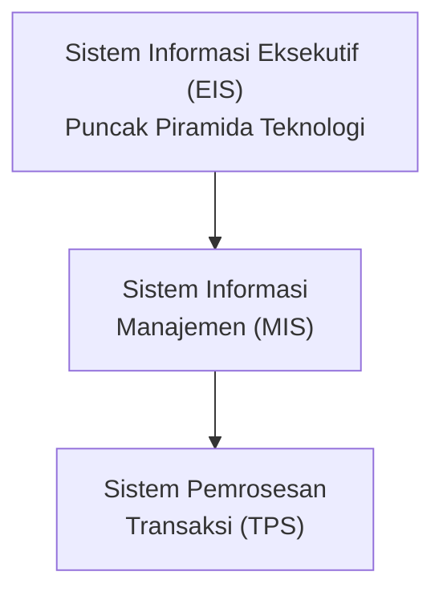
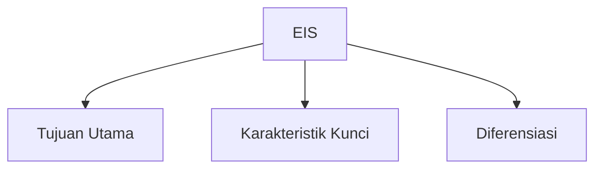
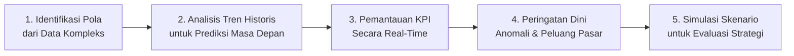
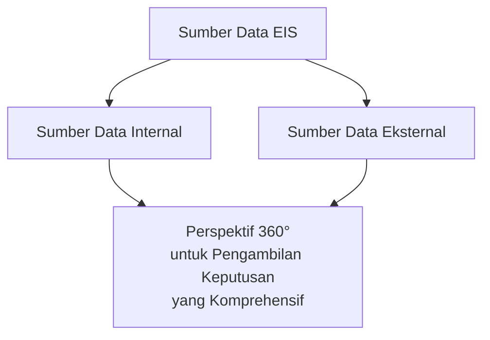
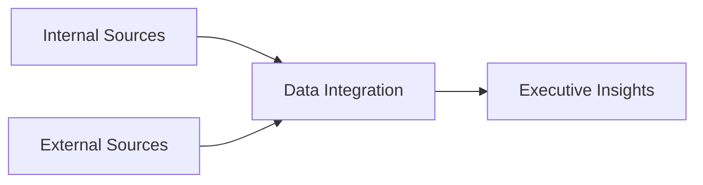
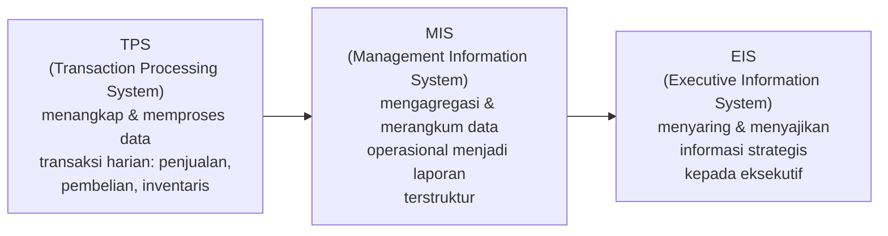
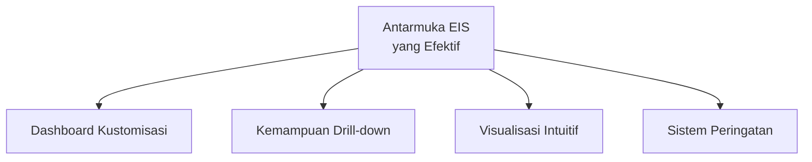
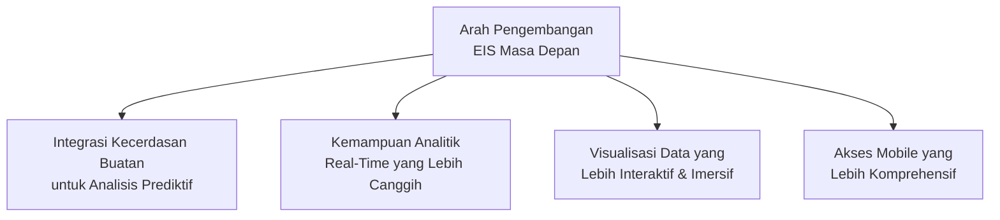
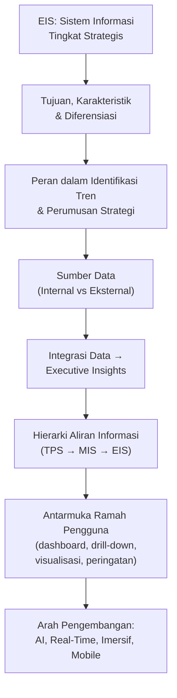

# Sistem Informasi Eksekutif (EIS): Mendukung Keputusan Strategis

Materi ini membahas **Sistem Informasi Eksekutif (EIS)** — sistem informasi tingkat strategis yang dirancang khusus untuk mendukung pengambilan keputusan di level manajemen puncak organisasi.

## Apa itu Sistem Informasi Eksekutif (EIS)?

**Sistem Informasi Eksekutif (EIS)** adalah:

1. Sistem informasi **tingkat strategis** yang berada di puncak piramida teknologi perusahaan
2. Dirancang khusus untuk dioperasikan langsung oleh para **eksekutif dan manajer senior**
3. Menyajikan informasi dalam **format yang mudah dipahami** dan disesuaikan
4. **Mengintegrasikan data** dari berbagai sumber internal dan eksternal

> Kaitan dengan Sesi 6 (STSI4206): jika Sesi 6 membahas bagaimana **pengetahuan individual** ditransformasikan menjadi **aset organisasi** melalui siklus manajemen pengetahuan, EIS adalah salah satu **alat konkret** yang memungkinkan pengetahuan/data tersebut disajikan kepada level pengambil keputusan tertinggi organisasi.

---

## 1. Tujuan dan Karakteristik Utama EIS

| Tujuan Utama | Karakteristik Kunci | Diferensiasi |
|---|---|---|
| Membantu analisis lingkungan bisnis | Antarmuka yang ramah pengguna | Fokus pada kebutuhan eksekutif |
| Mengidentifikasi tren jangka panjang | Kemampuan *drill-down* untuk menganalisis detail | Menyajikan pandangan holistik operasi bisnis |
| Mendukung perencanaan strategis | Visualisasi data yang komprehensif | Tampilan yang dapat disesuaikan |
| Memfasilitasi pengambilan keputusan tingkat tinggi | Penyajian informasi yang tidak terstruktur | Orientasi pada masa depan dan strategi |

> Tiga kolom ini saling berkaitan: **Tujuan** menjawab *mengapa* EIS dibutuhkan, **Karakteristik** menjawab *bagaimana* EIS bekerja secara teknis, dan **Diferensiasi** menjawab *apa yang membedakan* EIS dari sistem informasi level operasional/manajerial biasa.

---

## 2. Peran EIS dalam Identifikasi Tren dan Perumusan Strategi

EIS mendukung perumusan strategi melalui lima kemampuan berikut:

| Langkah | Penjelasan |
|---|---|
| **1. Identifikasi Pola** | Identifikasi pola dari berbagai sumber data yang kompleks. |
| **2. Analisis Tren Historis** | Analisis tren historis untuk prediksi masa depan. |
| **3. Pemantauan KPI** | Pemantauan indikator kinerja utama (KPI) secara *real-time*. |
| **4. Peringatan Dini** | Pemberian peringatan dini terhadap anomali dan peluang pasar. |
| **5. Simulasi Skenario** | Simulasi skenario untuk evaluasi alternatif strategi. |

> EIS memungkinkan eksekutif untuk **"melihat hutan, bukan hanya pohon-pohon"** dalam lanskap bisnis — yaitu memahami gambaran besar dan keterkaitan antar bagian organisasi, bukan hanya detail operasional satu per satu.

---

## 3. Sumber Data EIS: Internal vs Eksternal

EIS mengintegrasikan data dari dua kategori sumber:

| Sumber Data Internal | Sumber Data Eksternal |
|---|---|
| **Sistem Pemrosesan Transaksi (TPS)** — data operasional harian (penjualan, inventaris, keuangan) | **Analisis pasar** — tren industri dan pergeseran preferensi konsumen |
| **Sistem Informasi Manajemen (MIS)** — laporan terstruktur dan analisis kinerja departemen | **Laporan kompetitor** — kinerja dan strategi pesaing |
| **Sistem Pendukung Keputusan (DSS)** — hasil analisis dan model prediktif | **Data ekonomi** — indikator makroekonomi dan proyeksi pertumbuhan |
| **Data Warehouse** — repositori data historis perusahaan | **Riset industri** — laporan analis dan prediksi ahli |
| | **Media sosial** — sentimen publik dan tren percakapan |

> Integrasi sumber data internal dan eksternal memberikan **perspektif 360°** bagi para eksekutif untuk pengambilan keputusan yang lebih komprehensif.

---

## 4. Dampak Integrasi Data terhadap Pengambilan Keputusan

Data dari sumber internal dan eksternal mengalir melalui proses integrasi sebelum menjadi wawasan yang dapat digunakan eksekutif:

Integrasi data yang efektif dalam EIS memberikan dampak signifikan pada kualitas pengambilan keputusan:

- Eksekutif dapat melihat **hubungan antara berbagai variabel bisnis**
- Mengidentifikasi **pola yang tidak terlihat** pada sistem terpisah
- Memperoleh **wawasan yang lebih mendalam** tentang dinamika organisasi

---

## 5. Aliran Informasi dari TPS dan MIS ke EIS

Aliran informasi dalam organisasi mengikuti **hierarki pengolahan data yang sistematis**, dari level operasional hingga level strategis:

| Lapisan | Fungsi |
|---|---|
| **TPS** | Menangkap dan memproses data transaksi harian (penjualan, pembelian, inventaris). |
| **MIS** | Mengagregasi dan merangkum data operasional menjadi laporan terstruktur. |
| **EIS** | Menyaring dan menyajikan informasi strategis kepada eksekutif. |

> Hierarki ini menunjukkan bahwa EIS **bukan sistem yang berdiri sendiri** — ia bergantung pada data yang sudah diproses oleh TPS dan dirangkum oleh MIS sebelum disaring lagi menjadi informasi strategis yang ringkas dan relevan bagi eksekutif.

---

## 6. Pentingnya Antarmuka yang Ramah Pengguna dalam EIS

### Mengapa Antarmuka Penting?

Para eksekutif biasanya:

1. Memiliki **waktu terbatas** untuk menganalisis data
2. Mungkin **tidak memiliki keahlian teknis** yang mendalam
3. Membutuhkan **akses cepat** ke informasi kritis
4. Perlu melihat informasi dari **berbagai perspektif**

> Antarmuka yang intuitif dan dapat disesuaikan menjamin bahwa EIS **benar-benar digunakan**, bukan hanya diimplementasikan.

### Elemen Desain Antarmuka EIS yang Efektif

| Elemen | Penjelasan |
|---|---|
| **Dashboard Kustomisasi** | Memungkinkan eksekutif menyesuaikan tampilan berdasarkan preferensi dan kebutuhan spesifik mereka. |
| **Kemampuan *Drill-down*** | Memungkinkan eksplorasi data dari tingkat ringkasan hingga detail transaksi untuk analisis mendalam. |
| **Visualisasi Intuitif** | Menyajikan data kompleks dalam bentuk grafik, diagram, dan peta yang mudah dipahami. |
| **Sistem Peringatan** | Memberitahu eksekutif tentang anomali, tren penting, atau kondisi yang memerlukan perhatian segera. |

> Antarmuka yang efektif **mentransformasikan data mentah menjadi wawasan yang dapat ditindaklanjuti**, memungkinkan eksekutif fokus pada implikasi strategis, bukan pada teknis pengolahan data.

---

## 7. Kesimpulan dan Arah Pengembangan EIS

### Rangkuman Kunci

1. **EIS adalah sistem strategis** yang dirancang khusus untuk eksekutif.
2. **Mengintegrasikan data** dari berbagai sumber untuk memberikan pandangan holistik.
3. **Mendukung identifikasi tren** dan pengambilan keputusan strategis.
4. **Antarmuka yang ramah pengguna** merupakan komponen kritis.

### Arah Pengembangan Masa Depan

> Sebagai calon profesional sistem informasi, pemahaman tentang EIS akan membantu mengembangkan solusi yang benar-benar **mendukung pengambilan keputusan strategis** di tingkat tertinggi organisasi.

---

## Ringkasan Keterkaitan Antar Konsep

Inti dari materi ini: EIS adalah **puncak hierarki sistem informasi organisasi** — ia tidak menggantikan TPS dan MIS, melainkan **menyaring dan merangkum** data yang sudah diproses oleh kedua sistem tersebut, menggabungkannya dengan sumber data eksternal, lalu menyajikannya melalui **antarmuka yang ramah pengguna** agar eksekutif dapat membuat keputusan strategis berbasis data secara cepat dan komprehensif — tanpa harus memahami detail teknis pengolahan data di baliknya.
