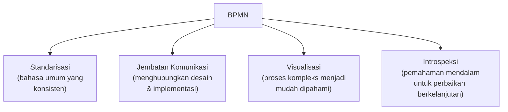
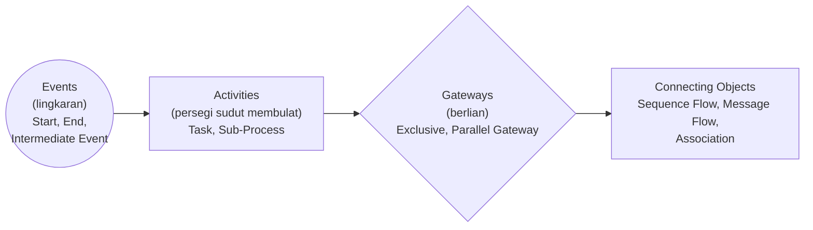
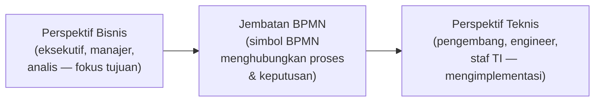
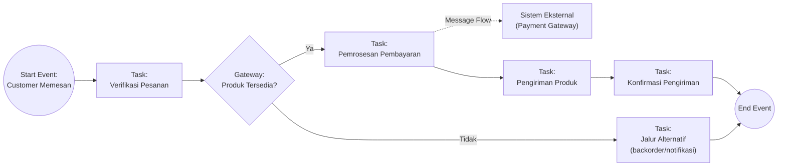
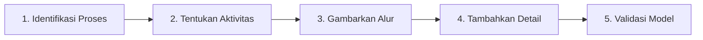
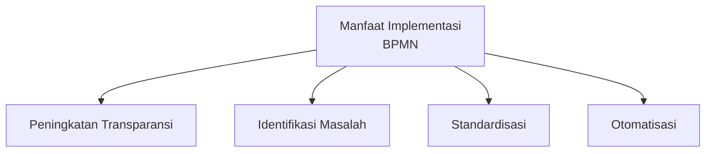
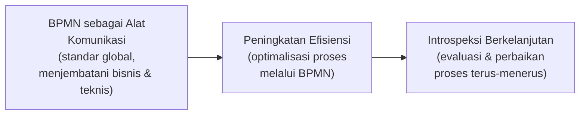
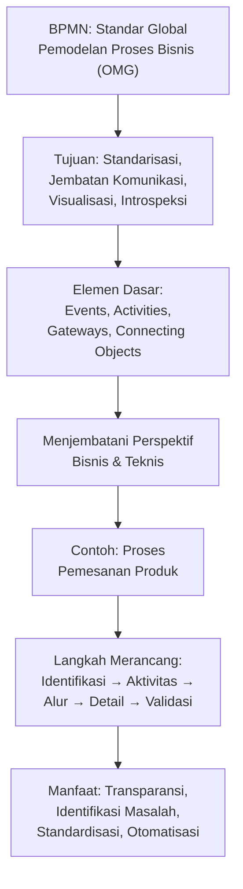

# Business Process Model and Notation (BPMN)

**Visualisasi Proses Bisnis untuk Komunikasi yang Efektif**

Materi ini membahas **BPMN (Business Process Model and Notation)** — standar global untuk memodelkan proses bisnis secara visual, sehingga dapat dipahami oleh semua pemangku kepentingan, mulai dari analis bisnis hingga pengembang teknis.

## Apa itu BPMN?

**Business Process Model and Notation (BPMN)** adalah standar global untuk memodelkan proses bisnis yang dikembangkan oleh **Object Management Group (OMG)**.

BPMN menggunakan **notasi grafis yang intuitif** untuk merepresentasikan alur kerja dalam sebuah proses bisnis secara visual melalui **Business Process Diagram (BPD)**.

> *"BPMN adalah bahasa universal untuk komunikasi proses bisnis, seperti notasi musik yang dipahami musisi di seluruh dunia."*

> Kaitan dengan Sesi 1 (STSI4206): pada materi *Metodologi Analisis Proses Bisnis*, **Pemetaan Proses** menggunakan notasi BPMN sudah disinggung sebagai langkah ke-3 dari 8 langkah metodologi analisis proses bisnis. Sesi ini membahas BPMN secara mendalam sebagai alat pemetaan tersebut.

---

## 1. Tujuan Utama BPMN

| Tujuan | Penjelasan |
|---|---|
| **Standarisasi** | Menciptakan bahasa umum yang konsisten untuk pemodelan proses bisnis. |
| **Jembatan Komunikasi** | Menghubungkan kesenjangan antara desain proses bisnis dan implementasi proses. |
| **Visualisasi** | Memvisualisasikan proses kompleks dengan cara yang mudah dipahami. |
| **Introspeksi** | Memberikan pemahaman mendalam tentang cara kerja bisnis untuk perbaikan berkelanjutan. |

> BPMN dirancang agar mudah dipahami oleh **semua pemangku kepentingan** — dari analis bisnis yang membuat draf awal proses, hingga pengembang teknis yang mengimplementasikannya.

---

## 2. Elemen-elemen Dasar BPMN

BPMN memiliki empat kategori elemen notasi dasar:

| Elemen | Bentuk | Penjelasan | Contoh |
|---|---|---|---|
| **Events** | Lingkaran | Menunjukkan sesuatu yang "terjadi" selama proses bisnis. | Start Event, End Event, Intermediate Event |
| **Activities** | Persegi panjang sudut membulat | Pekerjaan yang dilakukan dalam proses. | Task, Sub-Process |
| **Gateways** | Berlian (diamond) | Kontrol percabangan dan penggabungan alur. | Exclusive Gateway, Parallel Gateway |
| **Connecting Objects** | Garis/anak panah | Menghubungkan elemen-elemen diagram. | Sequence Flow, Message Flow, Association |

> Keempat elemen ini adalah "alfabet" dasar BPMN — kombinasi dari **Events** (kapan sesuatu terjadi), **Activities** (apa yang dilakukan), **Gateways** (bagaimana alur bercabang/bergabung), dan **Connecting Objects** (bagaimana semuanya terhubung) sudah cukup untuk memodelkan hampir semua proses bisnis, sesederhana atau serumit apa pun.

---

## 3. BPMN: Menjembatani Komunikasi

BPMN secara unik dirancang untuk dipahami oleh dua kelompok pemangku kepentingan yang biasanya memiliki cara berpikir berbeda:

| Perspektif Bisnis | Perspektif Teknis |
|---|---|
| Memahami alur kerja tanpa detail teknis | Menerjemahkan ke dalam implementasi teknis |
| Mengidentifikasi *bottleneck* dan inefisiensi | Pemetaan langsung ke **BPEL** (*Business Process Execution Language*) |
| Menyelaraskan proses dengan strategi | Merancang sistem yang sesuai kebutuhan bisnis |

> BPMN menggunakan **bahasa visual** yang dapat dipahami oleh kedua pihak, memfasilitasi komunikasi yang efektif dan **meminimalkan kesalahpahaman** antara tim bisnis dan tim teknis — masalah yang sering menjadi akar kegagalan proyek transformasi bisnis (lihat statistik *68% proyek transformasi gagal* pada Sesi 1).

---

## 4. Contoh Kasus: Proses Pemesanan Produk

Berikut rekonstruksi diagram BPMN untuk proses pemesanan produk dari awal hingga akhir, menggunakan elemen-elemen BPMN dari bagian 2:

| Tahap | Penjelasan |
|---|---|
| **Penerimaan Pesanan** | *Customer* melakukan pemesanan yang memicu *start event* dan proses verifikasi pesanan dimulai. |
| **Pengecekan Inventori** | *Gateway* digunakan untuk menentukan apakah produk tersedia; jika tidak, jalur alternatif diambil. |
| **Pemrosesan Pembayaran** | Aktivitas yang menghubungkan dengan sistem eksternal (pembayaran) menggunakan ***message flow***. |
| **Pengiriman dan Konfirmasi** | Proses berakhir dengan *end event* setelah pengiriman berhasil dan konfirmasi dikirim. |

> Contoh ini menunjukkan bagaimana **keempat elemen dasar BPMN** (bagian 2) digabungkan menjadi satu diagram yang utuh: *start/end event* menandai batas proses, *task* merepresentasikan setiap aktivitas, *gateway* menangani keputusan "produk tersedia atau tidak", dan *message flow* menghubungkan proses internal dengan sistem eksternal (pembayaran).

---

## 5. Langkah-langkah Merancang Diagram BPMN

| Langkah | Penjelasan |
|---|---|
| **1. Identifikasi Proses** | Tentukan proses bisnis yang akan dimodelkan dan batasan-batasannya. |
| **2. Tentukan Aktivitas** | Identifikasi tugas-tugas utama yang perlu dilakukan dalam proses tersebut. |
| **3. Gambarkan Alur** | Tentukan urutan aktivitas dan kondisi percabangan (*decision points*). |
| **4. Tambahkan Detail** | Lengkapi dengan *events*, *swimlanes*, dan *artifacts* sesuai kebutuhan. |
| **5. Validasi Model** | Periksa kembali model dengan *stakeholders* untuk memastikan akurasi. |

> Gunakan alat pemodelan BPMN seperti **Bizagi Modeler**, **Lucidchart**, atau **draw.io** untuk membuat diagram dengan lebih mudah.

---

## 6. Manfaat Implementasi BPMN

| Manfaat | Penjelasan |
|---|---|
| **Peningkatan Transparansi** | Membuat proses bisnis yang kompleks menjadi lebih jelas dan mudah dipahami. |
| **Identifikasi Masalah** | Membantu menemukan *bottleneck*, redundansi, dan inefisiensi dalam proses. |
| **Standardisasi** | Menciptakan standar untuk dokumentasi dan eksekusi proses. |
| **Otomatisasi** | Memfasilitasi implementasi *Business Process Management Systems* (BPMS). |

> **Hasil nyata:** organisasi yang menggunakan BPMN melaporkan **peningkatan efisiensi proses hingga 25%** dan **pengurangan biaya operasional hingga 20%**.

---

## 7. Kesimpulan & Langkah Selanjutnya

### Rangkuman Kunci

1. **BPMN sebagai Alat Komunikasi** — BPMN telah menjadi standar global untuk memvisualisasikan proses bisnis, menjembatani tim bisnis dan teknis.
2. **Peningkatan Efisiensi** — dengan memahami dan mengoptimalkan proses melalui BPMN, organisasi dapat mencapai efisiensi operasional yang lebih tinggi.
3. **Introspeksi Berkelanjutan** — BPMN memungkinkan organisasi untuk terus-menerus mengevaluasi dan memperbaiki proses bisnis mereka.

### Langkah Selanjutnya

1. Praktikkan pembuatan diagram BPMN untuk proses sederhana di lingkungan Anda.
2. Eksplorasi alat pemodelan BPMN yang tersedia (baik berbayar maupun gratis).
3. Pelajari pola-pola BPMN lanjutan untuk kasus yang lebih kompleks.

---

## Ringkasan Keterkaitan Antar Konsep

Inti dari materi ini: BPMN berperan sebagai **"bahasa visual universal"** yang memungkinkan proses bisnis kompleks didokumentasikan dengan konsisten menggunakan empat elemen dasar (*events*, *activities*, *gateways*, *connecting objects*) — dan yang terpenting, **menjembatani kesenjangan komunikasi** antara pihak bisnis yang berfokus pada tujuan strategis dan pihak teknis yang berfokus pada implementasi sistem, sehingga proses yang dirancang di atas kertas benar-benar dapat diimplementasikan sesuai maksud awalnya.
