# Sistem Informasi untuk Bisnis

**STSI4207 Sistem Informasi Manajemen**
Program Studi Sistem Informasi — Fakultas Sains dan Teknologi — Universitas Terbuka

Materi ini membahas konsep dasar sistem informasi, bagaimana perkembangan teknologi informasi mengubah dunia bisnis, serta berbagai pendekatan keilmuan yang membentuk disiplin Sistem Informasi Manajemen.

## Pengertian Sistem Informasi

### 1. Sistem

**Sistem** adalah sekumpulan komponen yang saling berinteraksi dan bekerja sama untuk mencapai tujuan yang sama (Bertalanffy, 1971; Checkland, 1981).

Poin-poin kunci dari definisi ini:

- Kata kunci adalah **sekumpulan komponen atau subsistem**, sehingga suatu sistem terdiri dari beberapa subsistem, dan demikian juga sebaliknya.
- Komponen atau subsistem penyusun suatu sistem **berinteraksi dan bekerja sama** satu dengan yang lain.
- Suatu sistem juga memiliki **tujuan** yang menjadi dasar kerja sistem tersebut.
- Beberapa subsistem akan membentuk **sistem**, dan kemudian beberapa sistem akan membentuk **supra sistem**.

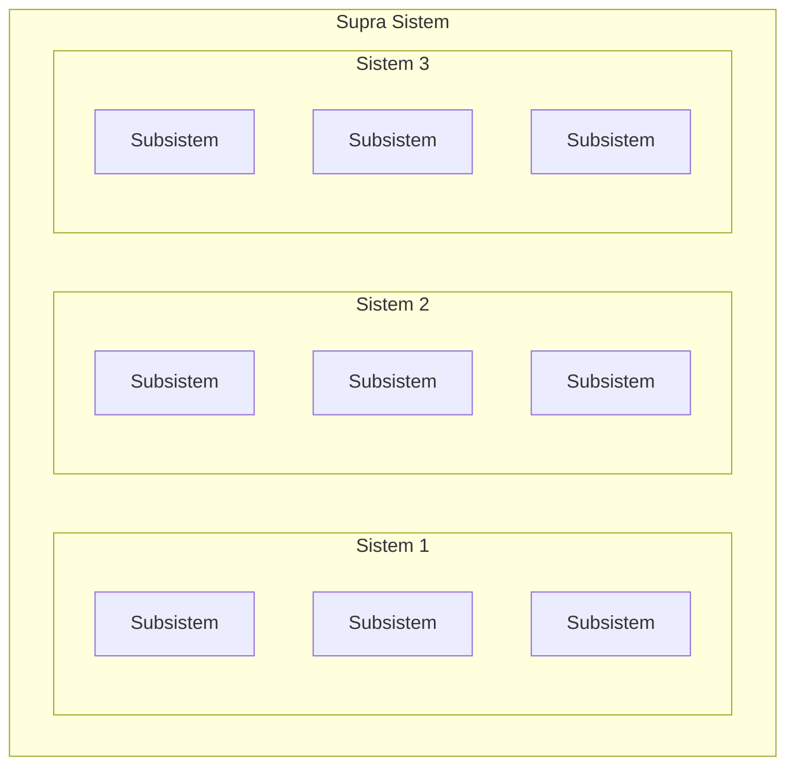

> Hierarki ini berlaku berjenjang: subsistem-subsistem membentuk satu sistem, dan beberapa sistem yang saling berkaitan akan membentuk satu **supra sistem** yang lebih besar — misalnya, sistem penjualan dan sistem inventaris (masing-masing tersusun dari subsistemnya sendiri) bersama-sama membentuk supra sistem **Sistem Informasi Perusahaan**.

### 2. Informasi

**Informasi** adalah data yang sudah mengalami pengolahan sedemikian rupa sehingga dapat digunakan oleh penggunanya dalam membuat keputusan (Laudon & Laudon, 2018; Rainer, Prince, & Watson, 2013; Romney & Steinbart, 2014).

Informasi yang memadai dibutuhkan untuk membuat **keputusan yang rasional** sehingga memperoleh hasil yang optimal dalam kondisi pada saat keputusan tersebut dibuat.

### 3. Sistem Informasi dan Teknologi Informasi

**Sistem informasi** didefinisikan sebagai suatu sistem yang digunakan untuk **mengumpulkan, mengolah, menyimpan, dan mendistribusikan informasi** (Laudon & Laudon, 2018). Informasi tersebut akan digunakan untuk mendukung **tata kelola** suatu organisasi.

**Teknologi informasi** didefinisikan sebagai perangkat komputer yang digunakan untuk **menyimpan, mengambil, mengirimkan, dan mengolah data** (Turban, Pollard, & Wood, 2018).

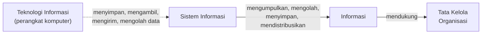

> Perbedaan penting: **Sistem informasi** adalah konsep yang lebih luas (mencakup proses, orang, dan tata kelola), sedangkan **teknologi informasi** adalah salah satu **komponen pendukung** dari sistem informasi tersebut, secara spesifik perangkat komputernya.

### 4. Model Input-Proses-Output

Pengolahan data menjadi informasi merupakan **inti kegiatan setiap sistem informasi**: data dimasukkan (*input*), diolah (*proses*), dan menjadi informasi (*output*). Dalam proses pengolahan tersebut terdapat mekanisme pengendalian (kontrol) berupa **umpan balik** untuk memastikan pengolahan data menjadi informasi sesuai dengan tujuan organisasi.

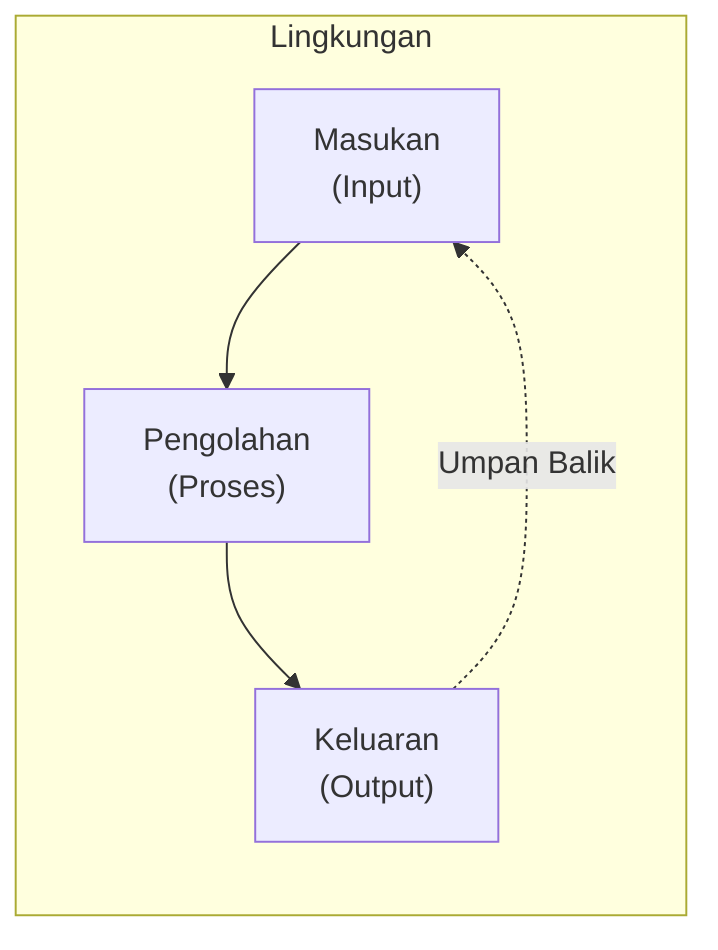

> Model ini berlaku universal untuk hampir semua sistem informasi: data mentah (*masukan*) diolah melalui suatu proses, menghasilkan informasi (*keluaran*), yang kemudian sebagian dipantau kembali sebagai **umpan balik** untuk mengoreksi/menyesuaikan proses berikutnya — semuanya berlangsung dalam suatu **lingkungan** organisasi tertentu.

---

## Perkembangan Teknologi Informasi dan Perubahan Dunia Usaha

Perkembangan teknologi informasi yang pesat belakangan ini mendorong terjadinya beberapa perubahan penting dalam bisnis (Laudon & Laudon, 2018):

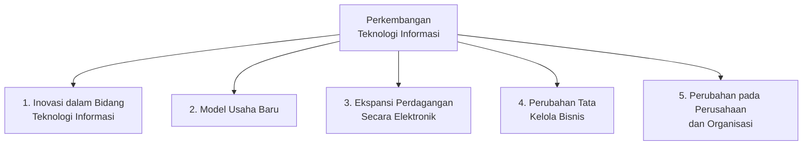

### Konsep Dunia Menjadi Datar

Pada tahun 2007, **Thomas Friedman** menulis buku yang menunjukkan bahwa **dunia menjadi datar**. Yang dimaksud "datar" adalah **berkurangnya keunggulan dan kesenjangan** antara negara maju dibanding negara lain di dunia. Pendorong utama konsep ini adalah adopsi teknologi informasi, khususnya **Internet** dan **telekomunikasi**.

Wujud konsep dunia menjadi datar:

- Perusahaan-perusahaan besar saat ini memiliki kantor dan beroperasi di **berbagai negara**.
- Dengan teknologi digital, kebiasaan berbisnis lama yang **terbatas ruang dan waktu** menjadi berubah.
- Kegiatan berbisnis dapat dilakukan dengan **siapapun di berbagai belahan dunia**.

> **Contoh nyata:** iPhone dari Apple — dirancang di Amerika Serikat oleh Apple, menggunakan komponen buatan Korea Selatan (Samsung dan LG) dan Taiwan (TSMC), yang kemudian dirakit di RRC (FoxConn).

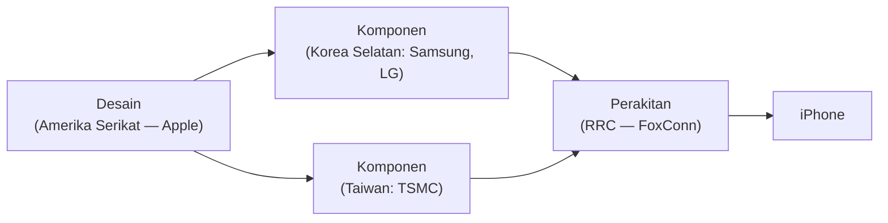

---

## Peran Sistem Informasi dalam Perubahan Dunia Bisnis

Sistem informasi dan investasi di bidang teknologi informasi digunakan perusahaan untuk mencapai **enam tujuan strategis usaha** (Laudon & Laudon, 2018):

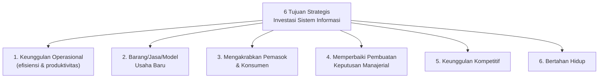

| Tujuan | Penjelasan |
|---|---|
| **Keunggulan Operasional** | Meraih keunggulan operasional dengan cara terus-menerus mencapai tingkat efisiensi yang lebih baik dan meningkatkan produktivitas kerja. |
| **Barang/Jasa/Model Usaha Baru** | Mengembangkan barang, jasa, atau model usaha baru menggunakan teknologi informasi. |
| **Mengakrabkan Pemasok & Konsumen** | Mempererat hubungan dengan pemasok dan konsumen. |
| **Keputusan Manajerial** | Memperbaiki pembuatan keputusan manajerial. |
| **Keunggulan Kompetitif** | Meraih keunggulan kompetitif. |
| **Bertahan Hidup** | Bertahan hidup di tengah persaingan dan perubahan pasar. |

### Fenomena Disrupsi

Perkembangan teknologi informasi mengubah secara drastis peta usaha pada berbagai industri, mengubah tata cara berusaha maupun dunia usaha. Fenomena tersebut disebut sebagai **disrupsi** (Turban et al., 2018).

- Disrupsi teknologi memunculkan **pasar baru, produk baru, dan pekerjaan baru**.
- Jika ingin bertahan dan bahkan berkembang, perusahaan harus mampu **beradaptasi dan mengantisipasi** disrupsi teknologi.

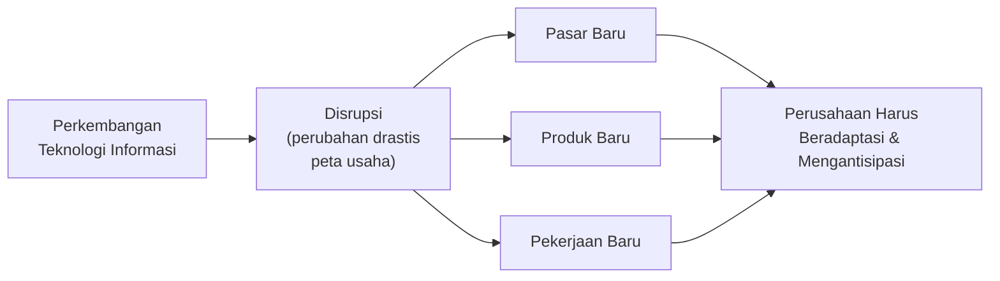

---

## Tantangan Para Manajer di Era Bisnis Modern

Berdasarkan **Kappelman et al. (2017)**, berikut sepuluh besar tantangan manajer modern:

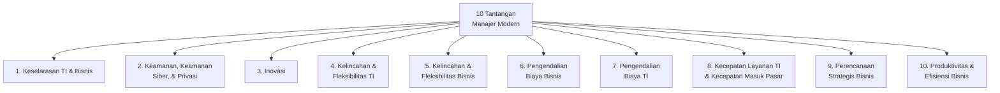

1. Keselarasan teknologi informasi dan bisnis
2. Keamanan, keamanan siber, dan privasi
3. Inovasi
4. Kelincahan dan fleksibilitas teknologi informasi
5. Kelincahan dan fleksibilitas bisnis
6. Pengurangan dan pengendalian biaya bisnis
7. Pengurangan dan pengendalian biaya teknologi informasi
8. Kecepatan layanan teknologi informasi dan kecepatan memasuki pasar
9. Perencanaan strategis bisnis
10. Produktivitas dan efisiensi bisnis

> Daftar ini menunjukkan bahwa tantangan manajer modern selalu **berpasangan antara sisi bisnis dan sisi teknologi informasi** (misalnya poin 4 & 5, poin 6 & 7) — menegaskan bahwa keduanya tidak bisa dipisahkan dalam pengambilan keputusan strategis.

### Tren Teknologi yang Mendorong dan Mendikte Perubahan

Turban et al. (2018) merinci tren teknologi yang akan mendorong dan mendikte perubahan:

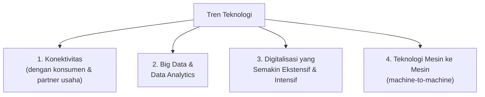

| Tren | Penjelasan |
|---|---|
| **Konektivitas** | Konektivitas yang perlu dilakukan oleh perusahaan dengan konsumen dan partner usahanya. |
| **Big Data & Data Analytics** | Merujuk pada tersedianya data melimpah dan tidak terstruktur. |
| **Digitalisasi** | Digitalisasi yang semakin ekstensif dan intensif. |
| **Teknologi Mesin ke Mesin** | Mesin cerdas berbasis komputer akan dapat saling berkomunikasi tanpa campur tangan manusia. |

---

## Pendekatan dalam Sistem Informasi Manajemen

Terdapat tiga pendekatan utama yang berkembang dalam mempelajari Sistem Informasi Manajemen:

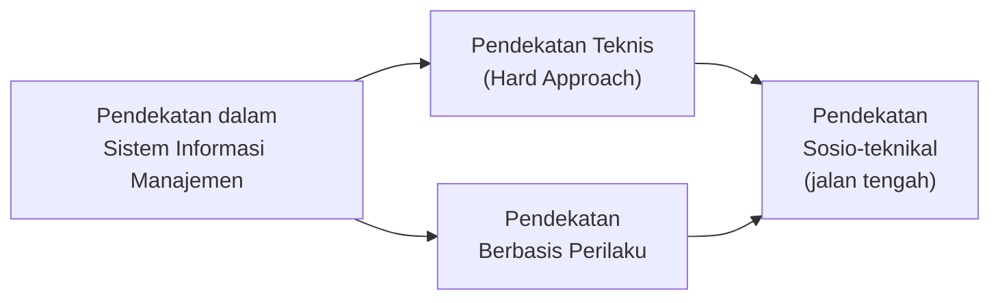

### 1. Pendekatan Teknis (*Hard Approach*)

Di masa lalu, mempelajari sistem informasi manajemen banyak menggunakan **pendekatan teknis**, disebut sebagai ***Hard Approach*** (Avison & Fitzgerald, 2006).

Pendekatan teknis biasanya berdasarkan pada penggunaan **model matematika, teknologi fisik (perangkat keras), dan kemampuan formal** suatu sistem informasi (Laudon & Laudon, 2018). Sistem informasi manajemen berkembang berdasarkan pengaruh besar dari disiplin **Ilmu Komputer, Manajemen Sains, dan Operations Research**.

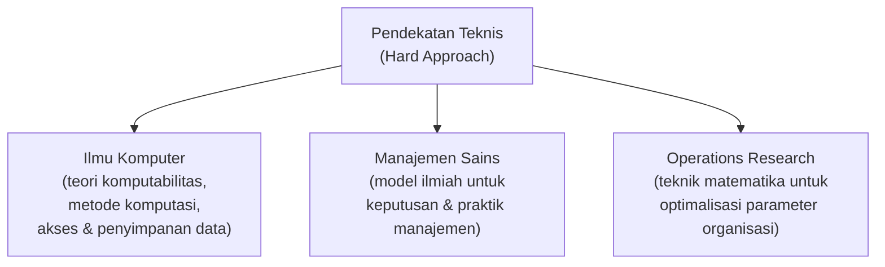

| Disiplin Ilmu | Fokus |
|---|---|
| **Ilmu Komputer** | Mempelajari teori komputabilitas, metode komputasi, dan metode bagaimana mengakses dan menyimpan data secara efisien. |
| **Manajemen Sains** | Berfokus pada pengembangan model-model ilmiah guna pembuatan keputusan dan praktik manajemen. |
| **Operations Research** | Berfokus pada teknik matematika untuk melakukan optimalisasi pada beberapa parameter organisasi, antara lain transportasi dan logistik, pengendalian persediaan, dan biaya transaksi. |

### 2. Pendekatan Berbasis Perilaku

Seiring berjalannya waktu, pendekatan berbasis ilmu teknik menemui banyak kendala yang bersifat **non-teknis**, sehingga mulai banyak digunakan **pendekatan berbasis perilaku** (Avison & Fitzgerald, 2006; Laudon & Laudon, 2018).

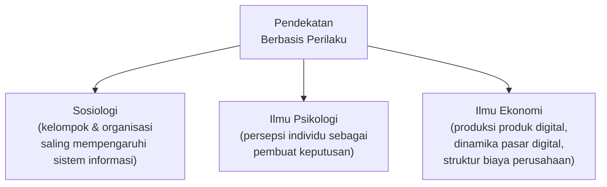

| Disiplin Ilmu | Fokus |
|---|---|
| **Sosiologi** | Mempelajari bagaimana kelompok dan organisasi saling mempengaruhi dan dipengaruhi oleh sebuah sistem informasi. |
| **Ilmu Psikologi** | Mempelajari bagaimana individu sebagai pembuat keputusan memiliki persepsi terhadap dan menggunakan sebuah sistem informasi. |
| **Ilmu Ekonomi** | Mempelajari bagaimana proses produksi produk digital, dinamika pasar digital, dan bagaimana sistem informasi baru mengubah pengendalian dan struktur biaya di dalam suatu perusahaan. |

### 3. Pendekatan Sosio-teknikal

Mulai dekade 1970-an, digunakan **pendekatan sosio-teknikal** dalam sistem informasi sebagai **jalan tengah**. Pendekatan ini mulai digunakan dan dipelopori oleh **Tavistock Institute** di London.

Pendekatan sosio-teknikal menggunakan **kombinasi** dari pendekatan teknis dan pendekatan perilaku untuk menyelesaikan masalah pada suatu sistem informasi — masalah yang seringkali merupakan kombinasi dari hal teknis dan non-teknis yang saling terkait.

Prinsip utama pendekatan ini:

- Optimalisasi suatu sistem informasi harus dilakukan pada **sisi sosial dan teknikal secara bersama-sama**.
- Mengoptimalkan hanya salah satu sisi akan mengakibatkan **masalah di sisi lain**. Terkadang salah satu sisi harus "dikalahkan" dan tidak dioptimalkan guna mencapai tujuan organisasi.
- Contoh: penggunaan perangkat teknologi informasi yang maju mungkin harus **ditunda** sampai para personil yang akan menggunakannya diberi **pelatihan yang memadai** dan disusun **rencana implementasi yang tepat**.

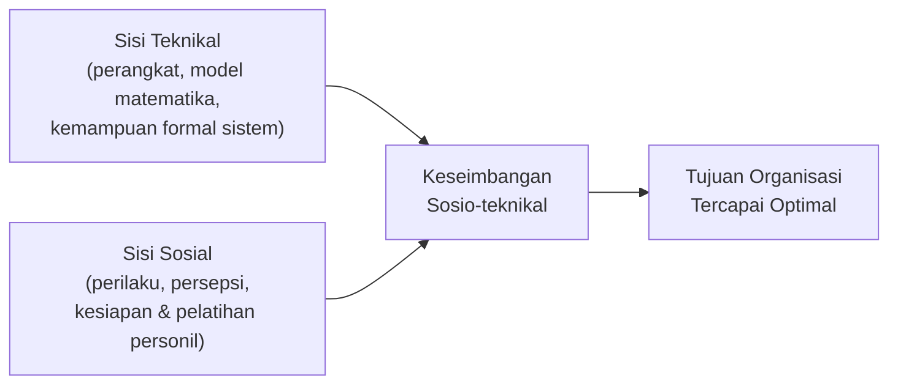

---

## Ringkasan Keterkaitan Antar Konsep

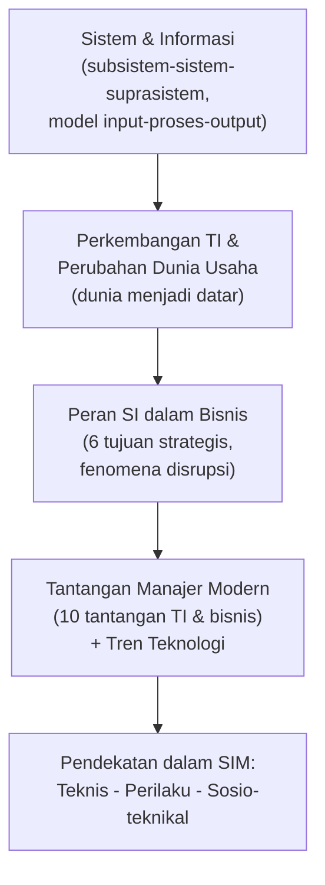

Inti dari materi ini: Sistem Informasi Manajemen dibangun dari **konsep dasar sistem dan informasi** (hierarki subsistem-sistem-suprasistem, model input-proses-output dengan umpan balik), berkembang seiring **transformasi dunia bisnis** akibat teknologi informasi (dunia menjadi datar, disrupsi), dan dipelajari melalui kombinasi **pendekatan teknis dan pendekatan perilaku** yang akhirnya disatukan dalam **pendekatan sosio-teknikal** — karena keberhasilan sistem informasi tidak pernah cukup hanya mengandalkan kecanggihan teknologi semata, tetapi juga harus memperhatikan sisi manusia yang menggunakannya.
