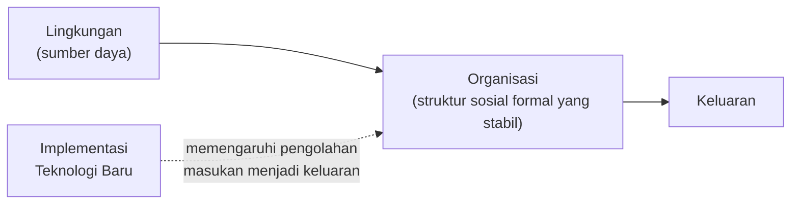
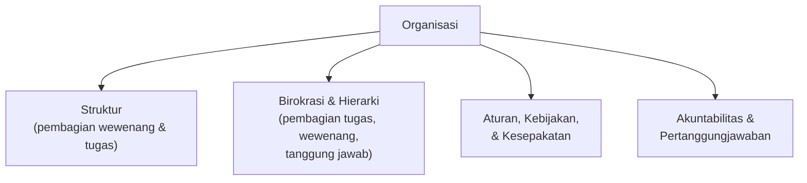
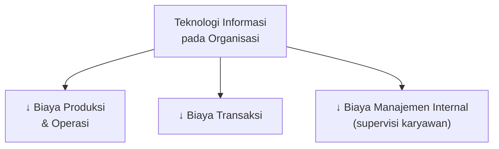
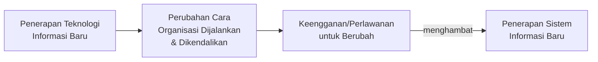
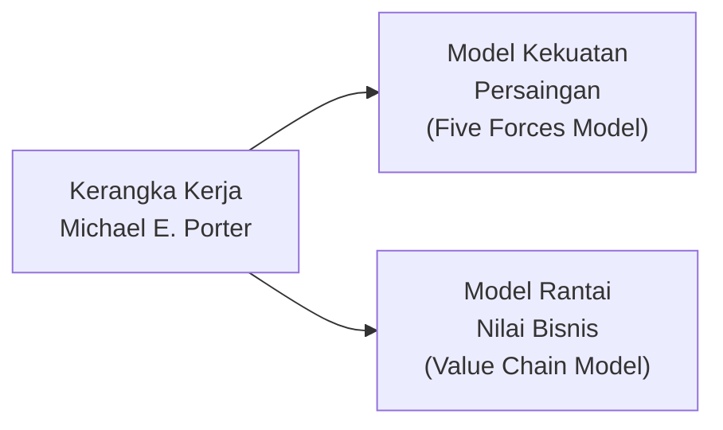
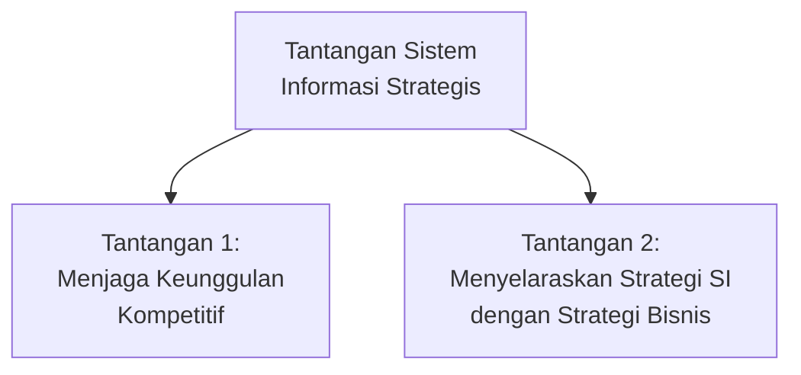
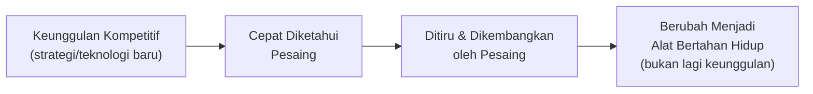
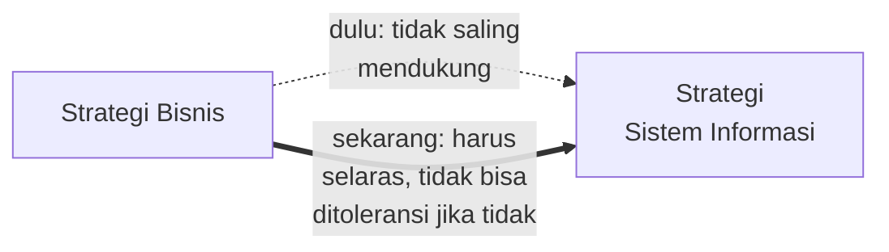
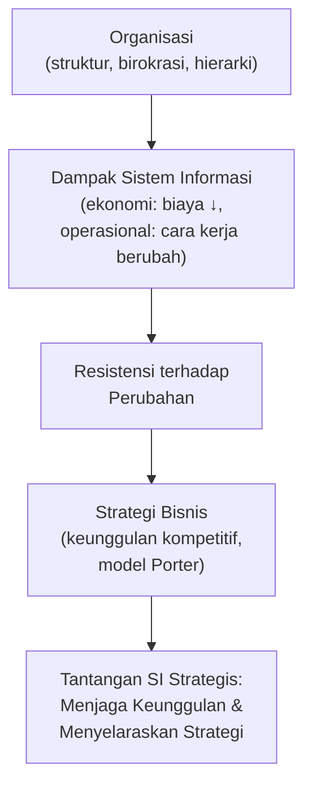

# Peran Sistem Informasi dalam Organisasi dan Strategi Bisnis

**STSI4207 Sistem Informasi Manajemen**
Program Studi Sistem Informasi — Fakultas Sains dan Teknologi — Universitas Terbuka

Materi ini membahas bagaimana sistem informasi berinteraksi dengan **struktur organisasi** dan **strategi bisnis** perusahaan, termasuk dampak ekonomi yang ditimbulkannya serta tantangan dalam menjaga sistem informasi tetap selaras dengan strategi bisnis secara keseluruhan.

> Kaitan dengan Inisiasi 1 (STSI4207): jika Inisiasi 1 membahas konsep dasar sistem, informasi, dan bagaimana teknologi informasi mengubah dunia bisnis secara umum, Inisiasi 2 ini mempersempit fokus pada **bagaimana sistem informasi memengaruhi organisasi secara internal** dan **bagaimana ia harus diselaraskan dengan strategi bisnis**.

---

## 1. Organisasi

### Definisi

**Organisasi** didefinisikan sebagai **struktur sosial formal yang stabil**, yang mengambil sumber daya dari lingkungan sekitarnya untuk diolah, guna menghasilkan keluaran (Coghlan & Brannick, 2014; Lin, Lin, Huang, & Jalleh, 2011; Luscher & Lewis, 2008; Neyland, 2008; Whitaker, Mithas, & Krishnan, 2010; Williamson, 1981).

Dengan memperhatikan definisi organisasi secara teknis, maka **sistem informasi akan berfokus pada bagaimana implementasi teknologi baru akan mempengaruhi pengolahan masukan menjadi keluaran**.

> Definisi ini secara langsung menghubungkan kembali ke **model input-proses-output** yang sudah dibahas pada Inisiasi 1 — organisasi pada dasarnya adalah "sistem" berskala besar yang juga mengikuti pola masukan-pengolahan-keluaran, dan sistem informasi berperan pada bagian "pengolahan" tersebut.

### Struktur, Birokrasi, dan Hierarki

- Setiap organisasi memiliki **struktur** yang disertai dengan **pembagian wewenang dan tugas**.
- Dalam setiap organisasi akan terdapat **birokrasi dan hierarki** yang menjelaskan bagaimana pembagian tugas, wewenang, dan tanggung jawab dilakukan.
- Pelaksanaan tugas dan wewenang tersebut diatur dengan sekumpulan **aturan, kebijakan, dan kesepakatan**. Selain itu terdapat juga **pertanggungjawaban dan akuntabilitas** pelaksanaan tugas dan wewenang.

---

## 2. Dampak Sistem Informasi pada Organisasi

### Dampak Ekonomi

- Dampak ekonomi teknologi informasi pada organisasi yang **paling utama adalah pada biaya**. Selain menurunkan **biaya produksi dan operasi**, teknologi informasi juga menurunkan **biaya transaksi** (Williamson, 1981).
- Teknologi informasi juga dapat menurunkan **biaya manajemen secara internal** — biaya manajemen yang dapat dikurangi adalah biaya untuk melakukan **supervisi** pada para karyawan.

### Dampak pada Cara Organisasi Dijalankan

- Teknologi informasi **mengubah bagaimana cara organisasi dijalankan dan dikendalikan**.
- Penerapan teknologi informasi dalam suatu organisasi akan **membawa perubahan**. Keengganan untuk berubah dan perlawanan untuk berubah dipastikan dapat **menghambat penerapan sistem informasi baru** (Luscher & Lewis, 2008; Sarker, Sarker, & Sidorova, 2006; Verhoeven, Heerwegh, & De Wit, 2010).

> Poin ini selaras dengan **Pendekatan Sosio-teknikal** yang dibahas pada Inisiasi 1 — dampak ekonomi (penurunan biaya) adalah sisi **teknikal**, sementara resistensi terhadap perubahan adalah sisi **sosial**. Keduanya harus dikelola bersama agar implementasi sistem informasi berhasil.

---

## 3. Strategi Bisnis

Perusahaan yang mampu **bertahan, berkembang, dan memenangkan persaingan** dikatakan memiliki **keunggulan kompetitif** (Michael E. Porter, 1998; M. E. Porter, 2001).

### Alat Analisis Persaingan

Dua kerangka kerja yang sering digunakan untuk menganalisis persaingan, keduanya dikembangkan oleh **Michael E. Porter** (profesor bisnis di Harvard Business School):

| Model | Fungsi |
|---|---|
| **Model Kekuatan Persaingan** (*Competitive Forces Model*) | Menganalisis intensitas persaingan dalam suatu industri berdasarkan beberapa kekuatan yang saling berinteraksi. |
| **Model Rantai Nilai Bisnis** (*Value Chain Model*) | Menganalisis aktivitas-aktivitas bisnis yang menciptakan nilai, untuk mengidentifikasi di mana keunggulan kompetitif dapat dibangun. |

> Kedua model Porter ini adalah kerangka kerja klasik yang **mendasari banyak keputusan investasi sistem informasi** — perusahaan menggunakan sistem informasi untuk memperkuat posisinya terhadap kekuatan-kekuatan persaingan (model pertama) atau untuk mengoptimalkan aktivitas penciptaan nilai pada rantai nilainya (model kedua).

---

## 4. Tantangan Sistem Informasi Strategis

Terdapat dua tantangan utama dalam mengelola sistem informasi sebagai alat strategis bisnis:

### Tantangan Pertama: Menjaga Keunggulan Kompetitif

- Strategi yang menyebabkan suatu perusahaan menjadi unggul **dapat dengan cepat diketahui** oleh para pesaingnya.
- Para pesaing kemudian dapat **meniru strategi tersebut** dan bahkan mengembangkannya.
- Teknologi yang tadinya menjadi **keunggulan bersaing**, karena pesaing juga mengadopsi teknologi yang mirip, menjadi sekadar **alat untuk bertahan hidup**.

> Siklus ini menjelaskan mengapa keunggulan kompetitif berbasis teknologi informasi bersifat **sementara** — perusahaan harus terus berinovasi karena keunggulan yang sama akan terus "didevaluasi" seiring waktu oleh adopsi pesaing.

### Tantangan Kedua: Menyelaraskan Strategi Sistem Informasi dengan Strategi Bisnis

- Awalnya, **strategi bisnis** dan **strategi sistem informasi** tidak saling mendukung. Manajemen hanya membutuhkan dan menuntut sistem informasi yang **memudahkan jalannya usaha**.
- Kadang strategi bisnis dan strategi sistem informasi **tidak berjalan seiring**, dan saat ini **ketidakselarasan tersebut tidak dapat lagi ditoleransi**.

> Tantangan kedua ini menjadi alasan mengapa pada Inisiasi 1 disebutkan **"Keselarasan teknologi informasi dan bisnis"** sebagai tantangan nomor satu dari sepuluh tantangan manajer modern (Kappelman et al., 2017) — keselarasan strategi bukan lagi pilihan, melainkan kebutuhan mutlak bagi organisasi modern.

---

## Ringkasan Keterkaitan Antar Konsep

Inti dari materi ini: sistem informasi tidak bisa dipandang sebagai alat teknis yang berdiri sendiri — ia **berinteraksi langsung dengan struktur organisasi** (mengubah biaya dan cara kerja, sekaligus memicu resistensi terhadap perubahan) dan **harus diselaraskan dengan strategi bisnis** perusahaan. Keunggulan kompetitif yang dibangun di atas sistem informasi/teknologi baru bersifat sementara karena dapat ditiru pesaing, sehingga organisasi harus terus-menerus berinovasi sekaligus memastikan strategi sistem informasinya tidak pernah berjalan sendiri, terpisah dari arah strategi bisnis secara keseluruhan.
