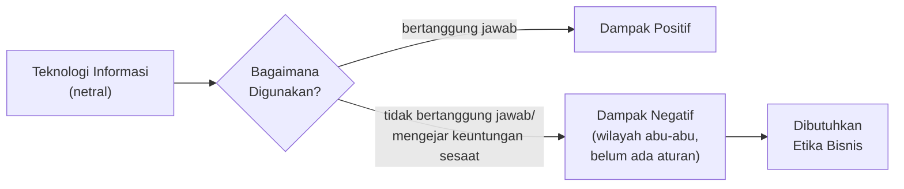
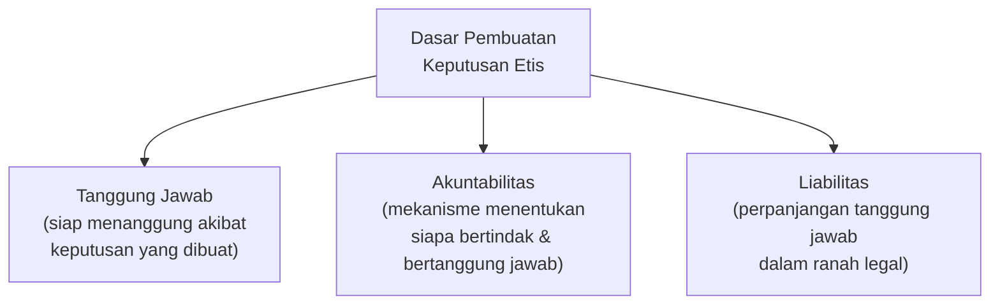
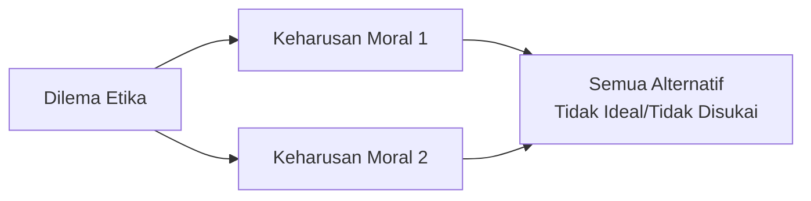
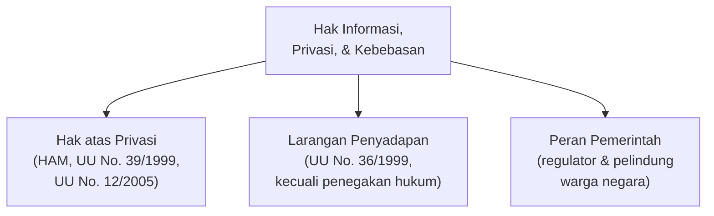
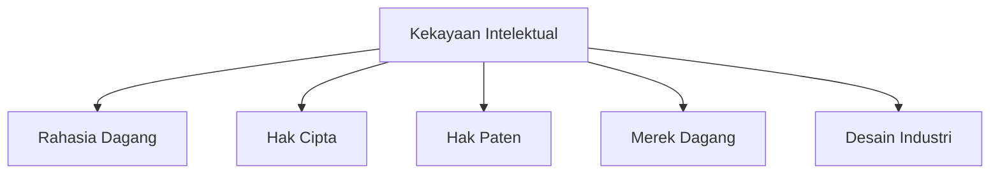
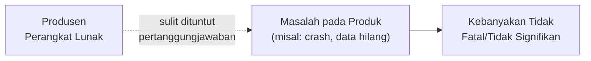
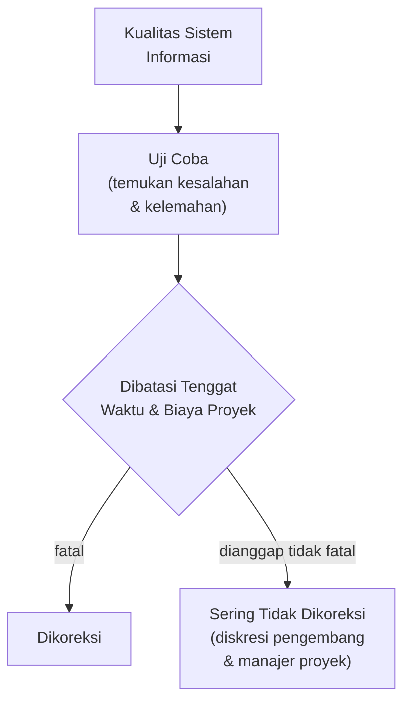
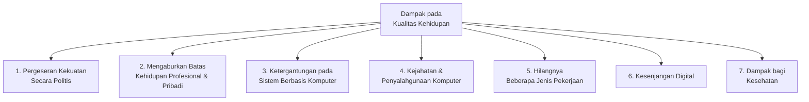
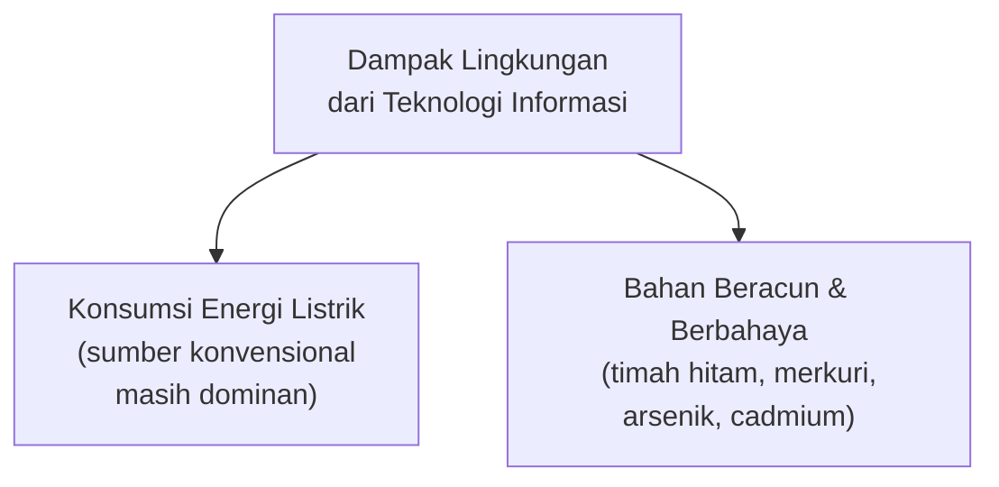
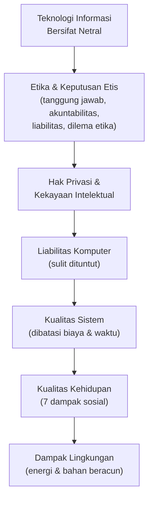

# Permasalahan Sosial dan Etika pada Sistem Informasi

**STSI4207 Sistem Informasi Manajemen**
Program Studi Sistem Informasi — Fakultas Sains dan Teknologi — Universitas Terbuka

Materi ini membahas sisi **etika dan dampak sosial** dari penerapan sistem informasi — mulai dari bagaimana keputusan etis dibuat, hak privasi dan kekayaan intelektual, kualitas sistem, hingga dampaknya terhadap kualitas hidup dan lingkungan.

> Kaitan dengan Inisiasi 1 & 2 (STSI4207): jika Inisiasi 1 membahas bagaimana teknologi informasi mendorong perubahan bisnis dan Inisiasi 2 membahas dampaknya pada organisasi serta strategi bisnis, Inisiasi 3 ini melihat **sisi lain dari mata uang yang sama** — dampak negatif dan dilema etis yang muncul ketika teknologi informasi yang sama itu digunakan secara tidak bertanggung jawab.

---

## 1. Dampak Sistem Informasi pada Etika

- Teknologi informasi sebagai suatu ciptaan manusia sebenarnya **bersifat netral**. Hanya saja ketika teknologi informasi digunakan oleh pihak-pihak yang **tidak bertanggung jawab** atau hanya digunakan untuk mengejar **keuntungan sesaat**, maka dampak negatif akan muncul.
- Para manajer sering melakukan tindakan dan membuat keputusan yang masuk ke **wilayah abu-abu**.
- Permasalahan yang dihadapi belum ada aturannya, sehingga para pelaku bisnis sering harus bertindak **tanpa pedoman aturan atau regulasi yang jelas**. Dalam situasi tersebut dibutuhkan **etika bisnis**.

### Definisi Etika

**Etika** didefinisikan sebagai prinsip tentang hal yang **baik dan salah**, di mana prinsip tersebut digunakan oleh seseorang dengan **kehendak bebas** untuk membuat keputusan dan membimbing perilakunya (Boylan, 2014; Brooks & Dunn, 2018).

---

## 2. Dasar Pembuatan Keputusan Etis

Tiga konsep dasar yang mendasari pembuatan keputusan etis (Boylan, 2014; Brooks & Dunn, 2018):

| Konsep | Penjelasan |
|---|---|
| **Tanggung Jawab** | Pembuat keputusan siap menanggung akibat yang mungkin terjadi atas keputusan yang dibuatnya. |
| **Akuntabilitas** | Mekanisme yang menentukan siapa yang bertindak dan siapa yang bertanggung jawab atas suatu tindakan. |
| **Liabilitas** | Perpanjangan konsep bertanggung jawab dalam ranah legal. |

> Ketiga konsep ini berjenjang: **tanggung jawab** adalah kesiapan moral menanggung akibat, **akuntabilitas** adalah mekanisme untuk melacak siapa yang harus bertanggung jawab, dan **liabilitas** adalah bentuk tanggung jawab tersebut ketika sudah masuk ke ranah hukum.

### Keputusan Etis dan Dilema Etika

Ketika seseorang dihadapkan pada kondisi harus membuat keputusan etis, biasanya akan muncul **dilema etika**.

> **Dilema etika** adalah masalah pengambilan keputusan antara **dua keharusan moral** yang mungkin terjadi, dan **semua alternatif keputusan tidak dapat diterima atau lebih disukai** (Dolgoff et al., 2012; Stuart et al., 2014).

---

## 3. Hak Informasi, Privasi, dan Kebebasan

Beberapa prinsip etika yang dapat membantu dalam memilih alternatif terbaik (Boylan, 2014; Brooks & Dunn, 2018; Dolgoff et al., 2012; Sommers-Flanagan & Sommers-Flanagan, 2015; Stuart et al., 2014):

1. **Hak atas privasi** termasuk dalam **Hak Asasi Manusia (HAM)** dan diatur dalam **Undang-Undang Nomor 39 Tahun 1999** tentang HAM dan **Undang-Undang Nomor 12 Tahun 2005** tentang Pengesahan *International Covenant on Civil and Political Rights*.
2. **Undang-Undang Nomor 36 Tahun 1999** menyatakan bahwa **penyadapan dilarang** bagi informasi milik pribadi yang merupakan hak pribadi dan harus dilindungi, kecuali untuk keperluan **penegakan hukum**.
3. **Peran serta pemerintah** sebagai regulator dan pelindung warga negaranya.

---

## 4. Hak Kepemilikan Kekayaan Intelektual

**Kekayaan intelektual** adalah produk berwujud maupun tak berwujud yang diciptakan oleh pemikiran individu maupun organisasi (Brynjolfsson & Saunders, 2010).

Beberapa hak kekayaan intelektual yang biasa digunakan (Brynjolfsson & Saunders, 2010; Shapiro & Varian, 1999):

---

## 5. Permasalahan Liabilitas Terkait Komputer

- Cukup sulit untuk **menuntut pertanggungjawaban produsen perangkat lunak** jika ada masalah pada produknya.
- **Contoh:** sangat sulit menuntut Microsoft bertanggung jawab jika kita menggunakan MS Word kemudian mengalami *"crash"* dan menyebabkan tulisan kita hilang.
- Kebanyakan kesalahan ataupun gangguan pada sistem komputer **tidak menyebabkan kerugian yang fatal**.

---

## 6. Kualitas Sistem

- Mengembangkan suatu sistem informasi yang baik merupakan upaya yang **tidak mudah**.
- Suatu sistem informasi besar biasanya dikerjakan oleh **beberapa kelompok yang berbeda**.
- Uji coba akan menemukan kesalahan dan kelemahan untuk kemudian dilakukan upaya koreksi — namun dalam praktiknya, **pengujian dan koreksi dibatasi oleh tenggat waktu proyek** sistem informasi (PMI, 2013; Schwalbe, 2014).
- Seringkali kesalahan atau kelemahan yang dianggap **tidak fatal tidak dikoreksi** pada saat sistem tersebut dikembangkan, dengan pertimbangan **biaya dan waktu**.
- Tidak ada panduan yang pasti mengenai standar kualitas suatu sistem informasi — kapan pengujian dan koreksi harus terus dilakukan dan kapan harus dihentikan merupakan **diskresi** dari para pengembang sistem informasi dan manajer proyek.

> Poin ini berkaitan langsung dengan **Permasalahan Liabilitas** pada bagian 5 — karena tidak ada standar kualitas yang pasti, dan kebanyakan kesalahan dianggap "tidak fatal", maka secara hukum juga sulit menuntut produsen perangkat lunak atas kesalahan yang muncul kemudian.

---

## 7. Kualitas Kehidupan

Dampak negatif penggunaan teknologi informasi juga dapat berdampak pada **kualitas kehidupan manusia**, mencakup tujuh dampak:

| No | Dampak | Penjelasan Singkat |
|---|---|---|
| 1 | Pergeseran kekuatan politis | Teknologi informasi mengubah siapa yang memegang kendali/pengaruh dalam masyarakat. |
| 2 | Batas profesional & pribadi kabur | Pekerjaan dapat menyusup ke waktu pribadi melalui perangkat yang selalu terhubung. |
| 3 | Ketergantungan pada komputer | Organisasi dan individu menjadi sangat bergantung pada sistem berbasis komputer. |
| 4 | Kejahatan & penyalahgunaan komputer | Munculnya bentuk-bentuk kejahatan baru yang memanfaatkan teknologi informasi. |
| 5 | Hilangnya jenis pekerjaan | Otomatisasi menggantikan pekerjaan yang sebelumnya dilakukan manusia. |
| 6 | Kesenjangan digital | Tidak semua kelompok masyarakat memiliki akses yang setara terhadap teknologi informasi. |
| 7 | Dampak kesehatan | Penggunaan teknologi informasi yang berlebihan dapat memengaruhi kesehatan fisik maupun mental. |

---

## 8. Dampak Lingkungan

Penggunaan teknologi informasi juga memberikan **dampak negatif pada lingkungan**:

- Dampak negatif ini dapat berupa **konsumsi energi** dan penggunaan **bahan beracun dan berbahaya**.
- Semakin banyak komputer yang digunakan, semakin banyak **energi listrik** yang dikonsumsi. Upaya menggantikan sumber energi konvensional dengan **energi baru terbarukan** terus berlangsung, namun sampai saat ini sumber energi konvensional masih menjadi alternatif **paling murah dan handal**.
- Selain penggunaan listrik, komponen perangkat keras komputer kerap menggunakan **bahan berbahaya dan beracun** bagi lingkungan, seperti **timah hitam, merkuri, arsenik, cadmium**, dan lainnya (Jain & Chawla, 2014).

---

## Ringkasan Keterkaitan Antar Konsep

Inti dari materi ini: teknologi informasi pada dasarnya **netral**, tetapi penggunaannya oleh manusia dapat menimbulkan **dilema etika** yang kompleks — mulai dari isu privasi dan kekayaan intelektual, ketidakjelasan liabilitas hukum ketika sistem gagal, keterbatasan dalam menjamin kualitas sistem karena tekanan biaya dan waktu, hingga dampak yang lebih luas pada **kualitas hidup manusia dan lingkungan**. Memahami dimensi etis ini sama pentingnya dengan memahami dimensi teknis dan strategis sistem informasi yang sudah dibahas pada Inisiasi 1 dan 2, karena keputusan yang secara teknis "benar" belum tentu secara etis "tepat".
