# Infrastruktur Teknologi Informasi dan Kemunculan Teknologi Baru

**STSI4207 Sistem Informasi Manajemen**
Program Studi Sistem Informasi — Fakultas Sains dan Teknologi — Universitas Terbuka

Materi ini membahas **infrastruktur teknologi informasi** — fondasi sumber daya teknologi yang menjadi dasar bagi seluruh aplikasi sistem informasi perusahaan — mulai dari evolusinya, komponen-komponennya, jaringan komputer, Internet, hingga tantangan dalam mengelolanya.

> Kaitan dengan Inisiasi 1–3 (STSI4207): jika sesi-sesi sebelumnya membahas konsep sistem informasi, dampaknya pada organisasi/strategi bisnis, serta dimensi etisnya, Inisiasi 4 ini masuk ke **fondasi teknis** yang mendasari semua itu — infrastruktur teknologi informasi adalah "panggung" tempat seluruh aplikasi sistem informasi berjalan.

---

## 1. Infrastruktur Teknologi Informasi

### Definisi

**Infrastruktur teknologi informasi** didefinisikan sebagai **sumber daya teknologi yang digunakan bersama** dan menjadi dasar bagi aplikasi sistem informasi spesifik untuk suatu perusahaan (Laudon & Laudon, 2018; Turban, Pollard, & Wood, 2018).

Infrastruktur teknologi informasi meliputi:

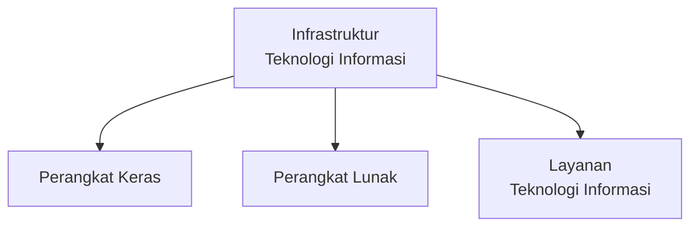

> Infrastruktur teknologi informasi **berevolusi menjadi rangkaian layanan** dalam suatu perusahaan. Dari sudut pandang layanan inilah, **investasi teknologi informasi akan lebih mudah kelihatan nilai tambahnya bagi bisnis** — bukan sekadar dipandang sebagai biaya pengadaan perangkat.

---

## 2. Perkembangan Infrastruktur Teknologi Informasi

Infrastruktur teknologi informasi berkembang melalui lima tahapan besar (Laudon & Laudon, 2018; Rainer, Prince, & Watson, 2013; Turban et al., 2018):

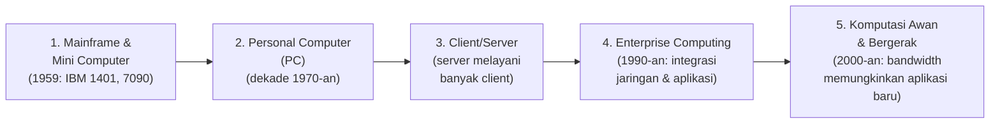

| Tahap | Penjelasan |
|---|---|
| **1. Mainframe dan Mini Computer** | Ditandai peluncuran **IBM 1401** dan **7090** pada tahun **1959**. |
| **2. Komputer Personal (PC)** | Mulai dijual dan digunakan secara terbatas di **dekade 1970-an**. |
| **3. Client/Server** | Satu komputer atau lebih dengan kekuatan dan kapasitas komputasi besar menjadi **server**; server memberikan berbagai layanan komputasi bagi PC yang disebut **client**. |
| **4. Enterprise Computing** | Pada tahun **1990-an**, berbagai perusahaan mengintegrasikan sumber daya komputasi mereka dengan **jaringan komputer**, selanjutnya dilakukan upaya integrasi aplikasi perangkat lunaknya. |
| **5. Komputasi Awan dan Bergerak** | Tahun **2000-an**, kapasitas jalur telekomunikasi data (*bandwidth*) memungkinkan berbagai aplikasi baru muncul. **Komputasi awan** memungkinkan layanan data dan aplikasi (pengolahan data) di server diakses melalui internet tanpa harus menggunakan aplikasi tertentu. |

> Evolusi ini menunjukkan **pergeseran arsitektur** yang konsisten: dari komputasi yang **terpusat** (mainframe), menjadi **personal** (PC), kembali **terpusat namun terdistribusi** (client/server, enterprise), hingga akhirnya menjadi **terpusat di awan namun diakses di mana saja** (cloud & mobile) — sebuah siklus yang relevan dengan konsep "dunia menjadi datar" pada Inisiasi 1.

---

## 3. Komponen Infrastruktur Teknologi Informasi

Infrastruktur teknologi informasi modern terdiri atas **tujuh komponen utama** (Laudon & Laudon, 2018):

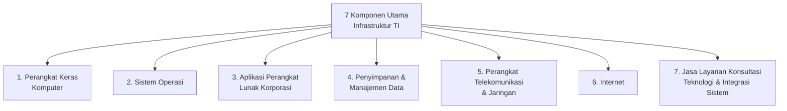

---

## 4. Jaringan Komputer

### Definisi dan Komponen

**Jaringan komputer** adalah dua atau lebih komputer yang saling terhubung sehingga dapat **bertukar data dan berbagi sumber daya komputasi**. Dalam berbagai perusahaan besar, layanan jaringan komputer digunakan untuk mengelola **semua jenis komunikasi** (data, suara, dan video).

Setiap jaringan terdiri atas beberapa elemen:

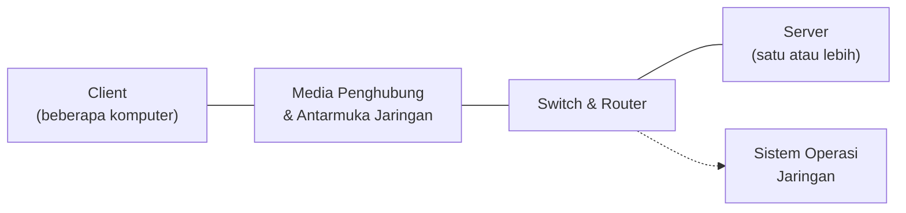

### Klasifikasi Berdasarkan Jangkauan

Jaringan komputer dapat diklasifikasikan berdasarkan jangkauannya (Hassan, 2011; Laudon & Laudon, 2018; Rainer et al., 2013; Turban et al., 2018):

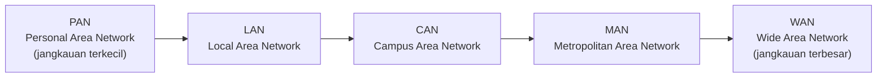

| Jenis | Kepanjangan | Jangkauan |
|---|---|---|
| **PAN** | *Personal Area Network* | Sangat dekat (sekitar individu, misalnya antar perangkat pribadi) |
| **LAN** | *Local Area Network* | Satu gedung/ruangan |
| **CAN** | *Campus Area Network* | Satu kampus/kompleks |
| **MAN** | *Metropolitan Area Network* | Satu kota |
| **WAN** | *Wide Area Network* | Antar kota/negara, jangkauan paling luas |

### Media Transmisi

Jaringan komputer membutuhkan media untuk mengirimkan dan menerima data, secara umum dibedakan menjadi dua:

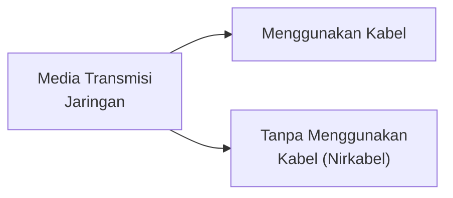

---

## 5. Internet

**Internet** adalah jaringan komputer terbesar yang menggunakan metode transmisi data ***Package Switching***. Protokol komunikasi yang digunakan dalam Internet adalah **TCP/IP** (*Transmission Control Protocol/Internet Protocol*), yang memungkinkan berbagai perangkat yang berbeda saling bertukar data.

### Alamat IP

Dalam protokol TCP/IP, setiap komputer yang terhubung ke Internet mendapatkan alamat yang disebut **alamat IP**. Ada dua versi alamat IP yang digunakan:

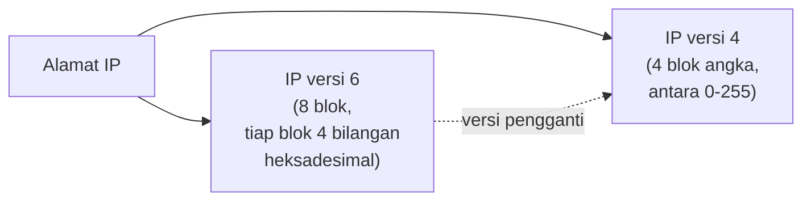

| Versi | Format |
|---|---|
| **IPv4** | Menggunakan format **4 blok angka** (antara 0–255). |
| **IPv6** | Versi pengganti IPv4, menggunakan **8 blok**, dan tiap blok menggunakan **4 bilangan heksadesimal**. |

### Domain Name System (DNS)

Untuk memudahkan mengingat alamat IP yang berupa bilangan, dibuat layanan **Domain Name System (DNS)**. DNS akan **menerjemahkan nama domain** sebuah situs di Internet ke alamat IP, atau sebaliknya.

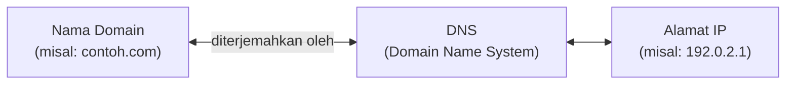

- **Nama domain level teratas**, misalnya: `.com`, `.edu`, `.org`, `.net`.
- **Nama domain level atas berdasar negara**, misalnya: `.id` untuk Indonesia, `.my` untuk Malaysia, dan `.uk` untuk Inggris.

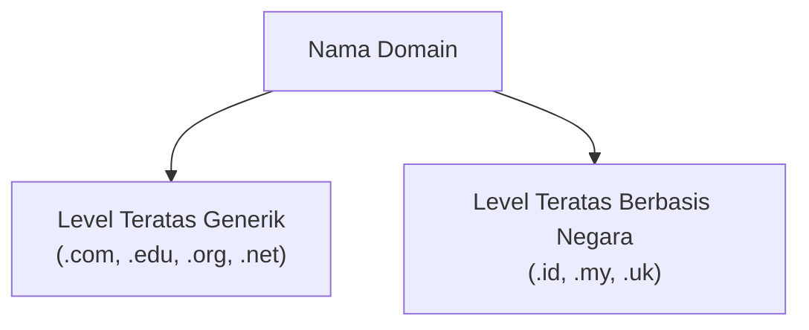

---

## 6. Tantangan Pengelolaan Infrastruktur Teknologi Informasi

Tiga tantangan utama dalam mengelola infrastruktur teknologi informasi (Laudon & Laudon, 2018; Turban et al., 2018):

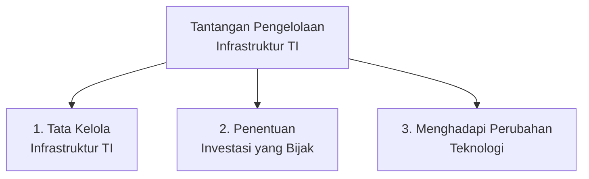

### 1. Tata Kelola Infrastruktur Teknologi Informasi

Siapa yang harus **bertanggung jawab** atas pengadaan, pengembangan, penggunaan, dan pemeliharaan infrastruktur teknologi informasi.

### 2. Penentuan Investasi yang Bijak

Investasi infrastruktur teknologi informasi membutuhkan **biaya yang besar**. Besarnya biaya ini antara lain ditentukan oleh apakah perusahaan akan **menyelenggarakan sendiri** fungsi infrastruktur teknologi informasi, atau menggunakan **jasa alih daya** (*outsourcing*).

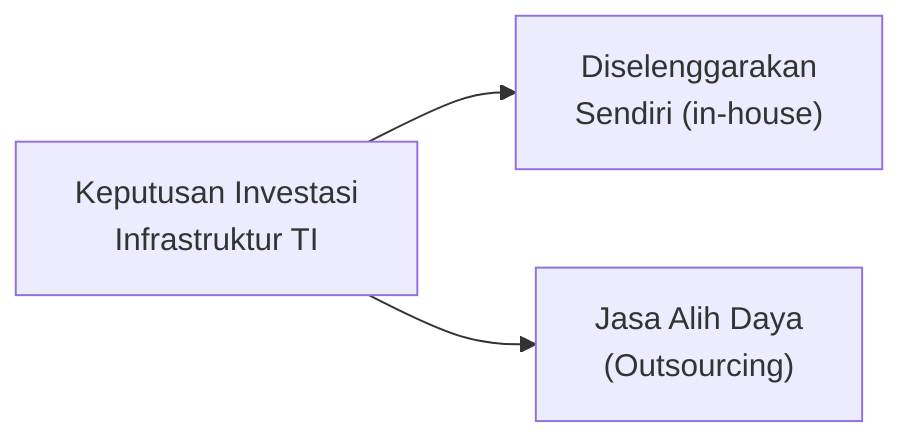

### 3. Menghadapi Perubahan Teknologi

Kita tidak pernah tahu kapan suatu standar akan digantikan oleh standar lain.

> **Contoh nyata:** mulai 2012, dominasi **Blackberry** mulai kalah oleh kehadiran perangkat **Android** dan **iOS**. Lalu bagaimana nasib investasi perangkat ekosistem Blackberry yang telah dibeli dan dipelajari?

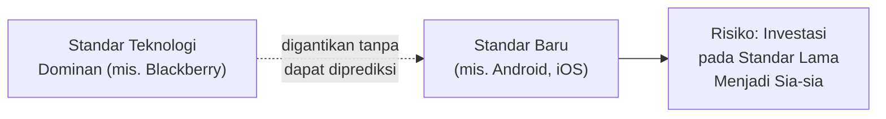

> Tantangan ketiga ini berkaitan langsung dengan **Tantangan Pertama Sistem Informasi Strategis** pada Inisiasi 2 (*"menjaga keunggulan kompetitif"*) — sama seperti strategi bisnis yang dapat ditiru pesaing, standar teknologi infrastruktur juga dapat tiba-tiba tergantikan, sehingga keputusan investasi infrastruktur TI selalu mengandung **risiko ketidakpastian jangka panjang**.

---

## Ringkasan Keterkaitan Antar Konsep

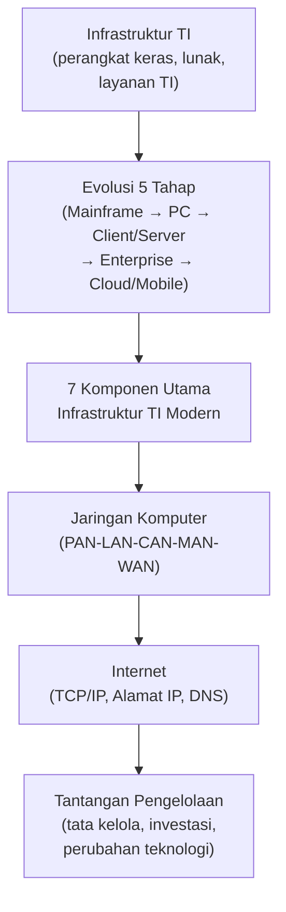

Inti dari materi ini: infrastruktur teknologi informasi adalah **fondasi yang terus berevolusi** — dari mainframe terpusat hingga komputasi awan yang dapat diakses dari mana saja — dan terdiri dari komponen perangkat keras, perangkat lunak, jaringan, hingga Internet yang saling terintegrasi. Mengelola infrastruktur ini bukan sekadar soal teknis, tetapi juga soal **tata kelola dan keputusan investasi strategis**, mengingat standar teknologi dapat berubah dengan cepat dan tidak terduga, sehingga organisasi harus selalu siap beradaptasi agar investasi infrastrukturnya tidak menjadi sia-sia.
