# Keamanan Sistem Informasi

**STSI4207 Sistem Informasi Manajemen**
Program Studi Sistem Informasi — Fakultas Sains dan Teknologi — Universitas Terbuka

Materi ini membahas **keamanan sistem informasi** — kelemahan yang dapat dieksploitasi, ancaman dari Internet, perangkat lunak jahat (*malware*), kejahatan komputer, hingga alat dan teknik untuk melindungi sistem informasi dari berbagai ancaman tersebut.

> Kaitan dengan Inisiasi 4 (STSI4207): jika Inisiasi 4 membahas **infrastruktur teknologi informasi** sebagai fondasi (perangkat keras, jaringan, Internet), Inisiasi 5 ini membahas **bagaimana fondasi tersebut dapat diserang** dan bagaimana melindunginya — keamanan adalah dimensi yang harus selalu menyertai setiap infrastruktur teknologi informasi yang dibangun.

---

## 1. Masalah Keamanan Sistem Informasi

### 1.1 Kelemahan Sistem Informasi

Setiap sistem informasi memiliki masalah keamanan berupa **kelemahan** yang dapat disalahgunakan oleh berbagai pihak yang tidak bertanggung jawab.

Kelemahan pertama adalah melalui **jalur telekomunikasi** yang menghubungkan berbagai komputer dalam satu jaringan. Akses sistem utama sebuah organisasi besar seringkali dilakukan dari **jarak jauh**. Dengan demikian, sulit untuk memastikan bahwa pengguna yang mengakses memang berhak dan bukan orang lain.

### Potensi Ancaman terhadap Sistem Informasi

Berikut rekonstruksi diagram potensi ancaman yang menyertai setiap lapisan, dari pengguna hingga basis data internal organisasi:

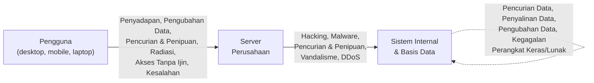

| Lapisan | Potensi Ancaman |
|---|---|
| **Pengguna → Server Perusahaan** | Penyadapan, pengubahan data, pencurian dan penipuan, radiasi, akses tanpa izin, kesalahan |
| **Server Perusahaan → Sistem Internal/Basis Data** | *Hacking*, *malware*, pencurian dan penipuan, vandalisme, DDoS |
| **Pada Sistem Internal & Basis Data** | Pencurian data, penyalinan data, pengubahan data, kegagalan perangkat keras, kegagalan perangkat lunak |

> Diagram ini menunjukkan bahwa ancaman keamanan **terjadi di setiap lapisan**, bukan hanya pada satu titik — mulai dari sisi pengguna yang mengakses dari jarak jauh, jalur komunikasi ke server, hingga sistem dan basis data internal organisasi itu sendiri.

### 1.2 Ancaman dari Internet

Sifat **keterbukaan dari Internet** menjadikannya sebagai sistem yang memiliki **lebih banyak kelemahan dan ancaman keamanan** dibandingkan jaringan komputer lokal. Beberapa contoh masalah keamanan di Internet:

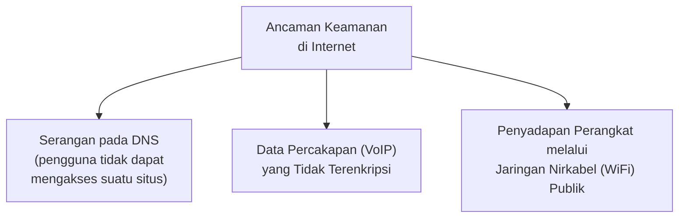

#### Ilustrasi: Pencurian Data Menggunakan Jaringan WiFi

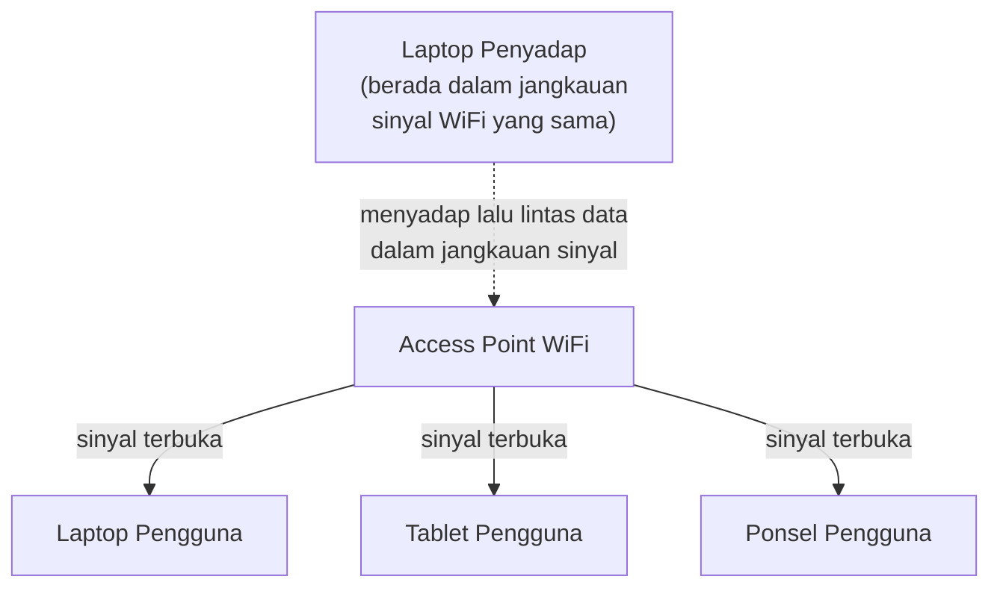

> Karena sinyal WiFi publik dipancarkan secara terbuka ke segala arah, **siapa pun dalam jangkauan sinyal** (termasuk pihak yang tidak berwenang) berpotensi menyadap lalu lintas data yang melewati jaringan tersebut — inilah mengapa transaksi sensitif sebaiknya tidak dilakukan melalui WiFi publik tanpa enkripsi tambahan (misalnya VPN).

### 1.3 Perangkat Lunak Jahat (*Malware*)

*Malware* seringkali disebut **virus komputer**. Namun, virus komputer hanyalah **salah satu jenis** dari beberapa jenis *malware*. Satu jenis *malware* yang belakangan muncul dan banyak menyerang adalah ***ransomware***.

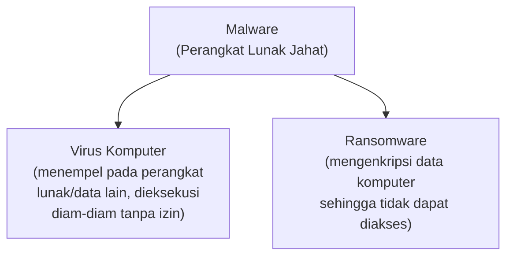

| Jenis | Definisi |
|---|---|
| **Virus Komputer** | Perangkat lunak jahat yang **menempelkan diri** pada perangkat lunak atau data lain, dan akan **dieksekusi secara diam-diam** tanpa sepengetahuan atau izin pengguna. |
| **Ransomware** | *Malware* yang akan **mengenkripsi data komputer** sehingga pengguna tidak dapat mengakses data tersebut (biasanya pelaku meminta tebusan untuk memulihkannya). |

### 1.4 Kejahatan Komputer

Pelaku kejahatan komputer biasanya disebut sebagai ***hacker***. Awalnya, istilah *hacker* mengacu kepada orang yang memiliki **keahlian dan kegemaran khusus** terkait komputer. Istilah ini mengalami **degradasi makna** menjadi pelaku kejahatan komputer.

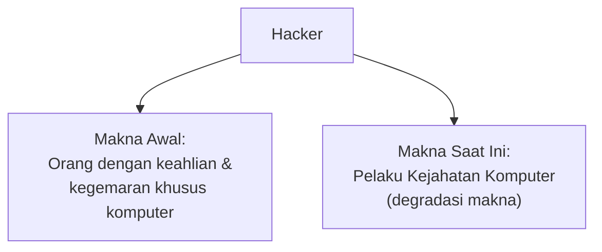

Beberapa kejahatan komputer:

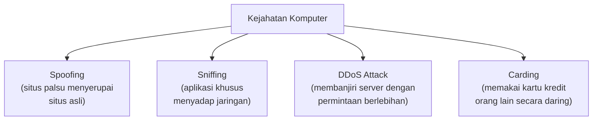

| Kejahatan | Penjelasan |
|---|---|
| **Spoofing** | Membuat situs palsu yang menyerupai situs asli untuk mengumpulkan data pribadi dari pengguna situs asli. |
| **Sniffing** | Membuat aplikasi khusus untuk menyadap informasi melalui suatu jaringan. |
| **DDoS Attack** | Membanjiri server yang dituju dengan permintaan atas data yang berlebihan sehingga server kewalahan dan berhenti bekerja. |
| **Carding** | Menggunakan kartu kredit milik orang lain untuk membeli barang atau jasa secara daring. |

#### Ilustrasi: Spoofing

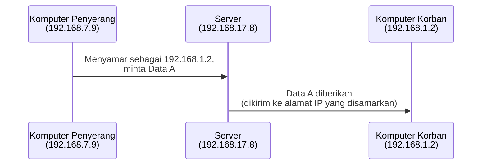

> Pada ilustrasi ini, komputer penyerang dengan alamat IP **192.168.7.9** mengirim permintaan ke server seolah-olah ia adalah komputer dengan alamat **192.168.1.2**. Server yang tidak dapat membedakan keaslian identitas pengirim kemudian merespons sesuai alamat yang "disamarkan" tersebut — inilah inti dari teknik **spoofing**: memanipulasi identitas (alamat IP) untuk menipu sistem agar memperlakukan pengirim palsu seolah pengirim yang sah.

---

## 2. Alat dan Teknik Keamanan Sistem Informasi

### 2.1 Regulasi Pemerintah

Untuk melindungi keamanan sistem informasi dan data, pemerintah telah mengeluarkan **Undang-Undang Nomor 11 Tahun 2008** tentang **Informasi dan Transaksi Elektronik (UU ITE)**.

Regulasi lain yang juga digunakan untuk menjaga kerahasiaan data dan keamanan sistem informasi:

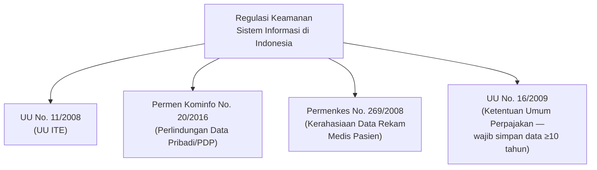

| Regulasi | Mengatur |
|---|---|
| **UU No. 11 Tahun 2008 (UU ITE)** | Informasi dan Transaksi Elektronik secara umum. |
| **Permen Kominfo No. 20 Tahun 2016** | Perlindungan Data Pribadi (PDP). |
| **Permenkes No. 269 Tahun 2008** | Kerahasiaan data rekam medis pasien di institusi kesehatan. |
| **UU No. 16 Tahun 2009** | Ketentuan Umum Perpajakan — kewajiban wajib pajak menyimpan data perpajakan minimal **10 tahun**. |

### 2.2 Pengendalian (*Controls*)

Selain regulasi dari pemerintah, perlu adanya **teknik** dalam menjaga keamanan sistem informasi dan integritas data. Salah satu *tools* yang dapat digunakan adalah **pengendalian**.

> **Pengendalian** didefinisikan sebagai metode, kebijakan, dan prosedur organisasi yang memastikan **keamanan aset organisasi**, **akurasi dan keandalan catatan akuntansinya**, dan **kepatuhan operasional** terhadap standar manajemen (Gelinas et al., 2018; Turner et al., 2017).

Terdapat dua macam pengendalian:

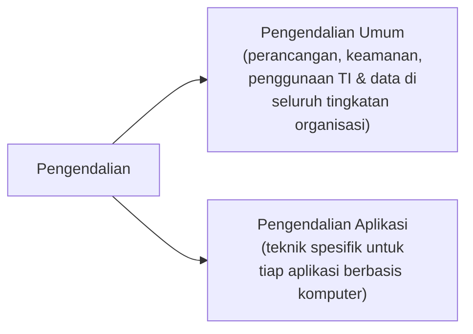

### 2.3 Teknik Tambahan Keamanan Sistem Informasi

Tiga teknik lain yang digunakan untuk menjaga keamanan sistem informasi:

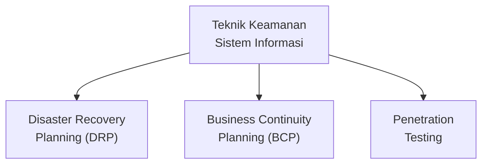

| Teknik | Penjelasan |
|---|---|
| **Disaster Recovery Planning (DRP)** | Panduan langkah-langkah yang harus dilakukan untuk **memulihkan layanan sistem informasi** jika terganggu oleh bencana atau risiko lain. |
| **Business Continuity Planning (BCP)** | Mengidentifikasi proses bisnis yang **kritis dan penting**, untuk kemudian disiapkan rencana **meneruskan aktivitas** jika terjadi bencana. |
| **Penetration Testing** | Teknik masuk ke suatu sistem informasi dengan cara **menemukan dan mengeksploitasi kelemahan** sistem informasi — dilakukan secara terkendali untuk menemukan celah sebelum dieksploitasi pihak yang tidak berwenang. |

> Ketiga teknik ini saling melengkapi: **DRP** berfokus pada pemulihan **sistem teknis** setelah bencana, **BCP** berfokus pada kelangsungan **proses bisnis** secara keseluruhan, sementara **Penetration Testing** bersifat **proaktif** — menemukan kelemahan sebelum insiden terjadi, alih-alih hanya bereaksi setelahnya.

---

## Ringkasan Keterkaitan Antar Konsep

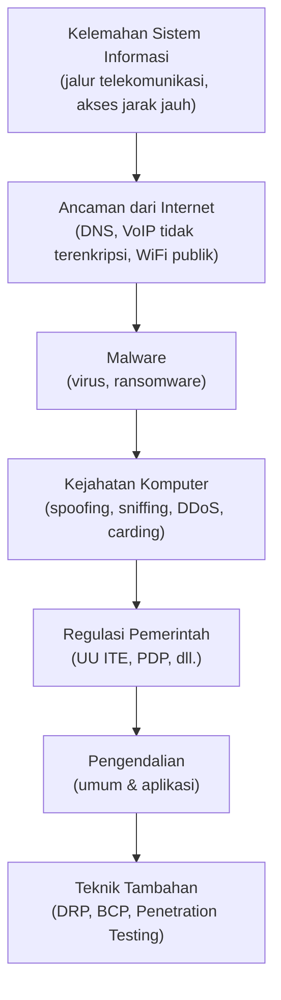

Inti dari materi ini: keamanan sistem informasi harus dipandang sebagai **rangkaian pertahanan berlapis** — mulai dari memahami **kelemahan** yang melekat pada sistem (jalur komunikasi, keterbukaan Internet), mengenali **bentuk-bentuk ancaman konkret** (*malware*, *hacking*, *spoofing*, dan sejenisnya), hingga menerapkan **regulasi, pengendalian, dan teknik mitigasi** (DRP, BCP, *Penetration Testing*) secara bersamaan. Tidak ada satu teknik tunggal yang cukup — organisasi perlu mengombinasikan kepatuhan regulasi, kontrol internal, dan kesiapan menghadapi insiden untuk benar-benar melindungi sistem informasinya.
