# Manajemen Data dan Pengetahuan

**STSI4207 Sistem Informasi Manajemen**
Program Studi Sistem Informasi — Fakultas Sains dan Teknologi — Universitas Terbuka

Materi ini membahas bagaimana **data dikelola secara terstruktur** mulai dari unit terkecil hingga basis data, peran **DBMS** dalam mengatasi permasalahan pengelolaan data, serta bagaimana data dan informasi pada akhirnya berkembang menjadi **pengetahuan** yang dikelola secara sistematis dalam organisasi.

> Kaitan dengan Inisiasi 4 & 5 (STSI4207): jika Inisiasi 4 membahas infrastruktur teknologi informasi (perangkat keras, jaringan) dan Inisiasi 5 membahas bagaimana infrastruktur tersebut diamankan, Inisiasi 6 ini membahas **isi** yang mengalir di dalam infrastruktur tersebut — yaitu data, informasi, dan pengetahuan itu sendiri.

---

## 1. Pengelolaan Data dan Basis Data

### 1.1 Hierarki Data

Pengelolaan data diperlukan untuk menghasilkan **informasi yang berkualitas baik**. Komputer mengorganisasi data dalam hierarki berikut, dari unit terkecil hingga terbesar:

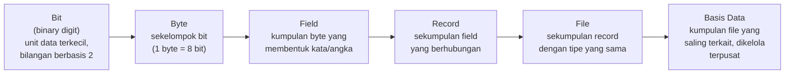

| Tingkat | Penjelasan |
|---|---|
| **Bit** (*binary digit*) | Unit data terkecil dalam bentuk bilangan biner atau bilangan berbasis 2. |
| **Byte** | Sekelompok bit; dapat berupa huruf, angka, tanda baca, dan simbol lainnya. Satu byte setara dengan **8 bit**. |
| **Field** | Kumpulan byte yang membentuk kata atau rangkaian angka. |
| **Record** | Sekumpulan field yang berhubungan. |
| **File** | Sekumpulan record dengan tipe yang sama. |
| **Basis Data** | Kumpulan file yang saling terkait dan disimpan serta dikelola secara terpusat menggunakan alat bantu komputer (Coronel & Morris, 2018; Gillenson et al., 2008; Hoffer, Prescott, & McFadden, 2007). |

> Contoh konkret: satu **bit** adalah `0` atau `1`; delapan bit membentuk satu **byte** (misalnya huruf `A`); kumpulan byte seperti `"Budi"` membentuk satu **field** (nama); field nama, NIM, dan alamat bersama-sama membentuk satu **record** (data satu mahasiswa); kumpulan record seluruh mahasiswa membentuk satu **file**; dan kumpulan file (mahasiswa, dosen, mata kuliah) yang saling terkait membentuk satu **basis data**.

### 1.2 Permasalahan dalam Pengelolaan Data

Tanpa pengelolaan yang tepat, data pada banyak aplikasi terpisah akan menimbulkan masalah berikut:

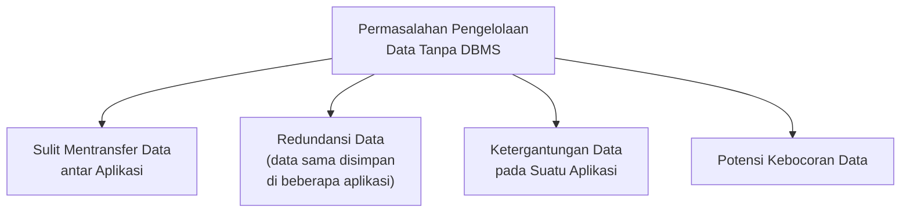

### 1.3 Database Management System (DBMS)

Untuk mengatasi permasalahan pengelolaan data di atas, dikembangkan suatu pendekatan yang dinamakan **sistem manajemen basis data** atau ***Database Management System* (DBMS)**.

**Keunggulan DBMS:**

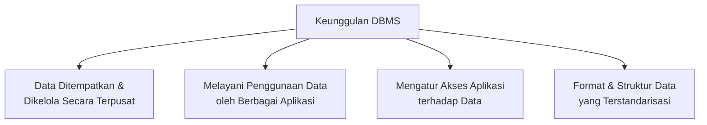

#### Ilustrasi DBMS

Berikut rekonstruksi diagram bagaimana DBMS menjadi titik pusat yang menghubungkan berbagai aplikasi dengan satu basis data bersama:

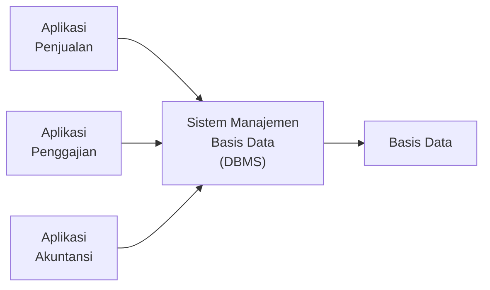

> Sebelum ada DBMS, setiap aplikasi (penjualan, penggajian, akuntansi) cenderung **menyimpan datanya sendiri-sendiri**, menyebabkan redundansi dan ketergantungan data pada aplikasi tertentu. Dengan DBMS, ketiga aplikasi tersebut **mengakses satu basis data terpusat** yang sama, sehingga data konsisten dan dapat dipakai bersama tanpa duplikasi.

### 1.4 Fasilitas Kunci dalam Aplikasi DBMS

Beberapa fasilitas kunci yang umumnya ditawarkan oleh aplikasi DBMS (Gillenson et al., 2008; Stephen, 2006):

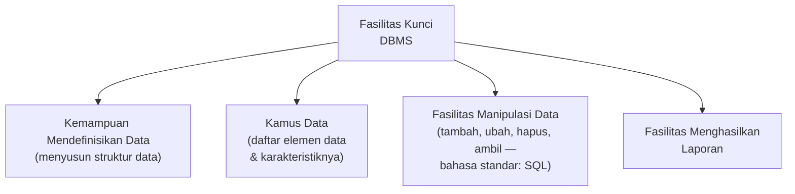

| Fasilitas | Penjelasan |
|---|---|
| **Mendefinisikan Data** | Kemampuan menyusun struktur data. |
| **Kamus Data** | Berisi daftar elemen data yang ada dalam suatu basis data beserta karakteristiknya. |
| **Manipulasi Data** | Menambah data baru, mengubah data, menghapus data, dan mengambil data. Bahasa standar untuk memanipulasi data dalam basis data adalah ***Structured Query Language* (SQL)**. |
| **Menghasilkan Laporan** | Laporan yang dihasilkan dari proses manipulasi data. |

---

## 2. Pengelolaan Pengetahuan

### 2.1 Dari Data ke Pengetahuan

**Data** diubah menjadi **informasi**, dan kemudian informasi tersebut digunakan untuk **membuat keputusan**. Bagaimana memanfaatkan informasi dalam pembuatan keputusan merupakan **pengetahuan**.

> **Pengetahuan** adalah konsep, pengalaman, dan wawasan yang menjadi kerangka berpikir untuk membuat, mengevaluasi, dan menggunakan informasi (Senge, 2006; Turban, Pollard, & Wood, 2018).

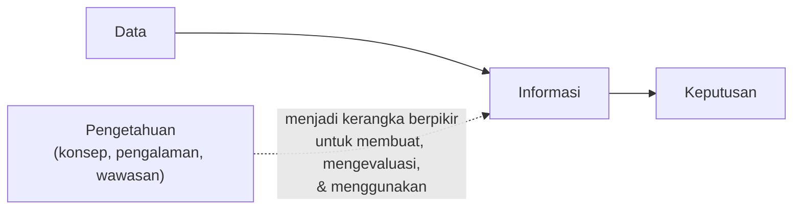

> Rangkaian **data → informasi → pengetahuan** ini melengkapi definisi sistem informasi pada Inisiasi 1: data diolah menjadi informasi (model *input-proses-output*), dan **pengetahuan** adalah lapisan lebih tinggi yang menentukan **bagaimana** informasi tersebut sebaiknya digunakan dalam pengambilan keputusan.

### 2.2 Dimensi Pengetahuan

Pengetahuan memiliki empat dimensi (Laudon & Laudon, 2018; Schon, 1971; Senge, 2006):

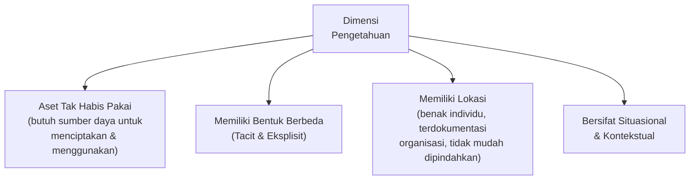

| Dimensi | Penjelasan |
|---|---|
| **Aset Tak Habis Pakai** | Pengetahuan adalah aset perusahaan yang tidak akan habis ketika didayagunakan, namun juga membutuhkan sumber daya untuk menciptakan dan menggunakannya. |
| **Bentuk yang Berbeda** | Pengetahuan memiliki beberapa bentuk yang berbeda, yaitu ***tacit*** dan **eksplisit**. |
| **Memiliki Lokasi** | Pengetahuan berada dalam benak individu, terdokumentasi pada suatu organisasi, dan **tidak mudah dipindahkan**. |
| **Situasional & Kontekstual** | Pengetahuan bersifat situasional dan kontekstual dalam penerapannya. |

> Dimensi **"memiliki lokasi"** dan **"bentuk tacit/eksplisit"** ini sangat berkaitan dengan tantangan **Kehilangan Pengetahuan Tacit** yang dibahas pada materi *Manajemen Proses untuk Pekerjaan Pengetahuan* (STSI4206, Sesi 6) — pengetahuan yang hanya berada di benak individu (tacit) berisiko hilang ketika individu tersebut meninggalkan organisasi.

### 2.3 Manajemen Pengetahuan

> **Manajemen pengetahuan** adalah serangkaian proses bisnis yang dikembangkan dalam suatu organisasi untuk **menciptakan, menyimpan, menyemaikan, dan menerapkan** pengetahuan (Sparrow, 2001).

Manajemen pengetahuan memungkinkan proses **pembelajaran organisasi** dilakukan dengan lebih **mudah, sistematis, dan terstruktur**.

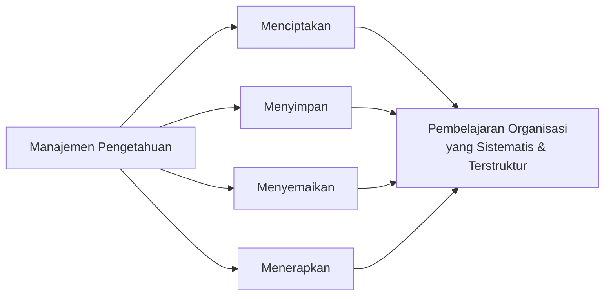

### 2.4 Tools Manajemen Pengetahuan

Dua *tools* utama yang digunakan untuk manajemen pengetahuan:

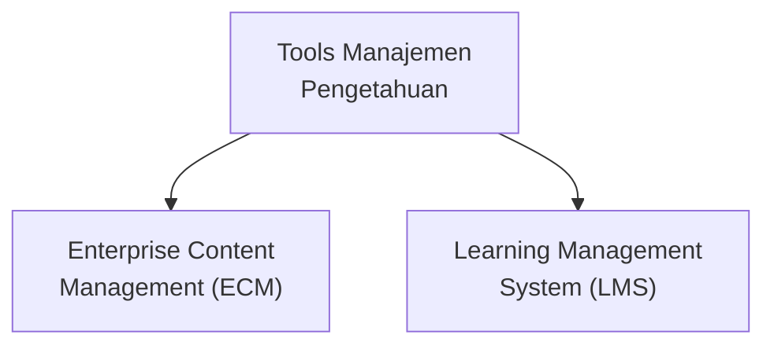

| Tools | Penjelasan |
|---|---|
| **Enterprise Content Management (ECM)** | Untuk menangani pengetahuan yang bersifat **terstruktur dan semi-terstruktur**, yaitu pengetahuan eksplisit yang bersifat **formal dan terdokumentasi**. |
| **Learning Management System (LMS)** | Untuk **mengelola, menyampaikan, menjejak, dan menilai** berbagai pelatihan dan pembelajaran. |

### 2.5 Peran Pekerja Pengetahuan

Pengelolaan pengetahuan biasanya dikelola oleh **pekerja pengetahuan**, yang umumnya memiliki **sertifikasi profesi** dan menempuh **jenjang pendidikan tinggi**. Peran mereka dalam organisasi:

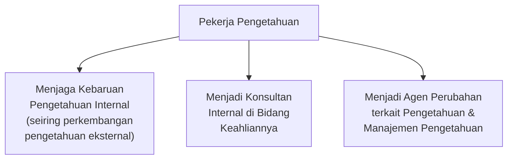

> Peran ini selaras dengan **karakteristik pekerja pengetahuan** (*pemikiran analitis, inovasi berkelanjutan, kolaborasi efektif, pembelajaran kontinu*) yang sudah dibahas pada materi *Manajemen Proses untuk Pekerjaan Pengetahuan* (STSI4206, Sesi 6) — peran konkretnya di sini adalah menjaga relevansi pengetahuan organisasi dan menjadi penggerak perubahan.

---

## Ringkasan Keterkaitan Antar Konsep

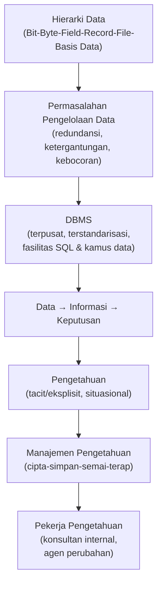

Inti dari materi ini: pengelolaan **data** yang baik — mulai dari hierarki bit hingga basis data, dikelola secara terpusat melalui **DBMS** — adalah fondasi yang memungkinkan data berubah menjadi **informasi** yang berkualitas. Namun, informasi saja tidak cukup; organisasi juga membutuhkan **pengetahuan** (cara memanfaatkan informasi untuk mengambil keputusan) yang dikelola secara sistematis melalui **manajemen pengetahuan**, didukung oleh *tools* seperti ECM dan LMS, serta dijalankan oleh **pekerja pengetahuan** yang berperan menjaga relevansi dan mendorong perubahan dalam organisasi.
