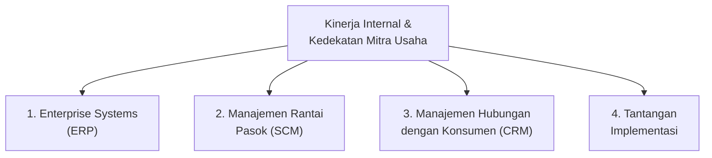
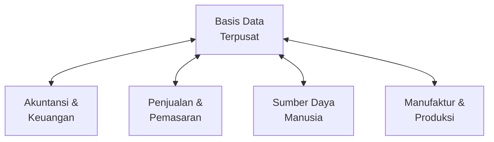
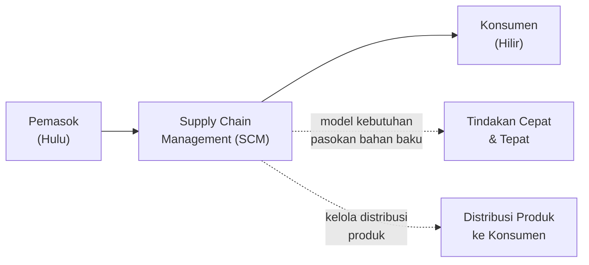
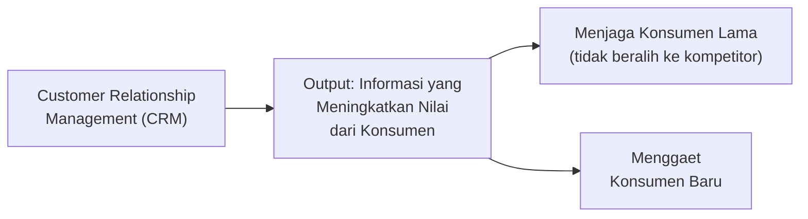
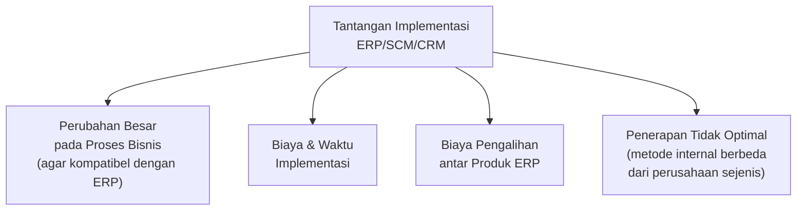
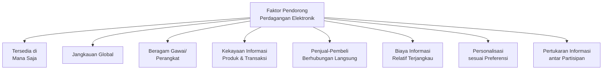
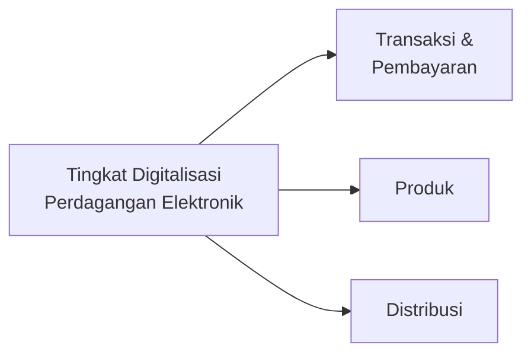
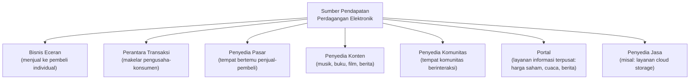
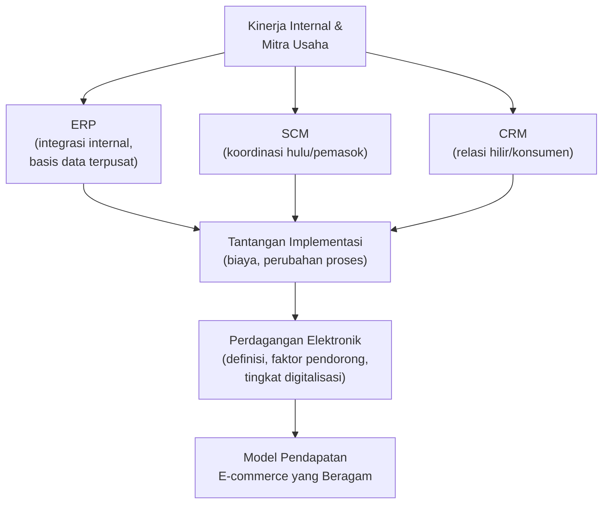

# Implementasi Sistem Informasi dalam Bisnis

**STSI4207 Sistem Informasi Manajemen**
Program Studi Sistem Informasi — Fakultas Sains dan Teknologi — Universitas Terbuka

Materi ini membahas bagaimana sistem informasi diimplementasikan secara konkret dalam bisnis untuk **meningkatkan kinerja internal** dan **mengakrabkan mitra usaha** (melalui ERP, SCM, dan CRM), serta bagaimana **perdagangan elektronik** (*e-commerce*) berkembang sebagai bentuk bisnis berbasis Internet.

> Kaitan dengan Inisiasi 1–6 (STSI4207): materi ini adalah **muara praktis** dari seluruh konsep sebelumnya — sistem informasi (Inisiasi 1), dampaknya pada organisasi & strategi (Inisiasi 2), dimensi etika (Inisiasi 3), infrastruktur TI (Inisiasi 4), keamanannya (Inisiasi 5), serta data dan pengetahuan (Inisiasi 6) — semuanya terwujud dalam implementasi nyata berupa sistem ERP, SCM, CRM, dan platform perdagangan elektronik.

---

## 1. Meningkatkan Kinerja Internal dan Mengakrabkan Mitra Usaha

- **Peningkatan kinerja internal** suatu perusahaan merupakan suatu upaya untuk meningkatkan **produktivitas**.
- Upaya peningkatan kinerja internal **tidak akan berjalan lancar** apabila kedekatan dengan **mitra usaha** tidak terjalin.
- Para pemasok yang menyediakan barang dan jasa bagi kepentingan produksi dan operasi harus diakrabkan, sehingga perusahaan akan **lebih unggul dari para pesaing** dalam mengamankan pasokan.

Untuk mencapai tujuan tersebut, perusahaan harus memperhatikan **empat aspek**:

### 1.1 Enterprise Systems (ERP)

Perusahaan skala besar biasanya memiliki masalah dalam **komunikasi dan koordinasi**. Masalah ini dapat diatasi menggunakan ***Enterprise Resource Planning* (ERP)**.

- ERP **mengintegrasikan berbagai macam *software*** dengan fungsi yang berbeda-beda dengan **satu basis data terpusat**.
- Penggunaan ERP dapat **memudahkan komunikasi dan koordinasi** antar departemen dalam satu perusahaan.
- Penggunaan ERP juga dapat **diperluas ke pihak eksternal**, seperti pemasok bahan baku.

> **Contoh ERP:** Microsoft Dynamics AX, SAP, dan Oracle Business Suites.

#### Arsitektur Umum ERP

> Setiap modul (Akuntansi & Keuangan, Penjualan & Pemasaran, Sumber Daya Manusia, Manufaktur & Produksi) **saling terhubung secara dua arah** dengan satu **Basis Data Terpusat** — inilah yang membedakan ERP dari sekadar kumpulan aplikasi terpisah seperti yang dibahas pada Inisiasi 6 (masalah redundansi data tanpa DBMS terpusat). Perubahan data di satu modul (misalnya pesanan baru di Penjualan) langsung tercermin secara konsisten di modul lain (misalnya kebutuhan bahan baku di Manufaktur).

### 1.2 Manajemen Rantai Pasok (SCM)

- Semua perusahaan dan organisasi dalam satu **rantai pasokan** dari hulu ke hilir merupakan **entitas yang berdiri sendiri** secara hukum dan ekonomis.
- **Regulasi persaingan usaha** tidak memungkinkan satu perusahaan menguasai hulu sampai ke hilir, sehingga **koordinasi antar perusahaan** menjadi tantangan dan hambatan tersendiri.
- Tantangan ini dapat diatasi menggunakan ***Supply Chain Management* (SCM)**.

- **SCM** dapat membuat **model kebutuhan pasokan bahan baku** (*input*) sehingga dapat diambil tindakan yang cepat dan tepat.
- **SCM** dapat mengelola **distribusi produk** ke konsumen.

### 1.3 Manajemen Hubungan dengan Konsumen (CRM)

Perusahaan perlu mengelola **relasi dengan konsumennya**, yang dapat diatasi dengan ***Customer Relationship Management* (CRM)**.

- **CRM** adalah sistem informasi yang digunakan untuk **mengelola relasi dengan konsumen**.
- Output CRM berupa **informasi** yang dapat meningkatkan nilai yang didapat dari konsumen.
- CRM yang dikelola dengan baik diharapkan dapat **menjaga konsumen lama** agar tidak beralih ke kompetitor, dan **menggaet konsumen baru**.

> Ketiga sistem ERP, SCM, dan CRM ini saling melengkapi: **ERP** menyatukan data **internal** perusahaan, **SCM** mengelola hubungan dengan **pemasok di hulu**, dan **CRM** mengelola hubungan dengan **konsumen di hilir** — bersama-sama mencakup seluruh rantai nilai dari pemasok hingga pelanggan akhir.

### 1.4 Tantangan Implementasi

| Tantangan | Penjelasan |
|---|---|
| **Perubahan Proses Bisnis** | Perusahaan harus melakukan perubahan besar pada proses bisnis mereka supaya kompatibel dengan proses bisnis yang sudah terdefinisi dalam ERP. |
| **Biaya & Waktu** | Implementasi ERP membutuhkan biaya dan waktu yang besar. |
| **Biaya Pengalihan** | Biaya pengalihan dari satu produk ERP ke produk ERP lainnya. |
| **Penerapan Tidak Optimal** | Disebabkan metode internal perusahaan yang berbeda dari perusahaan sejenis pada umumnya. |

---

## 2. Perdagangan dan Bisnis Secara Elektronik

### Definisi

**Perdagangan secara elektronik** didefinisikan sebagai **penggunaan Internet sebagai media untuk bertransaksi perdagangan** (CastleAsia, 2002; Lin, Pervan, Tsao, & Lin, 2008; Maddox, 1998; Turban, Lee, King, & Chung, 2000; Turban, Pollard, & Wood, 2018).

> **Data di Indonesia:** pelaku perdagangan elektronik pada tahun **2017** mencapai **4,5 juta**, dengan proporsi **99% pengusaha mikro** dengan pendapatan di bawah **Rp 300 juta per tahun**.

### Faktor Pendorong Perkembangan Pesat

| Faktor | Penjelasan |
|---|---|
| **Tersedia di Mana Saja** | Membuka peluang bagi berbagai pengusaha dari berbagai jenis dan ukuran usaha untuk berpartisipasi. |
| **Jangkauan Global** | Pembeli dari Irlandia dapat memesan barang atau jasa dari Indonesia. |
| **Beragam Gawai** | Partisipan dapat menggunakan berbagai macam gawai dan perangkat berbeda, selama dapat terhubung ke Internet. |
| **Kekayaan Informasi** | Mengenai produk, transaksi, pembayaran, dan lainnya. |
| **Hubungan Langsung** | Penjual dapat berhubungan langsung dengan pembeli untuk mendiskusikan berbagai aspek sebelum, selama, dan sesudah transaksi. |
| **Biaya Terjangkau** | Biaya untuk mendapatkan informasi yang dibutuhkan relatif terjangkau. |
| **Personalisasi** | Informasi dan transaksi yang tersedia dapat disesuaikan dengan preferensi pribadi. |
| **Pertukaran Informasi** | Para partisipan dapat bertukar informasi antar mereka. |

### Tingkat Digitalisasi Perdagangan Elektronik

Derajat produk perdagangan elektronik ditentukan oleh **tingkat digitalisasinya**:

> Semakin tinggi tingkat digitalisasi ketiga aspek ini (misalnya produk digital seperti e-book yang dibeli, dibayar, dan didistribusikan **sepenuhnya secara digital**), semakin "murni" suatu transaksi dapat disebut perdagangan elektronik dibandingkan transaksi yang hanya sebagian aspeknya digital (misalnya membeli barang fisik secara *online* tetapi tetap memerlukan pengiriman fisik).

### Sumber Pendapatan Lain Perdagangan Elektronik

Pendapatan pedagang elektronik **tidak hanya berasal dari menjual barang atau jasa** secara langsung, melainkan juga dari beberapa model bisnis berikut:

| Model Bisnis | Penjelasan | Contoh |
|---|---|---|
| **Bisnis Eceran** | Menjual barang secara eceran kepada pembeli individual. | Toko *online* |
| **Perantara Transaksi** | Menjadi makelar antara pengusaha dan konsumennya. | Platform pembayaran/*payment gateway* |
| **Penyedia Pasar** | Menyediakan tempat bertemu penjual dan pembeli. | Marketplace |
| **Penyedia Konten** | Menyediakan barang informasi seperti musik, buku, film, berita. | Layanan *streaming* |
| **Penyedia Komunitas** | Memungkinkan suatu komunitas bertemu dan berinteraksi di dunia maya. | Forum/media sosial |
| **Portal** | Menyediakan berbagai layanan informasi (harga saham, cuaca, berita) pada satu situs. | Portal berita/informasi |
| **Penyedia Jasa** | Menyediakan layanan tertentu. | Google Drive (penyimpanan berbasis komputasi awan) |

> Beragamnya model pendapatan ini menunjukkan bahwa **perdagangan elektronik bukan hanya soal jual-beli barang**, melainkan ekosistem bisnis yang luas — termasuk **layanan berbasis komputasi awan** yang sudah disinggung sebagai tahap evolusi infrastruktur TI pada Inisiasi 4.

---

## Ringkasan Keterkaitan Antar Konsep

Inti dari materi ini: implementasi sistem informasi dalam bisnis modern bergerak dalam dua arah besar — **ke dalam** (meningkatkan kinerja internal melalui ERP, mengakrabkan mitra usaha melalui SCM dan CRM) dan **ke luar** (membuka peluang bisnis baru melalui perdagangan elektronik yang menjangkau pasar global). Keduanya membutuhkan **integrasi data yang terpusat** (sejalan dengan konsep DBMS pada Inisiasi 6) dan kesiapan menghadapi **tantangan implementasi** yang tidak sederhana, baik dari sisi biaya, proses bisnis, maupun adaptasi terhadap model bisnis digital yang terus berkembang.
