# Inisiasi 8: Pembuatan Keputusan Bisnis & Pengembangan Sistem Informasi

**STSI4207 Sistem Informasi Manajemen**
Program Studi Sistem Informasi — Fakultas Sains dan Teknologi — Universitas Terbuka

Materi inisiasi terakhir ini terdiri dari dua bagian: **(A) Peran Sistem Informasi dalam Pembuatan Keputusan Bisnis**, dan **(B) Pengembangan Sistem Informasi**. Bagian A membahas bagaimana sistem informasi mendukung pengambilan keputusan, sedangkan Bagian B membahas bagaimana sistem informasi itu sendiri dibangun.

> Kaitan dengan Inisiasi 1–7 (STSI4207): materi ini menjadi **penutup** yang menyatukan seluruh rangkaian sebelumnya — keputusan bisnis (Bagian A) memanfaatkan data dan pengetahuan yang telah dibahas pada Inisiasi 6, sementara pengembangan sistem (Bagian B) adalah proses untuk **membangun** infrastruktur, aplikasi (ERP/SCM/CRM dari Inisiasi 7), dan keamanan (Inisiasi 5) yang sudah dibahas sebelumnya.

---

# Bagian A — Peran Sistem Informasi dalam Pembuatan Keputusan Bisnis

## 1. Pembuatan Keputusan Bisnis

- **Masa lalu:** manajer mengalami kesulitan dalam mengambil keputusan disebabkan oleh **akses informasi yang terbatas**.
- **Masa kini:** manajer menghadapi fenomena **kelebihan informasi** (*information overload*).
- **Sistem informasi berbasis komputer** diharapkan dapat **memfilter** informasi tersebut guna meningkatkan kualitas keputusan yang dihasilkan.

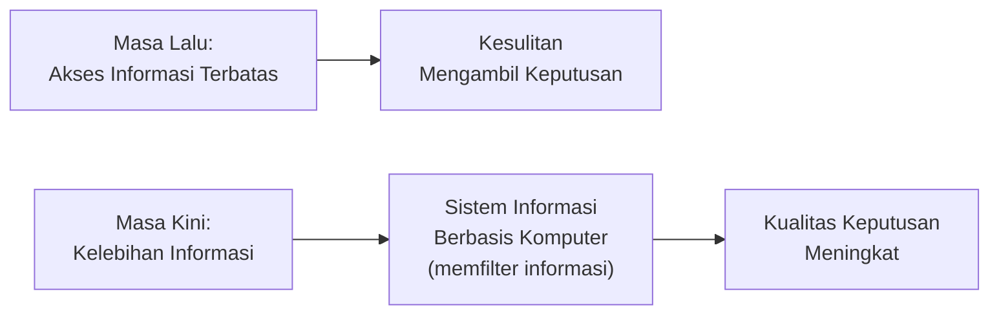

> Perubahan dari "akses terbatas" ke "kelebihan informasi" ini menggarisbawahi mengapa **Intelegensi Bisnis** (bagian 4) menjadi semakin penting di era saat ini — bukan lagi soal mencari informasi, tetapi menyaring informasi yang relevan dari lautan data yang tersedia.

---

## 2. Tipe Keputusan

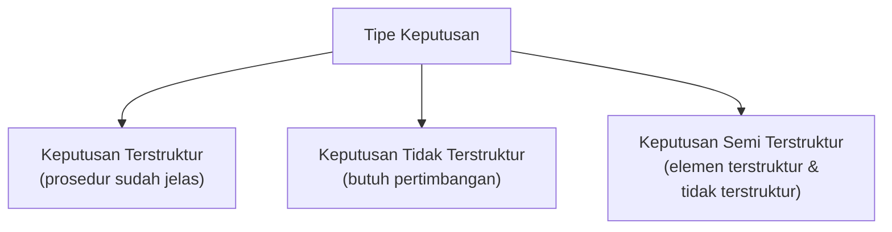

| Tipe | Penjelasan |
|---|---|
| **Keputusan Terstruktur** | Keputusan yang sudah jelas urutan prosedurnya. Apa yang harus dilakukan jika ada suatu kondisi yang dihadapi sudah digariskan secara tertulis. |
| **Keputusan Tidak Terstruktur** | Keputusan yang mengharuskan pembuat keputusan melakukan **pertimbangan**. |
| **Keputusan Semi Terstruktur** | Keputusan yang memiliki **elemen terstruktur dan tidak terstruktur**. |

---

## 3. Proses Pembuatan Keputusan Rasional

Proses pengambilan keputusan yang rasional harus melalui **empat tahapan**, dan dapat **kembali ke tahap sebelumnya** (iteratif) apabila diperlukan:

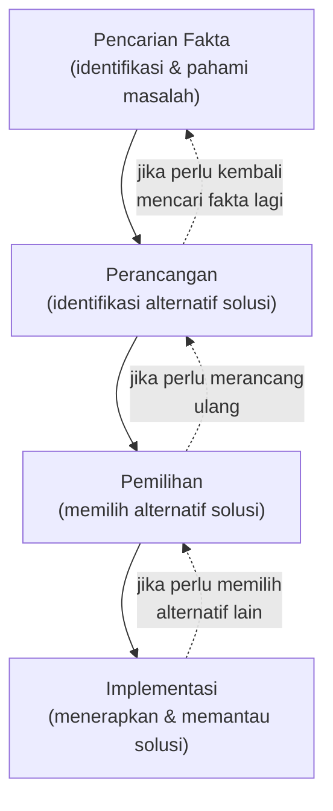

| Tahap | Penjelasan |
|---|---|
| **Pencarian Fakta** | Identifikasi masalah dan memahami masalah merupakan tahapan penting dalam mencari solusi. Pertanyaan yang dapat diajukan antara lain: mengapa muncul suatu masalah, di mana masalah tersebut muncul, apa dampak masalah tersebut pada perusahaan, dan lainnya. **Kesalahan dalam memahami masalah akan mengakibatkan kesalahan dalam pembuatan keputusan.** |
| **Perancangan** | Setelah diketahui permasalahan dan penyebabnya, maka diidentifikasi berbagai **alternatif solusi**. Dampak negatif maupun positif dari masing-masing alternatif solusi harus diketahui. |
| **Pemilihan** | Pembuat keputusan memilih alternatif solusi yang sudah dirumuskan pada tahapan perancangan. |
| **Implementasi** | Alternatif solusi yang sudah dipilih diterapkan oleh perusahaan. **Pemantauan terus dilakukan** guna melihat seberapa baik solusi yang dipilih tersebut menyelesaikan masalah. |

> Sifat iteratif proses ini (digambarkan dengan tanda panah melengkung kembali ke tahap sebelumnya pada diagram asli) menunjukkan bahwa pembuatan keputusan rasional **bukan proses satu arah** — jika pada tahap Implementasi ditemukan bahwa solusi tidak berjalan baik, pembuat keputusan dapat kembali ke tahap Pemilihan atau bahkan Perancangan untuk mengevaluasi ulang.

### Penggunaan Model dalam Pembuatan Keputusan

**Model** dapat didefinisikan sebagai **penyederhanaan atas realita** guna mengidentifikasi variabel dan parameter yang mempengaruhi suatu hal (Eppen et al., 1998; Turban, Leidner, MacLean, & Wetherbe, 2006).

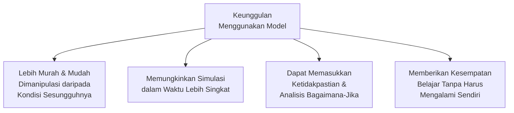

### Otomatisasi Pembuatan Keputusan

Dengan mengenali parameter apa saja yang terlibat dalam sebuah keputusan dan proses bisnisnya, keputusan dapat **diambil alih oleh komputer**. Untuk dapat menggunakan model pembuatan keputusan otomatis ini dibutuhkan (Laudon & Laudon, 2018; Radu & Necula, 2011):

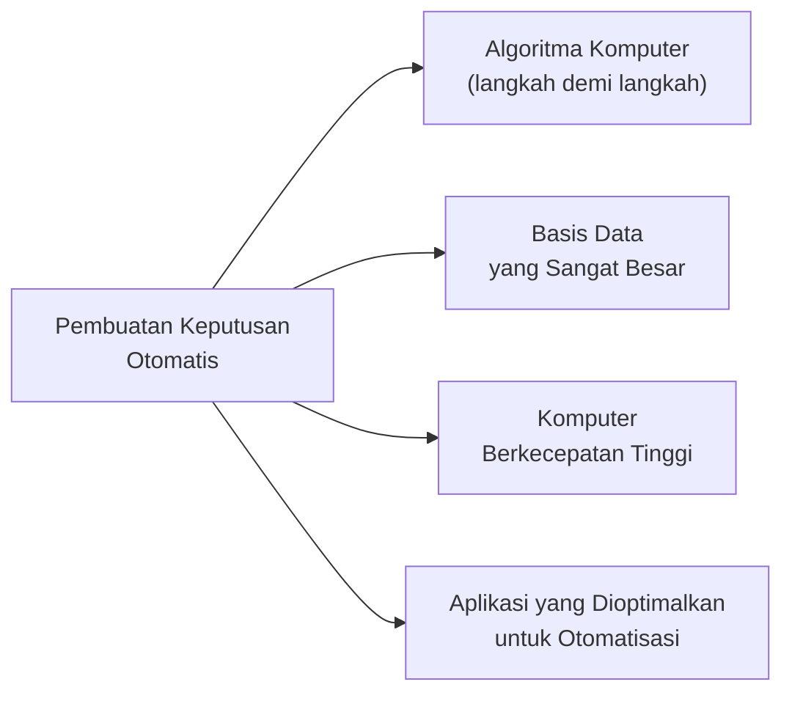

---

## 4. Intelegensi Bisnis (*Business Intelligence*)

### Definisi

**Intelegensi bisnis** adalah **infrastruktur** guna **menyimpan, mengintegrasikan, menganalisis, dan melaporkan** data yang berasal dari lingkungan bisnis (Berger & Doban, 2014; Goh, 2006; Hendriks & Jacobs, 2003; Karakiewicz, Sun, & Azizi, 2014; Rubin & Rubin, 2013). Data yang dikelola termasuk **Big Data**.

> Intelegensi bisnis **bukan sistem yang berdiri sendiri**, melainkan sistem yang tercipta dari suatu **ekosistem**.

### Ekosistem Intelegensi Bisnis

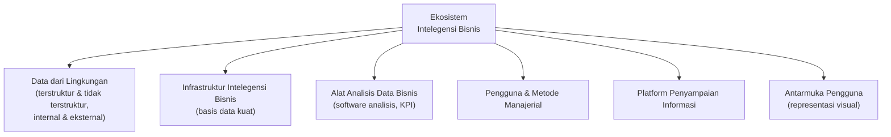

| Komponen | Penjelasan |
|---|---|
| **Data dari Lingkungan** | Data terstruktur dan tidak terstruktur dari berbagai sumber internal dan eksternal. |
| **Infrastruktur Intelegensi Bisnis** | Sistem basis data yang kuat untuk menangkap, menyimpan, dan mengolah data bisnis yang beragam. |
| **Alat Analisis Data Bisnis** | Sekumpulan alat berupa perangkat lunak untuk melakukan analisis dan menghasilkan laporan, menanggapi pertanyaan manajer, dan melacak kemajuan bisnis menggunakan **Key Performance Indicator (KPI)**. |
| **Pengguna & Metode Manajerial** | Perangkat keras dan perangkat lunak intelegensi bisnis hanya akan bermanfaat jika digunakan oleh pengguna yang tepat dan tahu apa yang harus dilakukan. |
| **Platform Penyampaian Informasi** | Hasil intelegensi bisnis harus didistribusikan pada para manajer dan karyawan di berbagai tingkatan organisasi. |
| **Antarmuka Pengguna** | Output akan lebih mudah dipahami jika menggunakan **representasi visual**, bukan hanya teks atau tabel. |

### Intelegensi Bisnis pada Level Manajerial

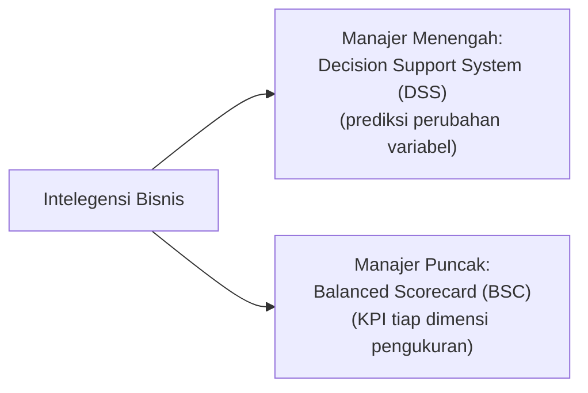

> Intelegensi bisnis mendukung pembuatan **keputusan terstruktur dan semi terstruktur** pada level manajerial — selaras dengan klasifikasi **Tipe Keputusan** pada bagian 2.

### Faktor Peningkatan Penggunaan Intelegensi Bisnis

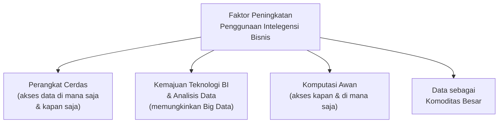

> Faktor **komputasi awan** ini berkaitan langsung dengan tahap evolusi infrastruktur TI (komputasi awan dan bergerak) yang dibahas pada Inisiasi 4 — intelegensi bisnis modern sangat bergantung pada infrastruktur cloud untuk dapat diakses kapan saja dan di mana saja.

---

# Bagian B — Pengembangan Sistem Informasi

## 5. Kriteria Keberhasilan Pengembangan Sistem Informasi

Pengembangan sistem informasi dianggap berhasil jika memenuhi **tiga kriteria**:

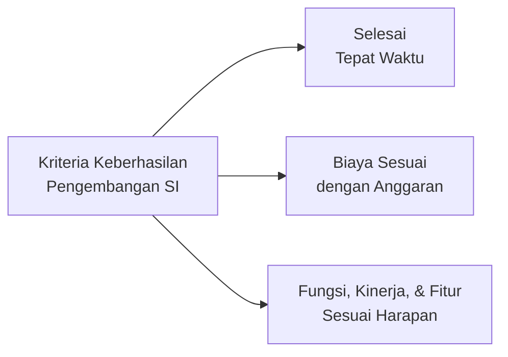

---

## 6. Perubahan Organisasi

Sistem informasi baru akan membawa perubahan dalam organisasi, yang dapat berwujud:

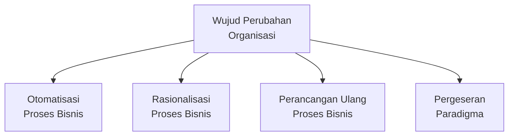

> Empat wujud ini tersusun dari **perubahan paling ringan ke paling radikal**: **otomatisasi** hanya mengganti cara kerja manual menjadi otomatis tanpa mengubah proses; **rasionalisasi** menyederhanakan prosedur; **perancangan ulang** mengubah keseluruhan alur proses bisnis; dan **pergeseran paradigma** mengubah cara berpikir fundamental organisasi tentang bisnisnya.

---

## 7. Systems Development Life Cycle (SDLC)

***Systems Development Life Cycle* (SDLC)** adalah salah satu metodologi pengembangan sistem informasi yang memiliki **enam tahapan**:

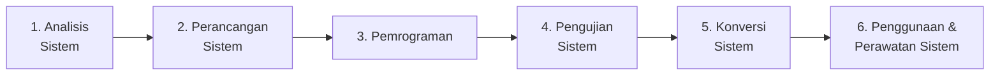

> Tahapan SDLC ini sejalan dengan tahapan SDLC yang lebih umum sudah dibahas pada mata kuliah Rekayasa Perangkat Lunak (STSI4202, Sesi 3) — istilah dan urutannya sedikit berbeda namun esensinya sama: analisis kebutuhan, desain, implementasi/coding, pengujian, peluncuran (konversi), hingga pemeliharaan.

### Kelebihan SDLC

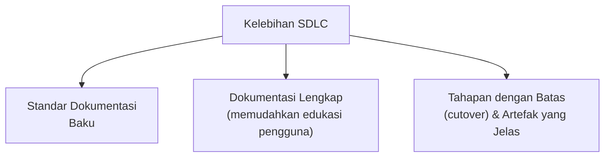

### Kelemahan SDLC

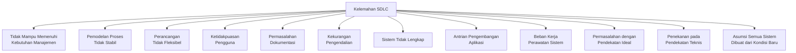

### Penyempurnaan SDLC

Beberapa alat dan metodologi baru dirancang untuk menyempurnakan SDLC (Sarosa, 2017):

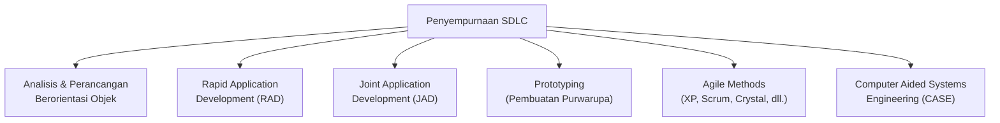

> Daftar penyempurnaan ini selaras dengan model-model SDLC alternatif (RAD, Prototipe, Iteratif/Agile) yang sudah dibahas secara lebih rinci pada STSI4202 Sesi 3 — menunjukkan bahwa kelemahan SDLC klasik (waterfall) memang menjadi pendorong lahirnya berbagai metodologi alternatif tersebut.

---

## 8. Proyek dan Manajemen Proyek

> **Proyek** adalah serangkaian aktivitas terencana, yang saling berkaitan, dan yang memiliki rentang waktu pengerjaan tertentu (ada awal dan ada akhir yang jelas) untuk mencapai tujuan bisnis tertentu.

> **Manajemen proyek** adalah penerapan pengetahuan, keahlian, alat, dan teknik untuk mencapai sasaran yang spesifik dalam waktu dan anggaran yang telah ditentukan.

### Kategori Proyek Pengembangan Sistem Informasi

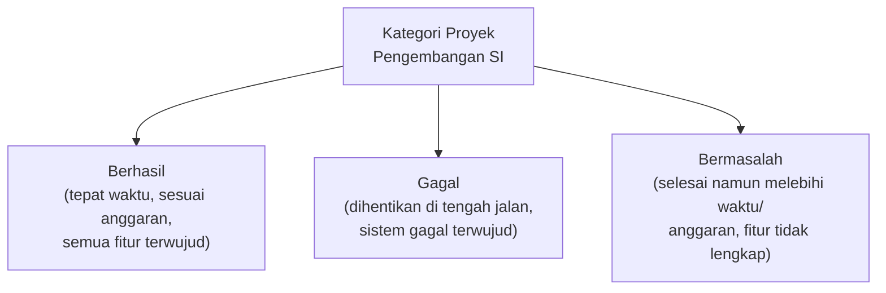

### Keberhasilan Proyek

Lima variabel utama dalam menilai apakah proyek berhasil atau tidak:

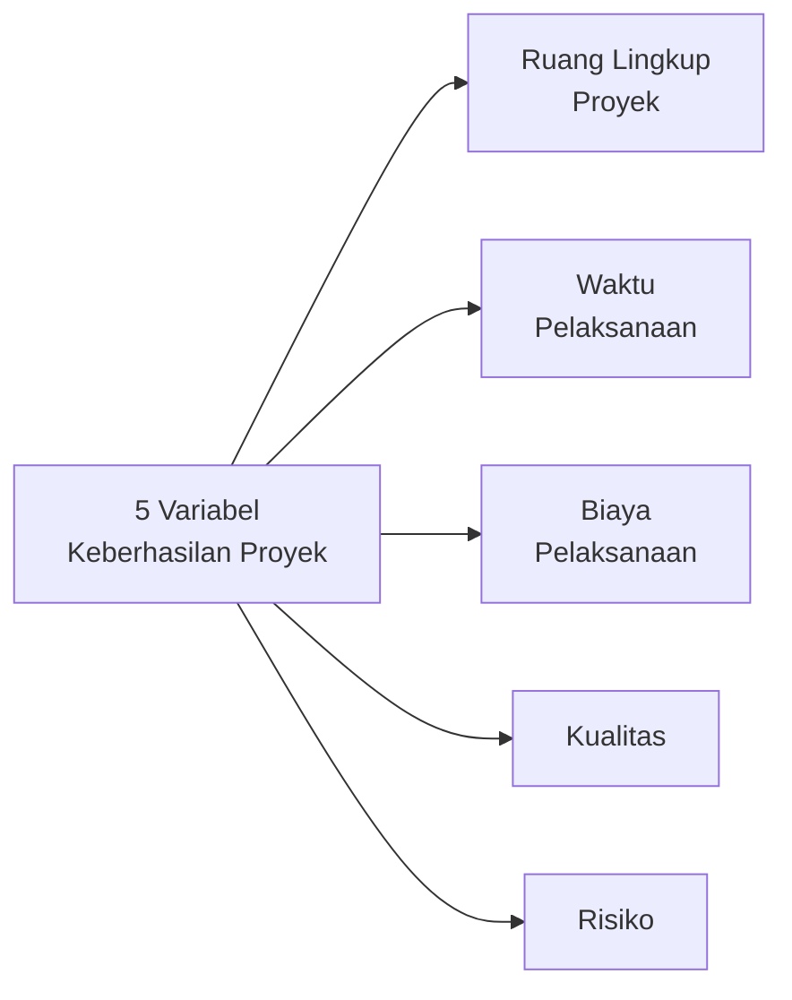

### Dimensi Risiko Proyek

Manajer proyek harus dapat mengidentifikasi risiko dan melakukan langkah mitigasi melalui tiga dimensi risiko:

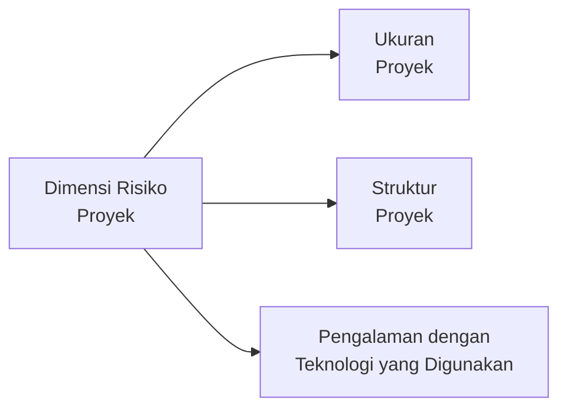

> Bagian ini melengkapi pembahasan **Manajemen Risiko** pada mata kuliah Proses Bisnis (STSI4206, Sesi 5) — di sini risiko proyek dipersempit secara spesifik ke konteks **pengembangan sistem informasi**.

---

## Ringkasan Keterkaitan Antar Konsep

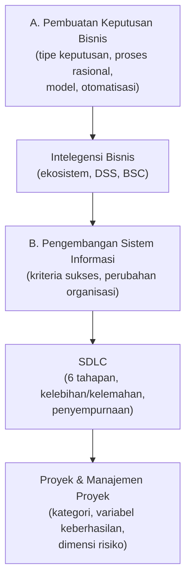

Inti dari materi penutup ini: sistem informasi pada akhirnya ada untuk **mendukung pembuatan keputusan bisnis** yang lebih baik — dari keputusan terstruktur yang dapat diotomatisasi hingga keputusan strategis yang didukung intelegensi bisnis. Namun, sistem informasi itu sendiri **harus dibangun melalui proses pengembangan yang terencana** (SDLC dan metodologi penyempurnaannya) serta dikelola sebagai sebuah **proyek** dengan kriteria keberhasilan, variabel, dan risiko yang jelas — menutup seluruh rangkaian pembahasan mata kuliah ini, dari konsep dasar sistem informasi hingga bagaimana sistem tersebut benar-benar diwujudkan dan dimanfaatkan dalam organisasi.
