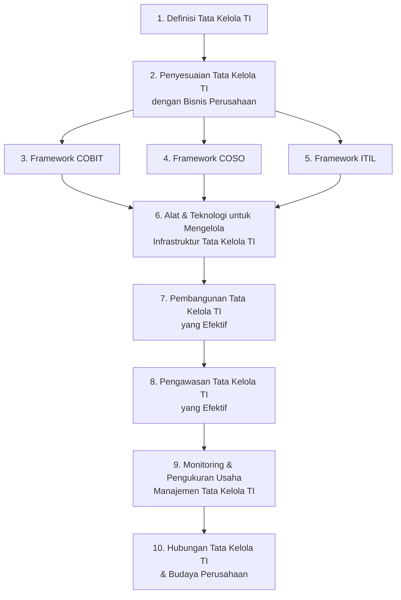

# Tata Kelola Teknologi Informasi (MSIM4402)

**Program Studi Sistem Informasi — Program Diploma/Sarjana — Universitas Terbuka**

| | |
|---|---|
| **Kode Mata Kuliah** | MSIM4402 |
| **Bobot SKS** | 2 |
| **Nama Pengembang** | Denisha Trihapningsari, S.Kom., MMSI. |
| **Nama Penelaah** | Eka Julianti, S.Kom., MMSI. |
| **Tahun Pengembangan** | 2024 |

> Dokumen ini disusun berdasarkan **Rancangan Aktivitas Tutorial (RAT)** ([rat.pdf](rat.pdf)) dan **Satuan Acara Tutorial (SAT)** ([sat.pdf](sat.pdf)) mata kuliah sebagai gambaran umum/preview materi yang dibahas di setiap pertemuan tutorial.

---

## Deskripsi Singkat Mata Kuliah

Mata kuliah Tata Kelola Teknologi Informasi/MSIM4402 mempelajari **strategi mengelola aset teknologi informasi** di organisasi berdasarkan standar internasional. Mahasiswa akan belajar pengelolaan aset teknologi menggunakan beberapa acuan kerangka kerja seperti **COBIT** (*Control Objectives for Information and Related Technology*) yang diperkenalkan oleh **ISACA** (*Information System Audit and Control Association*) dan **ITGI** (*Information Technology Governance Institute*).

Untuk pemahaman pengelolaan aset teknologi informasi, mahasiswa diberikan studi kasus secara nyata di lapangan berupa analisis lapangan secara mandiri. Kompetensi yang diperoleh mahasiswa diukur melalui diskusi, tugas praktikum (tugas tutorial), dan ujian akhir semester.

## Capaian Pembelajaran Mata Kuliah

Melalui mata kuliah ini, mahasiswa mampu:

1. Memahami **definisi tata kelola teknologi informasi (TI)** dan bagaimana penerapannya dapat disesuaikan dengan kebutuhan bisnis perusahaan.
2. Memahami berbagai **framework tata kelola TI** seperti **COBIT**, **COSO**, dan **ITIL**.
3. Mengenali **alat dan teknologi** yang mendukung pengelolaan infrastruktur TI.
4. Memahami **sistem tata kelola TI yang efektif**.
5. Memahami **monitoring dan pengukuran usaha manajemen** dalam tata kelola TI.
6. Memahami **hubungan antara tata kelola TI dan budaya perusahaan** untuk mendukung pencapaian tujuan organisasi.

---

## Peta Kompetensi

> **CPU (Capaian Pembelajaran Umum):** setelah mengikuti mata kuliah ini, mahasiswa mampu menjelaskan definisi tata kelola TI dan penyesuaiannya dengan bisnis perusahaan, memahami framework tata kelola TI (COBIT, COSO, ITIL), memahami alat dan teknologi untuk mengelola infrastruktur tata kelola TI, memahami pembangunan dan pemantauan sistem tata kelola TI yang efektif, memahami monitoring dan pengukuran usaha manajemen dalam tata kelola TI, dan memahami hubungan tata kelola TI dengan budaya perusahaan.

---

## Rancangan Aktivitas Tutorial (RAT)

| Tutorial Ke- | Pokok Bahasan | Sub Pokok Bahasan | Tugas Tutorial | Daftar Pustaka |
|---|---|---|---|---|
| Pra Sesi | Perkenalan pada Forum | — | — | — |
| [1](pertemuan-01/README.md) | IT Governance | Bisnis dan IT; Struktur IT Governance | — | [1] |
| [2](pertemuan-02/README.md) | Kerangka kerja (*Framework*) untuk mendukung tata kelola TI yang efektif | IT Governance dan COSO; Pengendalian Internal | — | [1] |
| [3](pertemuan-03/README.md) | Kerangka kerja untuk mendukung tata kelola TI yang efektif | COBIT; ITIL | √ (Tugas 1) | [1] |
| [4](pertemuan-04/README.md) | Alat dan Teknologi untuk Mengelola Infrastruktur Tata Kelola TI | *Cloud Computing*; Tata Kelola, Keamanan IT, dan Manajemen Kontinuitas | — | [1] |
| [5](pertemuan-05/README.md) | Efektivitas Sistem Tata Kelola TI | Arsitektur Sistem Tata Kelola TI; Konfigurasi TI dan Manajemen Portofolio | √ (Tugas 2) | [1] |
| [6](pertemuan-06/README.md) | Peran Manajemen dalam Tata Kelola TI (*IT Governance*) | *Enterprise Content Management* (ECM) | — | [1] |
| [7](pertemuan-07/README.md) | Peran Manajemen dalam Tata Kelola TI (*IT Governance*) | Peran Audit Tata Kelola TI (*IT Governance*) | √ (Tugas 3) | [1] |
| [8](pertemuan-08/README.md) | Tata Kelola TI dan Budaya Perusahaan | Tata Kelola dalam Perusahaan; Dampak dari *Social Media Computing* | — | [1] |

> Modus tutorial menggunakan **Tuton**. Tugas Tutorial diberikan pada pertemuan ke-3, ke-5, dan ke-7 — masing-masing mencakup CPK-MK esensial dari Modul 1-2 (Tugas 1), Modul 3-4 (Tugas 2), dan Modul 5-6 (Tugas 3) untuk mata kuliah berbobot 2 SKS.

### Rincian Capaian Pembelajaran Khusus per Pertemuan

#### Pra Sesi — Perkenalan
1. Mahasiswa membaca definisi terkait tata kelola teknologi informasi.
2. Mahasiswa mampu menjelaskan definisi tata kelola teknologi informasi.
3. Mahasiswa mampu menjelaskan hubungan tata kelola TI dengan penyesuaian bisnis perusahaan.
4. Mahasiswa mampu menyebutkan beberapa *framework* yang digunakan dalam proses Tata Kelola IT.

#### Pertemuan 1 — IT Governance
1. Mengidentifikasi tantangan yang dihadapi oleh bisnis dan TI dalam implementasi tata kelola TI.
2. Menjelaskan definisi tata kelola TI secara tepat.
3. Menjelaskan tujuan dari tata kelola TI dan bagaimana penerapannya dalam organisasi.
4. Membedakan antara tata kelola dan manajemen TI dalam konteks pengelolaan organisasi.
5. Menjelaskan konsep SOA (*Service Oriented Architecture*) *Governance* dalam mendukung tata kelola TI.
6. Menjelaskan pentingnya tata kelola TI untuk mendukung efektivitas dan efisiensi operasional TI dalam perusahaan.
7. Menjelaskan struktur organisasi TI yang diperlukan untuk mendukung implementasi tata kelola TI yang efektif.

#### Pertemuan 2 — Kerangka Kerja untuk Mendukung Tata Kelola TI yang Efektif (COSO)
1. Menjelaskan konsep IT Governance dan *framework* COSO.
2. Menjelaskan pengendalian internal sebagai bagian penting dari tata kelola TI untuk efektivitas operasional suatu organisasi.

#### Pertemuan 3 — Kerangka Kerja untuk Mendukung Tata Kelola TI yang Efektif (COBIT & ITIL)
1. Mengaplikasikan *framework* COBIT (*Control Objectives for Information and Related Technology*) dalam tata kelola TI.
2. Menerapkan prinsip-prinsip *IT Service Management* (ITSM) dalam pengelolaan layanan TI yang efektif.

#### Pertemuan 4 — Alat dan Teknologi untuk Mengelola Infrastruktur Tata Kelola TI
1. Memahami konsep dasar *cloud computing* dan penerapannya dalam lingkungan bisnis.
2. Mengevaluasi kontrol aplikasi dalam *cloud computing*.
3. Memahami tantangan keamanan dan privasi yang terkait dengan komputasi *cloud*.
4. Memahami sistem TI dan virtualisasi dalam manajemen penyimpanan data.
5. Menjelaskan konsep tata kelola TI serta peran virtualisasi dalam manajemen TI.
6. Memahami isu tata kelola perangkat TI terkait dengan penggunaan *smartphone* di lingkungan kerja.
7. Menjelaskan pentingnya lingkungan keamanan TI yang efektif dalam melindungi aset digital organisasi.
8. Memahami hubungan antara tata kelola TI, keamanan TI, dan manajemen kontinuitas dalam menjaga operasional bisnis.
9. Menerapkan prinsip-prinsip keamanan *enterprise* TI dan menerapkan standar keamanan yang umum diterima.
10. Merancang perencanaan keberlanjutan TI atau *business continuity planning* untuk mengatasi risiko dalam operasional bisnis.

#### Pertemuan 5 — Efektivitas Sistem Tata Kelola TI
1. Menjelaskan aplikasi SOA (*Service-Oriented Architecture*) serta penerapan aplikasi layanan-*driven* TI.
2. Mengidentifikasi tata kelola SOA dan masalah pengendalian internal serta risiko yang terkait.
3. Merencanakan untuk membangun *blueprint* untuk implementasi SOA dalam organisasi.
4. Menjelaskan hubungan antara SOA dan tata kelola TI, serta bagaimana keduanya saling mendukung.
5. Mengidentifikasi praktik terbaik ITIL dalam konfigurasi pengelolaan TI untuk meningkatkan efisiensi layanan.
6. Merencanakan sumber daya perusahaan dengan mempertimbangkan proses tata kelola TI yang efektif.
7. Menjelaskan konsep manajemen konfigurasi TI serta pentingnya manajemen konfigurasi database.

#### Pertemuan 6 — Peran Manajemen dalam Tata Kelola TI (ECM)
1. Menjelaskan definisi *Enterprise Content Management* (ECM) serta perannya dalam organisasi.
2. Mengidentifikasi karakteristik utama ECM dan komponen kunci yang diperlukan untuk implementasi ECM di perusahaan.
3. Menjelaskan proses ECM dan bagaimana tata kelola TI berperan dalam mengelola konten secara efektif dalam organisasi.
4. Merancang lingkungan ECM yang efektif untuk mendukung kebutuhan operasional perusahaan.

#### Pertemuan 7 — Peran Manajemen dalam Tata Kelola TI (Audit)
1. Menjelaskan peran audit dalam tata kelola TI dan bagaimana audit membantu memastikan kepatuhan serta efektivitas pengelolaan TI.
2. Menjelaskan sejarah dan latar belakang audit internal, serta peran pentingnya dalam pengawasan tata kelola TI.
3. Menjelaskan kegiatan dan tanggung jawab audit internal dalam mendukung tata kelola TI yang baik.
4. Mengidentifikasi peran auditor TI dalam melakukan audit internal dan menjaga integritas sistem TI.
5. Mengidentifikasi standar tata kelola TI yang digunakan dalam audit internal, serta bagaimana standar tersebut diterapkan.
6. Menerapkan prosedur audit internal untuk menilai dan mengawasi tata kelola TI dalam organisasi.

#### Pertemuan 8 — Tata Kelola TI dan Budaya Perusahaan
1. Menjelaskan pentingnya pernyataan misi perusahaan dalam mendukung budaya dan tata kelola TI yang kuat.
2. Menjelaskan pedoman perilaku perusahaan sebagai landasan untuk menciptakan etika dan tata kelola TI yang baik.
3. Menjelaskan peran *whistleblower* dan *hotline* dalam menjaga transparansi dan integritas dalam tata kelola TI.
4. Merancang program etika yang efektif untuk meningkatkan praktik tata kelola perusahaan yang mendukung TI.
5. Mengidentifikasi dampak sosial media *computing* terhadap tata kelola perusahaan dan bagaimana mengelolanya.
6. Mengidentifikasi risiko dan kerentanan yang ditimbulkan oleh media sosial dalam konteks perusahaan serta strategi untuk menanganinya.
7. Menganalisis peran komite audit *enterprise* dalam mendukung tata kelola TI yang efektif.
8. Menjelaskan tanggung jawab komite audit dalam tata kelola perusahaan dan TI.
9. Menganalisis *briefing* yang relevan bagi komite audit terkait masalah tata kelola TI.

---

## Daftar Pustaka/OER

1. Inayatulloh, S.E., MMSI., CDMS., CSCA. (2022). *Tata Kelola Teknologi Informasi* (Cetakan pertama). Penerbit Universitas Terbuka.
