# Sesi 1 — IT Governance

**MSIM4402 Tata Kelola Teknologi Informasi**
Program Studi Sistem Informasi — Universitas Terbuka

> Catatan: dokumen ini merupakan ekstraksi sekaligus elaborasi dari materi *Inisiasi 1 — IT Governance*. Diagram pada slide asli (termasuk SmartArt) digambarkan ulang dengan mermaid, dan setiap poin dijelaskan lebih dalam dengan konteks dan contoh agar lebih mudah dipahami secara utuh.

Materi inisiasi ini terbagi menjadi dua Kegiatan Belajar (KB):

- **KB 1 — Bisnis dan IT**: hubungan strategi bisnis dengan TI, lingkungan bisnis, dan lingkungan IT.
- **KB 2 — Struktur IT Governance**: definisi, tujuan, perspektif, manajemen risiko, dan efektivitas tata kelola TI.

---

## KB 1 — Bisnis dan IT

### 1. Hubungan Strategi Bisnis dan TI

Keberhasilan organisasi modern sangat ditentukan oleh seberapa baik **strategi bisnis** dan **strategi TI** saling terhubung. Hubungan ini digambarkan melalui **Strategic Alignment Model** (Moeller, 2013):

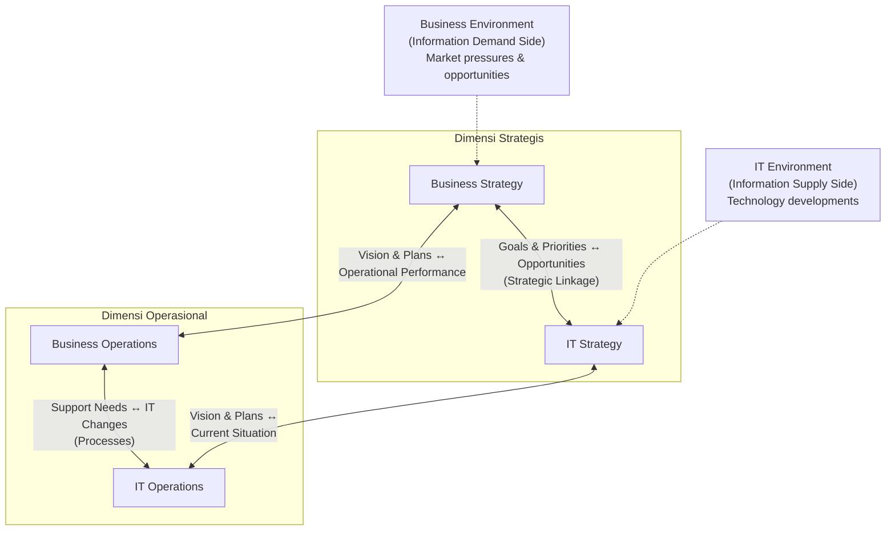

| Komponen | Penjelasan |
|---|---|
| **Business Strategy** | Arah dan tujuan bisnis, dipengaruhi oleh tekanan dan peluang pasar (*market pressures & opportunities*) dari *Business Environment*. |
| **IT Strategy** | Arah dan tujuan TI, dipengaruhi oleh perkembangan teknologi (*technology developments*) dari *IT Environment*. |
| **Strategic Linkage** | Keterkaitan antara *goals & priorities* bisnis dengan *opportunities* yang ditawarkan TI — inilah inti dari **keselarasan strategis** (*strategic alignment*). |
| **Business Operations** | Pelaksanaan operasional bisnis sehari-hari, dipandu oleh *vision & plans* dari strategi bisnis. |
| **IT Operations** | Pelaksanaan operasional TI sehari-hari, dipandu oleh *vision & plans* dari strategi TI. |
| **Functional Linkage** | Keterkaitan antara *support needs* (kebutuhan dukungan dari bisnis) dengan *IT changes* (perubahan yang dilakukan TI) pada level proses. |

> Model ini menunjukkan bahwa **TI tidak boleh berjalan sendiri** terlepas dari arah bisnis — baik pada level strategis (visi & tujuan jangka panjang) maupun pada level operasional (proses kerja sehari-hari). Inilah fondasi konseptual dari **IT Governance**: memastikan kedua dimensi ini selalu selaras.

### 2. Business Environment

**Business Environment** adalah kumpulan dari faktor dan kondisi yang mempengaruhi semua pihak dalam perdagangan, seperti konsumen, bisnis, dan pemerintah. *Business Environment* dapat dibagi menjadi **enam kekuatan pengaruh utama**:

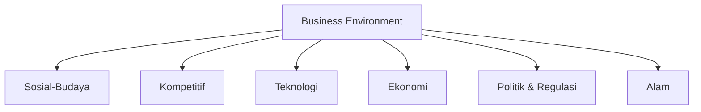

> Keenam kekuatan ini relevan karena masing-masing dapat menjadi sumber **peluang maupun ancaman** bagi organisasi — misalnya perubahan **regulasi** (politik & regulasi) dapat memaksa organisasi mengubah strategi TI-nya, atau tekanan dari pesaing (**kompetitif**) dapat mendorong adopsi teknologi baru lebih cepat.

### 3. Lingkungan Bisnis dan Lingkungan IT

Lingkungan bisnis dapat dipengaruhi oleh enam kekuatan pengaruh utama yang sama seperti pada bagian 2 (sosial-budaya, kompetitif, teknologi, ekonomi, politik & regulasi, dan alam).

**Lingkungan IT** secara umum terbagi menjadi dua dampak:

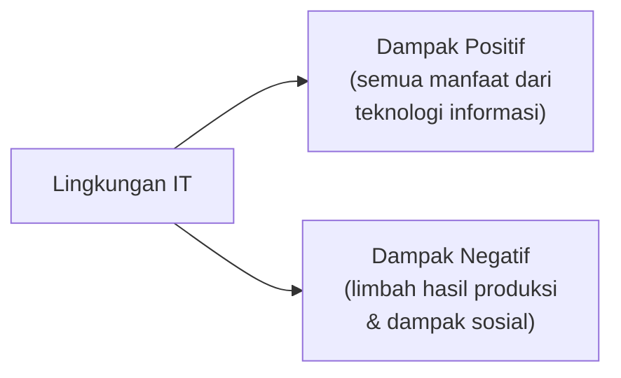

| Dampak | Penjelasan |
|---|---|
| **Dampak Positif** | Semua manfaat dari teknologi informasi bagi organisasi maupun masyarakat. |
| **Dampak Negatif** | Limbah hasil produksi (misalnya e-waste dari perangkat TI) dan dampak sosial yang ditimbulkan oleh penggunaan teknologi informasi. |

> Penting bagi organisasi yang menerapkan tata kelola TI yang baik untuk **menyadari kedua sisi dampak ini** — bukan hanya mengejar manfaat teknologi, tetapi juga mempertimbangkan konsekuensi negatifnya terhadap lingkungan dan masyarakat.

---

## KB 2 — Struktur IT Governance

### 4. Hubungan antara Tata Kelola, Manajemen, dan Bisnis

Tata kelola TI (*IT Governance*) bukanlah konsep yang berdiri sendiri — ia terhubung erat dengan strategi bisnis, struktur manajemen, dan sumber daya TI organisasi:

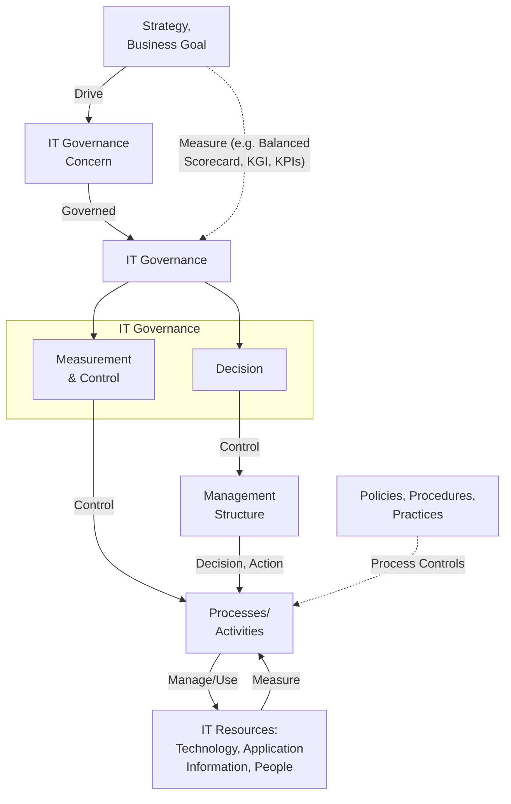

| Elemen | Penjelasan |
|---|---|
| **Strategy, Business Goal** | Titik awal yang **mendorong (*drive*)** munculnya *IT Governance Concern*. |
| **IT Governance Concern** | Perhatian/isu tata kelola yang muncul dari strategi dan tujuan bisnis, yang kemudian **diatur (*governed*)** oleh IT Governance. |
| **Decision** dan **Measurement & Control** | Dua fungsi inti di dalam **IT Governance** — membuat keputusan dan mengukur/mengendalikan hasilnya. |
| **Management Structure** | Dikontrol oleh fungsi *Decision*, menghasilkan keputusan dan tindakan (*decision, action*) terhadap *Processes/Activities*. |
| **Processes/Activities** | Dikontrol oleh fungsi *Measurement & Control*, mengelola/menggunakan (*manage/use*) *IT Resources* (teknologi, aplikasi informasi, dan orang), serta diatur oleh **kebijakan, prosedur, dan praktik** (*process controls*). |
| **IT Resources** | Sumber daya TI (teknologi, informasi aplikasi, dan orang) yang hasilnya **diukur (*measure*)** kembali untuk menjadi masukan bagi *Processes/Activities*. |

> Diagram ini menunjukkan **siklus tertutup (*closed loop*)**: tujuan bisnis mendorong tata kelola, tata kelola mengontrol struktur manajemen dan proses, proses mengelola sumber daya TI, dan hasilnya diukur kembali — membentuk mekanisme **pengendalian berkelanjutan**, bukan keputusan sekali jalan.

### 5. Definisi dan Perspektif Tata Kelola TI

> **Tata kelola TI** adalah tentang cara perusahaan menyelesaikan pengiriman kapabilitas bisnis yang sangat penting dengan menggunakan strategi, sasaran, dan sasaran TI. Tata kelola TI berkaitan dengan **penyelarasan strategis** antara tujuan dan sasaran bisnis dengan pemanfaatan sumber daya TI untuk secara efektif mencapai hasil yang diinginkan.

Banyak perspektif tata kelola yang ada di perusahaan. Namun secara umum ada **empat perspektif** yang paling relevan dari sudut pandang pengembangan:

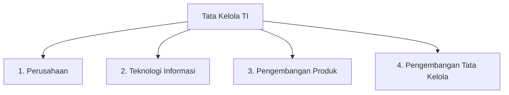

Suatu perusahaan mungkin menghadapi beberapa tantangan dan masalah bisnis, seperti:

- Persaingan global
- Biaya pengembangan produk
- Kepatuhan terhadap peraturan
- Kurangnya staf yang terampil
- Peluang bisnis baru

> Keempat perspektif ini relevan karena tata kelola TI yang baik **tidak hanya memandang dari sisi TI semata** — ia juga harus mempertimbangkan kebutuhan perusahaan secara keseluruhan, proses pengembangan produk, dan bagaimana tata kelola itu sendiri terus dikembangkan agar tetap relevan menghadapi tantangan bisnis (persaingan global, biaya, regulasi, dsb.) yang terus berubah.

### 6. Tujuan Tata Kelola TI

> Tujuan tata kelola TI adalah **memastikan bahwa tujuan strategis perusahaan tercapai secara efektif** melalui mekanisme pengukuran yang kuat yang mendukung fungsi manajemen kepatuhan.

Tata kelola TI mengintegrasikan **empat tujuan**:

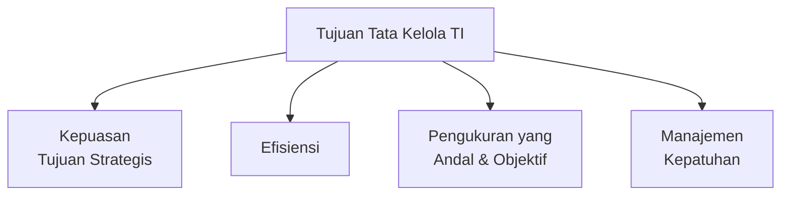

Sejalan dengan bagian 5, terdapat **empat perspektif pembangunan** dalam tata kelola perusahaan:

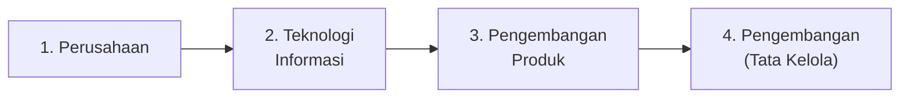

> Perhatikan bahwa **empat tujuan** (kepuasan tujuan strategis, efisiensi, pengukuran, kepatuhan) ini adalah hasil yang ingin dicapai, sedangkan **empat perspektif pembangunan** (perusahaan, TI, pengembangan produk, pengembangan tata kelola) adalah sudut pandang/area kerja yang harus diperhatikan untuk mencapai tujuan tersebut — keduanya saling melengkapi sebagai kerangka kerja tata kelola TI yang utuh.

### 7. Manajemen Risiko dalam Tata Kelola TI

Manajemen risiko termasuk komponen penting di dalam tata kelola TI, terdiri dari tiga tahap:

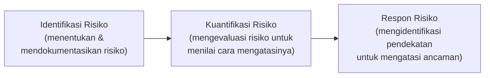

**Respon Risiko** dapat berupa salah satu dari empat strategi berikut:

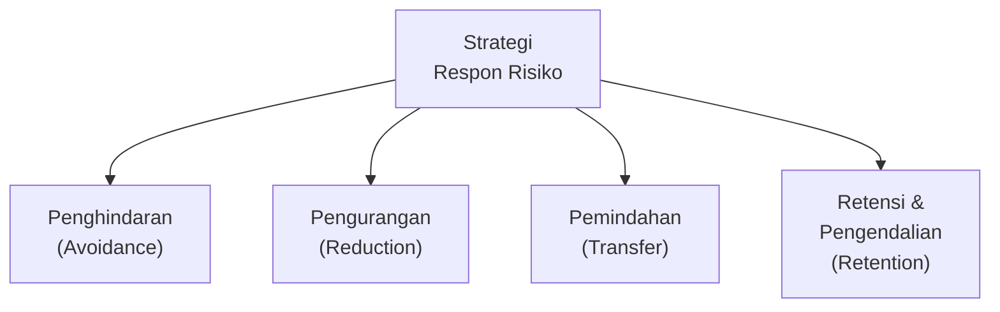

| Tahap | Penjelasan |
|---|---|
| **Identifikasi Risiko** | Untuk menentukan dan mendokumentasikan risiko. |
| **Kuantifikasi Risiko** | Untuk mengevaluasi risiko, untuk menilai bagaimana mengatasinya. |
| **Respon Risiko** | Untuk mengidentifikasi sebuah pendekatan untuk mengatasi ancaman/risiko dengan strategi yang mungkin termasuk **penghindaran, pengurangan, pemindahan, atau retensi dan pengendalian risiko**. |

> Catatan ini selaras dengan materi **Manajemen Risiko Proyek Perangkat Lunak** (STSI4202, Sesi 8) dan **Proses Manajemen Risiko** (STSI4206, Sesi 5) — empat strategi respon risiko (penghindaran, pengurangan, pemindahan, retensi) pada dasarnya sejalan dengan strategi **Avoid, Mitigate, Transfer, Accept** yang sudah dibahas pada mata kuliah lain, menegaskan bahwa kerangka manajemen risiko ini berlaku universal di berbagai konteks (proyek, proses bisnis, maupun tata kelola TI).

### 8. Pentingnya Sistem TI yang Didukung oleh Standar dan Prosedur

Sistem TI yang didukung oleh teknologi yang terus berubah dan berkembang merupakan komponen utama dari hampir semua aktivitas bisnis. Namun, aktivitas TI saat ini **belum didukung oleh standar dan prosedur yang sama** seperti yang ditemukan di area bisnis lain. Karena itu, **tata kelola TI menjadi solusi** untuk memberikan standarisasi pengelolaan TI.

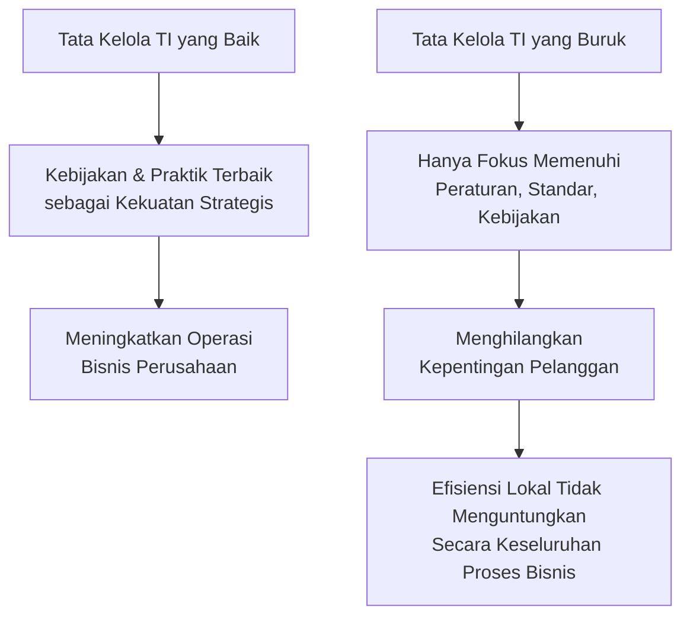

> Tata kelola TI **tidak dimaksudkan untuk membebankan** manajemen perusahaan dan fungsi TI dengan peraturan, standar, dan kebijakan yang ketat. Sebaliknya, tata kelola TI yang baik adalah seperangkat **kebijakan dan praktik terbaik** yang berfungsi sebagai **kekuatan strategis** yang memungkinkan peningkatan operasi bisnis perusahaan.
>
> Sebaliknya, **tata kelola TI yang buruk** akan menghilangkan kepentingan pelanggan demi memenuhi peraturan, standar, dan kebijakan semata. Keuntungan lokal dalam efisiensi proses dan produktivitas seringkali **tidak memberikan hasil yang menguntungkan** dalam konteks proses bisnis secara keseluruhan.

### 9. Manfaat Rencana Strategis SI

Rencana strategis Sistem Informasi (SI) memberikan tujuh manfaat utama:

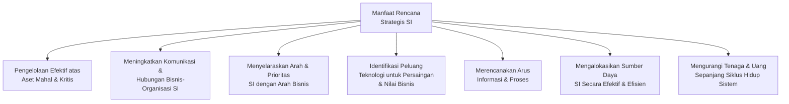

| Manfaat | Penjelasan |
|---|---|
| 1 | Pengelolaan yang efektif atas aset mahal dan kritis dari organisasi. |
| 2 | Meningkatkan komunikasi dan hubungan antara bisnis dan organisasi SI. |
| 3 | Menyelaraskan arah dan prioritas SI dengan arah bisnis dan prioritas. |
| 4 | Mengidentifikasi peluang untuk menggunakan teknologi untuk keuntungan persaingan dan meningkatkan nilai bisnis. |
| 5 | Merencanakan arus informasi dan proses. |
| 6 | Mengalokasikan sumber daya SI secara efektif dan efisien. |
| 7 | Mengurangi tenaga dan uang yang dibutuhkan sepanjang siklus hidup sistem. |

> Manfaat nomor 3 (**menyelaraskan arah dan prioritas SI dengan arah bisnis**) secara langsung mengaplikasikan **Strategic Alignment Model** yang sudah dibahas pada bagian 1 — perencanaan strategis SI adalah salah satu mekanisme konkret untuk mewujudkan keselarasan strategis tersebut.

### 10. Efektivitas Tata Kelola IT

Tugas pertama dan utama terkait dengan tata kelola TI yang merupakan tanggung jawab eksekutif (seperti **CIO** dan jajaran direksi) adalah **mempelajari dan memahami secara menyeluruh dan mendetail bisnis** yang digeluti perusahaan. Tugas kedua yang menjadi tanggung jawab seorang CIO adalah **membangun kredibilitas direktorat sistem informasi** yang dipimpinnya.

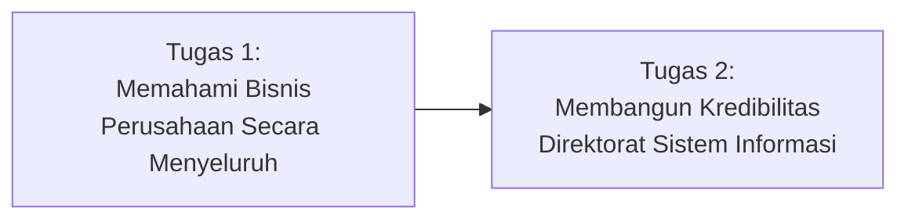

Tata kelola TI yang efektif juga ditentukan oleh **fungsi TI yang diatur dalam proses pengambilan keputusan**. Beberapa model organisasi TI yang dikembangkan dan diimplementasikan:

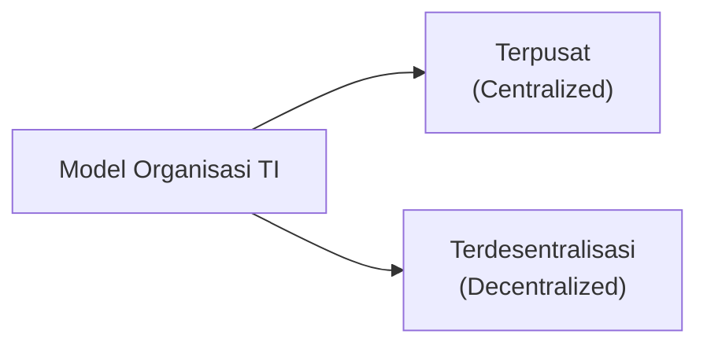

Manajemen TI melakukan proses **desain organisasi TI** secara strategis dan taktis dengan beberapa tujuan:

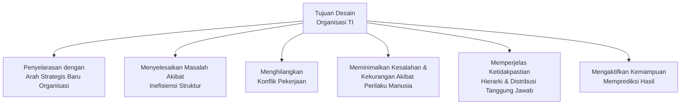

> Tujuan terakhir (**mengaktifkan kemampuan memprediksi hasil dengan meminimalkan opsi perilaku pribadi**) menunjukkan filosofi penting tata kelola TI: organisasi yang dirancang dengan baik akan membuat hasil kerja **lebih dapat diprediksi**, karena keputusan dan tindakan individu lebih terarah oleh struktur dan proses yang jelas, bukan oleh preferensi pribadi yang bisa berubah-ubah.

---

## Ringkasan Keterkaitan Antar Konsep

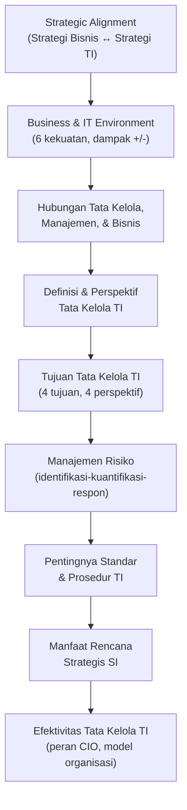

Inti dari sesi ini: **IT Governance** adalah kerangka kerja yang memastikan TI tidak berjalan terlepas dari arah bisnis — mulai dari keselarasan strategis (Strategic Alignment Model), pemahaman terhadap lingkungan bisnis dan TI, hingga struktur tata kelola yang konkret (definisi, tujuan, manajemen risiko, standar/prosedur, dan peran eksekutif seperti CIO). Tata kelola TI yang **baik** menjadikan TI sebagai kekuatan strategis yang meningkatkan nilai bisnis, sementara tata kelola TI yang **buruk** justru mengorbankan kepentingan pelanggan demi sekadar memenuhi kepatuhan administratif.

---

*Terima kasih*
