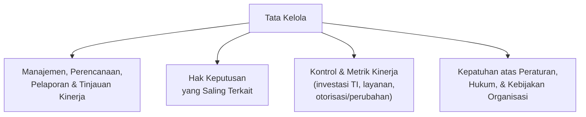
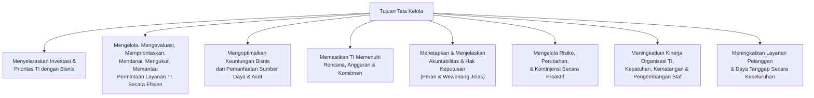
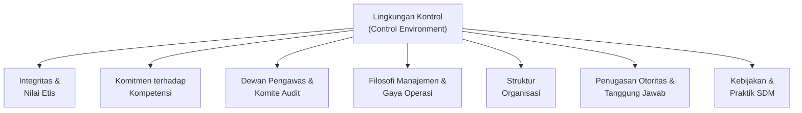
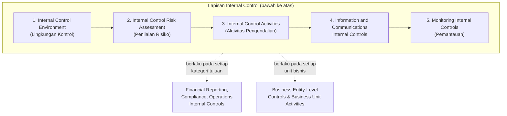
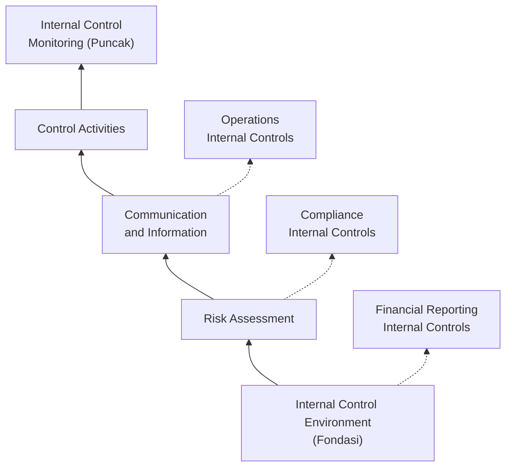
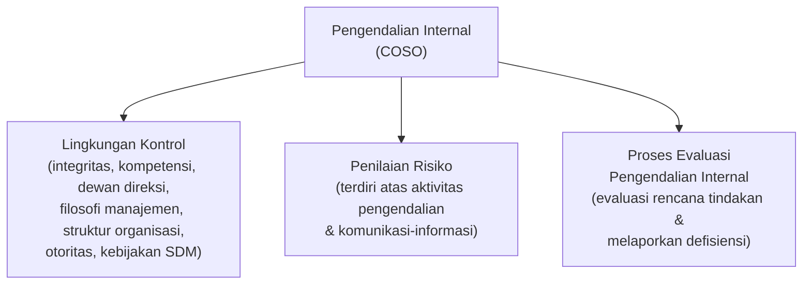
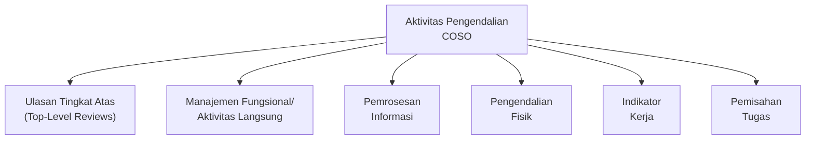
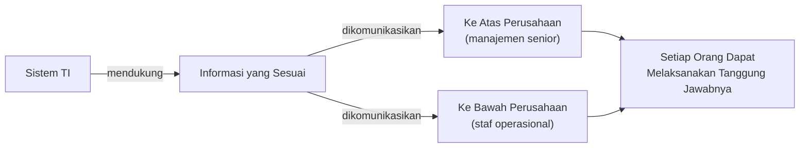
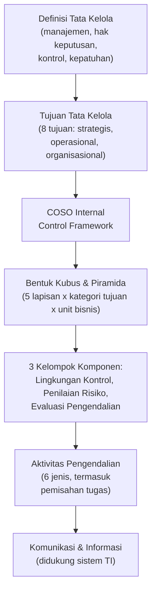

# Sesi 2 — Kerangka Kerja (Framework) untuk Mendukung Tata Kelola TI yang Efektif

**MSIM4402 Tata Kelola Teknologi Informasi**
Program Studi Sistem Informasi — Universitas Terbuka

> Catatan: dokumen ini merupakan ekstraksi sekaligus elaborasi dari materi *Inisiasi 2 — Kerangka Kerja untuk Mendukung Tata Kelola TI yang Efektif*. Diagram pada slide asli digambarkan ulang dengan mermaid, dan setiap poin dijelaskan lebih dalam dengan konteks dan contoh agar lebih mudah dipahami secara utuh.

---

## 1. Definisi Tata Kelola

> **Tata kelola** adalah kumpulan dari **manajemen, perencanaan, dan pelaporan dan tinjauan kinerja**, proses dengan **hak keputusan yang saling terkait**, yang menetapkan **kontrol dan metrik kinerja** atas investasi TI, layanan pengiriman dan otorisasi baru atau perubahan, dan **kepatuhan** atas peraturan, hukum, dan kebijakan organisasi.

> Definisi ini melengkapi definisi **Tata Kelola TI** yang sudah dibahas pada Sesi 1 — di sana fokusnya pada **penyelarasan strategis** antara bisnis dan TI, sedangkan di sini fokusnya lebih pada **mekanisme operasional**: bagaimana proses, hak keputusan, kontrol, dan kepatuhan benar-benar dijalankan sehari-hari.

---

## 2. Tujuan Tata Kelola

Tata kelola TI memiliki tujuan mengarahkan dan mengelola inisiatif TI agar selaras dan memberikan nilai bagi organisasi:

| Tujuan | Penjelasan |
|---|---|
| **Menyelaraskan Investasi & Prioritas** | Mengarahkan dan mengelola inisiatif TI, menyelaraskan investasi dan prioritas TI lebih dekat dengan bisnis. |
| **Pengelolaan Permintaan Layanan TI** | Mengelola, mengevaluasi, memprioritaskan, mendanai, mengukur, dan memantau permintaan untuk layanan TI dan hasil kerja dengan cara yang lebih efisien. |
| **Optimalisasi Keuntungan Bisnis** | Mengoptimalkan keuntungan bisnis dari pemanfaatan sumber daya dan aset secara optimal. |
| **Pemenuhan Komitmen** | Memastikan bahwa TI memenuhi rencana, anggaran, dan komitmennya. |
| **Akuntabilitas yang Jelas** | Menetapkan dan menjelaskan akuntabilitas dan hak keputusan semua pihak yang terlibat (dengan jelas mendefinisikan peran dan wewenang). |
| **Manajemen Risiko Proaktif** | Mengelola risiko, perubahan, dan kontinjensi secara proaktif. |
| **Peningkatan Kinerja Organisasi** | Meningkatkan kinerja organisasi TI, kepatuhan, kematangan, dan pengembangan staf. |
| **Layanan Pelanggan** | Meningkatkan layanan pelanggan dan daya tanggap secara keseluruhan. |

> Delapan tujuan ini menunjukkan bahwa tata kelola TI bekerja pada **tiga level sekaligus**: level **strategis** (penyelarasan investasi & prioritas), level **operasional** (pengelolaan permintaan layanan, pemenuhan anggaran), dan level **organisasional** (akuntabilitas, manajemen risiko, pengembangan staf, layanan pelanggan).

---

## 3. COSO Internal Control Framework

***Committee of Sponsoring Organizations of the Treadway Commission* (COSO)** menyediakan kerangka kerja pengendalian internal (*Internal Control Framework*) yang banyak diadopsi sebagai standar tata kelola dan pengendalian, termasuk dalam konteks TI.

> **Pengendalian internal** menyediakan kerangka kerja untuk **perencanaan, pelaksanaan, pengendalian, dan pemantauan** kegiatan yang membantu mencapai tujuan secara menyeluruh.

### Komponen Penting Lingkungan Kontrol (*Control Environment*)

| Komponen | Penjelasan |
|---|---|
| **Integritas dan Nilai Etis** | Fondasi moral yang mendasari seluruh perilaku organisasi. |
| **Komitmen terhadap Kompetensi** | Memastikan personel memiliki keahlian yang sesuai untuk menjalankan tugasnya. |
| **Dewan Pengawas dan Komite Audit** | Pengawasan independen terhadap manajemen. |
| **Filosofi Manajemen dan Gaya Operasi** | Pendekatan dan sikap manajemen terhadap risiko dan pengendalian. |
| **Struktur Organisasi** | Kerangka pembagian tugas, wewenang, dan tanggung jawab. |
| **Penugasan Otoritas dan Tanggung Jawab** | Kejelasan siapa yang berwenang dan bertanggung jawab atas apa. |
| **Kebijakan dan Praktik SDM** | Bagaimana organisasi merekrut, melatih, dan mengembangkan karyawannya. |

### Lima Komponen COSO dalam Bentuk Kubus (*Internal Control Cube*)

COSO menggambarkan kerangka pengendalian internalnya dalam bentuk **kubus tiga dimensi** (Moeller, 2013), yang menunjukkan bagaimana lima lapisan pengendalian internal berlaku di seluruh kategori tujuan dan unit bisnis organisasi:

> Bentuk kubus ini menggambarkan bahwa kelima **lapisan pengendalian** (lingkungan, penilaian risiko, aktivitas, informasi & komunikasi, pemantauan) **tidak hanya berlaku satu kali secara umum**, tetapi harus diterapkan secara konsisten di setiap **kategori tujuan pengendalian** (pelaporan keuangan, kepatuhan, operasi) maupun di setiap **unit bisnis** organisasi.

### COSO dalam Bentuk Piramida

COSO juga sering digambarkan dalam bentuk **piramida**, yang menekankan bahwa lapisan-lapisan pengendalian saling **bertumpuk dari fondasi ke puncak**, sekaligus berhubungan secara diagonal dengan tiga kategori tujuan pengendalian:

> Perhatikan bahwa pada bentuk **piramida**, urutan komponen sedikit berbeda dari bentuk kubus: ***Communication and Information*** berada **sebelum** *Control Activities* (bukan sesudahnya). Ini menunjukkan bahwa dalam praktiknya, **informasi dan komunikasi yang baik menjadi prasyarat** sebelum aktivitas pengendalian dapat dijalankan secara efektif — keduanya saling terkait erat meskipun digambarkan sebagai komponen yang berbeda.

---

## 4. Pengendalian Internal — Tiga Kelompok Komponen COSO

Berdasarkan kedua diagram di atas, komponen-komponen COSO dapat dikelompokkan menjadi tiga kelompok besar:

| Kelompok | Penjelasan |
|---|---|
| **Lingkungan Kontrol** | Terdiri atas integritas dan nilai etis, komitmen terhadap kompetensi, dewan direksi dan komite audit, filosofi manajemen dan gaya operasi, struktur organisasi, penugasan otoritas dan tanggung jawab, kebijakan dan praktik sumber daya manusia. |
| **Penilaian Risiko** | Terdiri atas aktivitas pengendalian dan komunikasi dan informasi. |
| **Proses Evaluasi Pengendalian Internal** | Terdiri dari evaluasi rencana tindakan dan melaporkan defisiensi pengendalian internal. |

> Catatan: pengelompokan pada slide ini sedikit berbeda dari struktur lima komponen standar pada kubus/piramida COSO (bagian 3) — di sini *Aktivitas Pengendalian* dan *Komunikasi & Informasi* digabungkan sebagai bagian dari **Penilaian Risiko**, sementara proses evaluasi pengendalian (yang sejalan dengan *Monitoring*) dijadikan kelompok tersendiri yang outputnya berupa **laporan defisiensi**.

---

## 5. Aktivitas Pengendalian (*Control Activities*) pada COSO

Aktivitas pengendalian pada pengendalian internal COSO terdiri dari enam jenis:

| Aktivitas | Penjelasan Singkat |
|---|---|
| **Ulasan Tingkat Atas** | Tinjauan oleh manajemen senior terhadap kinerja dibandingkan rencana/anggaran. |
| **Manajemen Fungsional/Aktivitas Langsung** | Pengawasan langsung oleh manajer fungsional terhadap aktivitas operasional sehari-hari. |
| **Pemrosesan Informasi** | Kontrol terhadap akurasi dan kelengkapan pengolahan data/informasi. |
| **Pengendalian Fisik** | Pembatasan akses fisik terhadap aset dan catatan penting. |
| **Indikator Kerja** | Penggunaan metrik kinerja untuk mendeteksi anomali. |
| **Pemisahan Tugas** | Memisahkan tanggung jawab antar individu untuk mencegah kecurangan/kesalahan tanpa terdeteksi (*segregation of duties*). |

> **Pemisahan tugas** adalah salah satu prinsip pengendalian internal yang paling klasik — misalnya, orang yang **mengotorisasi** transaksi sebaiknya **bukan orang yang sama** dengan yang **mencatat** atau **menyimpan aset** terkait transaksi tersebut, untuk meminimalkan risiko kecurangan.

---

## 6. Komunikasi dan Informasi

**Komunikasi dan Informasi** (*COSO Internal Control Foundation Component*) adalah bagian penting dari kerangka pengendalian internal. Informasi dan komunikasi **saling terkait**, tetapi masing-masing merupakan **komponen pengendalian internal yang berbeda**.

> Informasi yang sesuai, **didukung oleh sistem TI**, harus dikomunikasikan **ke atas dan ke bawah** perusahaan dengan cara dan kerangka waktu yang memungkinkan orang untuk melaksanakan tanggung jawab mereka.
>
> Poin ini menegaskan kembali **peran sentral TI** dalam tata kelola organisasi — sistem TI bukan hanya alat operasional, tetapi juga **infrastruktur komunikasi pengendalian internal** yang memastikan informasi yang tepat sampai ke pihak yang tepat, pada waktu yang tepat.

---

## Ringkasan Keterkaitan Antar Konsep

Inti dari sesi ini: tata kelola TI yang efektif membutuhkan **kerangka kerja pengendalian internal yang terstruktur** — COSO menjadi salah satu kerangka kerja paling banyak diadopsi, menggambarkan bagaimana **lima lapisan pengendalian** (lingkungan, penilaian risiko, aktivitas pengendalian, informasi & komunikasi, pemantauan) harus diterapkan secara konsisten di seluruh **kategori tujuan** (pelaporan keuangan, kepatuhan, operasi) dan **unit bisnis** organisasi. Sistem TI memainkan peran krusial sebagai infrastruktur yang mendukung **komunikasi informasi pengendalian** ke seluruh tingkatan organisasi, menjadikan tata kelola TI dan pengendalian internal sebagai dua sisi yang **saling memperkuat satu sama lain**.

---

*Terima kasih*
