# Sesi 3 — COBIT & IT Service Management

**MSIM4402 Tata Kelola Teknologi Informasi**
Program Studi Sistem Informasi — Universitas Terbuka

> Catatan: dokumen ini merupakan ekstraksi sekaligus elaborasi dari materi *Inisiasi 3 — COBIT & IT Service Management*. Diagram pada slide asli (termasuk SmartArt) digambarkan ulang dengan mermaid, dan setiap poin dijelaskan lebih dalam dengan konteks dan contoh agar lebih mudah dipahami secara utuh.

---

## 1. COBIT Menjadi Solusi

**COBIT** (*Control Objectives for Information and Related Technology*) adalah *framework* tata kelola dan manajemen teknologi informasi yang dikembangkan oleh **ISACA**. **COBIT 5** dirilis pada tahun **2012** dan merupakan versi penyempurnaan dari **COBIT 4.1**.

Manajer senior dan profesional teknologi informasi telah menyatakan keprihatinannya dengan menggunakan kerangka kerja pengendalian internal **COSO** (lihat Sesi 2) dalam dunia berorientasi TI saat ini. Perhatiannya adalah bahwa pedoman pengendalian internal COSO yang dipublikasikan **tidak memberikan cukup penekanan pada alat dan proses TI**. COBIT menjadi **solusi dari kelemahan COSO** tersebut.

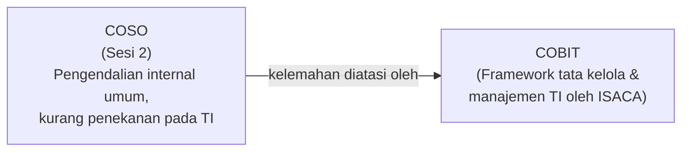

Meskipun awalnya diluncurkan sebagai panduan untuk membantu profesional **auditor TI internal dan eksternal** yang meninjau kontrol internal terkait TI, COBIT saat ini telah berkembang menjadi alat yang berguna untuk **menilai tata kelola TI** dan **mengevaluasi semua kontrol internal** di seluruh perusahaan.

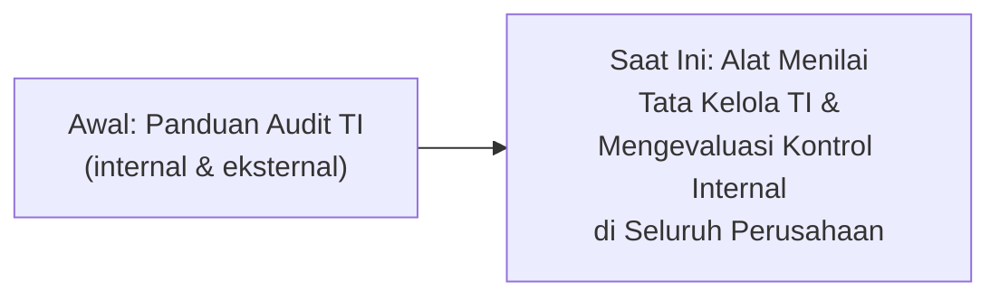

> Kaitan dengan Sesi 2: COBIT **tidak menggantikan** COSO secara total, melainkan **melengkapi** COSO dengan penekanan yang lebih kuat pada konteks TI — sehingga organisasi modern umumnya menggunakan **kombinasi** COSO (pengendalian internal umum) dan COBIT (tata kelola & manajemen TI spesifik).

### Contoh Penerapan COBIT 5

Berikut rekonstruksi contoh siklus penerapan COBIT 5 dari materi asli:

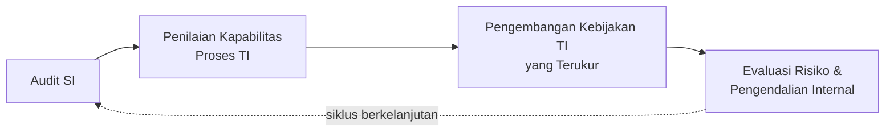

| Tahap | Penjelasan |
|---|---|
| **Audit SI** | Memeriksa sistem informasi untuk menilai kepatuhan dan efektivitas kontrol yang ada. |
| **Penilaian Kapabilitas Proses TI** | Mengevaluasi sejauh mana proses TI organisasi sudah matang dan mampu memberikan hasil yang konsisten. |
| **Pengembangan Kebijakan TI yang Terukur** | Menyusun kebijakan TI yang dilengkapi dengan metrik/indikator yang dapat diukur keberhasilannya. |
| **Evaluasi Risiko dan Pengendalian Internal** | Menilai risiko yang dihadapi serta efektivitas pengendalian internal yang sudah diterapkan. |

---

## 2. Manfaat Penerapan Kerangka Kerja COBIT

Melalui penerapan pedoman kerangka kerja COBIT yang efektif, perusahaan harus mencapai:

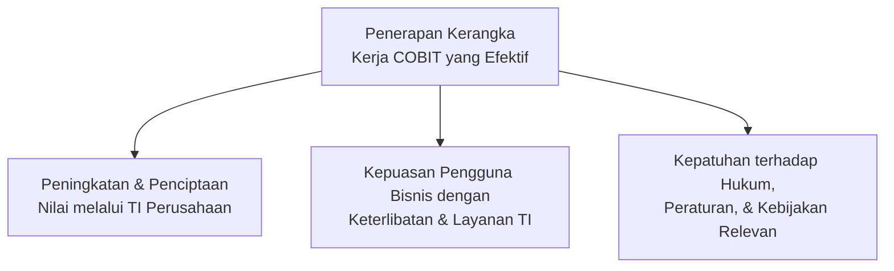

Manfaat-manfaat ini pada dasarnya merupakan **wujud nyata dari lima elemen kunci** tata kelola TI berikut, yang akan dibahas lebih rinci sebagai *5 Prinsip COBIT* pada bagian 3:

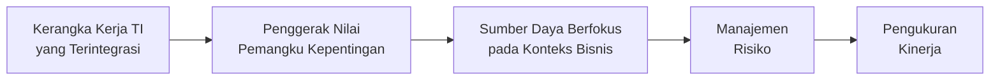

---

## 3. Lima Prinsip COBIT

Lima prinsip COBIT (atau area penekanan) menentukan elemen kerangka kerja COBIT dan memberikan definisi untuk elemen kunci **tata kelola TI**. Kerangka kerja COBIT adalah alat yang efektif untuk mendokumentasikan TI dan semua kontrol internal lainnya, dan digunakan untuk membantu proses tata kelola TI dalam **manajemen, perusahaan, dan audit internal**.

### Diagram Lima Prinsip COBIT (Moeller, 2013)

Berikut rekonstruksi diagram "bunga" lima prinsip COBIT, dengan **COBIT IT Governance Principles** sebagai inti yang dikelilingi oleh kelima prinsipnya:

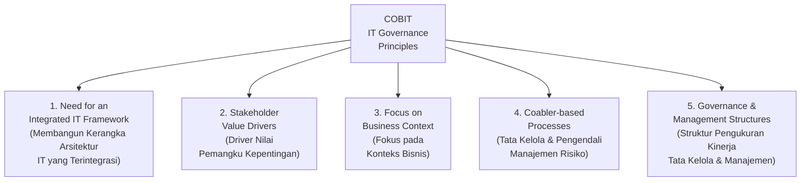

| Prinsip | Penjelasan |
|---|---|
| **1. Membangun Kerangka Arsitektur IT yang Terintegrasi** | Memastikan seluruh elemen TI (proses, struktur, teknologi) terhubung dalam satu kerangka kerja yang konsisten, bukan terpisah-pisah. |
| **2. Driver Nilai Pemangku Kepentingan** | Tata kelola TI harus didorong oleh kebutuhan dan harapan nilai dari para pemangku kepentingan (*stakeholders*), bukan semata-mata kebutuhan teknis. |
| **3. Fokus pada Konteks Bisnis** | Sumber daya dan keputusan TI harus selalu mempertimbangkan konteks bisnis tempat TI tersebut beroperasi. |
| **4. Tata Kelola dan Pengendali Manajemen Risiko** | Proses-proses TI (*coabler-based processes*) harus terintegrasi dengan mekanisme tata kelola dan pengendalian risiko. |
| **5. Struktur Pengukuran Kinerja Tata Kelola dan Manajemen** | Diperlukan struktur yang jelas untuk mengukur kinerja, baik dari sisi tata kelola maupun manajemen TI. |

> Diagram berbentuk "bunga" ini secara visual menekankan bahwa **kelima prinsip ini saling melengkapi** dan semuanya berpusat pada satu inti yang sama: **prinsip tata kelola TI COBIT** — tidak ada satu prinsip yang berdiri sendiri tanpa keempat prinsip lainnya.

---

## 4. Tujuan COBIT 5

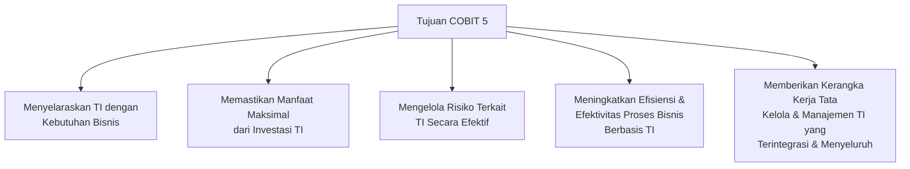

> Tujuan COBIT 5 ini selaras dan saling memperkuat dengan **Tujuan Tata Kelola** yang sudah dibahas pada Sesi 2 — keduanya menekankan **penyelarasan TI dengan bisnis**, **optimalisasi nilai investasi**, dan **manajemen risiko yang efektif**, namun COBIT memberikan kerangka kerja yang lebih **spesifik dan operasional** untuk mencapainya.

---

## 5. IT Service Management (ITSM)

> **ITSM** (*IT Service Management*) adalah keseluruhan disiplin atau proses untuk mengelola sistem TI yang **berpusat pada perspektif pelanggan** tentang kontribusi TI terhadap bisnis.

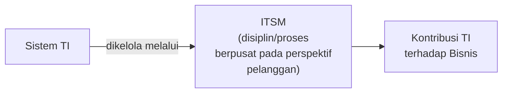

### COBIT vs ITIL

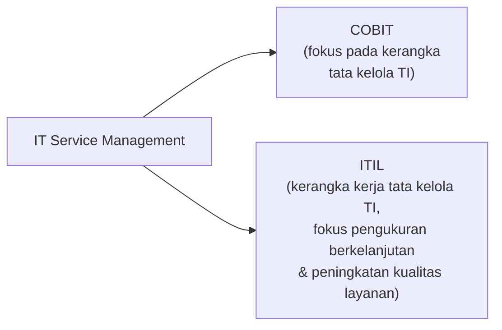

> **COBIT** fokus pada kerangka **tata kelola TI**, sementara **ITIL** menyediakan kerangka kerja untuk **tata kelola TI** dan berfokus pada **pengukuran berkelanjutan** dan **peningkatan kualitas layanan TI** yang diberikan, baik dari perspektif bisnis maupun pelanggan.

---

## 6. ITIL (*Information Technology Infrastructure Library*)

**ITIL** adalah kumpulan **praktik terbaik TI** yang independen dan diperbaharui secara berkala, yang pertama kali diakui secara luas oleh operasi TI di **Inggris**.

### Cakupan ITIL

Praktik terbaik penyampaian layanan ITIL mencakup apa yang sering disebut **infrastruktur TI proses pendukung** yang memungkinkan aplikasi TI berfungsi dan menyampaikan hasilnya kepada pengguna sistem.

> **Masalah umum:** terlalu sering, manajemen perusahaan memusatkan perhatiannya pada sisi **pengembangan aplikasi** proses TI dan **mengabaikan proses penyampaian layanan pendukung** yang penting.

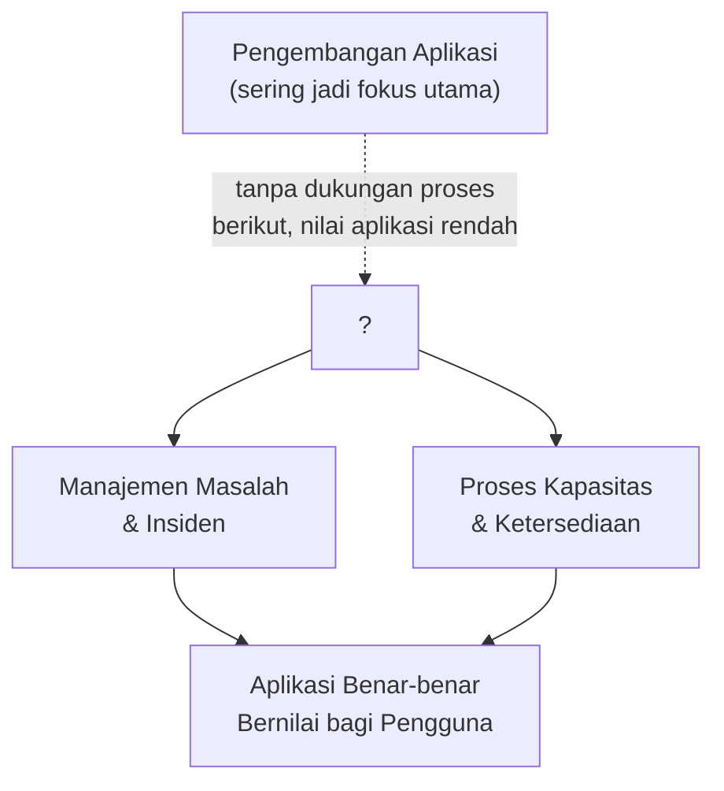

> **Contoh dari materi asli:** sebuah perusahaan dapat melakukan upaya besar-besaran untuk membangun dan menerapkan **sistem peramalan anggaran** yang baru, tetapi penerapan tersebut akan **bernilai kecil** kecuali ada proses yang baik — seperti **manajemen masalah dan insiden** (agar pengguna dapat melaporkan kesulitan sistem) dan proses **kapasitas dan ketersediaan** yang baik (agar aplikasi baru berjalan seperti yang diharapkan).
>
> Proses-proses ITIL ini semua adalah bagian dari **infrastruktur TI**, dan aplikasi yang dirancang dengan baik dan terkontrol dengan baik **hanya memiliki sedikit nilai** bagi penggunanya tanpa dukungan layanan dan proses pengiriman yang kuat.

### Manfaat ITIL

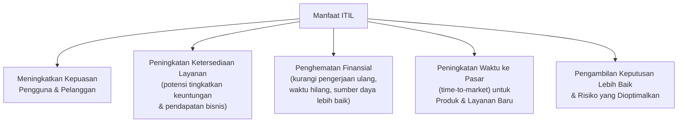

| Manfaat | Penjelasan |
|---|---|
| **Kepuasan Pengguna & Pelanggan** | Meningkatkan kepuasan pengguna dan pelanggan dengan layanan TI yang diberikan. |
| **Peningkatan Ketersediaan Layanan** | Berpotensi langsung meningkatkan keuntungan dan pendapatan bisnis. |
| **Penghematan Finansial** | Dari pengurangan pengerjaan ulang, waktu yang hilang, serta pengelolaan dan penggunaan sumber daya yang lebih baik. |
| **Peningkatan Waktu ke Pasar** | Untuk aspek TI dari produk dan layanan baru. |
| **Pengambilan Keputusan & Risiko** | Pengambilan keputusan yang lebih baik dan risiko yang dioptimalkan untuk semua proses terkait TI. |

> Manfaat **penghematan finansial** dan **risiko yang dioptimalkan** ini melengkapi konsep **manajemen risiko TI** (Sesi 1, bagian 7) — ITIL menunjukkan bahwa pengelolaan layanan TI yang baik bukan hanya soal teknis, tetapi juga berdampak langsung pada **kinerja finansial** organisasi.

---

## Ringkasan Keterkaitan Antar Konsep

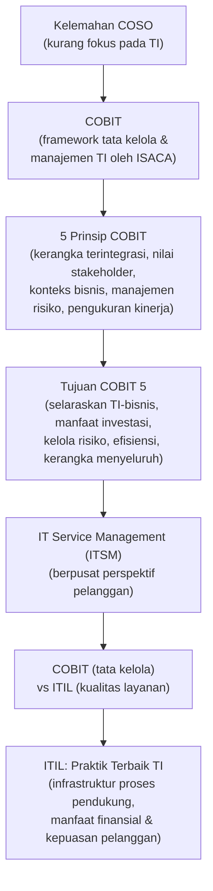

Inti dari sesi ini: **COBIT** lahir sebagai jawaban atas kelemahan COSO yang kurang menekankan aspek TI, menyediakan **lima prinsip** dan **kerangka tata kelola TI** yang menyeluruh. Sementara itu, **ITSM dan ITIL** melengkapi COBIT dari sisi **operasional layanan** — menekankan bahwa pengembangan aplikasi TI yang canggih sekalipun **tidak akan bernilai banyak** tanpa dukungan proses penyampaian layanan yang kuat (manajemen insiden, kapasitas, ketersediaan). Kombinasi COBIT (tata kelola) dan ITIL (manajemen layanan) inilah yang membentuk ekosistem tata kelola TI yang utuh — dari level kebijakan strategis hingga level operasional layanan harian.

---

*Terima kasih*
