# Sesi 4 — Cloud Computing, Tata Kelola, Keamanan IT, dan Manajemen Kontinuitas

**MSIM4402 Tata Kelola Teknologi Informasi**
Program Studi Sistem Informasi — Universitas Terbuka

> Catatan: dokumen ini merupakan ekstraksi sekaligus elaborasi dari materi *Inisiasi 4 — Cloud Computing, Tata Kelola, Keamanan IT, dan Manajemen Kontinuitas*. Sebagian besar konten asli tersimpan dalam SmartArt (diagram tersembunyi pada file presentasi) dan telah diekstrak serta digambarkan ulang dengan mermaid. Setiap poin dijelaskan lebih dalam dengan konteks dan contoh agar lebih mudah dipahami secara utuh.

---

## 1. Cloud Computing

### Manfaat Komputasi Awan

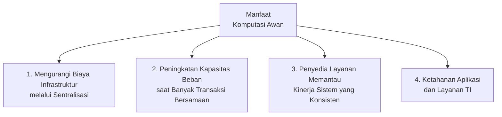

| Manfaat | Penjelasan |
|---|---|
| **Mengurangi Biaya Infrastruktur** | Melalui sentralisasi — organisasi tidak perlu membangun dan memelihara infrastruktur sendiri secara penuh. |
| **Peningkatan Kapasitas Beban** | Saat banyak transaksi berjalan secara bersamaan, kapasitas dapat ditingkatkan secara elastis. |
| **Pemantauan Kinerja Konsisten** | Penyedia layanan (*cloud provider*) memantau kinerja sistem secara konsisten. |
| **Ketahanan Aplikasi dan Layanan TI** | Aplikasi dan layanan TI menjadi lebih tahan terhadap gangguan/kegagalan. |

> Kaitan dengan Sesi 1: manfaat-manfaat ini secara langsung mendukung **Manfaat Rencana Strategis SI** (Sesi 1, bagian 9) — terutama poin "mengalokasikan sumber daya SI secara efektif dan efisien" dan "mengurangi tenaga dan uang sepanjang siklus hidup sistem".

### Tujuh Area dalam Memilih Penyedia Layanan Cloud Computing

Saat memilih penyedia layanan *cloud computing*, terdapat **tujuh area** yang harus diperhatikan:

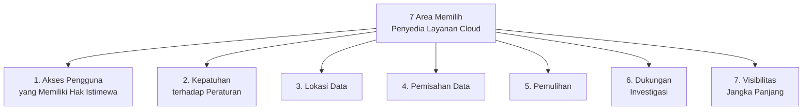

| Area | Penjelasan |
|---|---|
| **Akses Pengguna Berhak Istimewa** | Siapa yang memiliki akses administratif/istimewa terhadap data di sisi penyedia layanan. |
| **Kepatuhan terhadap Peraturan** | Apakah penyedia layanan memenuhi regulasi yang relevan bagi organisasi pengguna. |
| **Lokasi Data** | Di mana secara fisik/geografis data organisasi disimpan (relevan untuk kepatuhan hukum lintas negara). |
| **Pemisahan Data** | Bagaimana data organisasi dipisahkan dari data milik penyewa (*tenant*) lain pada infrastruktur bersama. |
| **Pemulihan** | Kemampuan penyedia layanan untuk memulihkan data/layanan setelah terjadi gangguan. |
| **Dukungan Investigasi** | Kemampuan penyedia layanan mendukung investigasi (misalnya forensik digital) bila diperlukan. |
| **Visibilitas Jangka Panjang** | Kejelasan dan transparansi praktik penyedia layanan dalam jangka panjang, termasuk kelangsungan bisnis penyedia itu sendiri. |

---

## 2. Virtualisasi TI

Terdapat istilah **virtualisasi TI** dalam tata kelola TI berbasis *cloud*. Virtualisasi TI memiliki lima jenis utama:

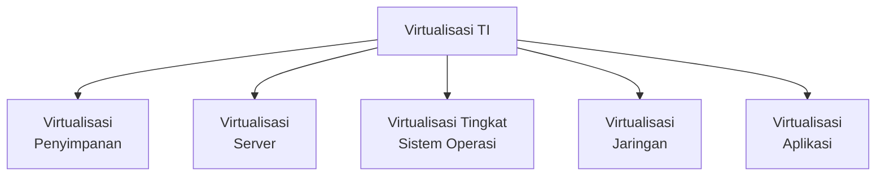

| Jenis Virtualisasi | Penjelasan Singkat |
|---|---|
| **Virtualisasi Penyimpanan** | Menggabungkan beberapa perangkat penyimpanan fisik menjadi satu kesatuan logis yang dapat dikelola secara terpusat. |
| **Virtualisasi Server** | Satu server fisik dapat menjalankan beberapa server virtual yang berjalan independen. |
| **Virtualisasi Tingkat Sistem Operasi** | Menjalankan beberapa instance sistem operasi terisolasi di atas satu kernel yang sama. |
| **Virtualisasi Jaringan** | Memisahkan infrastruktur jaringan fisik menjadi beberapa jaringan virtual yang independen. |
| **Virtualisasi Aplikasi** | Menjalankan aplikasi dalam lingkungan terisolasi tanpa instalasi langsung pada sistem operasi host. |

### Praktik Virtualisasi Tata Kelola TI yang Ideal (Bagian 1)

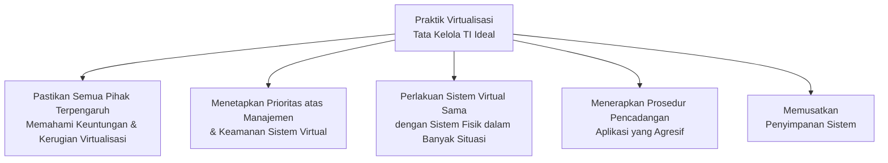

### Praktik Virtualisasi Tata Kelola TI yang Ideal (Bagian 2)

Sistem virtual harus diimplementasikan dengan serangkaian **kebijakan dan praktik tata kelola** yang dirancang dengan baik untuk memastikan bahwa data sistem virtual memenuhi lima kriteria:

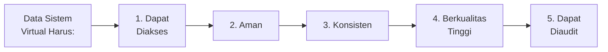

> Kelima kriteria ini (dapat diakses, aman, konsisten, berkualitas tinggi, dapat diaudit) sejalan dengan komponen **Lingkungan Kontrol** dan **Aktivitas Pengendalian** pada COSO (Sesi 2) — virtualisasi tidak mengubah prinsip dasar pengendalian internal, hanya menerapkannya dalam konteks infrastruktur yang bersifat virtual.

---

## 3. IT Governance dan SOA (*Service Oriented Architecture*)

Tata kelola TI akan berhubungan dengan komputasi awan karena sebagian perusahaan sudah menggunakan komputasi awan dengan beberapa manfaat seperti: mengurangi biaya infrastruktur karena sentralisasi, peningkatan kapasitas beban puncak, dan kinerja sistem yang konsisten dipantau oleh penyedia layanan.

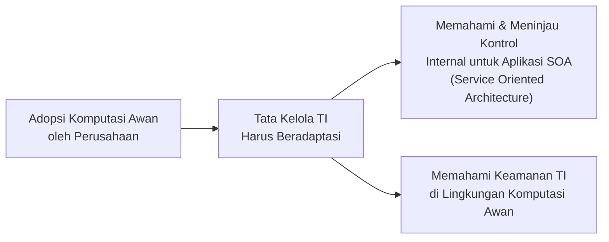

> Manajer perusahaan yang menerapkan tata kelola TI perlu mengambil **pendekatan berbeda** dalam meninjau kontrol internal untuk aplikasi **SOA** (*Service Oriented Architecture*), serta memahami keamanan TI di lingkungan komputasi awan — karena arsitektur berbasis layanan dan *cloud* tidak dapat ditinjau dengan cara yang sama seperti infrastruktur TI tradisional yang dimiliki dan dikendalikan penuh oleh organisasi.

---

## 4. Manajemen Tata Kelola TI di Era Komputasi Awan

### Masalah Utama Tata Kelola TI dan Jaminan Komputasi Awan

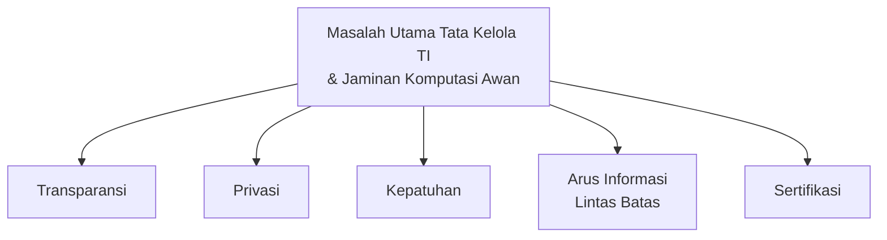

Tim manajemen yang bertanggung jawab atas tata kelola TI perusahaan harus mendapatkan **jaminan** di beberapa dari tujuh area berikut (sama dengan tujuh area pada bagian 1):

> Akses pengguna yang memiliki hak istimewa, kepatuhan terhadap peraturan, lokasi data, pemisahan data, pemulihan, dukungan investigasi, dan viabilitas jangka panjang.

### Kebijakan dan Kontrol Baru Terkait Virtualisasi

Terkait dengan tata kelola TI, virtualisasi memiliki keunikan yang memerlukan **kebijakan dan kontrol baru**:

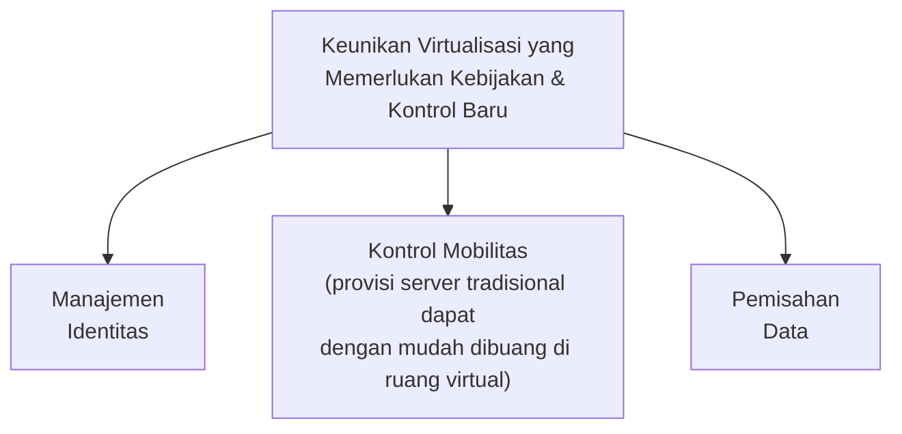

> Poin **kontrol mobilitas** menunjukkan perbedaan mendasar antara dunia fisik dan virtual: di lingkungan virtual, server dapat dibuat dan **dibuang/dihapus** dengan sangat mudah (*easily discarded*) — sehingga jejak audit dan kontrol yang dirancang untuk server fisik permanen tidak lagi cukup, perlu kebijakan baru yang mengantisipasi sifat sementara (*ephemeral*) dari sumber daya virtual.

---

## 5. GASSP (*Generally Accepted System Security Principles*)

**Information System Security Association (ISC)²** (sebuah organisasi internasional) telah mengembangkan **GASSP** (*Generally Accepted System Security Principles*), dengan versi **2.0** yang dirilis pada tahun **1999**.

Sesuai dengan namanya, prinsip-prinsip ini **diterima secara umum** — artinya, mereka mewakili konsep yang umumnya digunakan saat ini untuk mengamankan sumber daya TI.

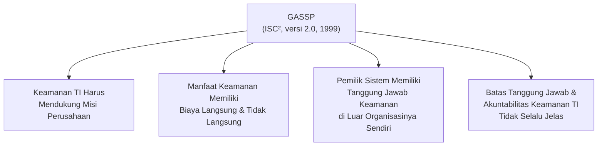

| Prinsip | Penjelasan |
|---|---|
| **Mendukung Misi Perusahaan** | Keamanan TI bukan tujuan itu sendiri, melainkan harus mendukung pencapaian misi/tujuan bisnis perusahaan. |
| **Biaya Langsung & Tidak Langsung** | Setiap manfaat keamanan memiliki konsekuensi biaya, baik yang langsung terlihat maupun tersembunyi. |
| **Tanggung Jawab Lintas Organisasi** | Pemilik sistem memiliki tanggung jawab keamanan yang dapat berdampak **di luar** organisasinya sendiri (misalnya terhadap mitra, pelanggan, atau masyarakat luas). |
| **Batas Tanggung Jawab Tidak Selalu Jelas** | Perbedaan antara **tanggung jawab** (*responsibility*) dan **akuntabilitas** (*accountability*) untuk keamanan TI seringkali kabur/tidak jelas batasnya. |

> Prinsip keempat ini berkaitan dengan **Dasar Pembuatan Keputusan Etis** (Inisiasi 3, STSI4207) yang membedakan **tanggung jawab, akuntabilitas, dan liabilitas** — GASSP menegaskan bahwa dalam praktik keamanan TI nyata, batas-batas konsep ini seringkali tidak sejelas definisi teoretisnya.

---

## 6. BCP (*Business Continuity Planning*)

**Business Continuity Planning (BCP)** adalah perencanaan untuk memastikan organisasi dapat **terus beroperasi** ketika menghadapi gangguan/bencana.

### Pembentukan Tim BCP

Di bawah kepemimpinan fungsi perusahaan yang diberi tanggung jawab atas BCP perusahaan, sebuah **tim harus dibentuk** untuk mengembangkan kebijakan keberlangsungan bisnis bagi perusahaan, termasuk:

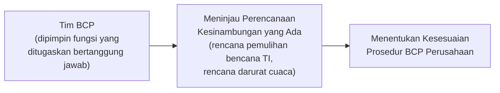

### Analisis Kompleksitas Saling Ketergantungan

**Kompleksitas saling ketergantungan** pada layanan, proses bisnis, data, dan teknologi perlu dianalisis, dengan **strategi yang tepat** dipilih untuk memenuhi kebutuhan:

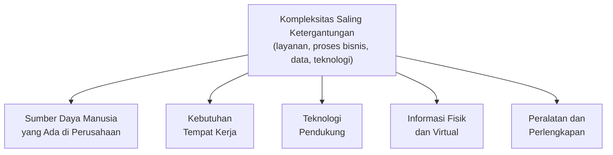

> Kelima kebutuhan ini menunjukkan bahwa **BCP tidak hanya soal teknologi** (rencana pemulihan bencana TI) — ia juga harus mempertimbangkan dimensi **manusia** (SDM), **fisik** (tempat kerja, peralatan), dan **informasi** (fisik maupun virtual) secara menyeluruh. Ini melengkapi konsep **Disaster Recovery Planning (DRP)** dan **Dimensi Risiko Proyek** yang sudah dibahas pada STSI4207 (Inisiasi 5 & 8) — BCP berada pada level yang lebih luas, mencakup kelangsungan **bisnis secara keseluruhan**, bukan hanya pemulihan sistem TI semata.

---

## Ringkasan Keterkaitan Antar Konsep

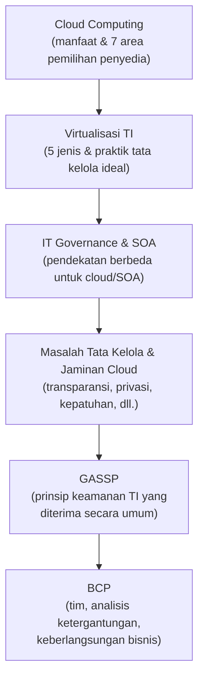

Inti dari sesi ini: adopsi **komputasi awan dan virtualisasi** membawa perubahan besar pada cara tata kelola TI harus diterapkan — kontrol internal tradisional yang dirancang untuk infrastruktur fisik permanen tidak lagi cukup untuk lingkungan virtual yang bersifat sementara dan terdistribusi di pihak ketiga (penyedia *cloud*). Organisasi harus memperhatikan **tujuh area jaminan** saat memilih penyedia layanan, menerapkan **prinsip keamanan yang diterima secara umum** (GASSP), dan memastikan **kelangsungan bisnis** (BCP) yang mempertimbangkan bukan hanya teknologi, tetapi juga manusia, tempat kerja, dan informasi secara menyeluruh.

---

*Terima kasih*
