# Sesi 5 — Efektivitas Sistem Tata Kelola TI

**MSIM4402 Tata Kelola Teknologi Informasi**
Program Studi Sistem Informasi — Universitas Terbuka

> Catatan: dokumen ini merupakan ekstraksi sekaligus elaborasi dari materi *Inisiasi 5 — Efektivitas Sistem Tata Kelola TI*. Sebagian besar konten asli tersimpan dalam SmartArt (diagram tersembunyi pada file presentasi) dan telah diekstrak serta digambarkan ulang dengan mermaid. Setiap poin dijelaskan lebih dalam dengan konteks dan contoh agar lebih mudah dipahami secara utuh.

---

## 1. Apa itu SOA?

**SOA** (*Service Oriented Architecture*) adalah pendekatan sistem TI di mana **logika bisnis aplikasi atau fungsi individu dimodulasi dan disajikan sebagai layanan** untuk aplikasi konsumen/klien.

> Konsep utama: layanan TI yang disediakan dan digabungkan **tidak bergantung pada implementasi aplikasi lainnya**.

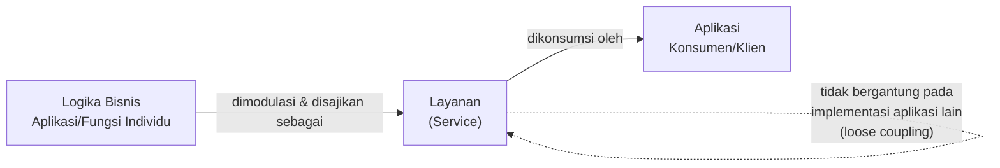

Beberapa konsep SOA penting saat membahas proses SOA:

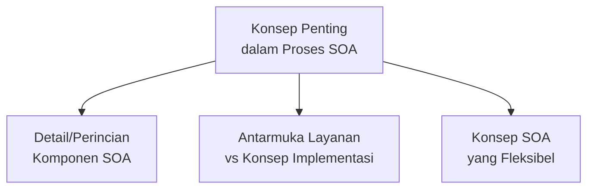

> Kaitan dengan Sesi 4: SOA sudah disinggung pada Sesi 4 (**IT Governance dan SOA**) sebagai salah satu hal yang harus dipahami manajer dalam konteks komputasi awan. Sesi ini membahas SOA secara lebih mendalam sebagai topik tersendiri.

---

## 2. Arsitektur Sistem Tata Kelola TI

### Aplikasi SOA

SOA merupakan arsitektur TI yang bertujuan untuk mencapai **kemudahan interaksi** di antara bagian perangkat lunak. SOA memungkinkan **interoperabilitas** antara sistem TI dan bahasa pemrograman yang berbeda, memberikan dasar untuk **integrasi antara aplikasi pada platform yang berbeda** melalui hubungan komunikasi jaringan.

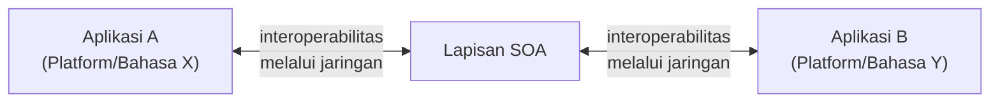

### Layanan Driven TI (*Service-Driven IT*)

**Layanan-*driven* TI** berorientasi pada layanan yang mendukung kebutuhan layanan bisnis. Dalam arsitektur sistem tata kelola TI, pendekatan layanan-*driven* mencakup:

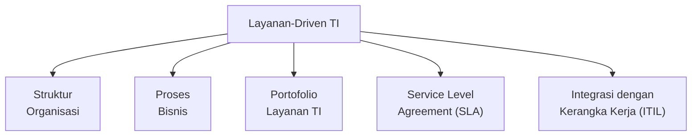

> Poin **integrasi dengan ITIL** ini menghubungkan kembali ke materi Sesi 3 — SOA dan ITIL bukan dua hal yang berdiri sendiri, melainkan **saling terintegrasi**: ITIL mengatur kualitas dan pengiriman layanan, sementara SOA mengatur bagaimana layanan tersebut diwujudkan secara teknis dalam arsitektur sistem.

---

## 3. Empat Dampak Penerapan SOA pada Tata Kelola TI

Terdapat empat poin utama yang harus diperhatikan oleh IT dan manajemen dalam memindahkan sistem IT ke dalam layanan berorientasi arsitektur (SOA):

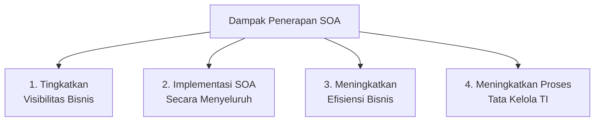

### 3.1 Tingkatkan Visibilitas Bisnis

SOA umumnya mengintegrasikan sistem yang ada dan menggabungkan data/informasi pelanggan yang lebih **konsisten dan akurat**, termasuk:

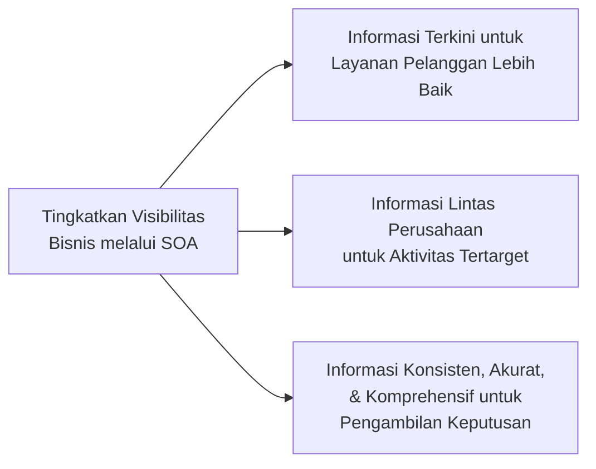

### 3.2 Implementasi SOA Secara Menyeluruh

SOA dapat membuat perangkat lunak yang terintegrasi dan infrastruktur untuk merespons kebutuhan bisnis dengan cepat:

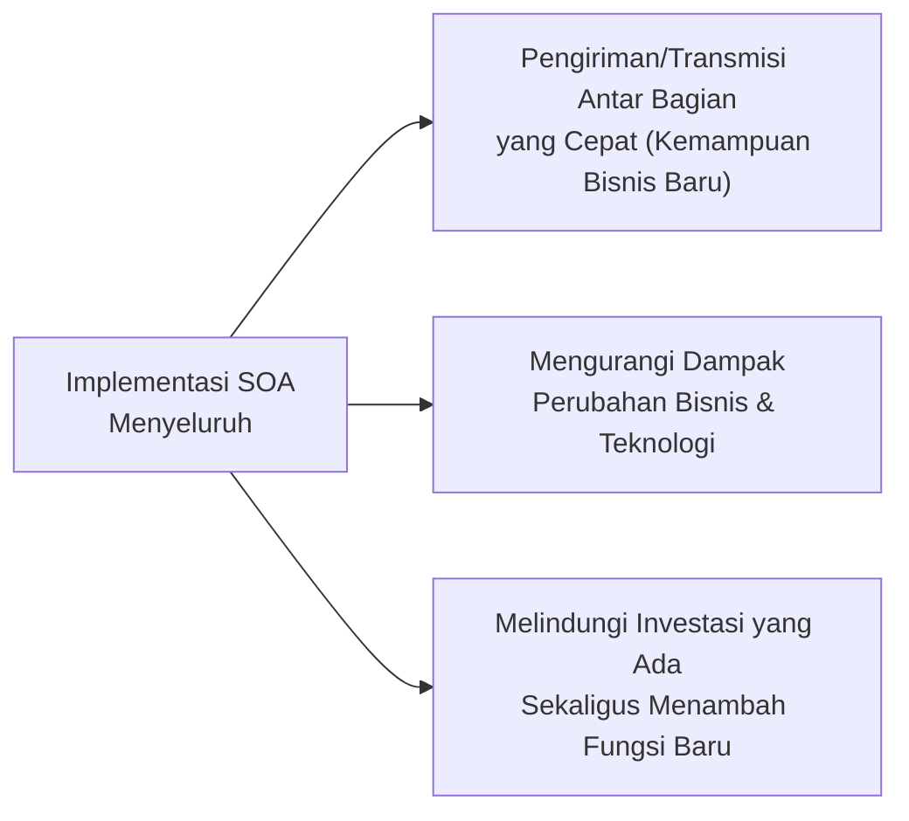

### 3.3 Meningkatkan Efisiensi Bisnis

Proses bisnis lebih efisien dengan SOA melalui proses yang disederhanakan, diotomatiskan, serta pelacakan dan visibilitas yang lebih baik:

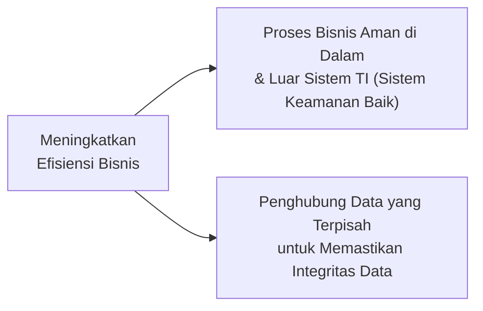

### 3.4 Meningkatkan Proses Tata Kelola TI

> Karena SOA mengklasifikasikan dan mengatur semua TI dengan proses yang lebih baik untuk perusahaan, maka **keseluruhan tata kelola dan kontrol proses** bisa dilakukan dan dikendalikan lebih baik.

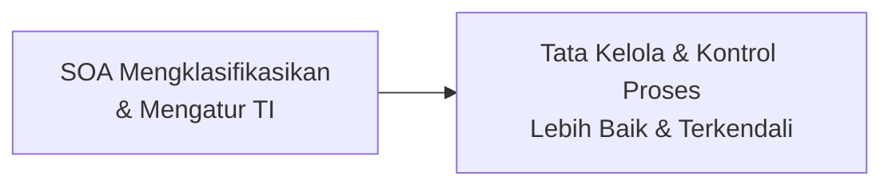

---

## 4. Konsep SOA

Beberapa konsep SOA yang penting bagi profesional TI dan manajemen, yang akan diperoleh saat membahas proses SOA:

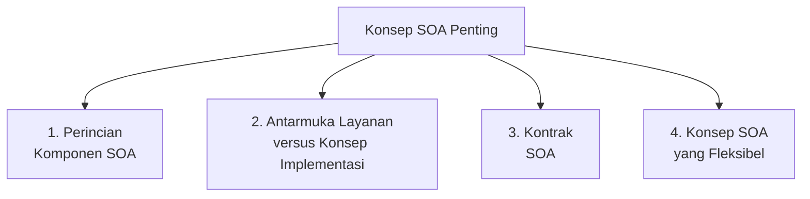

---

## 5. Membangun Blueprint Implementasi SOA

> **Kunci SOA yang efektif** adalah dengan mengidentifikasi rencana yang ada, atau membangun layanan menggunakan bagian yang akan menentukan implementasi SOA yang dibutuhkan.

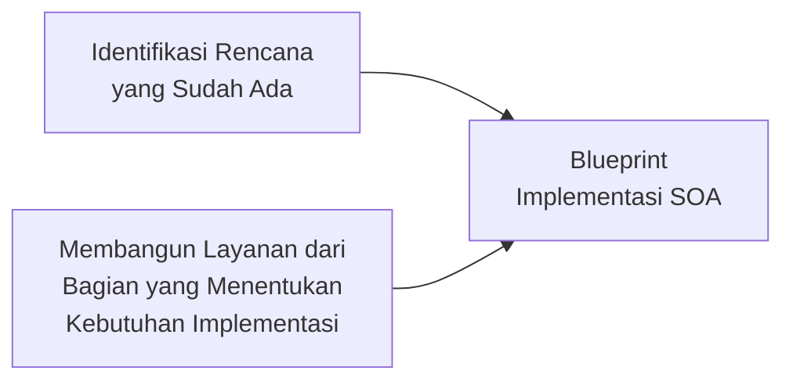

### Pemangku Kepentingan (*Stakeholder*) dalam SOA

Sebuah perusahaan yang menerapkan SOA harus mendefinisikan berbagai elemen layanan dan pemangku kepentingan layanan, termasuk alur kegiatan dan keputusan antara pemangku kepentingan yang terlibat dalam proses berikut:

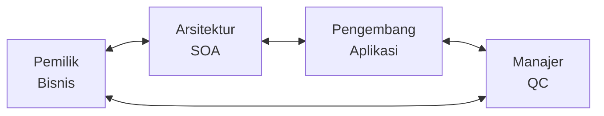

| Pemangku Kepentingan | Peran |
|---|---|
| **Pemilik Bisnis** | Menentukan kebutuhan bisnis yang harus dipenuhi oleh layanan. |
| **Arsitektur SOA** | Merancang struktur dan integrasi layanan secara teknis. |
| **Pengembang Aplikasi** | Membangun aplikasi/layanan sesuai dengan arsitektur yang dirancang. |
| **Manajer QC** (*Quality Control*) | Memastikan kualitas layanan yang dikembangkan memenuhi standar. |

---

## 6. Migrasi ke Lingkungan SOA: Perencanaan dan Kebijakan Baru

> Perusahaan **tidak pindah ke lingkungan TI SOA hanya dengan membeli paket perangkat lunak** dan melatih staf TI tentang penggunaannya. SOA lebih dari sekadar cara baru untuk mengatur sistem TI yang ada — ia membutuhkan **perencanaan rinci** untuk pindah ke lingkungan baru tersebut, serta **kebijakan dan prosedur TI baru**.

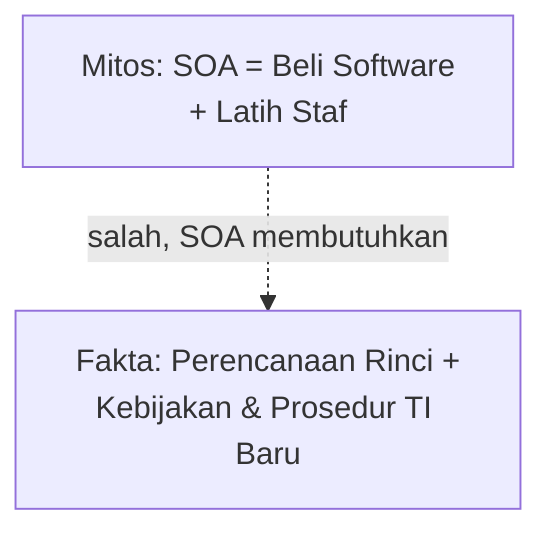

Sebagian besar kebijakan SOA bertujuan memastikan bahwa **layanan berperilaku sebagaimana mestinya** sesuai ekspektasi konsumen, termasuk:

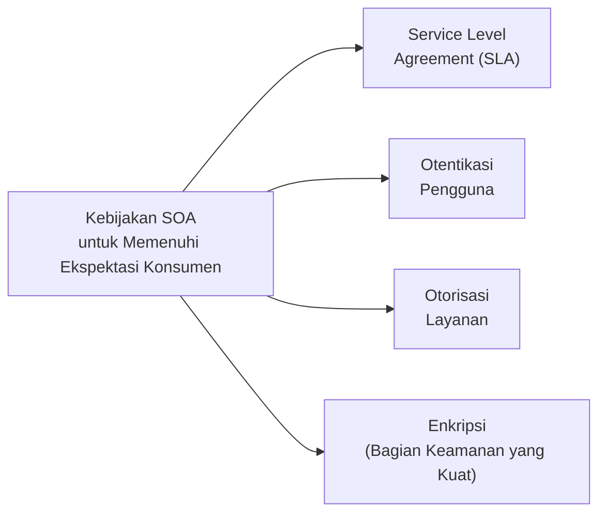

### Risiko Migrasi ke Layanan Web (*Web Services*)

Banyak perusahaan saat ini telah mengubah satu atau beberapa aplikasi kunci menjadi **layanan Web** dengan pendekatan seperti SOA — mengubah file aplikasi yang ada ke dalam lingkungan berbasis Web dan bergantung pada Web.

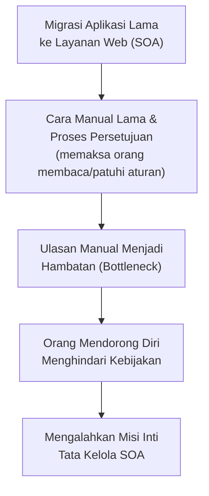

> Risiko ini penting untuk dipahami: tata kelola SOA yang **terlalu kaku/manual** dapat **menggagalkan dirinya sendiri** — alih-alih membuat layanan lebih teratur, prosedur yang membebani justru mendorong orang **menghindari** kebijakan tata kelola, sehingga misi inti tata kelola SOA (keteraturan dan kontrol) tidak tercapai.

---

## 7. Manajemen Konfigurasi TI (*IT Configuration Management*)

Seluruh perakitan komponen TI dikenal sebagai **konfigurasi TI perusahaan**. Sebagai elemen penting dari proses tata kelola TI, harus ada mekanisme untuk mengelola **kompatibilitas dan status komponen konfigurasi TI** ini, sehingga mereka dapat berhubungan dan berkomunikasi satu sama lain.

> **IEEE** mendefinisikan manajemen konfigurasi TI sebagai proses organisasi TI yang mengandung lima elemen:

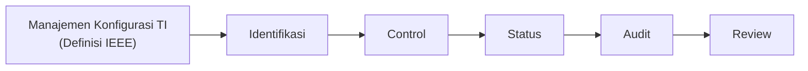

Untuk mencapai manajemen konfigurasi TI yang efektif, perusahaan dan fungsi TI-nya harus memiliki proses yang dapat:

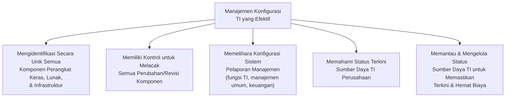

### Inventaris TI dan Kebijakan Produk TI

Setelah diimplementasikan secara efektif, **inventaris** juga harus memberikan informasi kepada manajemen dan fungsi area TI untuk penyelidikan lebih lanjut di area kebijakan produk TI, mencakup:

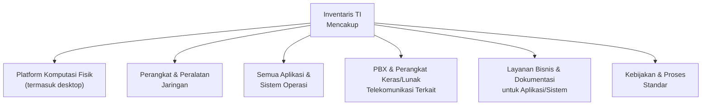

Proyek manajemen konfigurasi TI harus menyertakan **empat elemen**:

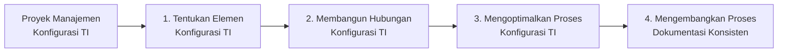

### CMDB (*Configuration Management Database*)

**CMDB** harus terdiri dari elemen/komponen berikut:

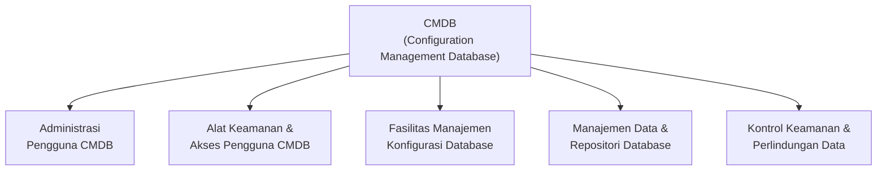

> Manajemen konfigurasi TI dan CMDB ini melengkapi konsep **Virtualisasi TI** (Sesi 4) — di lingkungan virtual, komponen TI dapat dibuat dan dihapus dengan sangat mudah, sehingga **manajemen konfigurasi yang akurat dan real-time** menjadi semakin krusial untuk menjaga visibilitas terhadap seluruh sumber daya TI organisasi.

---

## 8. Kontrol Pembangunan Sistem dan Implementasi ERP

### Kontrol Pembangunan Sistem yang Baik dan Umum

Perusahaan harus menggunakan kendali tata kelola TI dan prosedur untuk memastikan bahwa **teknik pembangunan sistem yang tepat** digunakan selama fase desain dan pengembangan aplikasi baru TI dalam metodologi terstruktur:

```mermaid
flowchart TD
    KONTROL3["Kontrol Pembangunan\nSistem yang Baik & Umum"] --> KP1["Aplikasi Sesuai, Fleksibel,\n& Memenuhi Kebutuhan Bisnis"]
    KONTROL3 --> KP2["Menetapkan Aturan\nTI Perusahaan"]
    KONTROL3 --> KP3["Menerapkan Pelatihan Awal\n& Berkelanjutan untuk Sistem TI"]
    KONTROL3 --> KP4["Menetapkan Standar Fungsi TI\nuntuk Aplikasi yang Dikembangkan"]
```

### Pertimbangan Tata Kelola TI saat Menerapkan ERP

Dari perspektif tata kelola TI, ada beberapa poin penting yang perlu dipertimbangkan kapan menerapkan **database ERP** untuk suatu perusahaan:

```mermaid
flowchart LR
    ERP3["Implementasi\nERP"] --> E1["1. Mendefinisikan Tujuan\n& Persyaratan ERP"]
    E1 --> E2["2. Membangun Tim Proyek\nLintas Fungsi"]
    E2 --> E3["3. Mengenali Biaya & Waktu\nyang Dibutuhkan"]
    E3 --> E4["4. Memilih Produk\nPerangkat Lunak ERP"]
    E4 --> E5["5. Menerapkan Teknik\nManajemen Proyek Formal"]
```

> Lima langkah implementasi ERP ini melengkapi pembahasan **Implementasi Sistem Informasi dalam Bisnis** (STSI4207, Inisiasi 7) yang sudah membahas arsitektur umum ERP — di sini fokusnya pada **tata kelola proses implementasinya**, bukan hanya arsitektur akhirnya.

---

## Ringkasan Keterkaitan Antar Konsep

```mermaid
flowchart TD
    DEFSOA["Apa itu SOA?\n(layanan independen dari implementasi)"] --> ARSITEKTUR["Arsitektur Sistem Tata Kelola TI\n(interoperabilitas, layanan-driven)"]
    ARSITEKTUR --> DAMPAK2["4 Dampak SOA\n(visibilitas, implementasi, efisiensi, tata kelola)"]
    DAMPAK2 --> KONSEPSOA["Konsep & Blueprint SOA\n(stakeholder, perencanaan, kebijakan baru)"]
    KONSEPSOA --> RISIKOMIGRASI["Risiko Migrasi ke Web Services\n(governance gagal jika terlalu kaku)"]
    RISIKOMIGRASI --> MK2["Manajemen Konfigurasi TI\n(IEEE: identifikasi-control-status-audit-review)"]
    MK2 --> CMDB3["Inventaris TI & CMDB"]
    CMDB3 --> KONTROLSISTEM["Kontrol Pembangunan Sistem\n& Implementasi ERP"]
```

Inti dari sesi ini: **SOA** menawarkan fleksibilitas besar bagi organisasi melalui layanan yang independen dan dapat dikombinasikan kembali, tetapi keberhasilannya **sangat bergantung pada tata kelola yang tepat** — mulai dari perencanaan blueprint, kebijakan baru (SLA, otentikasi, otorisasi, enkripsi), hingga manajemen konfigurasi TI yang akurat (didukung CMDB). Tata kelola SOA yang terlalu kaku justru dapat **menggagalkan dirinya sendiri** dengan mendorong staf menghindari kebijakan, sehingga keseimbangan antara **kontrol yang cukup** dan **kemudahan kepatuhan** menjadi kunci efektivitas sistem tata kelola TI secara keseluruhan — termasuk saat organisasi menerapkan sistem skala besar seperti ERP.

---

*Terima kasih*
