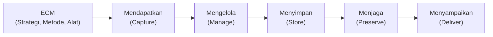
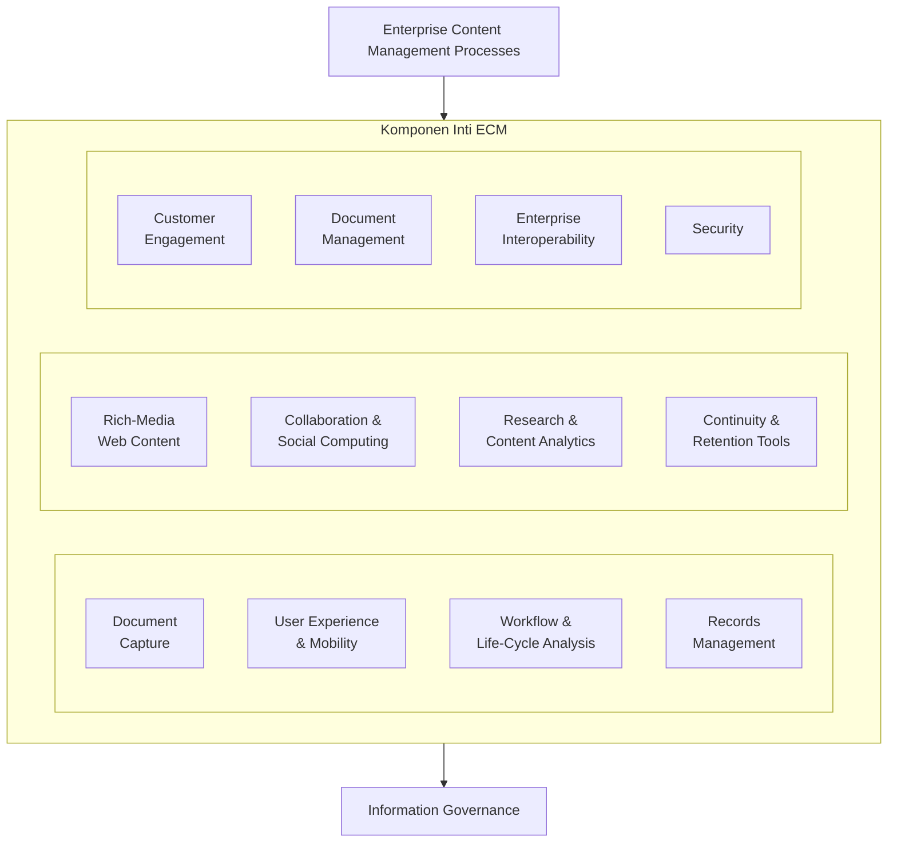
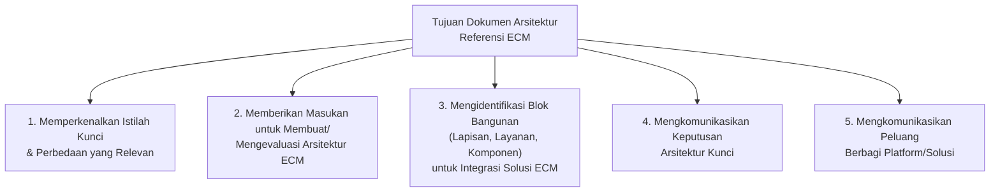
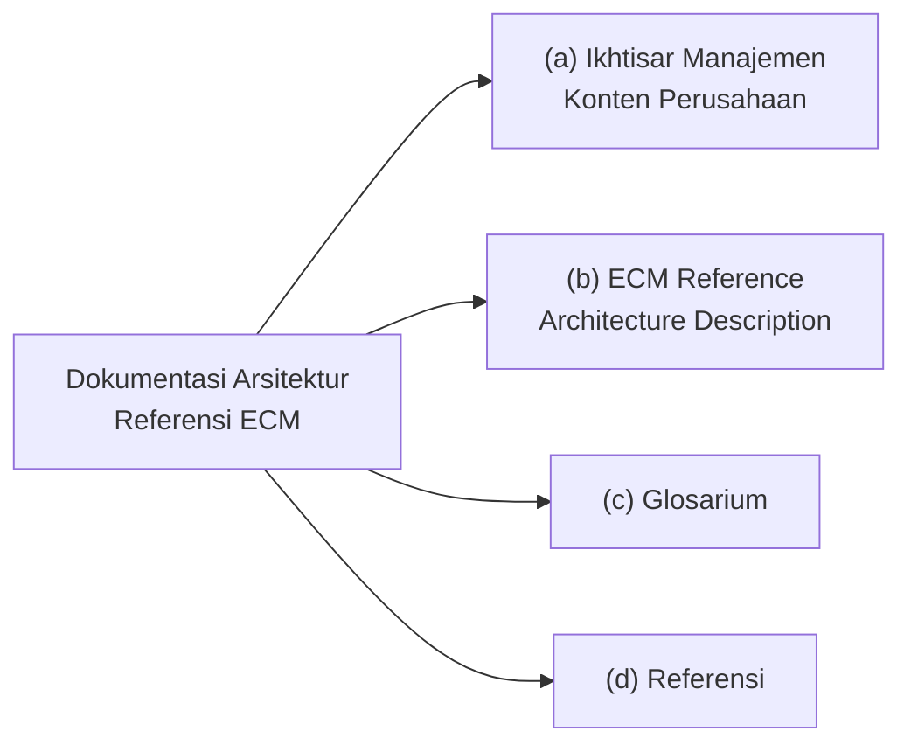
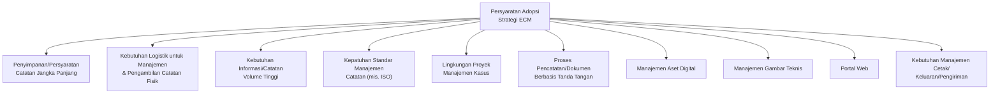
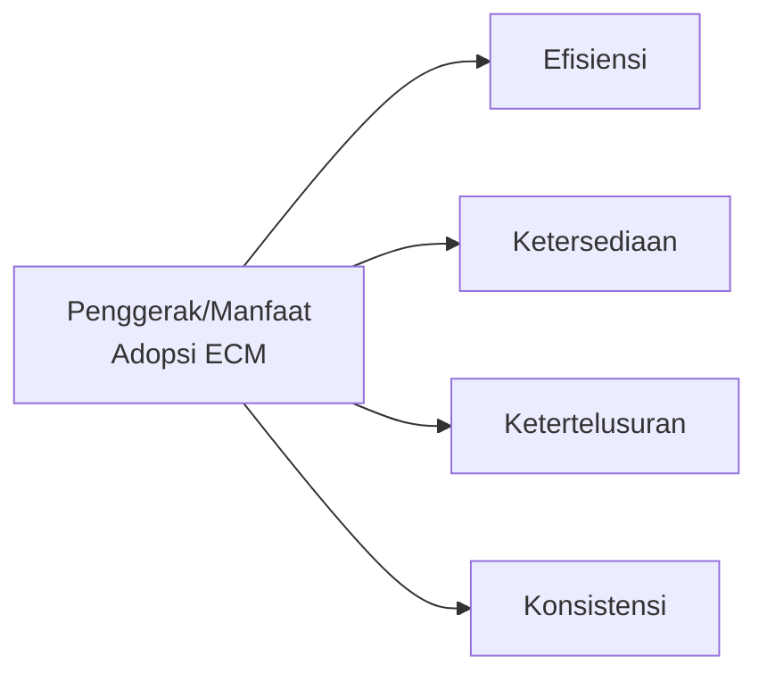
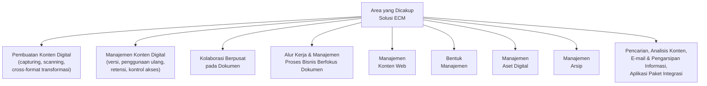
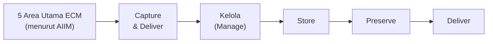
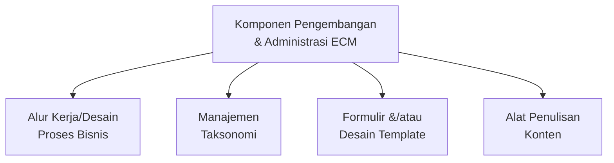
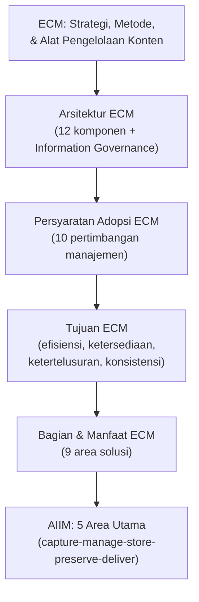

# Peran Manajemen dalam Tata Kelola TI

**MSIM4402 Tata Kelola Teknologi Informasi — Inisiasi 6**
Program Studi Sistem Informasi — Universitas Terbuka

Materi ini membahas **Enterprise Content Management (ECM)** sebagai salah satu wujud konkret peran manajemen dalam tata kelola TI — bagaimana organisasi mendapatkan, mengelola, menyimpan, menjaga, dan menyampaikan konten/dokumen yang terkait dengan proses bisnisnya.

| | |
|---|---|
| **Topik Utama** | ECM Process, Arsitektur ECM, Tujuan ECM, Bagian & Manfaat ECM, AIIM |
| **Sumber Diagram** | Moeller (2013) |

> Catatan: sebagian besar konten asli tersimpan dalam SmartArt (diagram tersembunyi pada file presentasi) dan telah diekstrak serta digambarkan ulang dengan mermaid.

---

## 1. ECM Process

> ***Enterprise Content Management Processes* (ECM)** menjelaskan **strategi, metode, dan alat** yang digunakan untuk **mendapatkan, mengelola, menyimpan, menjaga, dan menyampaikan** konten dan dokumen yang terkait dengan proses organisasi.

| Proses | Penjelasan |
|---|---|
| **Mendapatkan** | Memperoleh konten/dokumen dari berbagai sumber ke dalam sistem ECM. |
| **Mengelola** | Mengatur dan mengorganisasikan konten agar mudah ditemukan dan digunakan. |
| **Menyimpan** | Menempatkan konten dalam repositori yang aman dan terstruktur. |
| **Menjaga** | Memastikan konten tetap utuh dan dapat diakses dalam jangka panjang. |
| **Menyampaikan** | Mendistribusikan konten kepada pihak yang membutuhkan, kapan dan di mana diperlukan. |

> Kaitan dengan Sesi 5: ECM melengkapi **Manajemen Konfigurasi TI** yang sudah dibahas pada Sesi 5 — keduanya sama-sama berurusan dengan pengelolaan aset informasi organisasi secara terstruktur, namun ECM berfokus pada **konten/dokumen**, sementara manajemen konfigurasi TI berfokus pada **komponen perangkat keras dan lunak**.

---

## 2. Arsitektur ECM

Berikut rekonstruksi diagram **ECM Architecture** (Moeller, 2013), yang menggambarkan bagaimana proses ECM disusun secara berlapis:

| Lapisan | Isi |
|---|---|
| **Lapisan Atas** | *Enterprise Content Management Processes* — payung proses ECM secara keseluruhan. |
| **Lapisan Tengah (12 komponen, 3x4)** | *Document Capture*, *User Experience & Mobility*, *Workflow & Life-Cycle Analysis*, *Records Management*, *Rich-Media Web Content*, *Collaboration & Social Computing*, *Research & Content Analytics*, *Continuity & Retention Tools*, *Customer Engagement*, *Document Management*, *Enterprise Interoperability*, *Security*. |
| **Lapisan Bawah** | *Information Governance* — fondasi tata kelola informasi yang mendasari seluruh komponen di atasnya. |

> Susunan ini menunjukkan bahwa **Information Governance** menjadi **fondasi** (bukan komponen tambahan) bagi seluruh arsitektur ECM — sejalan dengan filosofi tata kelola TI yang sudah dibahas sejak Sesi 1: tata kelola harus mendasari implementasi teknis, bukan ditambahkan setelahnya.

### Tujuan Dokumen Arsitektur Referensi ECM

### Struktur Dokumentasi Arsitektur Referensi ECM

Dokumentasi arsitektur referensi ECM memiliki empat bagian:

---

## 3. Menciptakan Lingkungan ECM yang Efektif dalam Perusahaan

Beberapa persyaratan yang harus dipertimbangkan manajemen ketika mengadopsi strategi ECM:

| Persyaratan | Penjelasan |
|---|---|
| Penyimpanan/persyaratan catatan jangka panjang | Memastikan dokumen dapat disimpan dan diakses dalam periode yang lama, sesuai kebutuhan bisnis/regulasi. |
| Kebutuhan logistik manajemen catatan fisik | Mengelola dokumen fisik (kertas) yang masih beredar di organisasi. |
| Kebutuhan informasi/catatan volume tinggi | Sistem harus mampu menangani jumlah dokumen yang sangat besar. |
| Kepatuhan standar manajemen catatan (ISO) | Mengikuti standar internasional dalam pengelolaan dokumen/catatan. |
| Lingkungan proyek manajemen kasus | Mendukung pengelolaan dokumen dalam konteks proyek atau kasus tertentu (*case management*). |
| Proses berbasis tanda tangan | Mendukung alur kerja yang memerlukan tanda tangan elektronik/digital. |
| Manajemen aset digital | Mengelola aset digital seperti gambar, video, dan media lain. |
| Manajemen gambar teknis | Mengelola dokumen teknis seperti gambar desain/*engineering drawing*. |
| Portal web | Menyediakan akses konten melalui portal berbasis web. |
| Manajemen cetak/keluaran/pengiriman | Mengelola proses pencetakan dan pengiriman dokumen ke pihak terkait. |

> Daftar ini menunjukkan bahwa **kebutuhan ECM sangat beragam** tergantung karakteristik organisasi — perusahaan dengan banyak dokumen fisik (misalnya rumah sakit dengan rekam medis) akan menekankan poin *logistik catatan fisik*, sementara perusahaan digital-native mungkin lebih menekankan *portal web* dan *manajemen aset digital*.

---

## 4. Tujuan ECM

Penggerak (*driver*) paling umum atau manfaat untuk adopsi ECM:

| Manfaat | Penjelasan |
|---|---|
| **Efisiensi** | Mengurangi waktu dan usaha dalam mengelola dan menemukan konten/dokumen. |
| **Ketersediaan** | Konten dapat diakses kapan saja oleh pihak yang berhak. |
| **Ketertelusuran** | Setiap perubahan dan akses terhadap konten dapat dilacak (*audit trail*). |
| **Konsistensi** | Versi dan format konten terjaga keseragamannya di seluruh organisasi. |

---

## 5. Bagian dan Manfaat ECM

Area yang dicakup oleh solusi ECM meliputi:

| Area | Penjelasan |
|---|---|
| **Pembuatan Konten Digital** | Menggunakan *capturing*, *scanning* (*product imaging*), atau transformasi lintas format. |
| **Manajemen Konten Digital** | Termasuk pembuatan versi, penggunaan ulang konten, kebijakan retensi, dan kontrol akses. |
| **Kolaborasi Berpusat pada Dokumen** | Memungkinkan banyak pihak berkolaborasi pada dokumen yang sama secara terkontrol. |
| **Alur Kerja & Manajemen Proses Bisnis** | Mengelola proses bisnis yang berfokus pada dokumen (misalnya alur persetujuan dokumen). |
| **Manajemen Konten Web** | Mengelola konten yang ditampilkan di situs web organisasi. |
| **Bentuk Manajemen** | Mengelola formulir digital dan proses pengisiannya. |
| **Manajemen Aset Digital** | Mengelola aset digital seperti gambar, video, audio. |
| **Manajemen Arsip** | Mengelola dokumen yang sudah tidak aktif namun perlu disimpan. |
| **Pencarian, Analisis Konten, dll.** | Mencakup pencarian, analisis konten, pengarsipan e-mail, serta aplikasi paket integrasi. |

---

## 6. AIIM (*Association for Information and Image Management*)

Menurut **AIIM**, ada **lima area utama** dalam ECM:

| Area | Penjelasan |
|---|---|
| **Capture and Deliver** | Mendapatkan konten dari berbagai sumber dan menyampaikannya ke pengguna. |
| **Kelola (*Manage*)** | Mengelola konten yang sudah didapat, termasuk pengorganisasian dan kontrol versi. |
| **Store** | Menyimpan konten dalam repositori yang sesuai. |
| **Preserve** | Menjaga konten tetap utuh dan dapat diakses dalam jangka panjang. |
| **Deliver** | Mendistribusikan konten kepada pengguna akhir. |

> Lima area AIIM ini pada dasarnya **menjabarkan ulang** lima proses ECM yang sudah dibahas pada bagian 1 (*capture, manage, store, preserve, deliver*) — menegaskan bahwa kerangka kerja ini adalah standar yang **konsisten dan diakui luas** di industri manajemen konten.

### Komponen Pengembangan dan Administrasi ECM

---

## Ringkasan Keterkaitan Antar Konsep

Inti dari sesi ini: **ECM (Enterprise Content Management)** adalah salah satu pilar konkret tata kelola TI di level manajemen — ia menyatukan strategi, metode, dan alat untuk mengelola seluruh siklus hidup konten organisasi (dari pembuatan hingga pengarsipan), dengan **Information Governance** sebagai fondasi yang mendasari seluruh arsitekturnya. Adopsi ECM yang efektif membutuhkan pemahaman mendalam terhadap kebutuhan spesifik organisasi (volume dokumen, kepatuhan standar, kebutuhan logistik), serta keselarasan dengan kerangka kerja standar industri seperti yang didefinisikan oleh **AIIM**.
