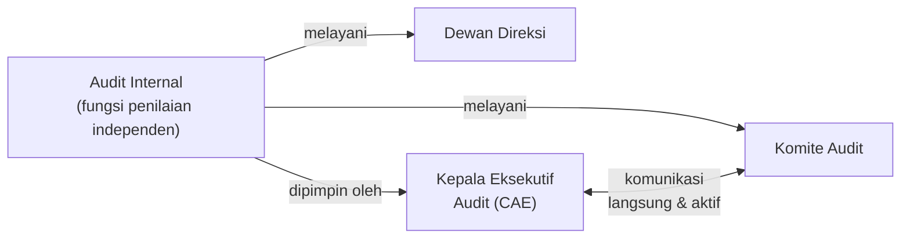
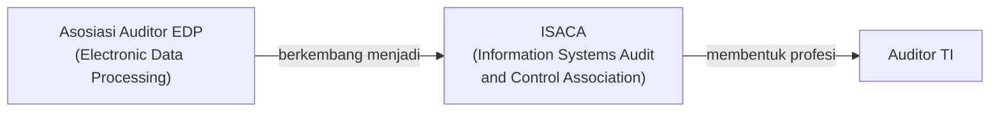
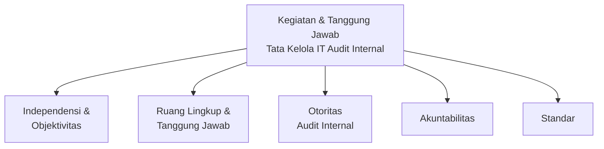
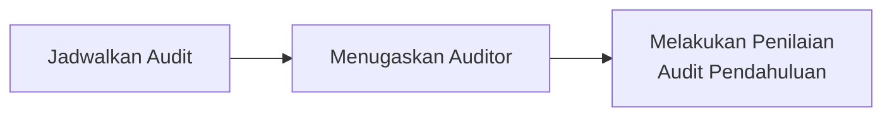
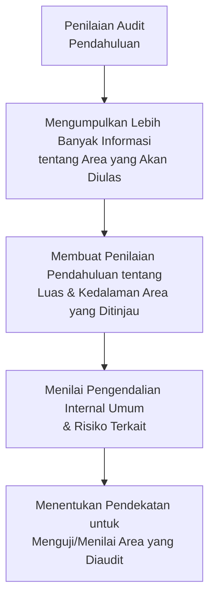
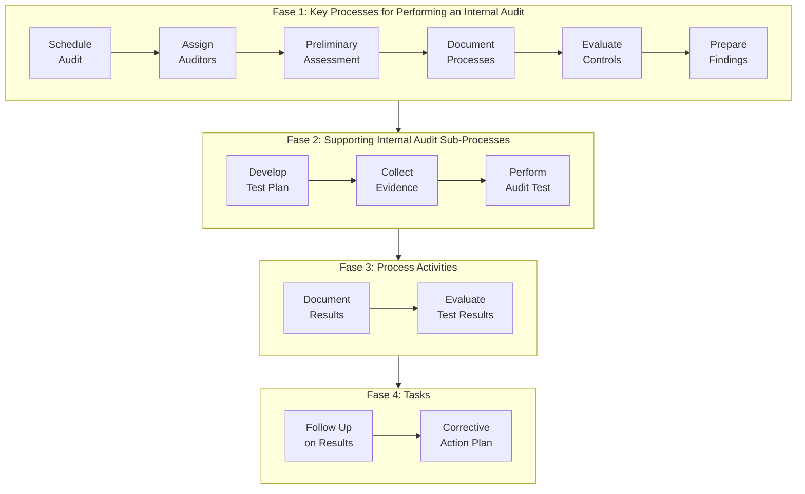
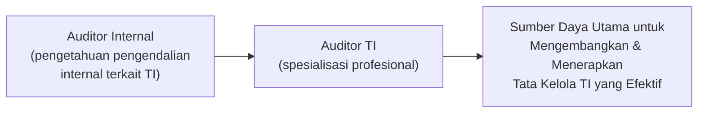
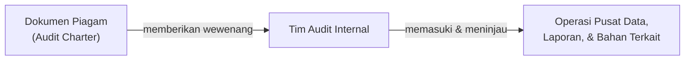
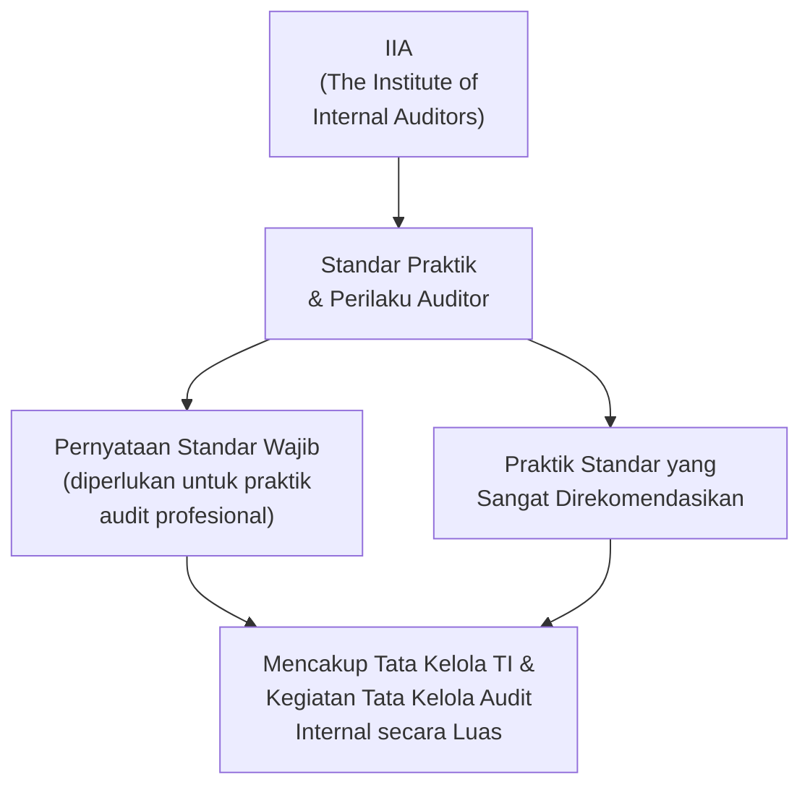
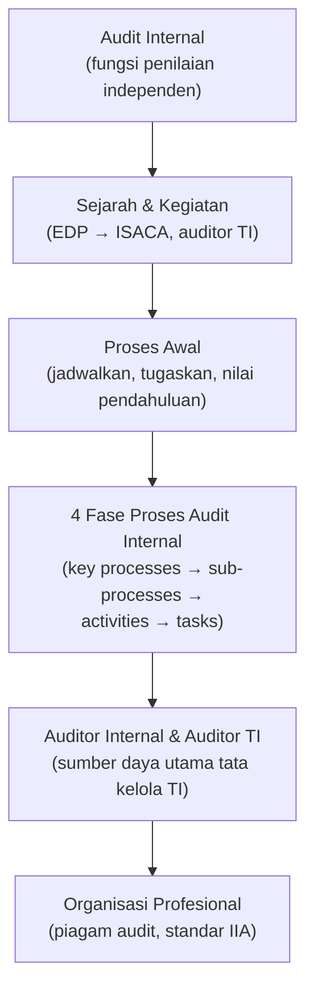

# Sesi 7 — Peran Audit Tata Kelola TI (IT Governance)

**MSIM4402 Tata Kelola Teknologi Informasi**
Program Studi Sistem Informasi — Universitas Terbuka

> Catatan: dokumen ini merupakan ekstraksi sekaligus elaborasi dari materi *Inisiasi 7 — Peran Audit Tata Kelola TI*. Sebagian besar konten asli tersimpan dalam SmartArt (diagram tersembunyi pada file presentasi) dan telah diekstrak serta digambarkan ulang dengan mermaid. Setiap poin dijelaskan lebih dalam dengan konteks dan contoh agar lebih mudah dipahami secara utuh.

---

## 1. Apa itu Audit Internal?

> **Audit internal** adalah fungsi **penilaian independen** yang dibentuk dalam suatu organisasi untuk **memeriksa dan mengevaluasi aktivitasnya** sebagai layanan bagi organisasi.

Auditor internal saat ini secara resmi dan aktif melayani **dewan direksi**, **komite audit**, dan **kepala eksekutif audit (CAE)** — yang saat ini juga memiliki level komunikasi langsung dan aktif dengan komite audit yang sama.

> Kaitan dengan Sesi 2: audit internal adalah **mekanisme pelaksana** dari komponen *Monitoring Internal Controls* pada kerangka kerja **COSO** (Sesi 2) — ia adalah fungsi yang secara aktif memeriksa apakah pengendalian internal organisasi (lingkungan kontrol, penilaian risiko, aktivitas pengendalian) benar-benar berjalan efektif.

### Sejarah Singkat dan Kegiatan Audit TI

Sebuah organisasi profesional baru, yang kemudian disebut **Asosiasi Auditor EDP**, dibentuk untuk mendukung para profesional audit internal baru ini. **EDP** adalah singkatan dari *electronic data processing*, istilah lawas untuk sistem dan proses TI.

Para profesional ini sekarang dikenal sebagai **auditor TI**, dan organisasi profesional utama mereka sekarang dikenal sebagai **Asosiasi Audit dan Pengendalian Sistem Informasi (ISACA)** — sebuah organisasi profesional tata kelola TI yang penting yang pertama kali diperkenalkan pada Sesi 3 sebagai pengembang kerangka kerja **COBIT**.

Kegiatan dan tanggung jawab tata kelola IT audit internal meliputi:

---

## 2. Audit Internal — Proses Penjadwalan dan Penugasan

*Process internal audit* meliputi **penjadwalan audit**, **penugasan auditor**, dan **melakukan penilaian audit awal/pendahuluan**.

### Jadwalkan Audit

Setelah rencana audit tahunan keseluruhan ditetapkan dan disetujui oleh **komite audit**, audit spesifik harus dijadwalkan, dengan pertimbangan yang diberikan pada **kebutuhan sumber daya audit**, **waktu auditee**, dan faktor lain.

### Menugaskan Auditor

Sumber daya sering kali langka di sini. Perhatian harus diberikan untuk menugaskan **spesialis audit TI** untuk penugasan yang sesuai, sementara auditor internal dengan keterampilan lain harus ditugaskan di mana yang paling sesuai.

### Melakukan Penilaian Audit Pendahuluan

Audit internal dapat menjadwalkan tinjauan untuk menilai pengendalian internal dari beberapa sistem/proses, tetapi sebelum memulai audit aktual, perlu untuk:

---

## 3. Proses Audit Internal

Berikut rekonstruksi diagram **Proses untuk Melakukan Audit Internal** (Moeller, 2013), yang diuraikan sebagai **empat ringkasan fase/langkah** berurutan:

| Fase | Langkah-langkah |
|---|---|
| **1. Key Processes for Performing an Internal Audit** | *Schedule Audit* → *Assign Auditors* → *Preliminary Assessment* → *Document Processes* → *Evaluate Controls* → *Prepare Findings*. |
| **2. Supporting Internal Audit Sub-Processes** | *Develop Test Plan* → *Collect Evidence* → *Perform Audit Test*. |
| **3. Process Activities** | *Document Results* → *Evaluate Test Results*. |
| **4. Tasks** | *Follow Up on Results* → *Corrective Action Plan*. |

> Perhatikan bahwa **Fase 1** ("Key Processes") pada diagram ini sebenarnya sudah mencakup ringkasan dari ketiga fase berikutnya: *Preliminary Assessment* berkaitan dengan bagian 2 (penilaian pendahuluan), *Evaluate Controls* berkaitan dengan Fase 2 dan 3 (pengujian dan evaluasi hasil), dan *Prepare Findings* mengarah ke Fase 4 (tindak lanjut dan rencana perbaikan). Struktur berlapis ini menunjukkan bagaimana proses audit internal bekerja secara **hierarkis** — dari proses utama, diturunkan ke sub-proses pendukung, aktivitas konkret, hingga tugas-tugas spesifik di lapangan.

---

## 4. Auditor Internal

Auditor internal saat ini harus memiliki pengetahuan tentang **pengendalian internal terkait TI**. Selain itu, ada juga spesialisasi profesional yang kuat yang dikenal sebagai **auditor TI**. Para profesional ini merupakan **sumber daya utama** untuk mengembangkan dan menerapkan proses tata kelola TI yang kuat dan efektif.

> Profesi audit internal, melalui pengembangan dirinya sendiri dan dedikasi, telah berkontribusi pada **kemajuan tata kelola TI** dan telah menyiapkan diri untuk keberlanjutan — ini adalah komponen penting dari proses tata kelola TI yang efektif.

---

## 5. Organisasi Profesional Auditor Internal

Dari perspektif tata kelola TI, **dokumen piagam** (*audit charter*) akan memberikan **wewenang** kepada tim audit internal untuk memasuki dan meninjau kembali operasi pusat data dan laporan serta bahan yang diamankan yang merupakan bagian dari audit yang direncanakan.

### IIA (*The Institute of Internal Auditors*)

Organisasi profesional auditor internal, **IIA**, bertanggung jawab untuk menerbitkan **standar praktik dan perilaku** untuk semua auditor internal, yang pada dasarnya digunakan di seluruh dunia.

> Panduan otoritatif IIA ini merupakan **kombinasi** dari pernyataan standar wajib yang diperlukan untuk melanjutkan praktik audit profesional, ditambah serangkaian praktik standar yang sangat direkomendasikan. Standar IIA ini mencakup **tata kelola TI** dan kegiatan tata kelola audit internal secara luas.
>
> Kaitan dengan Sesi 3: jika **ISACA** mengembangkan kerangka kerja teknis seperti **COBIT** untuk tata kelola dan manajemen TI, maka **IIA** berperan menetapkan **standar profesi dan etika** bagi para auditor internal yang menjalankan pemeriksaan — kedua organisasi ini saling melengkapi dalam ekosistem tata kelola TI: satu menyediakan kerangka kerja yang diaudit, satu lagi menyediakan standar bagi yang mengaudit.

---

## Ringkasan Keterkaitan Antar Konsep

Inti dari sesi ini: **audit internal** adalah mekanisme **penjamin independen** yang memastikan tata kelola TI organisasi benar-benar berjalan sesuai kerangka kerja yang sudah dirancang (COSO, COBIT) — mulai dari penjadwalan dan penugasan auditor, menjalankan empat fase proses audit yang sistematis (proses utama, sub-proses pendukung, aktivitas, hingga tugas tindak lanjut), hingga didukung oleh **profesi dan standar formal** (ISACA untuk auditor TI, IIA untuk standar audit internal secara umum). Tanpa fungsi audit yang independen dan terstandarisasi ini, tata kelola TI yang sudah dirancang dengan baik sekalipun tidak ada cara untuk memverifikasi bahwa ia benar-benar **dijalankan secara efektif** dalam praktik.

---

*Terima kasih*
