# Sesi 8 — Tata Kelola TI & Budaya Perusahaan

**MSIM4402 Tata Kelola Teknologi Informasi**
Program Studi Sistem Informasi — Universitas Terbuka

> Catatan: dokumen ini merupakan ekstraksi sekaligus elaborasi dari materi *Inisiasi 8 — Tata Kelola TI & Budaya Perusahaan*, sesi penutup mata kuliah ini. Seluruh konten asli tersimpan dalam SmartArt (diagram tersembunyi pada file presentasi) dan telah diekstrak serta digambarkan ulang dengan mermaid. Setiap poin dijelaskan lebih dalam dengan konteks dan contoh agar lebih mudah dipahami secara utuh.

---

## 1. Tata Kelola dalam Perusahaan

### Visi, Misi, dan Tata Kelola TI

Setiap perusahaan, tidak peduli seberapa besar atau kecil, membutuhkan **pernyataan misi** yang menjelaskan tujuan dan nilainya secara keseluruhan. Ini harus menjadi **sumber arahan** — sebuah **kompas** — yang memberi tahu karyawan, pelanggan, pemegang saham, dan pemangku kepentingan lainnya, dan **tata kelola TI harus menjadi bagian penting dari visi perusahaan**.

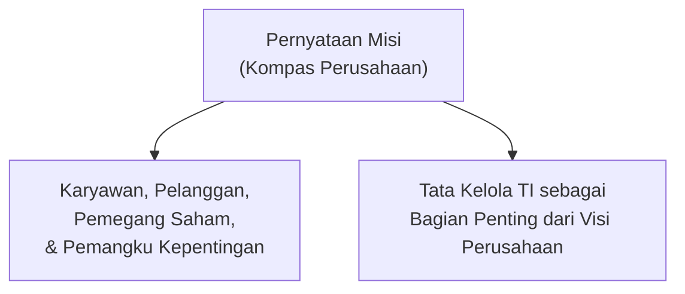

Sementara pernyataan misi yang kuat dan efektif merupakan elemen kunci dalam keseluruhan struktur tata kelola perusahaan, **kode etik** memberikan **aturan pendukung** bagi pemangku kepentingan perusahaan.

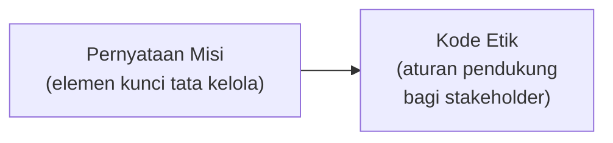

### Whistleblowing

**Whistleblowing** merupakan elemen/konsep penting dari tata kelola perusahaan.

> **Whistleblower** adalah pihak yang memberi tahu publik atau pihak berwenang tentang dugaan **ketidakjujuran atau aktivitas ilegal** yang terjadi di departemen pemerintah, perusahaan swasta, atau publik.

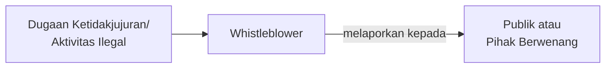

> Kaitan dengan Sesi 7: *whistleblowing* adalah salah satu mekanisme yang melengkapi **fungsi audit internal** — di mana audit bekerja secara terjadwal dan sistematis, *whistleblowing* menyediakan jalur pelaporan **ad-hoc** dari dalam organisasi ketika ada penyimpangan yang mungkin tidak terdeteksi oleh proses audit reguler.

---

## 2. Tata Kelola Perusahaan

### Program Etika sebagai Elemen Kunci

Program etika yang kuat, berdasarkan pernyataan misi dan kode etik yang bermakna, merupakan **elemen kunci** untuk program tata kelola perusahaan secara keseluruhan. Program etika yang kuat akan meningkatkan praktik tata kelola perusahaan secara keseluruhan, **tidak hanya pada orang-orang di kantor eksekutif**.

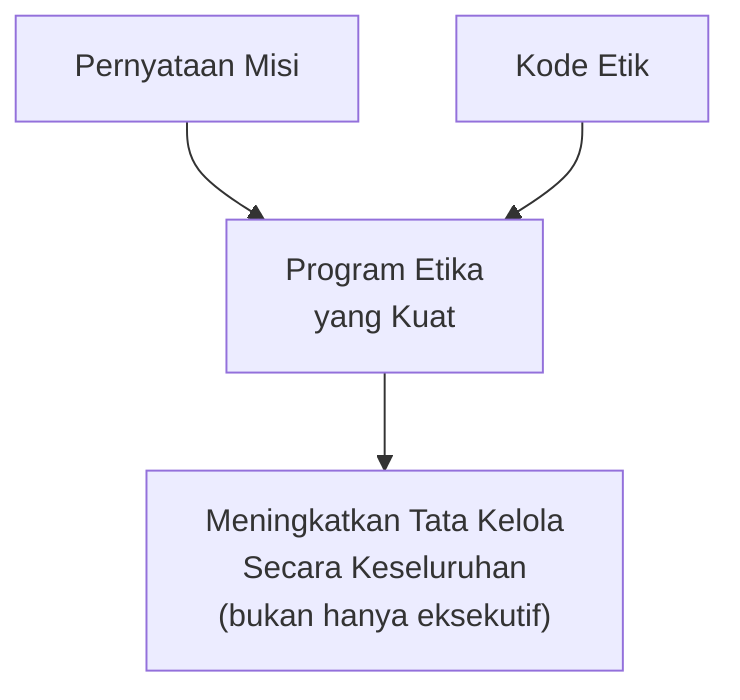

### Integrasi Tata Kelola TI ke Operasi Inti Bisnis

Tujuan perusahaan merupakan **penjabaran detail** dari visi dan misi perusahaan, sehingga tata kelola TI harus menjadi **bagian dari tata kelola perusahaan**. Proses tata kelola TI seharusnya **diintegrasikan ke dalam operasi inti bisnis** perusahaan — di mana pengelolaan setiap anak perusahaan atau unit bisnis menjadi **tanggung jawab** untuk memastikan proses tata kelola TI yang tepat.

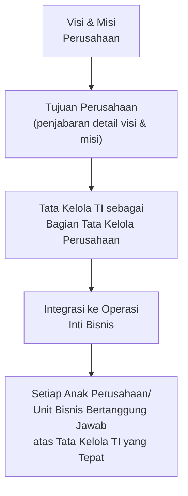

### Kode Etik

Kode etik harus berupa **seperangkat aturan atau pedoman yang jelas dan tidak ambigu**, yang menguraikan apa yang diharapkan dari anggota perusahaan — baik pejabat, karyawan, kontraktor, vendor, atau pemangku kepentingan lainnya.

Contoh topik kode etik:

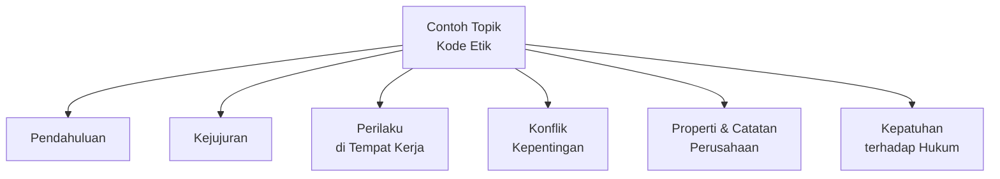

Kode etik baru dapat dikomunikasikan melalui beberapa metode:

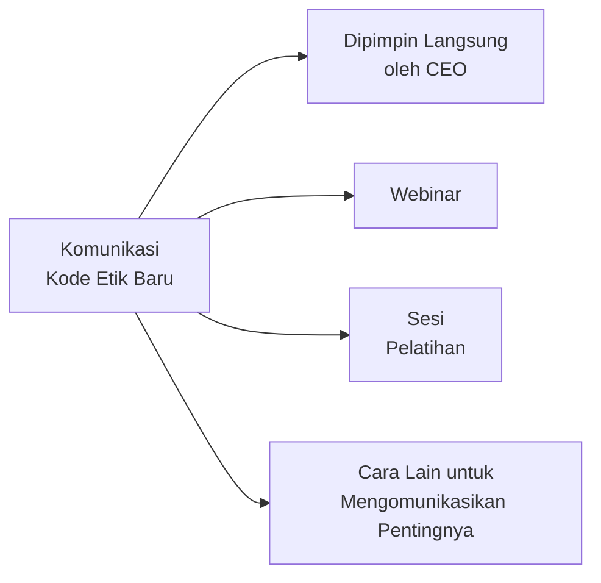

### Peninjauan Berkala dan Strategi Etika

Perusahaan harus meninjau kode etik yang diterbitkan **secara berkala**, dan setidaknya **setiap dua tahun**, untuk memastikan bahwa pedoman tersebut masih berlaku dan terkini.

Lima tindakan berikut harus dipertimbangkan sebagai bagian dari peluncuran strategi etika dan *whistleblower* yang efektif untuk seluruh perusahaan:

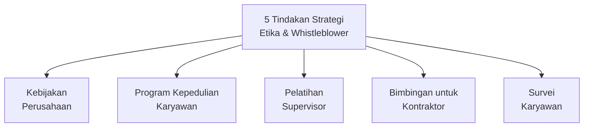

---

## 3. Dampak dari Sosial Media Computing

### Apa itu Media Sosial Computing?

> Sistem atau aplikasi media sosial adalah **layanan online, platform, atau situs IT** yang berfokus dalam membangun **jaringan atau hubungan** antara kelompok orang atau pengguna yang memiliki **minat dan/atau aktivitas yang sama**.

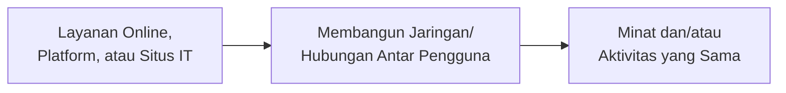

### Dua Sisi Dampak Media Sosial bagi Perusahaan

Dampak dari *social media computing* bagi perusahaan dapat dilihat dari dua sisi:

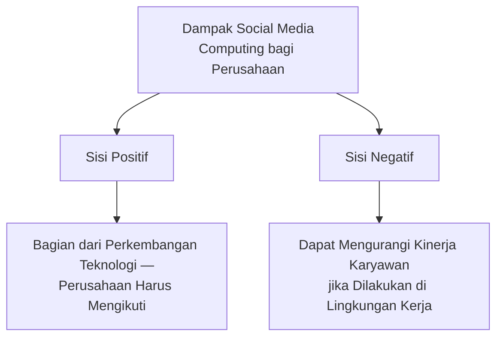

### Media Social Counter — Risiko dan Kerentanan

> **Media social counter** adalah akibat buruk yang disebabkan oleh penggunaan media sosial di lingkungan perusahaan.

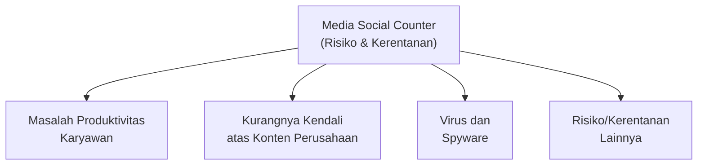

> **Kebijakan media sosial** merupakan sebuah aturan yang dibuat untuk dapat **mengurangi dampak negatif** dari media sosial bagi perusahaan.

### Sistem Media Sosial sebagai Sumber Risiko Tata Kelola TI

Sistem media sosial adalah alat yang hebat untuk komunikasi. Namun, aplikasi komputasi jaringan sosial seringkali dapat meningkatkan **masalah tata kelola TI** saat digunakan dalam lingkungan bisnis perusahaan.

> Situs media sosial sering kali tampak bersahabat dan berada **di luar layar kendali** banyak sistem bisnis, proses, dan masalah. Mereka terlalu sering dipandang sebagai **pengalihan karyawan** (misalnya, upaya bersama komite perencanaan untuk pesta liburan tahunan), padahal masalah media sosial bisa **lebih dari sekadar pesan sosial yang bersahabat** — karena orang lain dapat melihat lalu lintas pesan ini dan berpotensi memulai berbagai tindakan berdasarkan komunikasi tersebut.

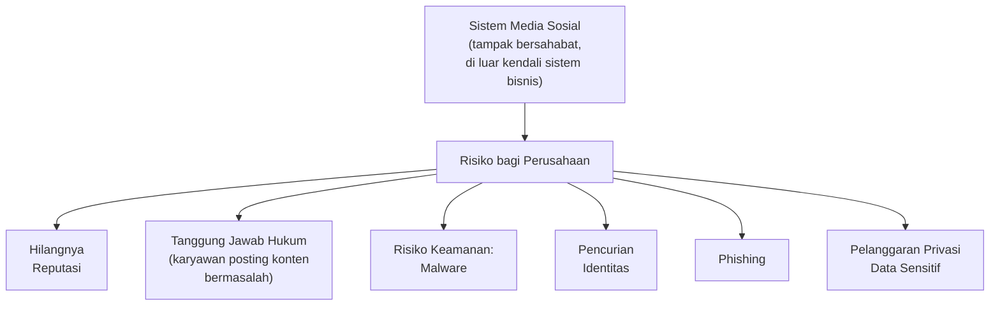

> Terkadang sistem media sosial dipandang sebagai sumber daya yang hampir terkait dengan **SDM**, seperti buletin perusahaan tidak resmi — padahal perusahaan menghadapi **banyak risiko nyata** di baliknya.

### Risiko dan Kekhawatiran Media Sosial Lainnya

Beberapa risiko dan kekhawatiran media sosial:

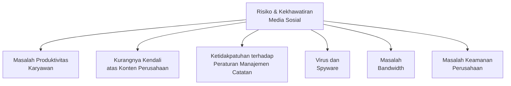

> Daftar ini melengkapi daftar **media social counter** sebelumnya, menambahkan dua poin baru: **ketidakpatuhan terhadap peraturan manajemen catatan** dan **masalah bandwidth** — menunjukkan bahwa dampak media sosial pada infrastruktur TI (bandwidth) dan kepatuhan (manajemen catatan/Sesi 6: ECM) juga harus diperhitungkan.

### Kebijakan Media Sosial

Terkait dengan kebijakan media sosial, perusahaan perlu menetapkan **praktik pendidikan**, menguraikan apa yang **boleh dan tidak boleh** dilakukan di berbagai sistem media sosial, serta beberapa kebijakan yang sangat spesifik yang meliputi penggunaan alat ini oleh pemangku kepentingan.

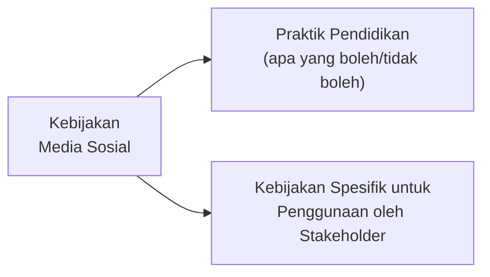

---

## 4. Komite Audit dan Fungsi Audit Internal

**Komite audit** merupakan bagian yang berwenang melakukan proses audit pada **level strategis** dan mempunyai peran penting dengan tata kelola TI, karena akan ada **singgungan** antara proses audit dengan tata kelola TI.

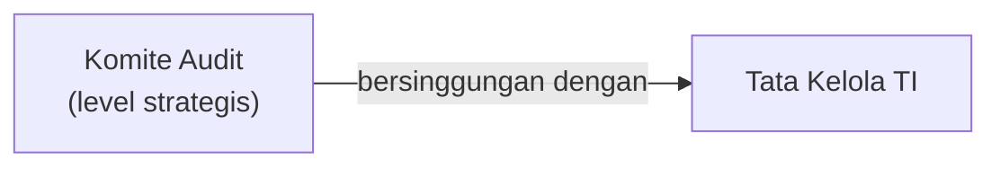

Fungsi audit internal diatur melalui **piagam** (*charter*) yang disetujui oleh komite audit, yang menjelaskan aktivitas dan hubungannya dengan komite audit perusahaan. Piagam ini biasanya mengharuskan komite audit untuk:

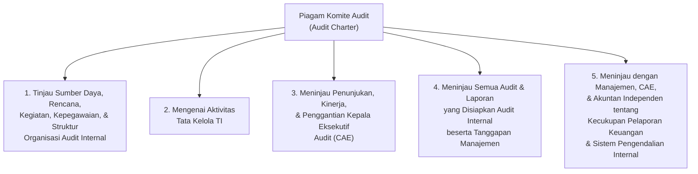

> Kelima tugas komite audit ini secara langsung melanjutkan dan memperdalam pembahasan **Sesi 7** — di sana sudah dibahas peran auditor internal dan CAE, sementara di sini dijelaskan secara spesifik **tanggung jawab pengawasan** komite audit terhadap fungsi audit internal tersebut, menutup lingkaran tata kelola dari level kebijakan (misi, kode etik) hingga level pengawasan (komite audit).

---

## Ringkasan Keterkaitan Antar Konsep

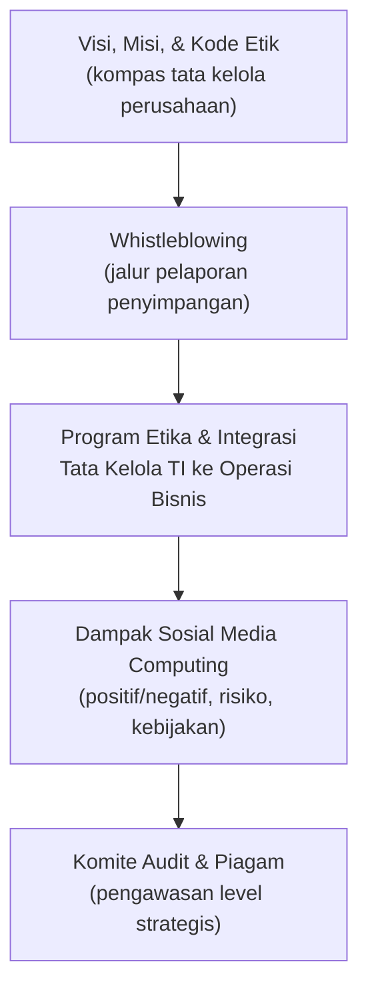

Inti dari sesi penutup ini: tata kelola TI yang efektif **tidak dapat dipisahkan dari budaya perusahaan** secara keseluruhan — ia harus berakar dari **visi dan misi** yang jelas, didukung oleh **kode etik** dan mekanisme **whistleblowing** yang berfungsi, serta diintegrasikan ke dalam operasi inti bisnis di setiap unit. Fenomena modern seperti **media sosial** menunjukkan bagaimana tata kelola TI harus terus beradaptasi terhadap risiko-risiko baru (reputasi, keamanan, produktivitas) yang muncul dari teknologi yang berkembang, sementara **komite audit** tetap menjadi pengawas tertinggi yang memastikan seluruh proses tata kelola — dari kebijakan etika hingga pengendalian TI teknis — benar-benar berjalan sebagaimana mestinya.

---

*Terima kasih*
